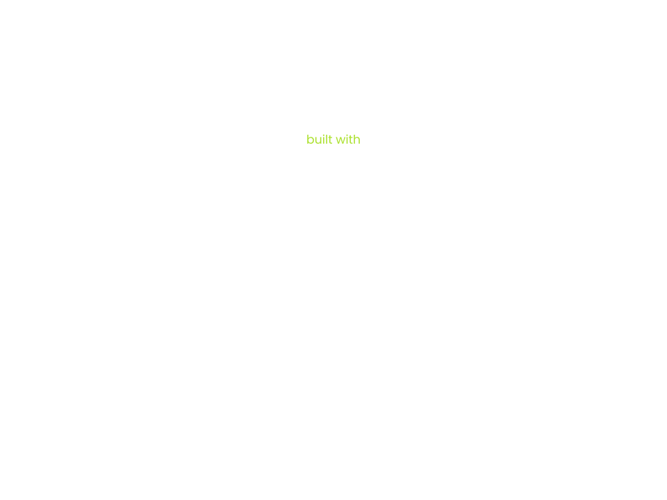
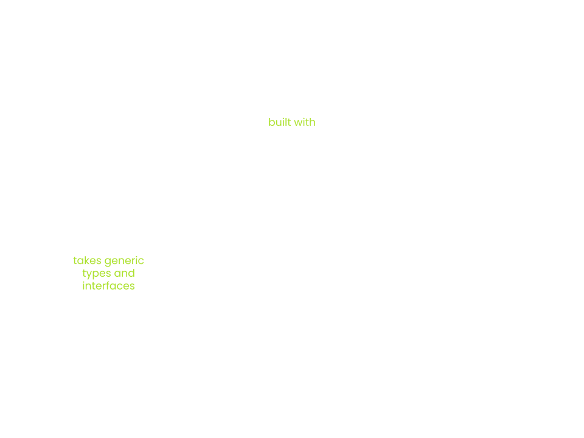

# Cumulus

---

## Outline

1. [What is Cumulus?](#what-is-cumulus)
1. [Cumulus Validation Blob](#cumulus-validation-blob)
1. [Cumulus on the Node Side](#cumulus-on-the-node-side)
1. [Transform Solo to Parachain](#transform-solo-to-parachain)

---

# What is Cumulus?

---

## What is Cumulus?


Notes:

- Substrate is a framework for building blockchains
- But only solo chains
- Split into runtime/node side

---

## What is Cumulus?



---

## What is Cumulus?



Notes:

- Polkadot makes uses of Substrate
- Node and runtime are build on the generic types of Substrate
- These generic types and Polkadot specific types are used to "form" Polkadot
- Functionality like the Parachains Protocol is living entirely in Polkadot

---

## What is Cumulus?


Notes:

- Cumulus uses the generic types of Substrate
- These generic types/interfaces are extended to make them work with/for Parachains
- Polkadot itself is providing APIs that are used by Cumulus to implement the Substrate interfaces/types
- SDK for building substrate-based Parachains

---

# Cumulus Validation Blob

---

## Polkadot requirements

- Polkadot requires a validation blob for verifying Parachain state transitions
- This blob is required to be a valid Wasm binary that exposes the `validate_block` function
- Wasm runtimes are deeply baked into the Substrate core protocol
- The Substrate runtime is the state transition function

---

## Verify a State Transition

- A Substrate chain verifies a Block state transition on import
- Importing a block is done using `execute_block`
- Executing a block means to execute the entire block with all transactions
- The input header must match the header that is the result of executing the block
- This ensures that the storage root, the extrinsic root, etc., are correct

---

## "The Trick"

- Reuse the substrate-based runtime
- Augment the runtime with the `validate_block` function
- The validation blob stored on the relay chain & the runtime code blob stored in the Parachain state are the same

---

## Cumulus Validation Blob

```rust
fn validate_block(input: InputParams) -> Output {


}
```

---

## Cumulus Validation Blob

```rust
fn validate_block(input: InputParams) -> Output {
    // First let's initialize the state
    let state = input.storage_proof.into_state().expect("Storage proof invalid");


}
```

---

## Cumulus Validation Blob

```rust
fn validate_block(input: InputParams) -> Output {
    // First let's initialize the state
    let state = input.storage_proof.into_state().expect("Storage proof invalid");

    // Run`execute_block` on top of the state
    with_state(state, || {
        execute_block(input.block).expect("Block is invalid")
    })


}
```

Notes:

- On solo chains we also run the block import on some state
- This state belongs to the parent of the block that should be imported

---

## Cumulus Validation Blob

```rust
fn validate_block(input: InputParams) -> Output {
    // First let's initialize the state
    let state = input.storage_proof.into_state().expect("Storage proof invalid");

    // Run`execute_block` on top of the state
    with_state(state, || {
        execute_block(input.block).expect("Block is invalid")
    })

    // Create the output of the result
    create_output()
}
```

Notes:

- `create_output` includes for example:
  - the number of processed messages
  - The upward messages sent
  - Is there a runtime upgrade to schedule?

---

## Cumulus on the Node Side

- [Finality](#finality)
- [Triggering Block Authoring](#triggering-block-authoring)
- [Ensuring Block Availability](#ensuring-block-availability)

---

## Finality

```rust
loop {
    let finalized = finalized_relay_chain_blocks_stream.next().await;

    let parachain_block = match get_parachain_block_for_relay_chain_block(finalized) {
        Some(b) => b,
        None => continue,
    };

    set_finalized_parachain_block(parachain_block);
}
```

---

## Triggering Block Authoring

```rust
loop {
    let imported = import_relay_chain_blocks_stream.next().await;

    if relay_chain_awaits_parachain_candidate(imported) {
        let pov = match parachain_trigger_block_authoring(imported) {
            Some(p) => p,
            None => continue,
        };

        relay_chain_distribute_pov(pov)
    }
}
```

Notes:

- `parachain_trigger_block_authoring` itself can decide if it wants to build a block.
- e.g. the parachain having a block time of 30 seconds

---

## Ensuring Block Availability

- On a solo chain a block gets part of the canonical chain by:
  - Being distributed to other nodes in the network
  - Being a valid block that can be imported by a majority of the validators
- On a Parachain a block only needs to be accepted by the relay chain validators to be part of the canonical chain
- The problem is that a collator can send a block to the relay chain without distributing it in the Parachain network
- So, the relay chain could expect some parent block for the next block that no one is aware of

Notes:

- Collators can be malicious and just do not propagate their block in the network
- Collators could crash after sending the block to the relay chain, but before propagating it in the Parachain network.

---

## Ensuring Block Availability

```rust
loop {
    let imported = import_relay_chain_blocks_stream.next().await;

    let candidate = match get_backed_parachain_candidate_for_relay_block(imported) {
        Some(c) => c,
        None => continue,
    };

    spawn(|| {
        wait(some_time).await;

        if !is_block_known(candidate.hash) {
            let pov = recover_candidate(candidate);

            let header = import_pov(pov);
            announce_block(header);
        }
    })
}
```

Notes:

- PoV recovery
- Relay chain stores the PoVs for 24 hours
- Every node relay chain/parachain can ask the relay chain validators for their piece to restore the PoV

---

<!-- .slide: data-background-color="#4A2439" -->

# Exercise

---

## Transform Solo to Parachain

Transform a substrate-node template into a parachain

Notes:

- Use some prepared node template and show what needs to be done
- Q&A after
