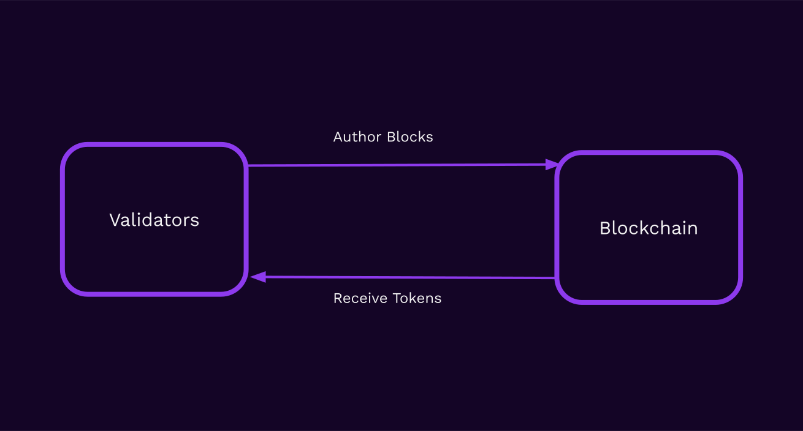
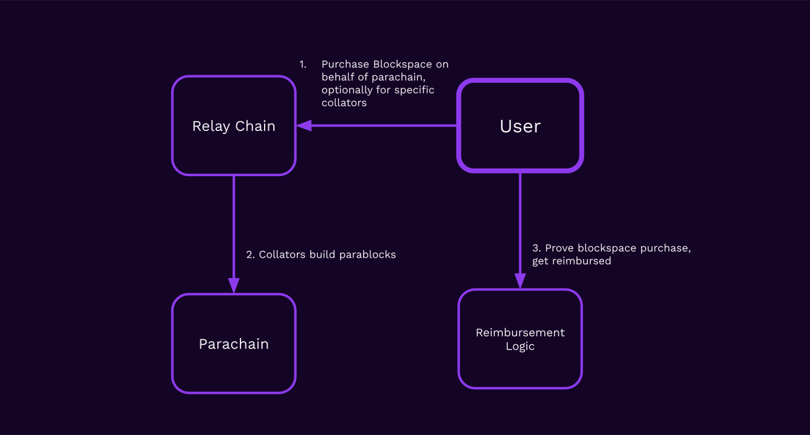

## Blockspace

In this lesson, we will cover:

<pba-flex center>

  1. Blockspace as a concept and historical interpretations
  1. Blockspace as a product of blockchains
  1. The importance of efficient allocation of blockspace
  1. The design space of blockspace allocation mechanisms within Polkadot

</pba-flex>

Notes:

Deep Dive Article is https://www.rob.tech/polkadot-blockspace-over-blockchains/

---

## Blockspace: Definition

> Blockspace is the capacity of a blockchain to finalize and commit operations.

---

## Measuring Blockspace

Blockspace can be measured in a few different ways:

<pba-flex center>

  1. Size: Bytes used by transactions (e.g. Bitcoin)
  1. Computation: Gas used by transactions (e.g. Ethereum)
  1. Data: Size of data required to validate transactions (PoV size in Polkadot)
  1. Or some combination of the above

</pba-flex>

---

## Blockspace Markets

Fee markets in blockchains are examples of blockspace markets.

The blockchain sells blockspace on-demand, and users pay fees in order to utilize the blockspace.

---

## Blockspace Markets

Parachain auctions are another example of a blockspace market.

Instead of selling blockspace on-demand, blockspace is sold in bulk up-front with an auction mechanism.

---

## Blockspace: Supply and Demand

---

## Blockspace in Ethereum: GasToken

GasToken (https://GasToken.io) was an early Blockspace Futures Market on Ethereum.

Ethereum provides a gas refund for storage slots being cleared in smart contract execution.

By "pre-buying" storage when gas is cheap and getting the refund when gas is expensive, users can perform blockspace arbitrage in Ethereum!

---

## Evaluating Blockspace

3 Properties of Blockspace:

<pba-flex center>

  1. Quality: How secure is the blockspace? What are the economic guarantees of finality?
  2. Availability: How much blockspace is _available_ on the market?
  3. Flexibility: How many applications can the blockspace be used for?

</pba-flex>

---

## Polkadot's Blockspace: Quality

Polkadot's Execution Sharding guarantees that all blockspace generated by Polkadot is highly secure, with economic guarantees of finality under the 33% BFT assumption.

---

## Polkadot's Blockspace: Availability

With sharding, Polkadot has the capability to produce large amounts of blockspace. This is another lens to view the blockchain scaling problem through: creating more blockspace.

---

## Polkadot's Blockspace: Flexibility

Polkadot provides blockspace in a highly flexible format due to key design choices:

<pba-flex center>

  1. WebAssembly: This turing-complete language allows all kinds of computation to be done.
  2. PoV Blobs: Unopinionated about storage formats or access patterns.
  3. Head-Data blobs: Parachains can use any header format they like and don't even have to be blockchains, strictly speaking.

</pba-flex>

---

## Substrate: The Blockspace Transformer

Since Polkadot provides highly flexible blockspace, it can be transformed into a variety of different, more specialized blockspace products.

---

## Principles of Blockchain Application Development

<pba-flex center>

  1. Acquire generalized blockspace (from Polkadot, from validators directly)
  2. Specialize blockspace for a particular use-case or requirement
  3. Downstream demand drives upstream demand.

</pba-flex>

Notes:
  By (3) I mean that the amount of demand for (2) should inform the amount to which the application does (1).

---

## Problem: Ghost Chains

It's quite common for chains to produce mostly empty blocks.

This is a problem: chains are buying more blockspace than they need!

They are paying validators to do nothing of value, and this will lead to depreciation of their token.

---

## Solution: Acquire Blockspace on-demand

Blockchains as needing to produce blocks every X seconds or minutes.

Blockchains should only produce blocks when they have a good reason to.

The main reason this is not done is because there are no good primitives for it.

---

## Polkadot's Architecture: Execution Cores

---

## Long-term vs. on-demand

Parathreads are analogous to "spot" instances and slot auctions are analogous to "reserved" instances in cloud computing.

Spot instances may be more expensive if overall demand is high, but help to soothe load.

---

## Elastic Scaling (planned upgrade)

What if parachains could acquire not just _one_ execution core at a time, but multiple?

Parachains would then be able to _elastically scale_ during periods of higher demand.

Notes:

This scaling can occur as a result of the property that in Polkadot, parablock state transitions are completely encapsulated and validation of block X+1 can occur in parallel with validation of block X.

However, the parablocks still must be _authored_ sequentially by collators, and for that reason this can only be used to scale up to the maximum throughput of collators authoring blocks.

---

## Reimbursement Layer: Status Quo

---

## Reimbursement Layer: Generalizing

Notes:

User could be a collator itself, or perhaps just someone fulfilling a market need (blockspace arbitrage!)

---

## Reimbursement Layer: Use Cases

<pba-flex center>

  1. Pay Collators _somewhere other_ than the chain they build upon
  2. Pay Collators in stablecoins or other tokens
  3. Tokenless parachain
  4. Parachain Launch Pad (e.g. pay out of "credits" on some other system)
  5. Generalized Collator Pool (plug and play, no need to run nodes specific to parachain)

</pba-flex>

---

## Blockspace and Interoperability

In interoperable blockchain applications, the application is only as good as the weakest chain it relies upon.

It is important not to mix different qualities of blockspace, due to toxicity risks.

---

## Ephemeral Chains

Is there any reason a blockchain should run forever?

Why not create blockchains that run for a limited period of time, e.g. to run some specific protocol or computation, and then conclude?

---

## Blockspace Futures Markets

With the right core-level primitives, it will be possible to transfer claims on future blockspace.

Secondary markets can emerge, perhaps using NFTs, on parachains themselves, to facilitate the market for future blockspace.

This will create an efficient market and price discovery for blockspace via blockspace arbitrage.

---

## Layer-1 Blockspace Only Scales With Demand

One unfortunate side effect of scaling blockspace production is that supply can greatly exceed demand, leading to very low prices for blockspace.

When demand is a key driver of token economics, this can create an inflationary imbalance.

One responsibility of Governance is to avoid flooding the market with unnecessary blockspace.

---

## Future Blockspace Allocation Mechanisms

If blockspace is the "product" of Polkadot, then allocation mechanisms are the "packaging".

Blockspace must be packaged in a way that the market desires.

In between long-term slots and on-demand parachain bids is short-term auctions: purchases of e.g. 1 hour, 1 day, 1 week of execution core time.

---

## Future Blockspace Allocation Mechanisms

For chains which want predictable access to blockspace but don't need to author blocks every 6 or 12 seconds, we can introduce execution core sharing.

This would allow parachains to purchase _sparse_ blockspace ahead of time and author blocks every 30 seconds or 1 minute or other interval by sharing slots with other parachains.

---

## Blockspace: Conclusions

<pba-flex center>

  1. Blockspace is an economic formulation of blockchain resources
  2. Blockspace provides new lenses on the scheduling and lifecycle of blockchains
  3. Efficient allocation of blockspace will be critical as Web3 systems scale to serve 8 billion people.
  4. Polkadot's architecture is blockspace-centric, not blockchain-centric, and provides many options for builders to use its product.

</pba-flex>

---

<!-- .slide: data-background-color="#4A2439" -->

## Questions
