# Cumulus Deep Dive

---

<!--
### Outline

<pba-flex center>

1. [What is Cumulus?](#what-is-cumulus)
1. [Cumulus Runtime Validation](#cumulus-runtime-validation)
1. [Cumulus on the Node Side](#cumulus-on-the-node-side)
1. [Transform Solo to Parachain](#transform-solo-to-parachain)
1. [References](#references)

</pba-flex> 
-->

## What is Cumulus?

> Cumulus clouds are shaped sort of like dots; together they form a system that is intricate, beautiful and functional

SDK for building substrate/FRAME-based Parachains
<!-- .element: class="fragment" data-fragment-index="1" -->

---v

<div class="r-stack">


<!-- .element: class="fragment" data-fragment-index="1" -->
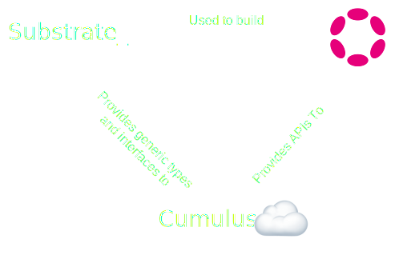
<!-- .element: class="fragment" data-fragment-index="2" -->
</div>

Notes:

1.
- Substrate is a framework for building blockchains
- But only "solo" chains
- Split into runtime/node side
- FRAME allows you to build modular components reused by runtimes

2.
- Polkadot makes uses of Substrate
- The concept of Parachains is introduced in Polkadot
- It implements Parachain Sharding and Validation as node and runtime-side logic
- Has its own networking protocols built with Substrate/libp2p

3.
- Cumulus uses the generic types of Substrate
- These generic types/interfaces are extended to make them work with/for Parachains
- Polkadot itself is providing APIs that are used by Cumulus to implement the Substrate interfaces/types

---

## What is the Role of Cumulus?

---v
<div class="r-stack">
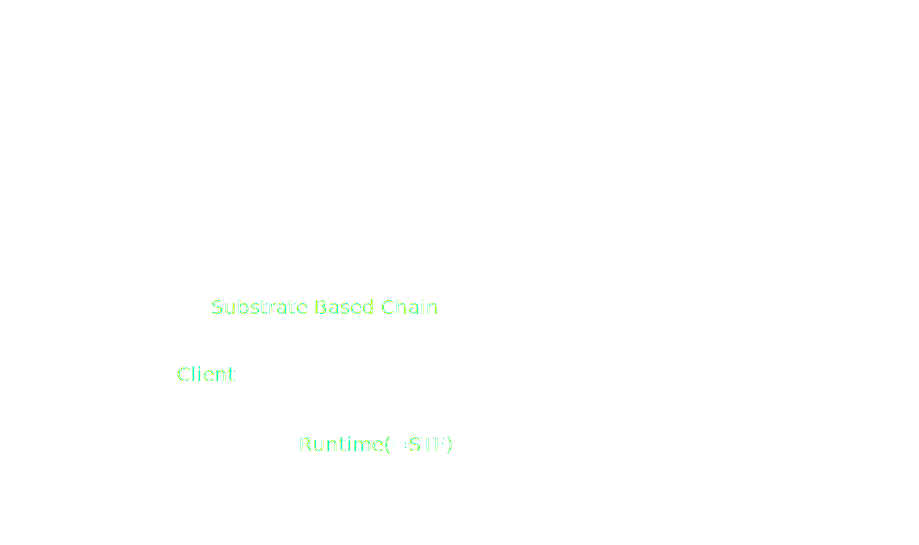
<!-- .element: class="fragment" data-fragment-index="0" -->
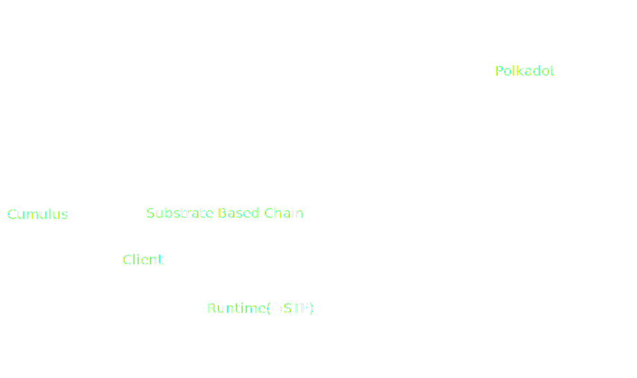
<!-- .element: class="fragment" data-fragment-index="1" -->
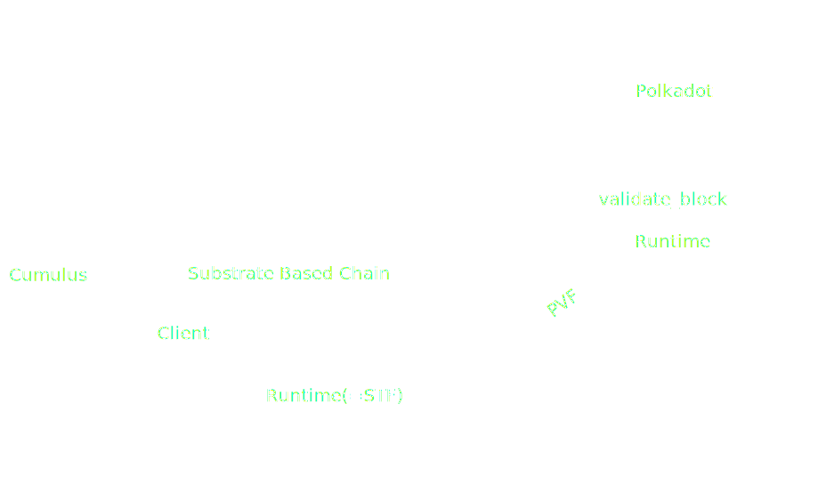
<!-- .element: class="fragment" data-fragment-index="2" -->
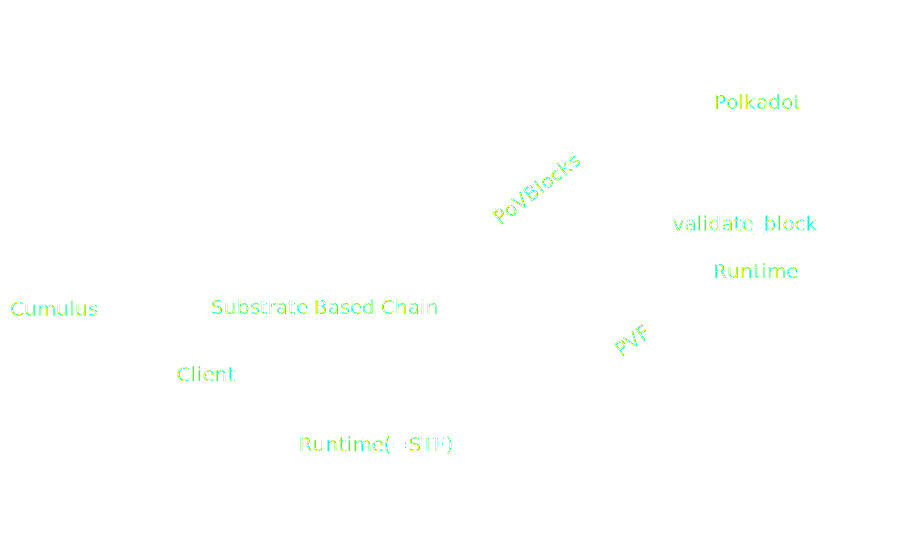
<!-- .element: class="fragment" data-fragment-index="3" -->
</div>

</br>

- Enables runtime validation by providing candidates to the parachains protocol
<!-- .element: class="fragment" data-fragment-index="4" -->
- Couples parachain finality to that of the relay chain
<!-- .element: class="fragment" data-fragment-index="5" -->

Notes: 
- A substrate Based Chain is composed by:
  - Client
  - Runtime (= STF)

- Cumulus act as a wrapper around a those two parts to make them adapt to the polkadot protocol.
- It not only abstract the complexity around the creation of the PVF and the PoV but also continuously interact with the relay chain to continue producing block with the pooled security

---

## How Cumulus Enables Runtime Validation

---

### What is Runtime Validation?

- The relay chain ensures that every parachain block follows the rules defined by that parachain's current code.

<!-- .element: class="fragment" data-fragment-index="1" -->

- Constraint: the relay chain must be able to execute Runtime Validation of a parachain block without access to the entirety of that parachain's state

<!-- .element: class="fragment" data-fragment-index="2" -->

<div class="r-stack">
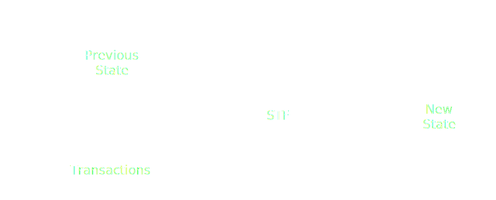

<!-- .element: class="fragment" data-fragment-index="1" -->

<!-- .element: class="fragment" data-fragment-index="2" -->
</div>

</br>

- Building Blocks to make this possible are PVF and PoV

<!-- .element: class="fragment" data-fragment-index="3" -->

---v

#### Parachain Validation Function - PVF

- The STF of the Parachain must be stored on the Relay Chain

``` rust [6]
/// A struct that carries code of a parachain validation function and its hash.
///
/// Should be cheap to clone.
#[derive(Clone)]
pub struct Pvf {
    pub(crate) code: Arc<Vec<u8>>,
    pub(crate) code_hash: ValidationCodeHash,
}
```

</br>

- New state transitions that occur on a parachain must be validated against the registered parachain code via the PVF 

Notes:

The code is hashed and saved in the storage of the relay chain. There is another map in the storage where the paraId is the key and the ValidationCodeHash (the hasho of the PVF) is the value.

---v

#### Proof Of Validity - POV

- Polkadot requires that a Parachain block is transmitted to the relay chain in a fixed format: **Collation**

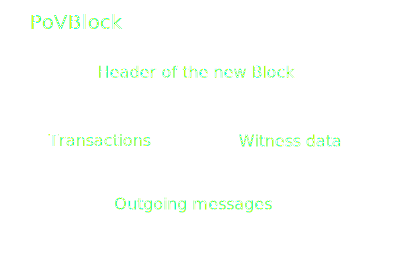
<!-- .element: class="fragment" data-fragment-index="1" -->

Notes:


---v
  
##### Witness Data

- Acts as a replacement for the parachain's pre-state for the purpose of validating a single block
  - It allows the reconstruction of a sparse in-memory merkle trie
  
---v

###### Example of Witness Data Construction

<div class="r-stack">
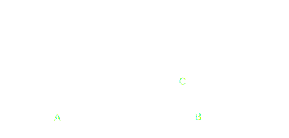
<!-- .element: class="fragment fade-out" data-fragment-index="1" -->
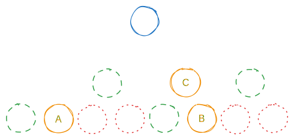
<!-- .element: class="fragment" data-fragment-index="1" -->
</div>

</br>

- Composed of only the data used in the state transitions of the block being validated
<!-- .element: class="fragment" data-fragment-index="2" -->
- This makes up the majority of the data in a collation (max 5MiB)
<!-- .element: class="fragment" data-fragment-index="3" -->

Notes:

orage: values present in the POV
green: hash of the sibilings node required for the pov
white: hash of the nodes that are constructed with orange and green nodes
red: not reuired hash
blue: head of the trie, hash present in the previous block header

---v

#### Little caveat - validate_block

<pba-cols>
<pba-col center>


</pba-col>
<pba-col center>

- The PVF is not only a copy paste of the parachain Runtime
<!-- .element: class="fragment" data-fragment-index="1" -->

</br>

- validate_block is a function required to be present in the PVF
<!-- .element: class="fragment" data-fragment-index="2" -->

</br>

**WHY!?**
<!-- .element: class="fragment" data-fragment-index="3" -->

</pba-col>
</pba-cols>

Notes: 

In the first image the PVF was not only composed by the Runtime but also by function needed to interpret all the information that are coming from the Parachain but opaque to the relay chain.

---v

#### Let's Take a Step Back

<div class="r-stack">
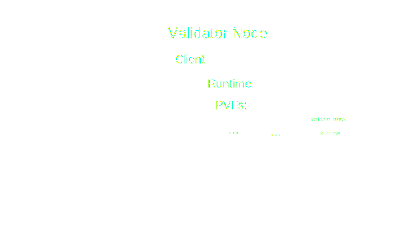
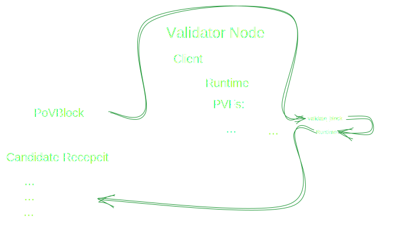
<!-- .element: class="fragment" data-fragment-index="1" -->
</div>

Notes: 

The input of the runtime validation process is the PoV and the function called in the PVF is 'validate_block', this will use the PoV to be able to call the effective runtime and then create an output representing the state transition, that's called candidate receipt, later you will understand why is needed.

---v

#### What Does validate_block Actually Do?

```rust [1|2-3|5]
fn validate_block(input: InputParams) -> Output {
    // First let's initialize the state
    let state = input.storage_proof.into_state().expect("Storage proof invalid");

    replace_host_functions();

    // Run `execute_block` on top of the state
    with_state(state, || {
        execute_block(input.block).expect("Block is invalid")
    })

    // Create the output of the result
    create_output()
}
```


Notes:

We construct the sparse in-memory database from the storage proof inside the block data and
then ensure that the storage root matches the storage root in the `parent_head`.

---v

##### Why Replace Host Functions?

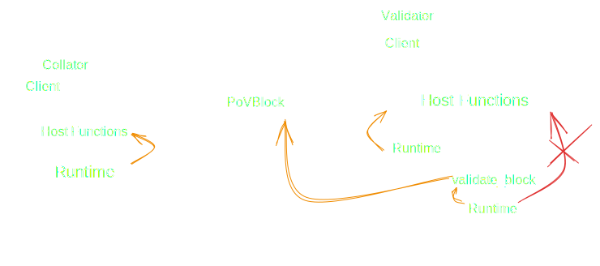

Notes: 

We replace all the storage related host functions with functions inside the wasm blob.
This means instead of calling into the host, we will stay inside the wasm execution.
This is very important as the relay chain validator hasn't the state required to verify the block.
But we have the in-memory database that contains all the values from the state of the parachain that we require to verify the block.

---v

```rust [7-10|12-13]
fn validate_block(input: InputParams) -> Output {
    // First let's initialize the state
    let state = input.storage_proof.into_state().expect("Storage proof invalid");

    replace_host_functions();

    // Run `execute_block` on top of the state
    with_state(state, || {
        execute_block(input.block).expect("Block is invalid")
    })

    // Create the output of the result
    create_output()
}
```


Notes:

- `create_output` includes for example:
  - the number of processed messages
  - The upward messages sent
  - Is there a runtime upgrade to schedule?

---

### Data Availability Protocol

- The Availability and Validity (AnV) protocol of Polkadot allows the network to be efficiently sharded among parachains while maintaining strong security guarantees

- The PoV is too big to be included on-chain when a parablock is backed, so validators instead produce a constant size **Candidate Block Recepeit** to represent the freshly validated block

- But the PoV must remain available after backing, since it will be used to validate the block during the approvals process.

---v

#### The Availability Process

- Erasure coding is applied to the PoV
- At least 2/3 + 1 validators must report that they possess their piece of the code word. Once this threshold of validators has been reached, the network can consider the PoV block of the parachain available 

---

### What cumulus does for you

Starting from a Substrate-based chain Cumulus changes both client and runtime to make them work with Polkadot, abstracting away the complexity we just explained

---v

#### From a Substrate-Runtime to a Parachain-Runtime

- When compiling a runtime that uses Cumulus, a WASM binary is generated, the PVF:

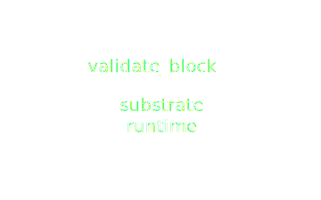

- This binary is required to register a Parachain on the relay chain
<!-- .element: class="fragment" data-fragment-index="1" -->

  
Notes:
Cumulus changes the compilation behavior to produce beside the normal state transition function used by the collator, also the PFV to a wasm blob

---v

#### Generate collations

- The block production phase is modified to create the Collation, the main changes to substrate are: 
  - access to the storage are used to create the witness data
  - outgoing messages are stored in the PoV to let be processed by the relay chain

---

<!-- .slide: data-background-color="#4A2439" -->

# Questions

<!--
### Cumulus Validation Blob

```rust
fn create_output(block: Block) -> ValidationResult {
	let head_data = HeadData(block.header().encode());

	let new_validation_code = crate::NewValidationCode::<PSC>::get();
	let upward_messages = crate::UpwardMessages::<PSC>::get();
	let processed_downward_messages = crate::ProcessedDownwardMessages::<PSC>::get();
	let horizontal_messages = crate::HrmpOutboundMessages::<PSC>::get();
	let hrmp_watermark = crate::HrmpWatermark::<PSC>::get();

	ValidationResult {
		head_data,
		new_validation_code: new_validation_code.map(Into::into),
		upward_messages,
		processed_downward_messages,
		horizontal_messages,
		hrmp_watermark,
	}
}
```

Notes:

- `create_output` includes for example:
  - the number of processed messages
  - The upward messages sent
  - Is there a runtime upgrade to schedule?
-->

---

## How Cumulus Enables Parachain-Relay Chain Communication

---v

- Every collator also runs a Polkadot full node

</br>

- Being part of the relay chain network the collator:
  - is able to pass collations to validators
  - is informed of new relay chain blocks <!--keeping active the block production and consensus logic-->

Notes:

the collator could also run a separeted RPC node

---

### Relay Chain Interface

```rust [1-2]
/// Trait that provides all necessary methods for interaction 
/// between collator and relay chain.
#[async_trait]
pub trait RelayChainInterface: Send + Sync {
  ...
}
```

</br>

It is responsible for:
<!-- .element: class="fragment" data-fragment-index="1" -->

- following the relay chain and providing block and finality notification streams
- runtime api calls into the relay chain state for message processing

<!-- .element: class="fragment" data-fragment-index="1" -->

Notes:

code: https://github.com/paritytech/cumulus/blob/master/client/relay-chain-interface/src/lib.rs

It can be run as an in-process full-node or a separate RPC node.

---

### Parachain System Pallet 


```rust
//! `cumulus-pallet-parachain-system` handles low-level details
//! of being a parachain.
/// It's responsibilities include:
//!
//! - ingestion of the parachain validation data
//! - ingestion of incoming downward and horizontal
//!   messages and dispatching them
//! - coordinating upgrades with the relay-chain
//! - communication of parachain outputs, such as
//!   sent messages, signalling an upgrade, etc.
```


---

### Finality

```rust
loop {
    let finalized = finalized_relay_chain_blocks_stream.next().await;

    let parachain_block = match get_parachain_block_for_relay_chain_block(finalized) {
        Some(b) => b,
        None => continue,
    };

    set_finalized_parachain_block(parachain_block);
}
```

---

### Triggering Block Authoring

```rust
loop {
    let imported = import_relay_chain_blocks_stream.next().await;

    if relay_chain_awaits_parachain_candidate(imported) {
        let pov = match parachain_trigger_block_authoring(imported) {
            Some(p) => p,
            None => continue,
        };

        relay_chain_distribute_pov(pov)
    }
}
```

Notes:

- `parachain_trigger_block_authoring` itself can decide if it wants to build a block.
- e.g. the parachain having a block time of 30 seconds

---

### Ensuring Block Availability

- On a solo chain a block gets part of the canonical chain by:
  - Being distributed to other nodes in the network
  - Being a valid block that can be imported by a majority of the validators
- On a Parachain a block only needs to be accepted by the relay chain validators to be part of the canonical chain
- The problem is that a collator can send a block to the relay chain without distributing it in the Parachain network
- So, the relay chain could expect some parent block for the next block that no one is aware of

Notes:

- Collators can be malicious and just do not propagate their block in the network
- Collators could crash after sending the block to the relay chain, but before propagating it in the Parachain network.

---

### Ensuring Block Availability

```rust
loop {
    let imported = import_relay_chain_blocks_stream.next().await;

    let candidate = match get_backed_parachain_candidate_for_relay_block(imported) {
        Some(c) => c,
        None => continue,
    };

    spawn(|| {
        wait(some_time).await;

        if !is_block_known(candidate.hash) {
            let pov = recover_candidate(candidate);

            let header = import_pov(pov);
            announce_block(header);
        }
    })
}
```

Notes:

- PoV recovery
- Relay chain stores the PoVs for 24 hours
- Every node relay chain/parachain can ask the relay chain validators for their piece to restore the PoV

---

## Runtime Upgrades

- Every Substrate blockchain supports runtime upgrades
<!-- .element: class="fragment" data-fragment-index="0" -->


##### Problem
<!-- .element: class="fragment" data-fragment-index="1" -->
- What happen if the PVF compilation takes too long?
<!-- .element: class="fragment" data-fragment-index="1" -->
  - In approval checking, there may be many no-shows, leading to slow finality
  - In disputes, neither side may reach supermajority. Nobody will get slashed and the chain will not be reverted or finalized.

<!-- .element: class="fragment" data-fragment-index="1" -->
  
</br>
  
- Updating a Parachain runtime is not as easy as updating a standalone blockchain runtime
<!-- .element: class="fragment" data-fragment-index="2" -->

Notes:

Now almost every change to the client and the runtime of the substrate based-chain is explained, is missing only the runtime upgrade managment that is not so easy as in a normal substrate-based solo chain.

---v

##### Solution

Relay chain needs a fairly hard guarantee that the PVFs can be compiled within a reasonable amount of time
<!-- .element: class="fragment" data-fragment-index="0" -->

</br>

+ Collators execute a runtime upgrade but it is not applied
+ The relay chain executes the **PVF Pre-Chekcing Process**
+ The first parachain block that will be included after the end of the process needs to apply the new runtime

<!-- .element: class="fragment" data-fragment-index="1" -->

</br>

Cumulus autonomously follows the relay chain to apply the runtime when it's time
<!-- .element: class="fragment" data-fragment-index="2" -->

Notes:

A Parachain will follow the same paradigm as a standard solo chain, but the relay chain needs to be informed before the update.
Cumulus will provide functionality to notify the relay chain about the runtime update.
The update will not be enacted directly; instead it takes X relay blocks (a value that is configured by the relay chain)
before the relay chain allows the update to be applied.
The first Parachain block that will be included after X relay chain blocks needs to apply the upgrade.
If the update is applied before the waiting period is finished, the relay chain will reject the Parachain block for inclusion.
The Cumulus runtime pallet will provide the functionality to register the runtime upgrade and will also make sure that the update is applied at the correct block.
https://github.com/paritytech/cumulus/blob/master/docs/overview.md#runtime-upgrade

---v

##### PVF Pre-Chekcing Process

- The relay chain keeps track of all the new PVFs that need to be checked
- Each validator checks if the compilation of a PVF is valid and does not require too much time, then it votes
  - binary vote: accept or reject
- As soon as the super majority is reached the voting is concluded
- The state of the new PVF is updated on the relay chain

Notes:

Only validators from the active set can participate in the vote. The set of active validators can change each session. That's why we reset the votes each session. A voting that observed a certain number of sessions will be rejected.

reference: https://paritytech.github.io/polkadot/book/pvf-prechecking.html

---

## Transform Solo to Parachain

To convert a Substrate runtime into a Parachain runtime, the following code needs to be added to the runtime:

```rust
cumulus_pallet_parachain_system::register_validate_block!(Block, Executive);
```

Notes:

When compiling a runtime that uses Cumulus, a Wasm binary is generated that contains the full code of the Parachain runtime plus the validate_block functionality.
This binary is required to register a Parachain on the relay chain.

---v

## Transform Solo to Parachain

Time for an exercise!

- [Convert a solo chain How-to guide](https://docs.substrate.io/reference/how-to-guides/parachains/convert-a-solo-chain/)

---v

## Migrating a parachain

In Cumulus, take a look at:

- [./pallets/solo-to-para/src/lib.rs](https://github.com/paritytech/cumulus/blob/master/pallets/solo-to-para/src/lib.rs)
- [./parachains/runtimes/starters/seedling/src/lib.rs](https://github.com/paritytech/cumulus/blob/master/parachains/runtimes/starters/seedling/src/lib.rs)

---

<!-- .slide: data-background-color="#4A2439" -->

# Questions

---

## References

1. https://github.com/paritytech/cumulus/blob/master/docs/overview.md
