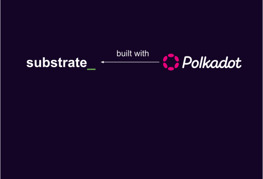
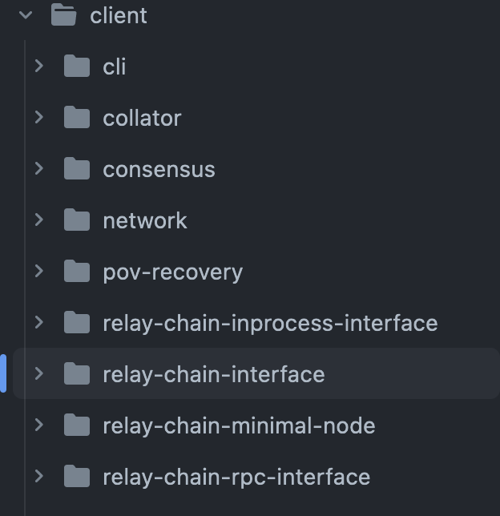

# Introduction to Cumulus.

---

### Outline

<pba-flex center>

1. [What is Cumulus?](#what-is-cumulus)
1. [Cumulus Runtime Validation](#cumulus-runtime-validation)
1. [Cumulus on the Node Side](#cumulus-on-the-node-side)
1. [Transform Solo to Parachain](#transform-solo-to-parachain)
1. [References](#references)

</pba-flex>

---

## What is Cumulus?


Notes:

- Substrate is a framework for building blockchains
- But only "solo" chains
- Split into runtime/node side
- FRAME allows you to build modular components reused by runtimes

---v

## What is Cumulus?



Notes:

- Polkadot makes uses of Substrate
- The concept of Parachains is introduced in Polkadot
- It implements Parachain Sharding and Validation as node and runtime-side logic
- Has its own networking protocols built with Substrate/libp2p

---v

## What is Cumulus?


Notes:

- Cumulus uses the generic types of Substrate
- These generic types/interfaces are extended to make them work with/for Parachains
- Polkadot itself is providing APIs that are used by Cumulus to implement the Substrate interfaces/types

---v

## What is Cumulus?

> Cumulus clouds are shaped sort of like dots; together they form a system that is intricate, beautiful and functional

SDK for building substrate/FRAME-based Parachains

---

## Cumulus Runtime Validation

### Polkadot requirements

- Polkadot requires a validation blob for verifying Parachain state transitions
- This blob is required to be a valid Wasm binary that exposes the `validate_block` function
- Wasm runtimes are deeply baked into the Substrate core protocol
- The Substrate runtime is the state transition function

---

## Verify a State Transition

- A Substrate chain verifies a Block state transition on import
- Importing a block is done using `execute_block`
- Executing a block means to execute the entire block with all transactions
- The input header must match the header that is the result of executing the block
- This ensures that the storage root, the extrinsic root, etc., are correct

---

#### Parachain Validation Function = Parachain Runtime

- Reuse the substrate-based runtime
- Augment the runtime with the `validate_block` function
- The validation blob stored on the relay chain & the runtime code blob stored in the Parachain state are the same

---

## Cumulus Validation Blob

```rust
fn validate_block(input: InputParams) -> Output {


}
```

---

## Cumulus Validation Blob

```rust
fn validate_block(input: InputParams) -> Output {
    // First let's initialize the state
    let state = input.storage_proof.into_state().expect("Storage proof invalid");


}
```

Notes:

We construct the sparse in-memory database from the storage proof inside the block data and
then ensure that the storage root matches the storage root in the `parent_head`.

---

## Cumulus Validation Blob

```rust
fn validate_block(input: InputParams) -> Output {
    // First let's initialize the state
    let state = input.storage_proof.into_state().expect("Storage proof invalid");

	replace_host_functions();


}
```

Notes:

We replace all the storage related host functions with functions inside the wasm blob.
This means instead of calling into the host, we will stay inside the wasm execution.
This is
very important as the relay chain validator hasn't the state required to verify the block.
But
we have the in-memory database that contains all the values from the state of the parachain
that we require to verify the block.

---

## Cumulus Validation Blob

```rust
fn validate_block(input: InputParams) -> Output {
    // First let's initialize the state
    let state = input.storage_proof.into_state().expect("Storage proof invalid");

	replace_host_functions();

    // Run `execute_block` on top of the state
    with_state(state, || {
        execute_block(input.block).expect("Block is invalid")
    })


}
```

Notes:

- On solo chains we also run the block import on some state
- This state belongs to the parent of the block that should be imported

---

## Cumulus Validation Blob

```rust
fn validate_block(input: InputParams) -> Output {
    // First let's initialize the state
    let state = input.storage_proof.into_state().expect("Storage proof invalid");

	replace_host_functions();

    // Run `execute_block` on top of the state
    with_state(state, || {
        execute_block(input.block).expect("Block is invalid")
    })

    // Create the output of the result
    create_output()
}
```

---

### Cumulus Validation Blob

```rust
fn create_output(block: Block) -> ValidationResult {
	let head_data = HeadData(block.header().encode());

	let new_validation_code = crate::NewValidationCode::<PSC>::get();
	let upward_messages = crate::UpwardMessages::<PSC>::get();
	let processed_downward_messages = crate::ProcessedDownwardMessages::<PSC>::get();
	let horizontal_messages = crate::HrmpOutboundMessages::<PSC>::get();
	let hrmp_watermark = crate::HrmpWatermark::<PSC>::get();

	ValidationResult {
		head_data,
		new_validation_code: new_validation_code.map(Into::into),
		upward_messages,
		processed_downward_messages,
		horizontal_messages,
		hrmp_watermark,
	}
}
```

Notes:

- `create_output` includes for example:
  - the number of processed messages
  - The upward messages sent
  - Is there a runtime upgrade to schedule?

---

### Parachain System Pallet

```rust
//! `cumulus-pallet-parachain-system` handles low-level details of being a parachain.
/// It's responsibilities include:
//!
//! - ingestion of the parachain validation data
//! - ingestion of incoming downward and horizontal messages and dispatching them
//! - coordinating upgrades with the relay-chain
//! - communication of parachain outputs, such as sent messages, signalling an upgrade, etc.
```

---

## Cumulus on the Node Side

- [Relay chain interface](#relay-chain-interface)
- [Finality](#finality)
- [Triggering Block Authoring](#triggering-block-authoring)
- [Ensuring Block Availability](#ensuring-block-availability)

---

## Relay chain interface



Notes:

The relay chain interface is responsible for following the relay chain and providing block and finality notification stream along with some runtime api calls into the relay chain state for message processing.
It can be run as an in-process full-node or a separate RPC node.

---

## Finality

```rust
loop {
    let finalized = finalized_relay_chain_blocks_stream.next().await;

    let parachain_block = match get_parachain_block_for_relay_chain_block(finalized) {
        Some(b) => b,
        None => continue,
    };

    set_finalized_parachain_block(parachain_block);
}
```

---

## Triggering Block Authoring

```rust
loop {
    let imported = import_relay_chain_blocks_stream.next().await;

    if relay_chain_awaits_parachain_candidate(imported) {
        let pov = match parachain_trigger_block_authoring(imported) {
            Some(p) => p,
            None => continue,
        };

        relay_chain_distribute_pov(pov)
    }
}
```

Notes:

- `parachain_trigger_block_authoring` itself can decide if it wants to build a block.
- e.g. the parachain having a block time of 30 seconds

---

## Ensuring Block Availability

- On a solo chain a block gets part of the canonical chain by:
  - Being distributed to other nodes in the network
  - Being a valid block that can be imported by a majority of the validators
- On a Parachain a block only needs to be accepted by the relay chain validators to be part of the canonical chain
- The problem is that a collator can send a block to the relay chain without distributing it in the Parachain network
- So, the relay chain could expect some parent block for the next block that no one is aware of

Notes:

- Collators can be malicious and just do not propagate their block in the network
- Collators could crash after sending the block to the relay chain, but before propagating it in the Parachain network.

---

## Ensuring Block Availability

```rust
loop {
    let imported = import_relay_chain_blocks_stream.next().await;

    let candidate = match get_backed_parachain_candidate_for_relay_block(imported) {
        Some(c) => c,
        None => continue,
    };

    spawn(|| {
        wait(some_time).await;

        if !is_block_known(candidate.hash) {
            let pov = recover_candidate(candidate);

            let header = import_pov(pov);
            announce_block(header);
        }
    })
}
```

Notes:

- PoV recovery
- Relay chain stores the PoVs for 24 hours
- Every node relay chain/parachain can ask the relay chain validators for their piece to restore the PoV

---

## Runtime Upgrades

- Every Substrate blockchain supports runtime upgrades
- Updating a Parachain runtime is not as easy as updating a standalone blockchain runtime
- Runtime upgrade is delay by a parameter configured by the relay chain
- The first Parachain block that will be included after X relay chain blocks needs to apply the upgrade.
- Cumulus will make sure that the runtime update is applied at the correct block

Notes:

A Parachain will follow the same paradigm, but the relay chain needs to be informed before the update.
Cumulus will provide functionality to notify the relay chain about the runtime update.
The update will not be enacted directly; instead it takes X relay blocks (a value that is configured by the relay chain)
before the relay chain allows the update to be applied.
The first Parachain block that will be included after X relay chain blocks needs to apply the upgrade.
If the update is applied before the waiting period is finished, the relay chain will reject the Parachain block for inclusion.
The Cumulus runtime pallet will provide the functionality to register the runtime upgrade and will also make sure that the
update is applied at the correct block.
https://github.com/paritytech/cumulus/blob/master/docs/overview.md#runtime-upgrade

---

### Transform Solo to Parachain

To convert a Substrate runtime into a Parachain runtime, the following code needs to be added to the runtime:

```rust
cumulus_pallet_parachain_system::register_validate_block!(Block, Executive);
```

Notes:

When compiling a runtime that uses Cumulus, a WASM binary is generated that contains the full code
of the Parachain runtime plus the validate_block functionality.
This binary is required to register a Parachain on the relay chain.

---

### Transform Solo to Parachain

Time for an exercise!

> https://docs.substrate.io/reference/how-to-guides/parachains/convert-a-solo-chain/

---

### Migrating a parachain

Take a look at 

> https://github.com/paritytech/cumulus/blob/master/pallets/solo-to-para/src/lib.rs
> https://github.com/paritytech/cumulus/blob/master/parachains/runtimes/starters/seedling/src/lib.rs

---

<!-- .slide: data-background-color="#4A2439" -->

# Questions

---

## References

1. https://github.com/paritytech/cumulus/blob/master/docs/overview.md
