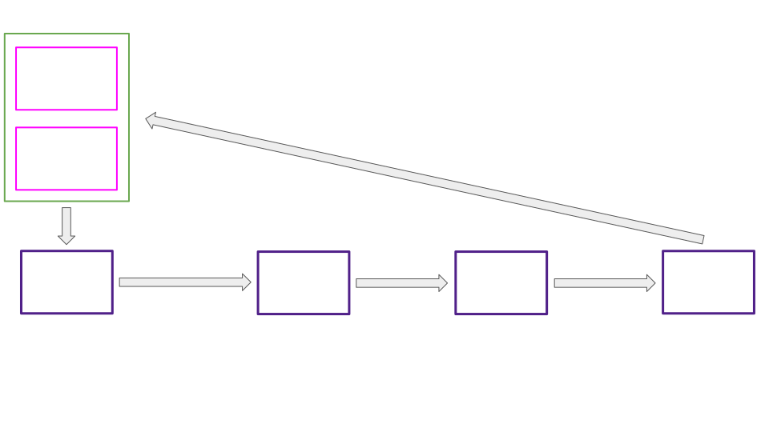
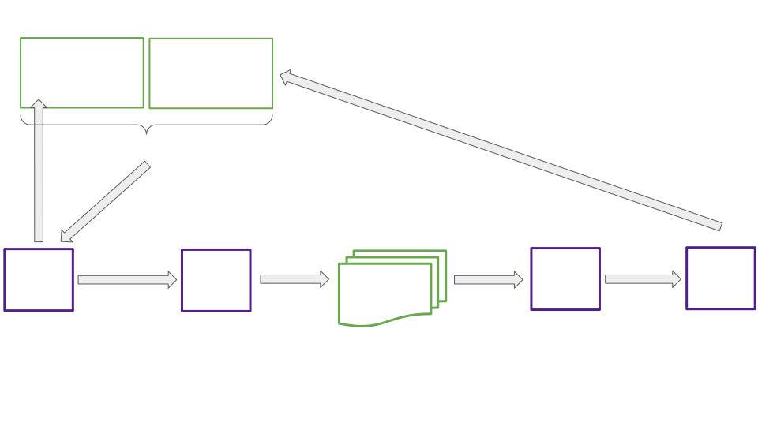
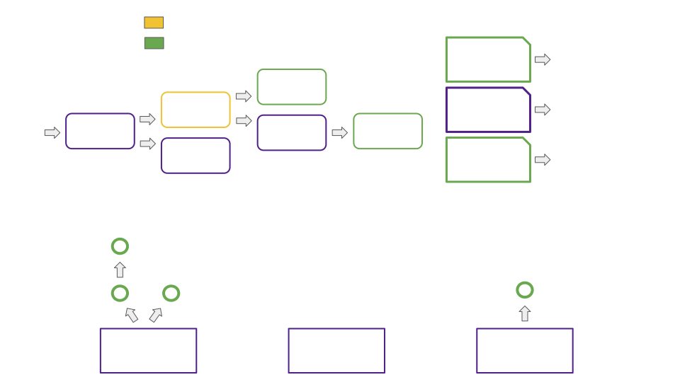

# Deep Dive, Asynchronous Backing

Notes:

I'll be presenting the second of 3 lectures providing a window into Polkadot core, a slice of where we're at and where we're headed.

This lecture covers asynchronous backing, the new feature with potential to deliver shorter parachain block times and an order of magnitude increase in quantity of Polkadot blockspace.

Lets get to it

---

## Overview

<pba-flex center>

- Async Backing Motivation
- Laying the Groundwork, Contextual Execution of Parablocks
- Prospective Parachains, Storing Products of the Backing Process
- Supporting Changes
- Async Backing Advantages, Current and Future

</pba-flex>

---

<!-- .slide: data-background-color="#4A2439" -->

# Async Backing Motivation

---

## Terminology: Backable vs Backed

<pba-flex center>

- Backable candidate:
	- Output of the offchain backing process
	- Received a quorum of "valid" votes from its backing group
- Backed candidate: 
	- A backable candidate that has been placed on-chain
	- Also termed "pending availability"

</pba-flex>

Notes:

We avoid backing any candidate on the relay chain unless we know there is room for that candidate in the availability process. To do otherwise risks wasted on-chain work.

When a candidate is backed on-chain it immediately occupies an availability core and enters the availability, or erasure coding, process.

---

## Synchronous Backing



Note:

Can anyone spot a problem with synchronous model?

- Problem 1
	- Can only start work on new parablock when prior is included
	- One relay block for backing, one for inclusion
	- Minimum block time of 12 seconds

- Problem 2
	- Minimal time to submit collation for 12 second total block time
	- < 3 seconds
	- Not enough to fill block fully

---

## Asynchronous Backing



Notes:

Indicate which work is done for a candidate prior to its ending up in Prospective Parachains. Indicate what parachains use to build blocks, rather than freshly included relay parent. (Older relay parent + required parent)

---

## The Async Backing Reasonable Collator Assumptions

<pba-flex center>

1. "The best existing parablock I'm aware of will eventually be included in the relay chain."
2. "There won't be a chain reversion impacting that best parablock."

</pba-flex>

<br />
<br />

> The Stakes Are Low


Notes:

Best is determined by a process similar to the BABE fork choice rule.
Brief BABE fork choice rule review

---

<!-- .slide: data-background-color="#4A2439" -->

# Laying The Groundwork: Contextual Execution of Parablocks

---

## Async Backing Execution Context

<pba-cols>
<pba-col center>

- From relay chain
	- Base constraints
	- Relay parent
- From unincluded segment
	- Constraint modifications
	- Required parent
	

</pba-col>
<pba-col>


</pba-col>
</pba-cols>

Notes:

- How it was before:
	- Required parent included in relay parent
	- No need for constraint modifications
- Relay parent vs required parent
- Base constraints vs modifications

---

## Required Parent Rule

Graphic here


---

## Relay Parent Rule

Graphic here


---

## Constraints

PersistedValidationData

```rust

pub struct Constraints {
	/// The minimum relay-parent number accepted under these constraints.
	pub min_relay_parent_number: BlockNumber,
	/// The maximum Proof-of-Validity size allowed, in bytes.
	pub max_pov_size: usize,
	/// The maximum new validation code size allowed, in bytes.
	pub max_code_size: usize,
	/// The amount of UMP messages remaining.
	pub ump_remaining: usize,
	/// The amount of UMP bytes remaining.
	pub ump_remaining_bytes: usize,
	/// The maximum number of UMP messages allowed per candidate.
	pub max_ump_num_per_candidate: usize,
	/// Remaining DMP queue. Only includes sent-at block numbers.
	pub dmp_remaining_messages: Vec<BlockNumber>,
	/// The limitations of all registered inbound HRMP channels.
	pub hrmp_inbound: InboundHrmpLimitations,
	/// The limitations of all registered outbound HRMP channels.
	pub hrmp_channels_out: HashMap<ParaId, OutboundHrmpChannelLimitations>,
	/// The maximum number of HRMP messages allowed per candidate.
	pub max_hrmp_num_per_candidate: usize,
	/// The required parent head-data of the parachain.
	pub required_parent: HeadData,
	/// The expected validation-code-hash of this parachain.
	pub validation_code_hash: ValidationCodeHash,
	/// The code upgrade restriction signal as-of this parachain.
	pub upgrade_restriction: Option<UpgradeRestriction>,
	/// The future validation code hash, if any, and at what relay-parent
	/// number the upgrade would be minimally applied.
	pub future_validation_code: Option<(BlockNumber, ValidationCodeHash)>,
}

/// Modifications to constraints as a result of prospective candidates.
#[derive(Debug, Clone, PartialEq)]
pub struct ConstraintModifications {
	/// The required parent head to build upon.
	pub required_parent: Option<HeadData>,
	/// The new HRMP watermark
	pub hrmp_watermark: Option<HrmpWatermarkUpdate>,
	/// Outbound HRMP channel modifications.
	pub outbound_hrmp: HashMap<ParaId, OutboundHrmpChannelModification>,
	/// The amount of UMP messages sent.
	pub ump_messages_sent: usize,
	/// The amount of UMP bytes sent.
	pub ump_bytes_sent: usize,
	/// The amount of DMP messages processed.
	pub dmp_messages_processed: usize,
	/// Whether a pending code upgrade has been applied.
	pub code_upgrade_applied: bool,
}

```

---

## Finding Our Execution Context: Collators

Image

---

## Finding Our Execution Context: Backers

Image

---

## Finding Our Execution Context: Approvers

Image

---

<!-- .slide: data-background-color="#4A2439" -->

# Prospective Parachains

Storing Products of the Backing Process

---

## Prospective Parachains Snapshot



Notes:

- Fragment trees only built for active leaves
- Fragment trees built per scheduled parachain at each leaf
- Fragment trees may have 0 or more fragments representing potential parablocks making up possible futures for a parachain's state. 
- Collation generation, passing, and seconding work has already been completed for each fragment.

---

## Anatomy of A Fragment Tree

Image here
- Candidate storage
- Fragments
- Scope (relay parent, ancestors, pending availability)

---

## Fragment Tree Scope

```rust

/// The scope of a [`FragmentTree`].
#[derive(Debug)]
pub(crate) struct Scope {
	para: ParaId,
	relay_parent: RelayChainBlockInfo,
	ancestors: BTreeMap<BlockNumber, RelayChainBlockInfo>,
	ancestors_by_hash: HashMap<Hash, RelayChainBlockInfo>,
	pending_availability: Vec<PendingAvailability>,
	base_constraints: Constraints,
	max_depth: usize,
}

/// Information about a relay-chain block.
#[derive(Debug, Clone, PartialEq)]
pub struct RelayChainBlockInfo {
	/// The hash of the relay-chain block.
	pub hash: Hash,
	/// The number of the relay-chain block.
	pub number: BlockNumber,
	/// The storage-root of the relay-chain block.
	pub storage_root: Hash,
}

```

---


## Revisiting Relay Parent Limitations

What does it mean for a relay parent to be in scope?
When can a relay parent be out of scope?

Notes:

Scope:
- On same fork of the relay chain
- Within `allowed_ancestry_len`

Out of scope:
- Candidates pending availability have been seen on-chain and need to be accounted for even if they go out of scope. The most likely outcome for candidates pending availability is that they will become available, so we need those blocks to be in the `FragmentTree` to accept their children.
- Relay parent can't move backwards relative to that of the required parent

---

## Fragment Tree Inclusion Checklist

When and where can a candidate be included in a fragment tree?

- Required parent is in tree
	- Included as child of required parent, if at all
- `Fragment::validate_against_constraints()` passes
- Valid relay parent

---


## Revisiting Relay Parent Limitations

What does it mean for a relay parent to be in scope?
When can a relay parent be out of scope?

Notes:

Scope:
- On same fork of the relay chain
- Within `allowed_ancestry_len`

Out of scope:
- Candidates pending availability have been seen on-chain and need to be accounted for even if they go out of scope. The most likely outcome for candidates pending availability is that they will become available, so we need those blocks to be in the `FragmentTree` to accept their children.
- Relay parent can't move backwards relative to that of the required parent

---

## AsyncBackingParams

```rust

pub struct AsyncBackingParams {
	/// The maximum number of para blocks between the para head in a relay parent
	/// and a new candidate. Restricts nodes from building arbitrary long chains
	/// and spamming other validators.
	///
	/// When async backing is disabled, the only valid value is 0.
	pub max_candidate_depth: u32,
	/// How many ancestors of a relay parent are allowed to build candidates on top
	/// of.
	///
	/// When async backing is disabled, the only valid value is 0.
	pub allowed_ancestry_len: u32,
}

```

Numbers in use for testing Prospective Parachains:
- `max_candidate_depth` = 4
- `allowed_ancestry_len` = 3

---

<!-- .slide: data-background-color="#4A2439" -->

# Supporting Changes

---

## Backing Changes

<pba-cols>
<pba-col center>

  - 

</pba-col>
<pba-col center>


</pba-col>
</pba-cols>

Notes:

---

## Statement Distribution Changes

---

## How Prospective Parachains Candidates are Used

Function `request_backable_candidates` from the Provisioner subsystem

```rust

/// Requests backable candidates from Prospective Parachains subsystem
/// based on core states.
///
/// Should be called when prospective parachains are enabled.
async fn request_backable_candidates(
	availability_cores: &[CoreState],
	bitfields: &[SignedAvailabilityBitfield],
	relay_parent: Hash,
	sender: &mut impl overseer::ProvisionerSenderTrait,
) -> Result<Vec<CandidateHash>, Error> {
	let block_number = get_block_number_under_construction(relay_parent, sender).await?;

	let mut selected_candidates = Vec::with_capacity(availability_cores.len());

	for (core_idx, core) in availability_cores.iter().enumerate() {
		let (para_id, required_path) = match core {
			CoreState::Scheduled(scheduled_core) => {
				// The core is free, pick the first eligible candidate from
				// the fragment tree.
				(scheduled_core.para_id, Vec::new())
			},
			CoreState::Occupied(occupied_core) => {
				if bitfields_indicate_availability(core_idx, bitfields, &occupied_core.availability)
				{
					if let Some(ref scheduled_core) = occupied_core.next_up_on_available {
						// The candidate occupying the core is available, choose its
						// child in the fragment tree.
						(scheduled_core.para_id, vec![occupied_core.candidate_hash])
					} else {
						continue
					}
				} else {
					if occupied_core.time_out_at != block_number {
						continue
					}
					if let Some(ref scheduled_core) = occupied_core.next_up_on_time_out {
						// Candidate's availability timed out, practically same as scheduled.
						(scheduled_core.para_id, Vec::new())
					} else {
						continue
					}
				}
			},
			CoreState::Free => continue,
		};

		let candidate_hash =
			get_backable_candidate(relay_parent, para_id, required_path, sender).await?;

		match candidate_hash {
			Some(hash) => selected_candidates.push(hash),
			None => {
				gum::debug!(
					target: LOG_TARGET,
					leaf_hash = ?relay_parent,
					core = core_idx,
					"No backable candidate returned by prospective parachains",
				);
			},
		}
	}

	Ok(selected_candidates)
}

```

Notes:

- Per core
    - Discuss core states free, scheduled, occupied
    - Discuss core freeing criteria
        - `bitfields_indicate_availability`
            - next_up_on_available
        - availability time out
            - next_up_on_timeout
	- Explain what required path is
	- Why is required path left empty?

---

## Cumulus Block Authoring Hooks

---

<!-- .slide: data-background-color="#4A2439" -->

# Async Backing Advantages, Current and Future

---

## Advantages of Asynchronous Backing

<pba-flex center>

1. 5-10x more extrinsics per block
1. Shorter parachain block times 6s vs 12s
1. Resulting 10-20x boost in quantity of blockspace
1. Fewer wasted parachain blocks

</pba-flex>

Notes:

1. Collators have more time to fill each block
1. Advance work ensures backable candidates for each parachain are present to be backed on the relay chain every 6 seconds
1. Self explanatory
1. Allow parachain blocks to be ‘reused’ when they don’t make it onto the relay chain in the first attempt

---

## Async Backing and Exotic Core Scheduling

- What is exotic core scheduling?
	- Multiple cores per parachain
	- Overlapping leases of many lengths
	- Lease + On-demand
- How asynchronous backing helps
	- Rich execution contexts for parablocks
		- Variable relay parents
		- Required parents
		- Constraints and constraint modifications

---

## Resources

<pba-col center>

1. [Async Backing Feature Branch](https://github.com/paritytech/polkadot/tree/rh-async-backing-feature)
1. [Implementers Guide: Prospective Parachains](https://github.com/paritytech/polkadot/blob/rh-async-backing-feature-while-frozen/roadmap/implementers-guide/src/node/backing/prospective-parachains.md)


</pba-col>

---

<!-- .slide: data-background-color="#4A2439" -->

# Questions