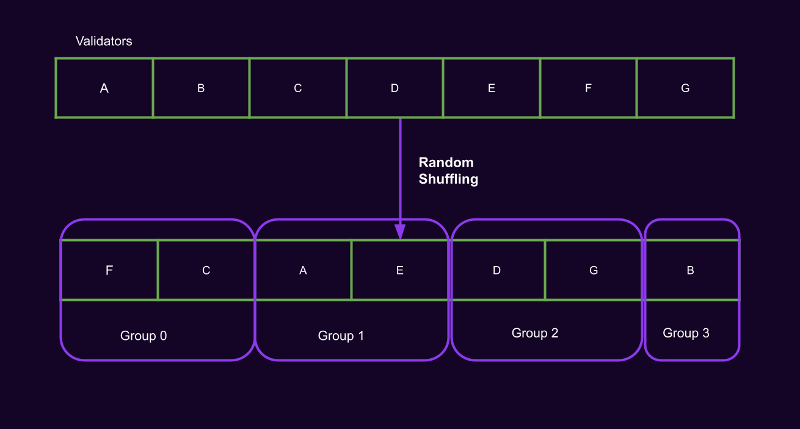
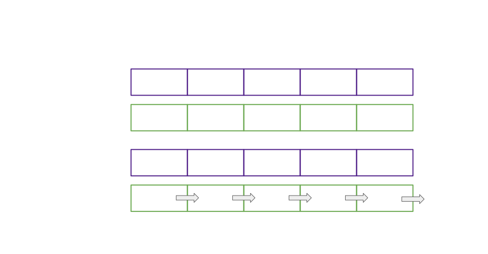

# Deep Dive, Availability Cores

Notes:

Hello!

I'm Bradley Olson

Was student at first Academy in Cambridge

Currently on Parachains Core Team at Parity

Will present 3 lectures providing a window into Polkadot core, a slice of where we're at and where we're headed.

First a look at availability cores, the abstraction enabling flexible purchases of blockspace under the umbrella of Polkadot shared security.

Lets get to it

---

## Overview

<pba-flex center>

- What do availability cores represent?
- How do cores map parachain leases and claims to validator subsets?
- How do cores gate each step of the parachains protocol?
- What advantages do cores give us now?
- What roadmap items do cores accomodate?

</pba-flex>

---

## Review, Blockspace

> Blockspace is the capacity of a blockchain to finalize and commit operations

Polkadot's primary product is _blockspace_.

---

## Disecting Polkadot Blockspace

In a parachain block you get:

<pba-flex center>

- Proof of Validity
    - max size: 5 * 1024 * 1024
- Code upgrade 
    - max size: 4 * 1024 * 1024
    - cooldown: 14400 blocks
- HRMP messages 
    - Max message size: 102400
    - Messages per block per channel: 10
    - Max channels: 30
- UMP messages
    - Max message size: 65531
    - Messages per block: 16

</pba-flex>

Notes:

Max POV size implicitly limits the number of operations per block, since each on-chain operation and its impact on state are accounted for in the POV.

Why not put everything in the POV?

Short answer: Code upgrades and cross consensus messages have different data availability requirements than ordinary parachain operations.

The relay chain needs to keep a copy of the current code for each parachain for PVF execution. 

HRMP and UMP messages must be made available to their recipients, so they need to be cached on the relay chain for an indeterminate period.

---

## Blockspace, Use It or Lose It

Polkadot blockspace is consumed in two ways:
1. When the relay chain validates, includes, and finalizes a parachain block
2. When the capacity to validate a parachain block is left unused and expires


Notes:

In this sense units of blockspace have very short lifespans, less than the relay block time of 6 seconds. To mitigate waste it is therefore critical to provide flexible markets for blockspace which maximize the proportion that is purchased and fully used.

---

## Availability Core Defined

<pba-cols>
<pba-col center>

  - Availability cores are the abstraction we use to allocate Polkadot's blockspace.
  - Cores divide blockspace supply into discrete units, 1 parachain block per relay chain block per core
  - Why "availability"?
  - Why "core"?

</pba-col>
<pba-col center>


</pba-col>
</pba-cols>

Notes:

- "Availability", because a core is considered occupied by a parachain block candidate during the period when that candidate is being made available via erasure coding.
- "Core", because many candidates can be made available in parallel, mimicking the parallel computation per core in a computer processor.

---

## Cores and Blockspace Over Time


Notes:

_analogy-freight-train_: A unit of blockspace is a reserved car in a train leaving the station at a specific time. Trains are scheduled to leave the station every six seconds. An availability core is a particular car index within all trains. If you have a lease on core 4, then you have the right to fill train car 4 on each train with whatever you want to ship.

---

# Mapping Leases and Claims to Validator Subsets

---

## Backing Group Formation



Notes:

To understand how cores divide up parachains protocol work among validators, we first need to understand how those validators are grouped.
Validators randomly assigned to groups at start of session.

---

## Assigning Backing Groups to Cores



Notes:

Validator groups rotate across availability cores in a round-robin fashion, with rotation occurring at fixed intervals. This is to prevent a byzantine backing group from interrupting the liveness of any one parachain for too long.

---

## Assigning Approvers to Cores

---

## Assigning Cores to Parachains

Diagram for core assignments. Two cores paired to a single lease each. Two on-demand cores linked to the same on-demand claims queue. Show that every other claim in the queue goes to core 1. Show at least one free core. 

---

## Occupying Assigned Cores

Diagram showing how backed candidates are supplied to occupy assigned cores. Show that a leasing chain with no backed candidates won't occupy a core. Show that an occupied core can't accept a second candidate. Show that each on-demand claim comes with a number of tries to submit a candidate that validators will back. Each relay block that passes with without a backed candidate produced to fill the availability core counts as a failed try.

---

## Core States in the Runtime

```rust

#[pallet::storage]
#[pallet::getter(fn availability_cores)]
pub(crate) type AvailabilityCores<T> = StorageValue<_, Vec<Option<CoreOccupied>>, ValueQuery>;

#[pallet::storage]
pub(crate) type ParathreadQueue<T> = StorageValue<_, ParathreadClaimQueue, ValueQuery>;

#[pallet::storage]
#[pallet::getter(fn scheduled)]
pub(crate) type Scheduled<T> = StorageValue<_, Vec<CoreAssignment>, ValueQuery>;

pub struct ParathreadClaimQueue {
    queue: Vec<QueuedParathread>,
    // this value is between 0 and config.parathread_cores
    next_core_offset: u32,
}

pub struct CoreAssignment {
    /// The core that is assigned.
    pub core: CoreIndex,
    /// The unique ID of the para that is assigned to the core.
    pub para_id: ParaId,
    /// The kind of the assignment.
    pub kind: AssignmentKind,
}

pub enum CoreOccupied {
    /// A parathread (on-demand parachain).
    Parathread(ParathreadEntry),
    /// A parachain.
    Parachain,
}
```

---

# How Cores Gate Each Step of the Parachains Protocol

---

## Cores and Backing Groups

- Groups assigned by core
- Groups only back candidates with appropriate assignment
- Groups notified early of on-demand core assignments

Notes:

- Backing groups are assigned to parachains by core
- Backing groups will only back candidates for the chain assigned to their assigned core as of the candidate's relay parent
- Backing groups for on-demand cores are made aware of on-demand claims ahead of time, so that they know to start the backing process early enough that inclusion retries aren't required.

---

## Cores and Backing Groups, Code

We limit seconding of candidates based on availability core assignments in the function `handle_second_message()` of the Backing Subsystem.

```rust

// Sanity check that candidate is from our assignment.
if Some(candidate.descriptor().para_id) != rp_state.assignment {
	gum::debug!(
		target: LOG_TARGET,
		our_assignment = ?rp_state.assignment,
		collation = ?candidate.descriptor().para_id,
		"Subsystem asked to second for para outside of our assignment",
	);

	return Ok(())
}

```

Notes:

- rp_state is the state of the backing subsystem tracked per relay parent. 
- The backing subsystem doesn't need to track assignments very far back. Without Asynchronous backing only the assignments at the heads of each active fork are needed. With Async backing we track up to AsyncBackingParams::allowed_ancestry_len
- A single validator may end up simultaniously performing backing tasks relating to multiple cores even within the same fork of the chain. This happens if that validator's core assignment changed from one relay block to the next and allowed_ancestry_len > 0.

---

## Cores and Backing On-Chain

- Prior candidate must vacate core before next is backed on-chain
- When backed on-chain the candidate immediately occupies the availability core
- Candidates provided from backing subsystem (or prospective parachains) according to core assignment

Notes:
- Prior candidate leaves core by time out (1 block) or being made available

---

## Cores and Backing On-Chain, Code

Function `request_backable_candidates` from the Provisioner subsystem

```rust

/// Requests backable candidates from Prospective Parachains subsystem
/// based on core states.
///
/// Should be called when prospective parachains are enabled.
async fn request_backable_candidates(
	availability_cores: &[CoreState],
	bitfields: &[SignedAvailabilityBitfield],
	relay_parent: Hash,
	sender: &mut impl overseer::ProvisionerSenderTrait,
) -> Result<Vec<CandidateHash>, Error> {
	let block_number = get_block_number_under_construction(relay_parent, sender).await?;

	let mut selected_candidates = Vec::with_capacity(availability_cores.len());

	for (core_idx, core) in availability_cores.iter().enumerate() {
		let (para_id, required_path) = match core {
			CoreState::Scheduled(scheduled_core) => {
				// The core is free, pick the first eligible candidate from
				// the fragment tree.
				(scheduled_core.para_id, Vec::new())
			},
			CoreState::Occupied(occupied_core) => {
				if bitfields_indicate_availability(core_idx, bitfields, &occupied_core.availability)
				{
					if let Some(ref scheduled_core) = occupied_core.next_up_on_available {
						// The candidate occupying the core is available, choose its
						// child in the fragment tree.
						//
						// TODO: doesn't work for on-demand parachains. We lean hard on the assumption
						// that cores are fixed to specific parachains within a session.
						// https://github.com/paritytech/polkadot/issues/5492
						(scheduled_core.para_id, vec![occupied_core.candidate_hash])
					} else {
						continue
					}
				} else {
					if occupied_core.time_out_at != block_number {
						continue
					}
					if let Some(ref scheduled_core) = occupied_core.next_up_on_time_out {
						// Candidate's availability timed out, practically same as scheduled.
						(scheduled_core.para_id, Vec::new())
					} else {
						continue
					}
				}
			},
			CoreState::Free => continue,
		};

		let candidate_hash =
			get_backable_candidate(relay_parent, para_id, required_path, sender).await?;

		match candidate_hash {
			Some(hash) => selected_candidates.push(hash),
			None => {
				gum::debug!(
					target: LOG_TARGET,
					leaf_hash = ?relay_parent,
					core = core_idx,
					"No backable candidate returned by prospective parachains",
				);
			},
		}
	}

	Ok(selected_candidates)
}

```

Notes:

- Per core
    - Discuss scheduled, free
    - Discuss occupied
        - `bitfields_indicate_availability`
            - next_up_on_available
        - availability time out
            - next_up_on_timeout
    - We get a backable candidate for the assigned para id of each core, if one exists. This backs the candidate on chain and fills the vacated core.

---

## Cores and Availability

- Core freed when bitfields indicate availability
- 1/3 needed to reconstruct POV
- Availability threshold 2/3 
- But what do bits represent?

---

## Cores and Availability, Code

Either graphic of taking the transverse of bitfields, or `bitfields_indicate_availability` code

---

## Cores and Approvals, Disputes, Finality

- An included candidate already occupied an availability core
- Approvals, Disputes, and Finality only provided to included candidates

---

## Advantages Cores Give us Now

- Improved liveness through rotating backing groups
- Flexible partitioning of resources (lease vs on-demand)
- Intuitive unit of capacity over time

---

## Cores and Roadmap Items

- Exotic core scheduling
	- Multiple cores per parachain
	- Lease

---

## Cores and Roadmap Items, Cont.

- Strided blockspace regions
	- EX: 2 chains each with 12 sec blocks
- Cross timeframe cost comparisons
- Custom bidding/purchasing logic
	- Bid below given price
	- Transaction pool larger than threshold
	- Raise bid at peak usage

---

## Resources

<pba-col center>

1. [Implementers Guide: Scheduler Pallet](https://paritytech.github.io/polkadot/book/runtime/scheduler.html)
1. [Forum Post: Strided Blockspace Regions](https://forum.polkadot.network/t/unifying-bulk-and-mid-term-blockspace-with-strided-regions/2228)

</pba-col>

---

<!-- .slide: data-background-color="#4A2439" -->

# Questions