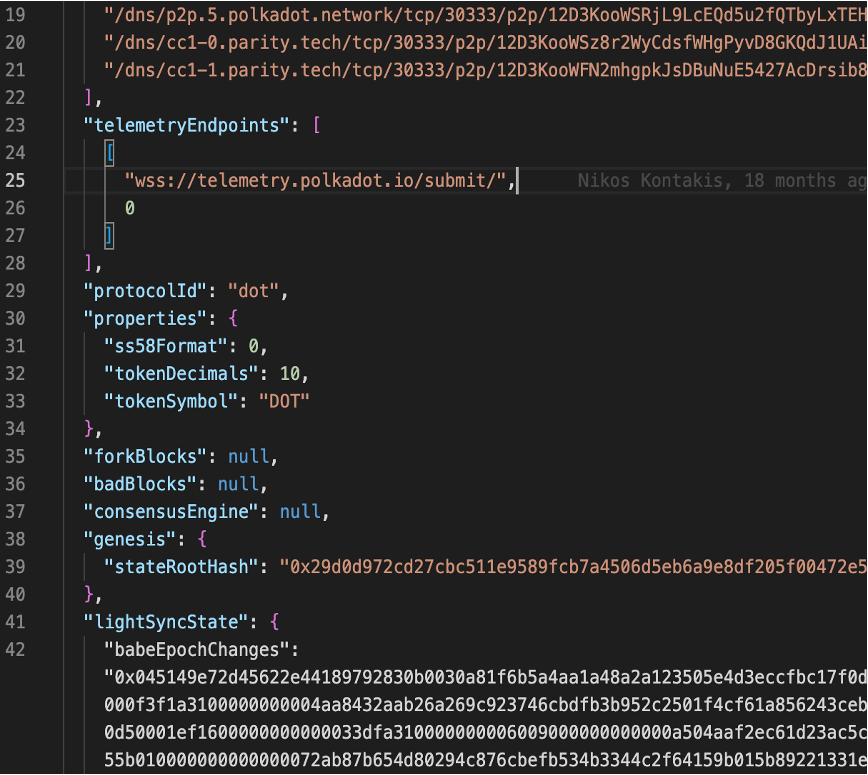
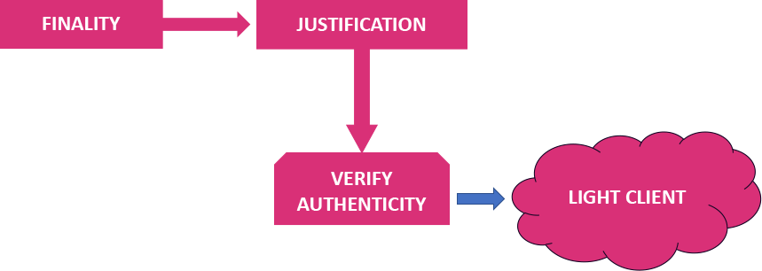

<style type="text/css">
.bordered-box {
  background-color: green;
  border-radius: 1rem;
  padding: 1rem;
  margin-top: 1rem !important;
}

.font-weight-bold {
  font-weight: bold;
}

.red {
  background-color: red;
}

.green {
  background-color: green;
}

.bold_under {
  font-weight: bold;
  text-decoration: underline;
}

.polkadot {
  color: var(--r-heading-color);
}

.polkadot-bubble {
  color: white;
  background: var(--r-heading-color);
  font-size: 1.5rem;
}
</style>

# Light clients<br/>and<br/>Unstoppable Apps

---

## Traditional Web 2


<aside class="notes">
  This is web 2. This is where most of applications in the web are at the moment (e.g. don’t want to roast anyone, but facebook, twitter, whatsapp etc etc);
</aside>

---v

## The Web 3 vision


---v

## The Web 3 reality


---

<h1 style="font-size:7rem; font-weight: bold">Blockchain "decentralized” apps are still centralized</h1>

---

## The reality of blockchains today


---v

<h4>PUBLICLY-ACCESSIBLE NODE</h4>
<pba-cols>
  <pba-col left>
    <div>App connects to a third-party-owned publicly-accessible
node client</div>
    <div class="red bordered-box"><span class="font-weight-bold">Centralized and insecure:</span> Publicly-accessible node can be malicious</div>
<div class="green bordered-box"><span class="font-weight-bold">Convenient:</span> Works transparently</div>
  </pba-col>
  <!-- .element: class="fragment" data-fragment-index="2" -->
  <pba-col left>
    
  </pba-col>
  <!-- .element: class="fragment" data-fragment-index="1" -->
</pba-cols>

---v

<h4>USER-CONTROLLED NODE</h4>
<pba-cols>
  <pba-col left>
    <div>App connects to a node client that the user has installed on their machine</div>
    <div class="green bordered-box"><span class="font-weight-bold">Secure</span><br />Trustless: connects to multiple nodes, verifies everything</div>
<div class="red bordered-box"><span class="font-weight-bold">Convenient:</span> Works transparently</div>
  </pba-col>
  <!-- .element: class="fragment" data-fragment-index="2" -->
   <pba-col left>
      
  </pba-col>
  <!-- .element: class="fragment" data-fragment-index="1" -->
</pba-cols>

---v

<h4>Why this needs fixing?</h4>
<pba-cols>
  <pba-col left>
      <h4>Reliability</h4>
      <div>"The middleman" can stop working for a reason or another, leaving end users incapable of interacting with the blockchain.</div>
  </pba-col>
  <!-- .element: class="fragment" data-fragment-index="1" -->
   <pba-col left>
   <h4>Possibility of censorship or hijacking</h4>
      <div>"The middleman" can decide to ban some end users or some transactions, or can be taken control of by an attacker.</div>
  </pba-col>
  <!-- .element: class="fragment" data-fragment-index="2" -->
   <pba-col left>
   <h4>Frontrunning problem</h4>
      <div>"The middleman" knows all the transactions that are submitted before they are actually applied, and can inject its own transactions ahead of time for its own monetary gains.</div>
  </pba-col>
  <!-- .element: class="fragment" data-fragment-index="3" -->
</pba-cols>
---v

## The reality of blockchains we want


---v

# The solution


# Light Clients

---

# What is a light client?

<p style="font-size:4rem">It's a client/node...</p>

<!-- .element: class="fragment" data-fragment-index="1" -->

<p style="font-size:1.5rem">...but lighter!</p>

<!-- .element: class="fragment" data-fragment-index="2" -->

---v

# Node types in the network

<p style="text-align: left; padding-bottom: 2rem">The type of each node depends on different characteristics:</p>

<ul>
  <li>
    <span class="bold_under">Validator:</span> node configured to potentially produce blocks.
  </li>
<!-- .element: class="fragment" data-fragment-index="1" -->
  <li>
    <span class="bold_under">JSON-RPC:</span> node which gives public access to its JSON-RPC endpoint.
  </li>
<!-- .element: class="fragment" data-fragment-index="2" -->
  <li>
    <span class="bold_under">Bootnode:</span> node whose address can be found in the chain specification. Necessary to kick-off the network.
  </li>
<!-- .element: class="fragment" data-fragment-index="3" -->
  <li>
    <span class="bold_under">Archive:</span> stores the entire state of the chain at each block since block #0. Useful to access historical data.
  </li>
<!-- .element: class="fragment" data-fragment-index="4" -->
  <li>
    <span class="bold_under polkadot">Light client:</span><span class="polkadot"> doesn’t store the entire state of the chain but requests it on demand.</span>
  </li>
<!-- .element: class="fragment" data-fragment-index="5" -->
</ul>

---v

# What is a light client/node?

<ul>
  <li>
    It is a client that is lighter than a full node, in terms of memory consumption, number of threads, and code size, in order to be distributed it in web pages;
  </li>
<!-- .element: class="fragment" data-fragment-index="1" -->
  <li> Allows a dApp to access and interact with a blockchain in a secure and decentralized manner without having to sync the full blockchain;
  </li>
<!-- .element: class="fragment" data-fragment-index="2" -->
  <li> It is a node that doesn’t store the entire state of the chain but requests it
on demand;
  </li>
<!-- .element: class="fragment" data-fragment-index="3" -->
  <li> It connects to the network and interacts in a fully trust-less way with it;</li>
<!-- .element: class="fragment" data-fragment-index="4" -->
</ul>

---v

<h2>How does a light client know where to connect to</h2>

<pba-cols>
  <pba-col left>
    
  </pba-col>
  <!-- .element: class="fragment" data-fragment-index="1" -->
  <pba-col left>
    
  </pba-col>
  <!-- .element: class="fragment" data-fragment-index="2" -->
</pba-cols>

---v

<h2>How does a light client know what/who to trust</h2>

<!-- .element: class="fragment" data-fragment-index="1" -->
---v

<pba-cols>
  <pba-col left>
    <h2 style="text-align: center">Full node</h2>
  </pba-col>
  <pba-col left>
    <h2 style="text-align: center">Light client</h2>
  </pba-col>
</pba-cols>
<pba-cols>
  <pba-col left>
    <div class="polkadot-bubble bordered-box">Fully verifies all blocks (authenticity/validity)</div>
    <div class="polkadot-bubble bordered-box">Holds all the chain’s storage in its database</div>
    <div class="polkadot-bubble bordered-box">Holds all past blocks in its database</div>
    <div class="polkadot-bubble bordered-box">At initial startup, can take hours to be
ready</div>
  </pba-col>
  <!-- .element: class="fragment" data-fragment-index="1" -->

  <pba-col left>
    <div class="polkadot-bubble bordered-box">Only verifies the authenticity of blocks</div>
    <div class="polkadot-bubble bordered-box">Requests state of the chain on demand</div>
    <div class="polkadot-bubble bordered-box">No database whatsoever</div>
    <div class="polkadot-bubble bordered-box">Initializes in few seconds</div>
  </pba-col>
  <!-- .element: class="fragment" data-fragment-index="2" -->
</pba-cols>

<p style="font-size: 1.5rem; padding-top: 100px;">“Full”: not really a type - depends on context - a node that does not fulfill any of the characteristics below.</p>

---v

<pba-cols>
  <pba-col left>
    <ul>
      <li>light client</li>
  <!-- .element: class="fragment" data-fragment-index="1" -->
      <li>wasm</li>
  <!-- .element: class="fragment" data-fragment-index="3" -->
      <li>rust</li>
  <!-- .element: class="fragment" data-fragment-index="6" -->
      <li>smoldot</li>
  <!-- .element: class="fragment" data-fragment-index="2" -->
      <li>Deno</li>
  <!-- .element: class="fragment" data-fragment-index="5" -->
      <li>browser-friendly</li>
  <!-- .element: class="fragment" data-fragment-index="2" -->
      <li>npm package</li>
  <!-- .element: class="fragment" data-fragment-index="4" -->
    </ul>
  </pba-col>
  <pba-col left>
    <ul>
      <li>standalone or as a wrapper of smoldot for polkadotJS</li>
  <!-- .element: class="fragment" data-fragment-index="3" -->
      <li>npm package</li>
  <!-- .element: class="fragment" data-fragment-index="2" -->
      <li>substrate_connect</li>
  <!-- .element: class="fragment" data-fragment-index="1" -->
      <li>javascript</li>
  <!-- .element: class="fragment" data-fragment-index="6" -->
      <li>substrate_connect</li>
  <!-- .element: class="fragment" data-fragment-index="5" -->
      <li>javascript</li>
  <!-- .element: class="fragment" data-fragment-index="4" -->
      <li>WASM light node (no native)</li>
  <!-- .element: class="fragment" data-fragment-index="5" -->
    </ul>
  </pba-col>
  <pba-col left>
    <ul>
      <li>light client</li>
  <!-- .element: class="fragment" data-fragment-index="2" -->
      <li>wasm</li>
  <!-- .element: class="fragment" data-fragment-index="3" -->
      <li>rust</li>
  <!-- .element: class="fragment" data-fragment-index="2" -->
      <li>smoldot</li>
  <!-- .element: class="fragment" data-fragment-index="3" -->
      <li>CAPI</li>
  <!-- .element: class="fragment" data-fragment-index="5" -->
      <li>substrate_connect</li>
  <!-- .element: class="fragment" data-fragment-index="4" -->
      <li>javascript</li>
  <!-- .element: class="fragment" data-fragment-index="2" -->
      <li>browser-friendly</li>
  <!-- .element: class="fragment" data-fragment-index="1" -->
    </ul>
  </pba-col>
</pba-cols>

---

## NEXT SLIDES FOR LIGHT CLIENTS

---

## Publicly Accessible Node

The dApp (UI) connects to a third-party-owned publicly-accessible node client

<p class="red bordered-box"><span class="font-weight-bold">Centralized and insecure:</span> Publicly-accessible node can be malicious</p>
<p class="green bordered-box"><span class="font-weight-bold">Convenient:</span> Works transparently</p>

---v

## So what one needs to do

Find the web-socket url of a 3rd party node that you trust;

---v

## In your dApp

```javascript[0|1|3-5|7-9]
import { ApiPromise, WsProvider } from "@polkadot/api";

// Maybe some more code that does some magic here
const provider = new WsProvider("wss://westend-rpc.polkadot.io");
const api = await ApiPromise.create({ provider });

// Interact using polkadotJS API
const header = await api.rpc.chain.getHeader();
const chainName = await api.rpc.system.chain();
```

---

## User-Controlled Node

The dApp (UI) connects to a node client that the user has installed on their machine

<p class="green bordered-box"><span class="font-weight-bold">Secure Trustless:</span> connects to multiple nodes, verifies everything</p>
<p class="red bordered-box"><span class="font-weight-bold">Inconvenient:</span> Needs an installation process and having a node up and running, plus maintenance effort</p>

---v

## So what one needs to do

<pba-flex center>

1. Install dependencies<br/>
   (e.g. rust, openssl, cmake, llvm etc);
1. Clone from github the `polkadot` repo;
1. Build the node locally;
1. Start the node locally;
1. Wait for node to synchronize;

<pba-flex>

---v

## In your dApp

```javascript[|1|3-5|7-9]
import { ApiPromise, WsProvider } from "@polkadot/api";

// Maybe some more code that does some magic here
const provider = new WsProvider("wss://127.0.0.1:9944");
const api = await ApiPromise.create({ provider });

// Interact using polkadotJS API
const header = await api.rpc.chain.getHeader();
const chainName = await api.rpc.system.chain();
```

---

## Light Client in the Browser

The uApp (UI) connects to an _integrated_ light client

<p class="green bordered-box"><span class="font-weight-bold">Secure Trustless:</span> connects to multiple nodes, verifies everything</p>
<p class="green bordered-box"><span class="font-weight-bold">Convenient:</span> Works transparently</p>

---v

## So what one needs to do

<pba-flex center>

1. Install and use [Substrate Connect](https://github.com/paritytech/substrate-connect)<br/>
   dependencies in the uApp
1. Write/Replace 2-3 lines of code

</pba-flex>

---v

## With PolkadotJS API

```javascript[0|1-2|4-7|9-11]
import { ScProvider } from "@polkadot/rpc-provider/substrate-connect";
import * as Sc from '@substrate/connect';

// Maybe some more code that does some magic here
const provider = new ScProvider(Sc, Sc.WellKnownChain.westend2);
await provider.connect();
const api = await ApiPromise.create({ provider });

// Interact using polkadotJS API
const header = await api.rpc.chain.getHeader();
const chainName = await api.rpc.system.chain();
```

---v

### Or even without PolkadotJS API

```javascript[0|1|4|5-10|12-15]
import { createScClient, WellKnownChain } from "@substrate/connect";

// Maybe some more code that does some magic here
const scClient = createScClient();
const mainChain = await scClient.addWellKnownChain(
  WellKnownChain.polkadot,
  jsonRpcCallback = (response) {
    console.log(response);
  }
);

// Communicate with the network
mainChain.sendJsonRpc(
  '{"jsonrpc":"2.0","id":"1","method":"chainHead_unstable_follow","params":[true]}',
);
```

---v

### Or with a Custom Chainspec

```javascript[0|2, 4| 6-13| 9 | 15-18]
import { createScClient, WellKnownChain } from "@substrate/connect";
import myLovelyChainspec from './myLovelyChainspecFromSubstrateChain.json';

const myLovelyChainspecStringified = JSON.stringify(myLovelyChainspec);

// Maybe some more code that does some magic here
const scClient = createScClient();
const mainChain = await scClient.addChain(
  myLovelyChainspecStringified,
  jsonRpcCallback = (response) {
    console.log(response);
  }
);

// Communicate with the network
mainChain.sendJsonRpc(
  '{"jsonrpc":"2.0","id":"1","method":"chainHead_unstable_follow","params":[true]}',
);
```

---


