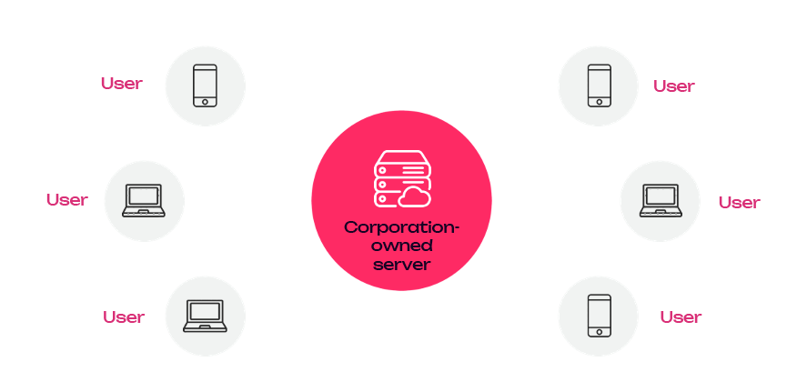
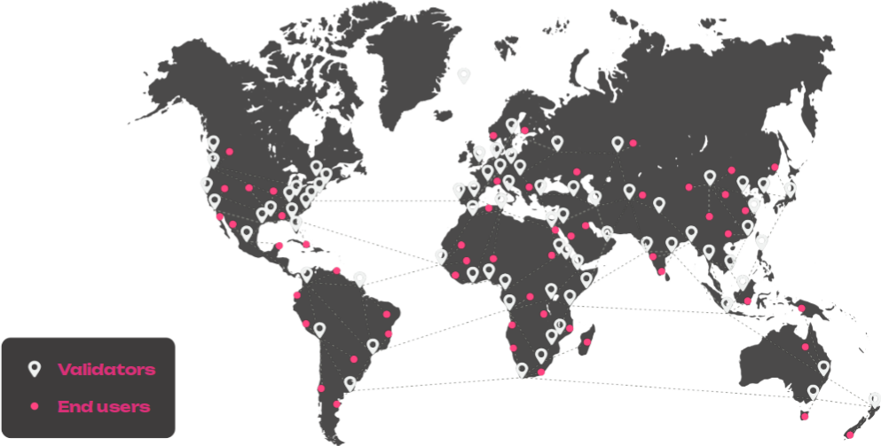
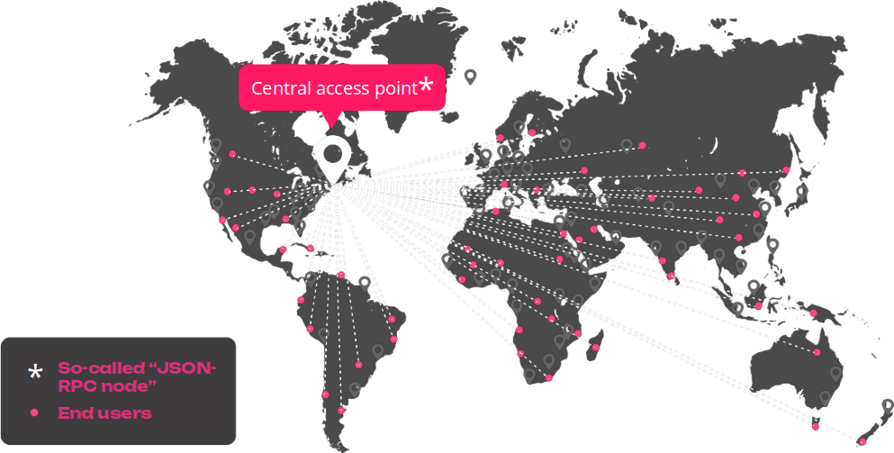
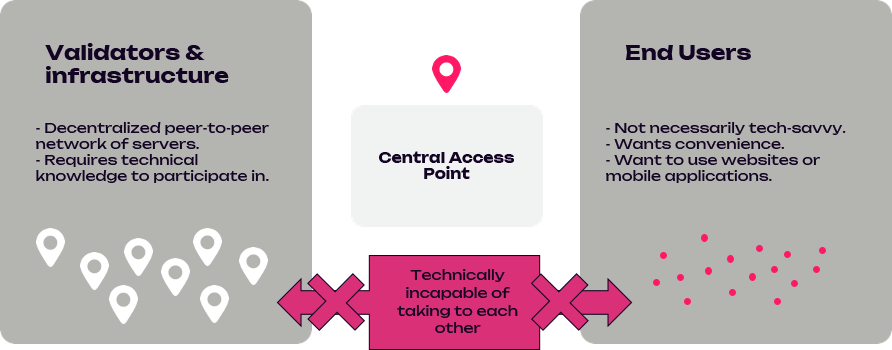
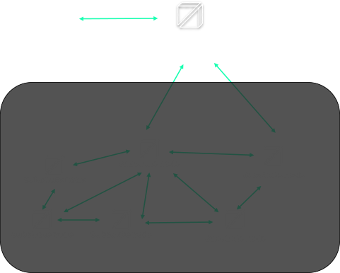
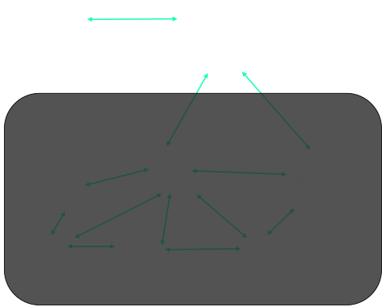
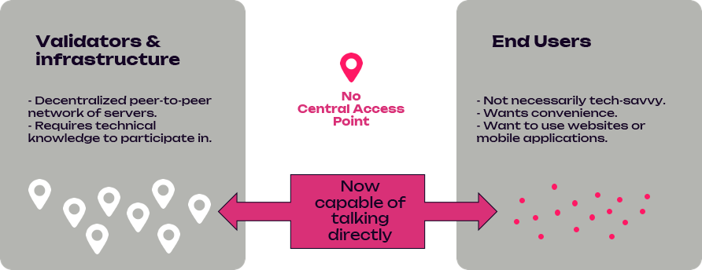
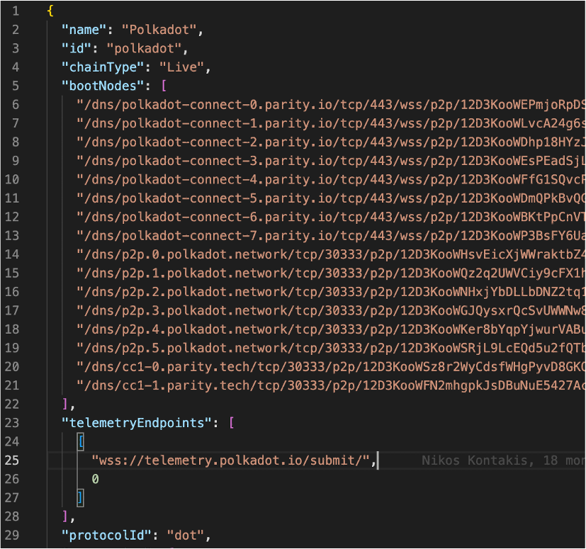
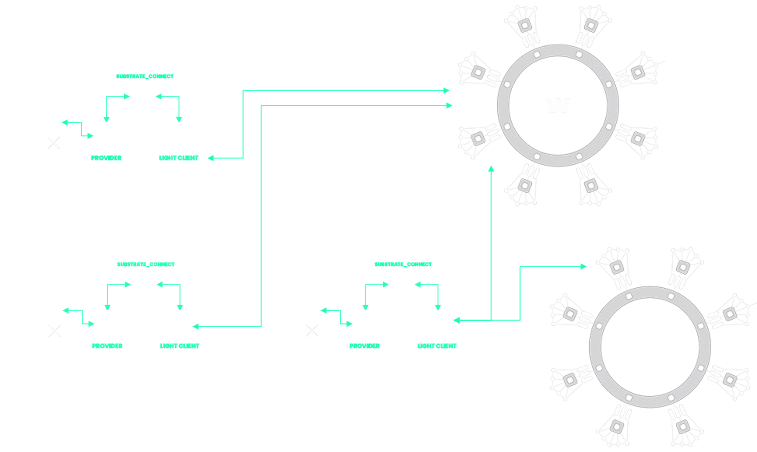
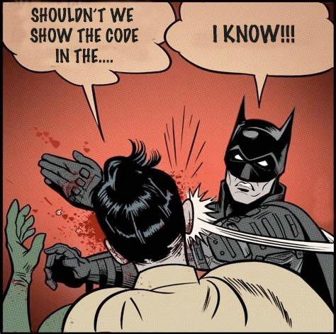

<style type="text/css">
.bordered-box {
  background-color: green;
  border-radius: 1rem;
  padding: 1rem;
  margin-top: 1rem !important;
}

.font-bold {
  font-weight: bold;
}

.red {
  background-color: red;
}

.green {
  background-color: green;
}

.font-under {
  text-decoration: underline;
}

.polkadot {
  color: var(--r-heading-color);
}

.polkadot-bubble {
  color: white;
  background: var(--r-heading-color);
  font-size: 1.5rem;
}

.lc-mermaid svg {
  max-width: 70% !important;
}
</style>

# Light clients<br/>and<br/>Unstoppable Apps

---

## Traditional Web 2



<aside class="notes">
  This is web 2. This is where most of applications in the web are at the moment (e.g. don’t want to roast anyone, but facebook, twitter, whatsapp etc etc);
</aside>

Notes:

This is web 2. This is where most of applications in the web are at the moment (e.g. don’t want to roast anyone, but facebook, twitter, whatsapp etc etc);

---v

## The Web 3 vision



Notes:

This is the vision of what web3 should look like.. Validators and End users all over the world, where everyone can connect to anyone available around and exchange information;

With a show of hands…
How many people in here, think that we are close to this at the moment?
How many people in here, think that we are far from this at the moment?

---v

## The Web 3 reality



Notes:

Many applications or services may advertise as decentralized but, how much they really are?

I want to say one thing - and pause there for a few seconds to let it sink in;

---

<h1 style="font-size:7rem; font-weight: bold">Blockchain "decentralized” apps are still centralized</h1>

---

## The reality of blockchains today



Notes:

Intro to next slide:
Here is how this is happening in reality at the moment, or how one could possibly connect to the network today

---v

<h4>PUBLICLY-ACCESSIBLE NODE</h4>
<pba-cols>
  <pba-col left>
    <div>App connects to a third-party-owned publicly-accessible
node client</div>
    <div class="red bordered-box"><span class="font-bold">Centralized and insecure:</span> Publicly-accessible node can be malicious</div>
<div class="green bordered-box"><span class="font-bold">Convenient:</span> Works transparently</div>
  </pba-col>
  <!-- .element: class="fragment" data-fragment-index="2" -->
  <pba-col left>
    
  </pba-col>
  <!-- .element: class="fragment" data-fragment-index="1" -->
</pba-cols>

Notes:

This is the reality of how things really are today

WHAT ARE THE WAYS to connect to the network from a UI like (e.g. polkadotJS apps or any custom one) today:

(Read slides)

---v

<h4>USER-CONTROLLED NODE</h4>
<pba-cols>
  <pba-col left>
    <div>App connects to a node client that the user has installed on their machine</div>
    <div class="green bordered-box"><span class="font-bold">Secure</span><br />Trustless: connects to multiple nodes, verifies everything</div>
<div class="red bordered-box"><span class="font-bold">Convenient:</span> Works transparently</div>
  </pba-col>
  <!-- .element: class="fragment" data-fragment-index="2" -->
   <pba-col left>
      
  </pba-col>
  <!-- .element: class="fragment" data-fragment-index="1" -->
</pba-cols>

Notes:

(Read slides)

---v

<h4>Why this needs fixing?</h4>
<pba-cols>
  <pba-col left>
      <h4>Reliability</h4>
      <div>"The middleman" can stop working for a reason or another, leaving end users incapable of interacting with the blockchain.</div>
  </pba-col>
  <!-- .element: class="fragment" data-fragment-index="1" -->
   <pba-col left>
   <h4>Possibility of censorship or hijacking</h4>
      <div>"The middleman" can decide to ban some end users or some transactions, or can be taken control of by an attacker.</div>
  </pba-col>
  <!-- .element: class="fragment" data-fragment-index="2" -->
   <pba-col left>
   <h4>Frontrunning problem</h4>
      <div>"The middleman" knows all the transactions that are submitted before they are actually applied, and can inject its own transactions ahead of time for its own monetary gains.</div>
  </pba-col>
  <!-- .element: class="fragment" data-fragment-index="3" -->
</pba-cols>

Notes:

In the 3rd party case the user relies on the 3rd party node to connect to, in order to communicate with the network.
(audience) With a show of hands Why this needs fixing?
Possibility of censorship or hijacking
Reliability

Front running is the act of placing a transaction in a queue with the knowledge of a future transaction

---v

## The reality of blockchains we want



---v

# The solution


# Light Clients

---

# What is a light client?

<p style="font-size:4rem">It's a client/node...</p>

<!-- .element: class="fragment" data-fragment-index="1" -->

<p style="font-size:1.5rem">...but lighter!</p>

<!-- .element: class="fragment" data-fragment-index="2" -->

Notes:

When I joined the team of substrate connect, I asked this same question.. And the response I got was…. (\*)
Back then I was like… “Yeah – thanks I guess”

But that was actually true!

---v

# Node types in the network

<p style="text-align: left; padding-bottom: 2rem">The type of each node depends on different characteristics:</p>

<ul>
  <li>
    <span class="font-bold font-under">Validator:</span> node configured to potentially produce blocks.
  </li>
<!-- .element: class="fragment" data-fragment-index="1" -->
  <li>
    <span class="font-bold font-under">JSON-RPC:</span> node which gives public access to its JSON-RPC endpoint.
  </li>
<!-- .element: class="fragment" data-fragment-index="2" -->
  <li>
    <span class="font-bold font-under">Bootnode:</span> node whose address can be found in the chain specification. Necessary to kick-off the network.
  </li>
<!-- .element: class="fragment" data-fragment-index="3" -->
  <li>
    <span class="font-bold font-under">Archive:</span> stores the entire state of the chain at each block since block #0. Useful to access historical data.
  </li>
<!-- .element: class="fragment" data-fragment-index="4" -->
  <li>
    <span class="font-bold font-under polkadot">Light client:</span><span class="polkadot"> doesn’t store the entire state of the chain but requests it on demand.</span>
  </li>
<!-- .element: class="fragment" data-fragment-index="5" -->
</ul>

Notes:

Before anything else – lets remember the node types in the network

(......After the Clicks!....)

Any combination of “validator”, “archive”, “bootnode” and “JSON-RPC node” is possible, except for “light” and “archive” that are mutually incompatible.

Depending on context, the word “full node” is generally used to designate either the opposite of a light node, or a node that hasn’t any or combination of the characteristics above. At the moment, almost all nodes on the network are either validators or full nodes.

---v

# What is a light client/node?

<ul>
  <li>
    It is a client that is lighter than a full node, in terms of memory consumption, number of threads, and code size, in order to be distributed it in web pages;
  </li>
<!-- .element: class="fragment" data-fragment-index="1" -->
  <li> Allows a dApp to access and interact with a blockchain in a secure and decentralized manner without having to sync the full blockchain;
  </li>
<!-- .element: class="fragment" data-fragment-index="2" -->
  <li> It is a node that doesn’t store the entire state of the chain but requests it
on demand;
  </li>
<!-- .element: class="fragment" data-fragment-index="3" -->
  <li> It connects to the network and interacts in a fully trust-less way with it;</li>
<!-- .element: class="fragment" data-fragment-index="4" -->
</ul>

Notes:

Read the slides

---v

<h2>How does a light client know where to connect to</h2>

<pba-cols>
  <pba-col left>
    
  </pba-col>
  <!-- .element: class="fragment" data-fragment-index="1" -->
  <pba-col left>
    
  </pba-col>
  <!-- .element: class="fragment" data-fragment-index="2" -->
</pba-cols>

---v

<h2>How does a light client know what/who to trust</h2>

<!-- .element: class="fragment" data-fragment-index="1" -->

Notes:

As we know Substrate chains provides the concept of FINALITY which is VERY important for the light clients!

Once a block has been finalized, it is guaranteed to always be part of the best chain. By extension, the parent of a finalized block is always finalized as well etc etc

For finality Substrate/Polkadot nodes use the GrandPa algorithm. Authorized nodes, emit votes on the network, when 2/3rds or more have voted for a specific block, it effectively becomes finalized.

These votes are been collected in what is called a **justification**

It is used by nodes who might not have received all the votes, or for example if they were offline, In order to verify the authenticity of the blocks;

A Light client receives these justifications and this way it verifies the authenticity of a block.

---v

<pba-cols>
  <pba-col left>
    <h2 style="text-align: center">Full node</h2>
  </pba-col>
  <pba-col left>
    <h2 style="text-align: center">Light client</h2>
  </pba-col>
</pba-cols>
<pba-cols>
  <pba-col left>
    <div class="polkadot-bubble bordered-box">Fully verifies all blocks (authenticity/validity)</div>
    <div class="polkadot-bubble bordered-box">Holds all the chain’s storage in its database</div>
    <div class="polkadot-bubble bordered-box">Holds all past blocks in its database</div>
    <div class="polkadot-bubble bordered-box">At initial startup, can take hours to be
ready</div>
  </pba-col>
  <!-- .element: class="fragment" data-fragment-index="1" -->

  <pba-col left>
    <div class="polkadot-bubble bordered-box">Only verifies the authenticity of blocks</div>
    <div class="polkadot-bubble bordered-box">Requests state of the chain on demand</div>
    <div class="polkadot-bubble bordered-box">No database whatsoever</div>
    <div class="polkadot-bubble bordered-box">Initializes in few seconds</div>
  </pba-col>
  <!-- .element: class="fragment" data-fragment-index="2" -->
</pba-cols>

<p style="font-size: 1.5rem; padding-top: 100px;">“Full”: not really a type - depends on context - a node that does not fulfill any of the characteristics below.</p>

---

<pba-cols>
  <pba-col left>
    <ul>
      <li>light client</li>
  <!-- .element: class="fragment" data-fragment-index="1" -->
      <li>wasm</li>
  <!-- .element: class="fragment" data-fragment-index="3" -->
      <li>rust</li>
  <!-- .element: class="fragment" data-fragment-index="6" -->
      <li>smoldot</li>
  <!-- .element: class="fragment" data-fragment-index="2" -->
      <li>browser-friendly</li>
  <!-- .element: class="fragment" data-fragment-index="2" -->
      <li>npm package</li>
  <!-- .element: class="fragment" data-fragment-index="4" -->
    </ul>
  </pba-col>
  <pba-col left>
    <ul>
      <li>standalone or as a wrapper of smoldot for polkadotJS</li>
  <!-- .element: class="fragment" data-fragment-index="3" -->
      <li>npm package</li>
  <!-- .element: class="fragment" data-fragment-index="2" -->
      <li>javascript</li>
  <!-- .element: class="fragment" data-fragment-index="6" -->
      <li>substrate_connect</li>
  <!-- .element: class="fragment" data-fragment-index="5" -->
      <li>javascript</li>
  <!-- .element: class="fragment" data-fragment-index="4" -->
      <li>WASM light node (no native)</li>
  <!-- .element: class="fragment" data-fragment-index="5" -->
    </ul>
  </pba-col>
  <pba-col left>
    <ul>
      <li>light client</li>
  <!-- .element: class="fragment" data-fragment-index="2" -->
      <li>wasm</li>
  <!-- .element: class="fragment" data-fragment-index="3" -->
      <li>rust</li>
  <!-- .element: class="fragment" data-fragment-index="2" -->
      <li>smoldot</li>
  <!-- .element: class="fragment" data-fragment-index="3" -->
      <li>substrate_connect</li>
  <!-- .element: class="fragment" data-fragment-index="4" -->
      <li>javascript</li>
  <!-- .element: class="fragment" data-fragment-index="2" -->
      <li>browser-friendly</li>
  <!-- .element: class="fragment" data-fragment-index="1" -->
    </ul>
  </pba-col>
</pba-cols>

Notes:

Now… Concerning the Polkadot solution of light clients for all substrate chains…

(click through the slide)
You may have heard all these words..

and I have to draw a line here… We have 3 different categories/things

We said the generics about light clients

Lets be more specific now, and clarify few things in the Polkadot Ecosystem

---v

<h1>Smoldot<h1>

<div style="font-size:2.5rem; color: #fff">light client implementation</div>
  <!-- .element: class="fragment" data-fragment-index="1" -->

## rust

<!-- .element: class="fragment" data-fragment-index="2" -->
<div>
  <div style="font-size:1.5rem; color: #fff">smoldot-light-js (/wasm-node) - npm/deno</div>
  <div style="font-size:1.5rem; color: #fff">smoldot (/lib) - Rust library</div>
  <div style="font-size:1.5rem; color: #fff">smoldot-light (/light-base)</div>
  <div style="font-size:1.5rem; color: #fff">smoldot-full-node (/full-node)</div>
</div>
<!-- .element: class="fragment" data-fragment-index="3" -->


<!-- .element: class="fragment" data-fragment-index="4" -->

<a href="https://github.com/smol-dot/smoldot/">https://github.com/smol-dot/smoldot/</a>

<!-- .element: class="fragment" data-fragment-index="5" -->

Notes:

- smoldot-light-js (/wasm-node): A JavaScript package that can connect to a Substrate-based chains as a light client. Works both in the browser and in NodeJS/Deno. This is the main component of this repository.
- smoldot (/lib): An unopinionated Rust library of general-purpose primitives that relate to Substrate and Polkadot. Serves as a base for the other components.
- smoldot-light (/light-base): A platform-agnostic Rust library that can connect to a Substrate-based chain as a light client. Serves as the base for the smoldot-light-js component explained above.
- smoldot-full-node (/full-node): A work-in-progress prototype of a full node binary that can connect to Substrate-base chains. Doesn't yet support many features that the official client supports.

---v

<h1>Substrate Connect<h1>

<div style="font-size:2.5rem; color: #fff">npm package</div>
  <!-- .element: class="fragment" data-fragment-index="1" -->

## javascript/typescript

<!-- .element: class="fragment" data-fragment-index="2" -->

<div style="font-size:2rem; color: #fff">Standalone / RPC provider polkadotJS</div>
<!-- .element: class="fragment" data-fragment-index="3" -->

<p style="margin-top: 5rem"><a href="https://github.com/paritytech/substrate-connect/">https://github.com/paritytech/substrate-connect/</a></p>

<!-- .element: class="fragment" data-fragment-index="4" -->

---v

<diagram class="mermaid lc-mermaid">
  stateDiagram-v2
    Smoldot --> Substrate_connect
    Substrate_connect --> PolkadotJS_API
    PolkadotJS_API --> UI_dAPP

    Smoldot --> smoldot_libraries(Rust_or_JS)
    smoldot_libraries(Rust_or_JS) --> Custom_Code(with_JSON_RPC_API)
    Custom_Code(with_JSON_RPC_API) --> UI_dAPP

</diagram>

---v

### Each tab opens its own connections



---

## Publicly Accessible Node

The dApp (UI) connects to a third-party-owned publicly-accessible node client

<p class="red bordered-box"><span class="font-bold">Centralized and insecure:</span> Publicly-accessible node can be malicious</p>
<p class="green bordered-box"><span class="font-bold">Convenient:</span> Works transparently</p>

---v

## So what one needs to do

Find the web-socket url of a 3rd party node that you trust;

---v

## In your dApp

```javascript[0|1|3-5|7-9]
import { ApiPromise, WsProvider } from "@polkadot/api";

// Maybe some more code that does some magic here
const provider = new WsProvider("wss://westend-rpc.polkadot.io");
const api = await ApiPromise.create({ provider });

// Interact using polkadotJS API
const header = await api.rpc.chain.getHeader();
const chainName = await api.rpc.system.chain();
```

---

## User-Controlled Node

The dApp (UI) connects to a node client that the user has installed on their machine

<p class="green bordered-box"><span class="font-bold">Secure Trustless:</span> connects to multiple nodes, verifies everything</p>
<p class="red bordered-box"><span class="font-bold">Inconvenient:</span> Needs an installation process and having a node up and running, plus maintenance effort</p>

---v

## So what one needs to do

<pba-flex center>

1. Install dependencies<br/>
(e.g. rust, openssl, cmake, llvm etc);
<!-- .element: class="fragment" data-fragment-index="1" -->
1. Clone from github the "polkadot" repo;
<!-- .element: class="fragment" data-fragment-index="2" -->
1. Build the node locally;
<!-- .element: class="fragment" data-fragment-index="3" -->
1. Start the node locally;
<!-- .element: class="fragment" data-fragment-index="4" -->
1. Wait for the node to synchronize;
   <!-- .element: class="fragment" data-fragment-index="5" -->
   <pba-flex>

---v

<p>...wait for the node to synchronize...</p>
<!-- .element: class="fragment" data-fragment-index="1" -->
<p>....</p>
<!-- .element: class="fragment" data-fragment-index="2" -->
<p>......
<!-- .element: class="fragment" data-fragment-index="3" -->
<p>.........</p>
<!-- .element: class="fragment" data-fragment-index="4" -->
<p>.............</p>
<!-- .element: class="fragment" data-fragment-index="5" -->
<p>..................</p>
<!-- .element: class="fragment" data-fragment-index="6" -->
<p>ok</p>
<!-- .element: class="fragment" data-fragment-index="7" -->

---v

## In your dApp

```javascript[|1|3-5|7-9]
import { ApiPromise, WsProvider } from "@polkadot/api";

// Maybe some more code that does some magic here
const provider = new WsProvider("wss://127.0.0.1:9944");
const api = await ApiPromise.create({ provider });

// Interact using polkadotJS API
const header = await api.rpc.chain.getHeader();
const chainName = await api.rpc.system.chain();
```

---

## Light Client in the Browser

The uApp (UI) connects to an _integrated_ light client

<p class="green bordered-box"><span class="font-bold">Secure Trustless:</span> connects to multiple nodes, verifies everything</p>
<p class="green bordered-box"><span class="font-bold">Convenient:</span> Works transparently</p>

---v

## So what one needs to do

<pba-flex center>

1. Install and use [Substrate Connect](https://github.com/paritytech/substrate-connect)<br/>
   dependencies in the uApp
1. Write/Replace 2-3 lines of code

</pba-flex>

---v

## With PolkadotJS API

```javascript[0|1-2|4-7|9-11]
import { ScProvider } from "@polkadot/rpc-provider/substrate-connect";
import * as Sc from '@substrate/connect';

// Maybe some more code that does some magic here
const provider = new ScProvider(Sc, Sc.WellKnownChain.westend2);
await provider.connect();
const api = await ApiPromise.create({ provider });

// Interact using polkadotJS API
const header = await api.rpc.chain.getHeader();
const chainName = await api.rpc.system.chain();
```

---v

### Or even without PolkadotJS API

```javascript[0|1|4|5-10|12-15]
import { createScClient, WellKnownChain } from "@substrate/connect";

// Maybe some more code that does some magic here
const scClient = createScClient();
const mainChain = await scClient.addWellKnownChain(
  WellKnownChain.polkadot,
  jsonRpcCallback = (response) {
    console.log(response);
  }
);

// Communicate with the network
mainChain.sendJsonRpc(
  '{"jsonrpc":"2.0","id":"1","method":"chainHead_unstable_follow","params":[true]}',
);
```

---v

### Or with a Custom Chainspec

```javascript[0|2, 4| 6-13| 9 | 15-18]
import { createScClient, WellKnownChain } from "@substrate/connect";
import myLovelyChainspec from './myLovelyChainspecFromSubstrateChain.json';

const myLovelyChainspecStringified = JSON.stringify(myLovelyChainspec);

// Maybe some more code that does some magic here
const scClient = createScClient();
const mainChain = await scClient.addChain(
  myLovelyChainspecStringified,
  jsonRpcCallback = (response) {
    console.log(response);
  }
);

// Communicate with the network
mainChain.sendJsonRpc(
  '{"jsonrpc":"2.0","id":"1","method":"chainHead_unstable_follow","params":[true]}',
);
```

---

# Some demo maybe…?



---

# Questions?
