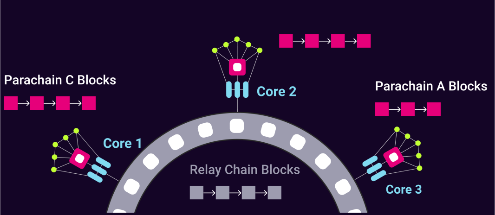
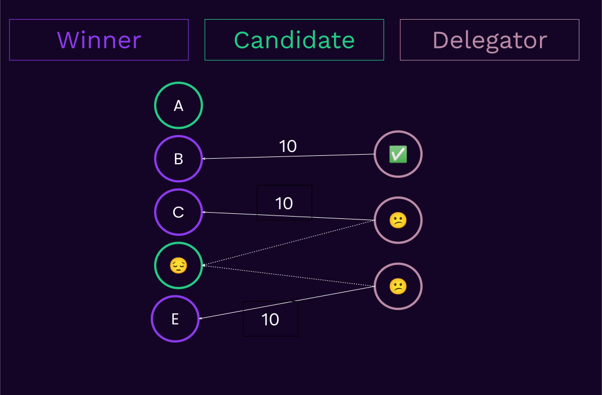
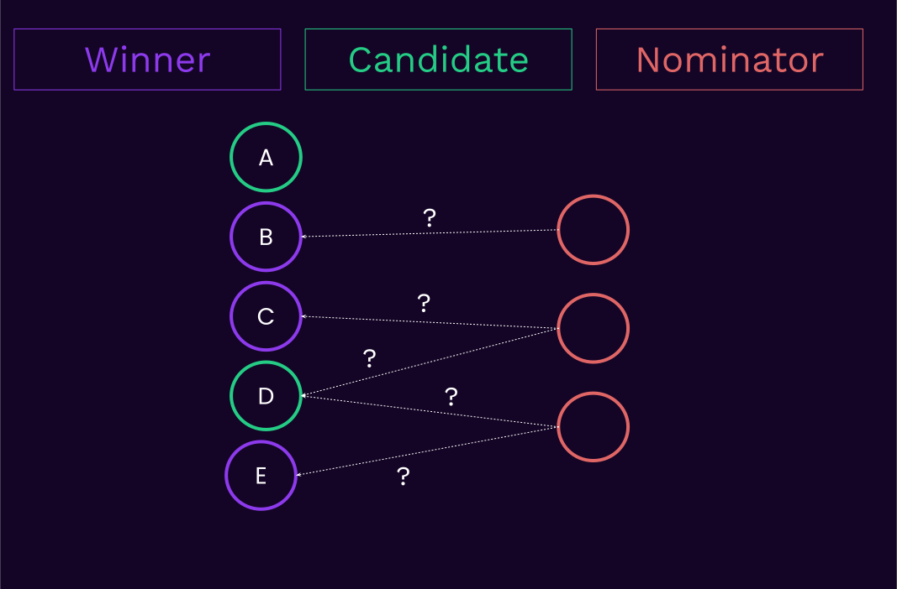

# Nominated Proof of Stake

## _in Polkadot_

---

## Why Proof of Stake Ser?

Why do we use PoS?

<div>

Economic Security 💸🤑

Tokens locked + prone to being slashed.

</div>

<!-- .element: class="fragment" -->

Everything else (finality, parachains, etc.) is built on top of this base layer of economic security.

<!-- .element: class="fragment" -->

---v

### Why Proof of Stake Ser?

- Remember that Polkadot provides validator-set-as-a-service.
- Secure Blockspace is provided by these validators.



---

## What is NPoS: Assumptions

Assumptions:

<pba-flex center>

<ul>
<li class="fragment"><b>Validators</b>: those who wish to author blocks.</li>

<li class="fragment"><b>Nominators/Delegators</b>:<br> Those who wish to support wanna-be authors.</li>

<li class="fragment">Validation and nomination intentions can change,<br>therefore we need <b>periodic elections</b> to<br> always choose the best validators + hold them slashable.</li>

<li class="fragment">Every election period is called an <b><em>Era_**,</b></em><br>e.g. 24hrs in Polkadot.</li>
</ul>

</pba-flex>

---

### What is NPoS: Re-inventing the Wheel

---v

**Solo-POS**


---v

### What is NPoS: Re-inventing the Wheel

<pba-flex center>

Authority-wanna-bees<br>aka.validators bring their own stake.<br>
No further participation.<br>
Top validators are elected.

</pba-flex>

> Problems?

Notes:

Low amount of stake that we can capture, impossible for those who don't want to run the hardware to join.

---v

**Single-Delegation-POS**


---v

### What is NPoS: Re-inventing the Wheel

<pba-flex center>

Anyone can dilute themselves in any given validators.<br>
Top validator based on total stake are elected.

Voters are called **delegators**.

</pba-flex>

> Problems?

Notes:

- Better, but funds might be delegated to non-winners, which get wasted.
- In other words, there is no incentive to delegate to those that are non-winners.

---v

**Multi-Delegation-POS**



---v

### What is NPoS: Re-inventing the Wheel

Your stake is divided $\frac{1}{N}$ among $N$ validators.

> Problems?

Notes:

Same issue as before.

---v

**Nominated Proof of Stake**



---v

**Nominated Proof of Stake**


---v

### What is NPoS: Re-inventing the Wheel

- You name up to `N` nominees, an _algorithm_,<br>computed either onchain or offchain, decides
  the **winners**<br> and **how to distribute the stake among them**.
- Voters are called **Nominators**.

---v

### What is NPoS: Re-inventing the Wheel

<pba-flex center style="font-size: smaller;">

- ✅ Can optimize other criteria other than<br>"who had more approval votes".
- ✅ Has a much higher chance to make sure<br>staked tokens won't get wasted.
- ✅ As a nominator, you are free to express<br>your desire to back non-winners as well.<br>
  Once enough people have expressed the same desire,<br>the non-winner will become a winner.

</pba-flex>

---

## NPoS Drawbacks

<pba-flex center>

We decided to solve an np-hard,<br>graph processing problem onchain 🤠.

<pba-cols>
<pba-col>

- scalability. <!-- .element: class="fragment" -->
- scalability. <!-- .element: class="fragment" -->
- Oh, and<br>scalability. <!-- .element: class="fragment" -->

</pba-col>
<pba-col>

- scalability. <!-- .element: class="fragment" -->
- scalability. <!-- .element: class="fragment" -->
- Lastly,<br>scalability. <!-- .element: class="fragment" -->

</pba-col>
</pba-cols>

<br>

...But we (strive to) get much better<br>economic security measures in return 🌈. <!-- .element: class="fragment" -->

Long term, this can in itself be solved<br>by what Polkadot provides best, more Blockspace 🎉! <!-- .element: class="fragment" -->

</pba-flex>

---

### NPoS Protocol Overview

<pba-flex center>

- The current NPoS protocol revolves around an **election round**,<br> which is itself made up of 4
  episodes.
- This gives you an idea about how we solved<br>the scalability issue for now.

</pba-flex>

---v

### NPoS Protocol Overview: Episode 1

**Snapshot**

<pba-flex center>

- Allows us to index stakers, not `AccountId`s.
- Allows us to not need to "freeze" the staking system.

</pba-flex>

---v

### NPoS Protocol Overview: Episode 2

**Signed Submissions**

<pba-flex center>

- Any signed account can come up with a **NPoS solution**<br>based on that snapshot.
- Deposits, rewards, slash, other game-theoretic tools<br>incorporated to make to secure.

</pba-flex>

---v

### NPoS Protocol Overview: Episode 3

**Validator Submissions as Fallback**

<pba-flex center>

- As the first backup, any validator can also<br>submit a solution while authoring blocks.

</pba-flex>

---v

### NPoS Protocol Overview: Episode 4

**Fallbacks**

<pba-flex center>

- If all of the above fails, the chain won't rotate<br>validators and the governance can either:
  - dictate the next validator set.
  - trigger an onchain election (limited in what it can do).

</pba-flex>

---

## NPoS Objective

<pba-flex center>

Given the powerful tool of NPoS, what should we aim for?

Let's first recap:

</pba-flex>

<pba-flex center class="fragment">

1. Polkadot validators are the source of truth<br>for the state transition of both the relay chain<br>and all of the parachains + bridges.
1. Polkadot validator are assigned to parachains<br>as backing group, and swapped over time.
1. Polkadot validators all author the same<br>number of blocks, i.e. **they are of same importance**.

</pba-flex>

Notes:

Point 2 is not to imply that the polkadot validator set's security is partitioned among parachains,
security comes from approval voters.
https://polkadot.network/blog/polkadot-v1-0-sharding-and-economic-security/

---v

### NPoS Objective: Election Score

```rust
pub struct ElectionScore {
  /// The minimal winner, in terms of total backing stake.
  ///
  /// This parameter should be maximized.
  pub minimal_stake: u128,
  /// The sum of the total backing of all winners.
  ///
  /// This parameter should maximized
  pub sum_stake: u128,
  /// The sum squared of the total backing of all winners, aka. the variance.
  ///
  /// Ths parameter should be minimized.
  pub sum_stake_squared: u128,
}
```

---v

### NPoS Objective: Election Score

<pba-flex center>

- NPoS allows us to incentivize the formation of a validator set that optimized the aforementioned `ElectionScore`.

- This score is ALWAYS calculate and checked onchain.
  This is why we can accept solutions from the outer world.

</pba-flex>

Notes:

A common example: we allow signed submissions.
What if they send solutions that are censoring a particular validator?
If it can achieve a better score, so be it!
We don't care.

---

## NPoS Future

👨‍🍳 Fresh from the oven (Jan 2023):

[Future of Polkadot Staking in the Polkadot forum](https://forum.polkadot.network/t/the-future-of-polkadot-staking/1848/2).

---

<!-- .slide: data-background-color="#4A2439" -->

# Questions

---

## Additional Resources! 😋


<br>

> Check speaker notes (click "s" 😉).

Notes:

### Further Reading

- [A verifiably secure and proportional committee election rule](https://arxiv.org/abs/2004.12990)
- 4.1 in [Overview of Polkadot and its Design Considerations](https://arxiv.org/abs/2005.13456)
- [Proportional Justified Representation](https://arxiv.org/abs/1611.09928)
- [Justified representation - Wikipedia](https://en.wikipedia.org/wiki/Justified_representation)

### NPoS Protocol: More Details, Backup Slides

- `bags-list`: how to store an unbounded semi-sorted linked-list onchain.
- Nomination pools: best of both.
- Minimum-untrusted score.
- PJR checking: why we don't do it.
- `reduce` optimization.

### Feedback After Lecture:
