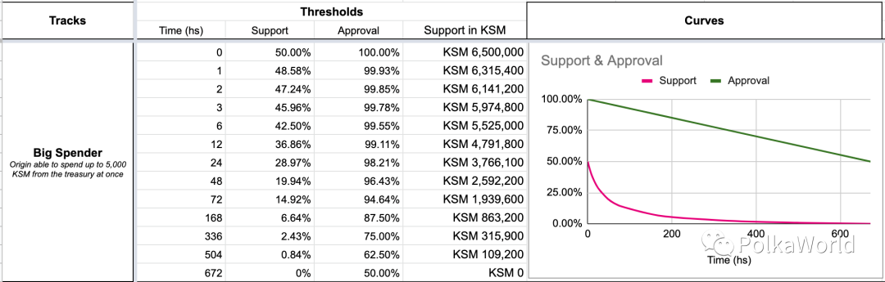
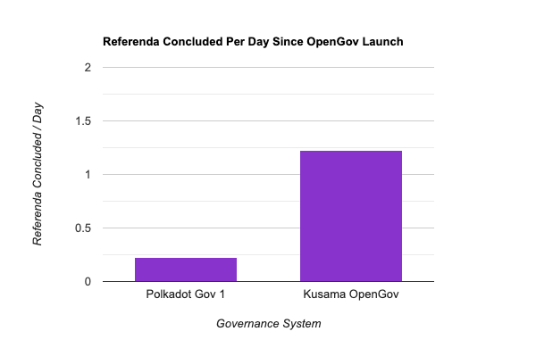
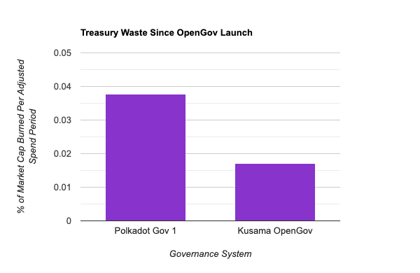

# OpenGov

## The Gold Standard of On-Chain Governance

Presented by Bradley Olson

---

## Overview

<pba-flex center>

- Why on-chain?
- Goals of on-chain governance
- Initial Solution, Governance V1
- Improvement, OpenGov 
- How is it going? By the numbers.
- OpenGov and you

</pba-flex>

---

## Reasons for Blockchain Governance

- Think of software as the executive branch of government
    - Applies existing laws (code) in pre-defined ways
    - Protocol security ensures the letter of those laws is followed
- But any evolving protocol needs an equivalent to the legeslative branch
    - To update the laws (code) 
    - To rectify cases where the letter of the law didn't match the spirit of the law (bugs)
    - To trigger parts of the system that aren't on a set schedule, EX: Polkadot Parachain auctions
    - To spend treasury funds on worthy causes 
- On-chain governance mechanisms fill that legeslative role

---

## Why On-chain?

<pba-cols>
<pba-col center>

- Off-chain governance
   - Formal proposal drafted by core dev team
   - Discussions, debates, and media campaigns
   - Hard fork

- Issues
   - Centralization
   - Low throughput
   - Long decision period
   - Little accessibility

</pba-col>
<pba-col center>

<!-- set height*width in px, where full screen is 1920*1080 -->

<!-- set height*width in px, where full screen is 1920*1080 -->

</pba-col>
</pba-cols>

---

## Goals of On-chain Governance
- **Transparency**: Decisions by who and by what rules?
- **Decentralization**: Distributed power, weighted only by commitment and conviction
- **Security**: Harmful proposals don't pass or have limited scope
- **Accessibility**: Easy to draft proposal, to receive vote, to vote yourself, and to vote by proxy
- **Concurrency**: Maximize simultaneus referenda as security allows
- **Speed**: Each referendum completed as fast as security allows
- **Agility**: Speed is responsive to support/controversy

---

## Governance V1 

<pba-cols>
<pba-col center>

<!-- set height*width in px, where full screen is 1920*1080 -->

</pba-col>
<pba-col center>

- Single track
- Root origin
- 28 day referendum
- 1 month minimum enactment period
- 1 referendum at a time
- Supplemental centralized bodies: council and technical committee
- Emergency referenda by technical committee
- Most proposals initiated by council
- Fully council controlled roles such as tipping

</pba-col>
</pba-cols>

---

## Gov V1, Room for Improvement

<pba-cols>
<pba-col center>

- The good
   - Security
   - Transparency

- The bad
   - Decentralization
   - Concurrency
   - Speed
   - Agility

</pba-col>
<pba-col center>

<!-- set height*width in px, where full screen is 1920*1080 -->

</pba-col>
</pba-cols>

---

## OpenGov Overview

<pba-cols>
<pba-col center>

- Origins and tracks
- Lifecycle of a referendum
- Support and approval threshold curves
- The Polkadot Fellowship
- Vote delegation by track
- OpenGov and governance goals 

</pba-col>
<pba-col center>

<!-- set height*width in px, where full screen is 1920*1080 -->

</pba-col>
</pba-cols>

---

## Origins

<pba-flex center>

- Level of privelege that code executes with
- Similar to user on Unix
- Proposal is two things
    - Operation: What should happen
    - Origin: Who authorizes it
- Many operations require a specific origin

</pba-flex>

---

<!-- set height*width in px, where full screen is 1920*1080 -->

## Origins and Tracks

- Each origin is served by a referendum track
- A track can serve more than one origin
- These tracks are totally independent from one another
- Track examples: Root, ParachainAdmin, BigSpender, Tipper
- Emergency tracks: ReferendumCanceler, ReferendumKiller

---

## Track Parameters

Parameters give us the ability to find an optimal balance between security and throughput. The security needs of the Tipper track are very different than those of the Root track.

- Lead-in period duration
- Decision period duration
- Confirmation period duration
- Minimum enactment period
- Concurrency, how many referenda can run in this track at a time
- Support and Approval threshold curves

---

<!-- set height*width in px, where full screen is 1920*1080 -->

---

## Criteria for Passing a Proposal

- Approval: Approving votes/total votes cast, weighted by conviction
    - Conviction: Locking tokens for longer periods scales their voting impact up to a maximum of 6x with a lockup duration of 896 days
- Support: Approving votes/total possible vote pool, disregarding conviction

---

## Deciding and Confirming Periods

- If Approval and Support thresholds met, confirmation period begins
- Approval and Support must remain above respective thresholds for entire period
- Confirmation period concludes -> proposal approved early
- Decision period expires -> proposal rejected

---

## Lifecycle of A Referendum

<!-- set height*width in px, where full screen is 1920*1080 -->

Steps in order: **Proposing, Lead In, Deciding, Confirming, Enactment**

---

## Support and Approval Threshold Curves

<pba-flex center>

- We want agility
   - Well supported proposals pass quickly
   - Controvercial proposals get more deliberation
- Addressed with time varying curves
   - Support threshold
   - Approval threshold
- Monotonically decreasing

</pab-flex>

---

## Example Support and Approval Curves

<!-- set height*width in px, where full screen is 1920*1080 -->

#### _From PolkaWorld Article in Resources_

---

## Vote Delegation

<pba-cols>
<pba-col center>

- Traditional delegation: You entrust one third party with your vote on all matters
- Delegation by track: You may delegate your vote to one or more third parties on a per track basis
- EX: Tipper vote delegated to local ambassador, WhiteListedCaller vote delegated to Parity Technologies, vote retained for all other tracks
- This is likely a first!

</pba-col>
<pba-col center>

<!-- set height*width in px, where full screen is 1920*1080 -->

</pba-col>
</pba-cols>

---

<!-- set height*width in px, where full screen is 1920*1080 -->

## OpenGov Acting Under Pressure

Typical path to safety: Lower throughput and restricted origins

But in emergencies we may need to pass proposals that both require root origin and are time critical!

Solution: Some sort of oracle capable of providing expert information

---

## Oraclizing Expert Information

<pba-flex center>

1. Track everyone's level of expertise
2. Allow experts to register sentiment
3. Aggregate opinions by level of expertise
</pba-flex>
 

But how are these steps accomplished?

---

<!-- .slide: data-background="../../../assets/img/0-Shared/bg-circles-image-transparent.png" -->

<pba-cols>
<pba-col center>

## Enter The Polkadot Fellowship

</pba-col>
<pba-col center>

</pba-col>
</pba-cols>

---

Purely on-chain membership body to recognize and compensate all individuals who hold and use expert knowledge of Polkadot in line with its broad interest and philosophy

Members hold rank denoting proven level of expertise and commitment as recognized by their peers and, for higher ranks, through general referendum.

---

## Who Make up the Fellowship?

- Experts in the Polkadot core protocol who maintain a consistant level of active contribution
- Notably this does not include core developers of independent parachain protocols, which should develop their own protocol specific fellowships as needed.
- Trajectory
    - Currently: < 100 core developers, mostly from Parity or the Web3 Foundation
    - Next year or two: Hundreds
    - Ideal far future: Tens of thousands, independent of any centralized entity
- Only one fellowship for Polkadot and Kusama

---

## Function of the Fellowship

- WhiteListedCaller track
    - Root priveleges
    - More agile
    - Maintains reasonable safety via Fellowship
- White list proposals must pass two votes
    - Expertise weighted Fellowship vote via second referendum pallet instantiation
    - Same general referendum as other tracks
- Just an oracle! (can't act on its own)
- Secondarily intended to cultivate a long term base of Polkadot core developers outside of Parity

---

## OpenGov and Governance Goals

- Open source + single process + track abstraction -> Transparency
<!-- .element: class="fragment" data-fragment-index="1" -->
- Liberal proposal creation + greater throughput + per-track delegation -> Accessibility
<!-- .element: class="fragment" data-fragment-index="2" -->
- Accessibility + No special bodies -> Decentralization
<!-- .element: class="fragment" data-fragment-index="3" -->
- Limited origins + emergency tracks + white list -> Security
<!-- .element: class="fragment" data-fragment-index="4" -->
- Multiple tracks + low risk tracks -> Concurrency
<!-- .element: class="fragment" data-fragment-index="5" -->
- Low risk tracks + early confirmation -> Speed 
<!-- .element: class="fragment" data-fragment-index="6" -->
- Support and approval threshold curves + white list -> Agility
<!-- .element: class="fragment" data-fragment-index="7" -->

---

# OpenGov, By The Numbers

---

## Governance Activity

<!-- set height*width in px, where full screen is 1920*1080 -->

#### _5.5x more daily governance activity_

---

## Proposal Origins

<!-- set height*width in px, where full screen is 1920*1080 -->

#### _Proposals now primarily authored via democracy_

---

## Treasury Usage

<!-- set height*width in px, where full screen is 1920*1080 -->

#### _Treasury funds used more efficiently_

---

## OpenGov and You

- Participate in OpenGov and Polkadot Fellowship on Polkadot and Kusama
- Can customize OpenGov instances per parachain
- Custom fellowships per parachain
- Potentially create non-technical fellowships, such as a fellowship for brand ambassadors

---

## Resources 
1. PolkaWorld Hands-On OpenGov: https://polkaworld.medium.com/a-hands-on-guide-for-kusamas-open-gov-governance-system-98277629b0c5
2. OpenGov Article from Moonbeam Team: https://moonbeam.network/blog/opengov/
3. Gavin’s Polkadot Decoded 2022 talk: https://www.youtube.com/watch?v=EF93ZM_P_Oc
4. Gov V1 tracking: https://polkadot.polkassembly.io/
5. OpenGov tracking: https://kusama.subsquare.io/

---

# Questions?