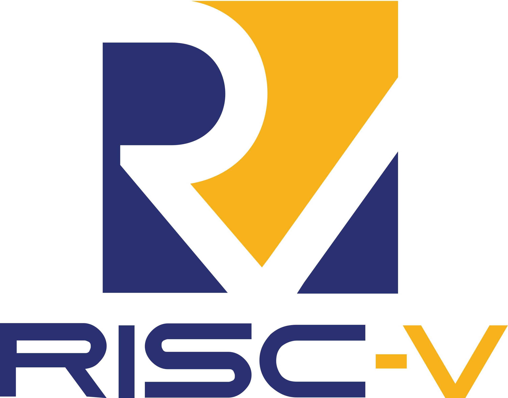

# Polkadot Introduction

Notes:
Introduction

Welcome everyone to the second module in this PBA. This module will be centered around the Polkadot protocol, what is today and what it will be in the future. 

---

Notes:
Some of you probably have a preconpcetion of what a blockchain is and hopefully the refresher classes at the start of this week solidified it. Bot today and tomorrow we will bo trying to explain how we want from something like this

---

Notes:
So something like this. Because this is a much more accurate representation of Polkadot. And believe me or not, this is not just a fully artistic representation. Elements in this diagram actually makes sense to me and hopefuly by the end of this module they will also make sense to you.

---

# Polkadot Introduction

## Agenda

- Core Tenets
- Blockchain Landscape Overview
- Key Polkadot Decisions
- Actors in the Polkadot Network
- Core Polkadot Technologies Glossary
- Polkadot Module Agenda Overview

Notes:
In this specific lecture we will quickly go through some core values of the Polkadot ecosystem and then we'll try and understand where does Polkadot place within the wide web3 world. 
We will also list all the actors and technologies relevant to the protocol and its current implementation.
Then we'll have a quick overview of waht else can you expect from me in the upcoming days.

---

# Core Tenets

- [...]

- [...]

- [...]

- [...]

- [...]

Notes:
Before we jump into the main topic let me make a few comments on what are the core tenets of Polkadot. Even tho Polkadot is changing over the years and the protocol evolves those values where accurate when the network first launched, are accurate today and will still be accurate when JAM launches.

---v

# Core Tenets

- **Accessibility**

- [...]

- [...]

- [...]

- [...]

Notes:
The first one is that Polkadot needs to be accesible which should be apparent with the open-source nature of the community. Negligible barriers to innovation, being easy, fast and cheap are the core properties here.

Hopefully all of you being here in this room learning about Polkadot is a bit of a proof of our values, that access to the protocol and the knowledge of it should be easily accessible.

Remember that all of you are here on this free course because the world largest DAO, Polkadot OpenGov funds it. The ecosystem tries to make itself as accessible as possible. And spread of knowledge is a core component here.

---v

# Core Tenets

- Accessibility

- **Generality**

- [...]

- [...]

- [...]

Notes:
Polkadot is a ubiquitous computer and every good computer needs to provide some generality. The key pieces to this were supplied by the customizable and programmable substrate/frame chains so something you got to experience in details over the last few weeks. They are fully adjustable state transition machines that can be deployed online. And they will play an integral role as building blocks for the Polkadot Ecosystem.

---v

# Core Tenets

- Accessibility

- Generality

- **Composability/Interoperability**

- [...]

- [...]

Notes:
Next one is Composability which can be closely married with interoperability. In Polkadot individual parachains are fully coherent and composable within themselves but to interact between the parachain boundaries you need XCMP which grants us native bridging beween the chains. All of that allows various sub-ecosystems to thrive together.

---v

# Core Tenets

- Accessibility

- Generality

- Composability/Interoperability

- **Performance**

- **Resilience**

Notes:

The goal of the next 2 days will be mainly spent understanding how we achieve those last two tenets: Performance and Resilience.

Performance is a big one. We all want a bigger variety of applications hosted on blockchain but this cannot be done unless we provide more throughput and lower latency. Just like web2 systems need to scale their architecture we had to innovate and evolve ours. No longer can every validator EXECUTE and STORE everything and for that we will explore how Polkadot is sharded. In fact we will be exploring both STATE SHARDING and EXECUTION SHARDING in the upcoming lectures.

Do notice that decentralisation is not a core principle, we only care about decentralisation because we believe it provides true resilience. It's not decentralisation for the sake of decentralisation.

---

# Blockchain Landscape

Notes:
Let's zoom out for a second and remind ourselves how Polkadot overall aims to compare to the blockchain landscape and what it aims to bring to the table. This is my own take on the history but I will try and highlight some core innovations, strenghts and weaknesses of all the different solutions so we can appreciate and understand all the trade-offs.

---v

# Blockchain Landscape

## Simple Monolithic - (Bitcoin etc)

<pba-cols>
<pba-col>
  <ul>
    <li>Shared single state</li>
    <li>Everyone executes everything</li>
    <li>Shared single and constant state transition function</li>
  </ul>
</pba-col>
<pba-col>

</pba-col>
</pba-cols>

Notes:
We started with single simple state machine blockchains like Bitcoin. Every node had to fully sync up and store the state and reexecute all the state transitions. Nevertheless it initially didn't require much hardware and was easy to host so a well diversified networks of nodes quickly arose.

The state transition function was immutable. It was just moving balances left and right so it was all essentially a giant ledger.

And I often hear this critique that blockchains are just that giant ledgers and it certainly was true in the past. BUt modern blockchains are so so much more than that. They are closer to virtual computers than ledgers.

---v

# Blockchain Landscape

## General Monolithic - (Ethereum 1.0 etc)

<pba-cols>
<pba-col>
  <ul>
    <li>Shared single state</li>
    <li>Everyone executes everything</li>
    <li><b>Programmable logic (smart contracts)</b></li>
  </ul>
</pba-col>
<pba-col>

</pba-col>
</pba-cols>

Notes:
And that was all started with Ethereum. The big innovation was that it was programmable. The state transition function was no longer immutable but instead effectively turing complete. This opened up a lot more demand for blockchain throughput but original Ethereum did really not address this demand. Everything was being reexecuted by every single validator.

This was still a world where each blockchain to communicate with another needed to develop a brand new bridging technique supporting both landscapes.

---v

# Blockchain Landscape

## Supercharged Monolithic - (Solana etc)

<pba-cols>
<pba-col>
  <ul>
    <li>Shared single state</li>
    <li>Everyone executes everything</li>
    <li>Programmable logic (smart contracts)</li>
    <li>[...]</li>
  </ul>
</pba-col>
<pba-col>

</pba-col>
</pba-cols>

Notes:
Then there came solutions that tried to quickly boost the throughput. The easiest solution to achieve it was to throw money at it. So all the core state, execution and generality components are the same as previously but the hardware just gets super beefy and expensive.

---v

# Blockchain Landscape

## Supercharged Monolithic - (Solana etc)

<pba-cols>
<pba-col>
  <ul>
    <li>Shared single state</li>
    <li>Everyone executes everything</li>
    <li>Programmable logic (smart contracts)</li>
    <li><b>Just on super expensive hardware</b></li>
  </ul>
</pba-col>
<pba-col>

</pba-col>
</pba-cols>

Notes:
Each validator and node is required to use this very expensive hardware which technically allows the monolithic solution to "scale". This solution comes with major trade-offs because running a node gets so expensive only a single operator or maybe a few can afford it which generally sacrifices on the core tenets of blockchain.

It topoligically looks like all other monolithic but just a lot more sparse and centralised.

---v

# Blockchain Landscape

## Fragmented Networks - Cosmos

<pba-cols>
<pba-col>
  <ul>
    <li><b>State split between subnetworks</b></li>
    <li><b>Fragmented economic security</b></li>
    <li><b>Execution separated and encapsulated within subnetworks</b></li>
    <li>Programmable logic (usually)</li>
  </ul>
</pba-col>
<pba-col>

</pba-col>
</pba-cols>

Notes:
Now we can take a look at solutions that realised a single state machine is not scalable. To scale we need to delegate, separate, split and shard.

One solution like that is Cosmos which features a framework for building blockchains and they provide a shared communication language between chains. Although the chains in the cosmos world all have different security guarantees and different rules and while they can speak the same messaging language it is up to the chains to ensure the message gets to the other chains and is respected there.

In this solution cosmos blockchains are like separate islands, they technically speak the same language but they are so remote and independent it is difficult to fascilitate safe and regular communication. Each island is responsible for their own security and resources needed for maintaining security are spread between the islands.

---v

# Blockchain Landscape

## Sharded Networks - Polkadot

Notes:
And finally we can take a look at Polkadot. Polkadot since day 1 of its inception was centered around sharding. A single monolithic blockchain cannot scale unless it compromises on core blockchain principles.

---v

# Blockchain Landscape

## Sharded Networks - Polkadot

Notes:
and at this point I'm sure you all are very familiar with the blockchain trilemma.

---v

# Blockchain Landscape

## Sharded Networks - Polkadot

Notes:
So on a high level Polkadot also decided to split the state into smaller subnetworks.

---v

# Blockchain Landscape

## Sharded Networks - Polkadot

Notes:
Each subnetwork or shard with a fully programmable runtime logic thanks to substrate and wasm.

---v

# Blockchain Landscape

## Sharded Networks - Polkadot

Notes:
but then Instead of fully separating the execution and security layers Polkadot instead chooses to start pooling them together. Combining forces.

---v

# Blockchain Landscape

## Sharded Networks - Polkadot

Notes:
From the diagram here you can start noticing that there is a region forming that is crossection between all of the islands. The islands are no longer separated, individual beings, they have something in common.

---v

# Blockchain Landscape

## Sharded Networks - Polkadot

Notes:
And the more and more subnetworks we add the emergent existence of this central core becomes more and more obvious.

---v

# Blockchain Landscape

## Sharded Networks - Polkadot

Notes:
So lets crystalize it a bit. Some nodes remain unique and specialised for the subnetwork while others aim to remain very generic and sitting in the middle. The middle section is not just one node but a full on family of general compute nodes able to fully sync up with every other subnetwork in the ecosystem.

---v

# Blockchain Landscape

## Sharded Networks - Polkadot

Notes:
The universal nodes in the middle will be a unifying force bringing together all the subnetworks into a single cohesive structure. We will be looking into more and more detail of what is this central structure, but some of you might already now it as the Polkadot Beacon Chain, or Polkadot Relay Chain. This is the auditing layer of Polkadot that is the source of its security and interoperability.

And looking at this diagram it should already be pretty straightforward to see what the Polkadot logo actually represents. Just by adding a bit of color...

---v

# Blockchain Landscape

## Sharded Networks - Polkadot

Notes:
And we can arrive to our familiar design.

---v

# Blockchain Landscape

## Sharded Networks - Polkadot

Notes:
Pause

---v

# Blockchain Landscape

## Sharded Networks - Polkadot

<pba-cols>
<pba-col>
  <ul>
    <li>Sharded state</li>
    <li><b>Shared security</b></li>
    <li><b>Sharded execution</b></li>
    <li>Programmable logic</li>
    <li>Built in bridging</li>
  </ul>
</pba-col>
<pba-col>

</pba-col>
</pba-cols>

Notes:
Let's summarize and zoom out for a second.

Polkadot is at its core a sharded network. The state and execution is separated into subnetworks, but the security is pooled and not separated. Individual subnetworks are of course fully programmable with wasm runtimes.

You can think of the polkadot rolay chain as a layer 0 solution. It's like a mothership for all the smaller shards connecting to it.

Additionally Polkadot not only provides a messaging language BUT it also comes with a messaging protocol over which those messages can be sent and received.

---v

# Blockchain Landscape

## Sharded Networks - Polkadot

Notes:
In this module we will be mainly focusing on the role of responsibilities of the central nodes. They are the Polkadot validators hosting the Polkadot Relay Chain.

The subnetworks are called parachains, parallel chains -> parachains. And the nodes for parachains are called collators. They are akin to sequencers in other ecosystems and parachains are like rollups or L2 solutions. We sometimes even call parachains cynical rollups.

---v

# Blockchain Landscape

## Sharded Networks - Ethereum (2.0)

Optimistic Rollups & ZK Rollups 

---v

# Blockchain Landscape

## Sharded Networks - Ethereum (2.0)

( Optimistic Rollups & ZK Rollups ) VS Cynical Rollups

---v

# Blockchain Landscape

## Sharded Networks - Ethereum (2.0)

10 of the top 20 rollups are powered by Polkadot

---

## In one sentence...

> Polkadot’s mission is to provide secure, scalable, and resilient compute infrastructure for applications and services.

Notes:

Note the difference between “decentralization” as a mission vs "resilience".

---v

## The Decisions

What are the core decisions which define Polkadot?

---v

## Sharding

Polkadot scales primarily by parallelizing execution on separate data shards.

These parallel chains (shards) are called Parachains or Cynical Rollups.

Notes:
Polkadot scales primarily by parallelizing execution on separate data shards.

These parallel chains (shards) are called Parachains or Cynical Rollups.

And we really really dedicated ourselves to this mission fully. In Polkadot the central relay chain, which is analogous to the ethereum beacon chain is udeally compeltely unavailable for the end users. There should be no transactions there. It's main function is to only secure other shards.

---v

## App-Chains

Another key scaling decision is the choice of heterogeneous shards, allowing for application specific chains.

Specialized solutions for problems are more performant than generalized solutions, as they can incorporate more details about the problem space.

---v

## Programmable Runtimes

Programmable Runtimes are the backbone of Polkadot. Fast, safe, and open meta-protocols which powers all of the state transitions of our ecosystem.

It standardizes how chains execute, sandboxes that execution for improved security, and allows teams to build on Polkadot using any language that can be compiled into WASM and soon RISC-V.

---v

## On-Chain Runtime & Forkless Upgrades

The Polkadot protocol specification defines a clear separation between the blockchain client and runtime (state transition function).

This is primarily useful to implement the Parachains protocol, but also allows for chains to “forklessly” upgrade their code.

This gives the Polkadot Relay Chain and all connected parachains an evolutionary advantage over others in the blockchain space.

---v

## Interoperability

Individual application chains will inherently lack the ability to provide a full suite of optimized solutions for end users.

Interoperability allows parachains to work together to complete, complex end-to-end scenarios.

A visual of XCM Protocol channels between Parachains.

---v

## Shared Security

An often overlooked problem is economic scaling of the entire blockchain ecosystem.

Polkadot is unique in that it provides all connected parachains with the same security guarantees as the Relay Chain itself.

Notes:

Security in proof-of-stake networks depends on economics, so there can only exist a limited amount of security in the world because economic value is, by definition, limited. As the number of blockchains increases due to scaling issues on single chains, their economic value — and therefore their security — gets spread out over multiple chains, leaving each one weaker than before.

Polkadot introduces a shared security model so that chains can interact with others while knowing full well that their interlocutors have the same security guarantees as their own chain. Bridge-based solutions — where each chain handles its own security — force the receiver to trust the sender. Polkadot’s security model provides the necessary guarantees to make cross-chain messages meaningful without trusting the security of the sender.

---v

## Trust-Free Interactions

A key result of shared security through the Relay Chain is that it keeps track of the state of all parachains and keeps them in lock step.

That means blocks which are finalized on Polkadot imply **finalization of all interactions** between all parachains at the same height.

So, shared security not only secures the individual chains, but the interactions between chains too.

---v

## Execution Cores

Polkadot's Shared Security is powered through the creation and allocation of execution cores.

Execution cores provide compute-as-a-service, and are designed to work with any kind of consensus system.

---v

## Light Client First Mentality

Polkadot has a strong belief that light clients are a necessary component for a Web3 future. It has been uncompromising in enabling first class light client support as a primary part of its development process:

- In-Browser Wasm Client (Substrate Connect)
  - Wasm state transition function too!
- Consensus data integrated into block headers
- Merkle Tries and other LC compatible data structures
- Maximizing statically known metadata to offset reliance on full nodes.

---v

## On-Chain Governance

Polkadot and its parachains need to change over time to stay relevant, and the network was designed from the beginning to have a transparent and sophisticated process to not only approve or reject changes but also **enact them automatically**.

- Governance decisions can literally change the underlying code of the chain (since it is on-chain).
- 50% of the total stake in the system should be able to control the future of the system.

---v

## On-Chain Treasury

Polkadot has designed at its core a self-funded treasury pool to incentivize the development and evolution of the protocol.

It is entirely controlled on-chain by the governance system of Polkadot, which means that it is immune to the regulations which would normally be imposed to centralized entities.

---

# Core Technologies of Polkadot

Notes:
Now that we enumerated all the actors it's time for more lists. You all already worked a bunch with various technologies that are foundational to Polkadot but I wanted to make a short glossary of the key pieces. So what core technologies used to power Polkadot today?

---v

# Core Technologies of Polkadot

1. Framework: Substrate
1. VM: WASM/PolkaVM
1. Governance: OpenGov
1. [...]
1. [...]
1. [...]
1. [...]
1. [...]
1. [...]

Notes:
Some of them you are already very familiar with. Substrate is our framework for building modular blockchains and WASM is the go-to runtime featured in Substrate. Substrate and Wasm together gives us fully coherent and proggrammable blockchains to play with.

Governance which was already discussed at depth is for the evolutions of the system. Runtimes can be changed over time and system parameters can be adjusted. Governance is also crucial for rescue operations in emergency situations.

---v

# Core Technologies of Polkadot

1. Framework: Substrate
1. VM: WASM/PolkaVM
1. Governance: OpenGov
1. Authority: Nominated Proof of Stake
1. [...]
1. [...]
1. [...]
1. [...]
1. [...]

Notes:
Then we have something a bit newer. The authority modules which essentialy need to decide who gets to be in the temporary priviliged set of relay chain validator nodes running the show. We are using a Nominated Proof of Stake system and we'll dive into it in the next lecture. It's a more energy efficient alternative to Proof of Work, and a more democratic one than Proof of Authority.

---v

# Core Technologies of Polkadot

1. Framework: Substrate
1. VM: WASM/PolkaVM
1. Governance: OpenGov
1. Authority: Nominated Proof of Stake
1. Block Production: BABE/SASSAFRAS
1. [...]
1. [...]
1. [...]
1. [...]

Notes:
Next is block production. Once NPoS selected us some relay chain validator then we need to figure out between them who makes the next block. And Polkadot Relay Chain is just a substrate blockchain in the end. Someone needs to author the relay chain Block and this is where BABE comes in.

In future we will be transition to a newer variant called Sassafras but we will cover that in the Block Production lectures.

---v

# Core Technologies of Polkadot

1. Framework: Substrate
1. VM: WASM/PolkaVM
1. Governance: OpenGov
1. Authority: Nominated Proof of Stake
1. Block Production: BABE/SASSAFRAS
1. Sharding: ELVES
1. [...]
1. [...]
1. [...]

Notes:
Then we have ELVES. This part was often called parachains protocol in the past. Elves describe a sharding strategy of Polkadot. That includes both state and execution sharding. This is the polkadot secret sauce. Whihout it parachains woudlnt exist. And this is also my main area of expertise.

---v

# Core Technologies of Polkadot

1. Framework: Substrate
1. VM: WASM/PolkaVM
1. Governance: OpenGov
1. Authority: Nominated Proof of Stake
1. Block Production: BABE/SASSAFRAS
1. Sharding: ELVES
1. Shard Interoperability: XCMP + XCM
1. [...]
1. [...]

Notes:
But to provide at least some coherency between the shards we need out interoperability tools. Those are XCMP which is the protocol that moves the messages around and XCM which is the language of the moved messages. XCMP is often being worked on in my team while XCM is mainly Cisco's domain. They are very different things.

---v

# Core Technologies of Polkadot

1. Framework: Substrate
1. VM: WASM/PolkaVM
1. Governance: OpenGov
1. Authority: Nominated Proof of Stake
1. Block Production: BABE/SASSAFRAS
1. Sharding: ELVES
1. Shard Interoperability: XCMP + XCM
1. Finality: GRANDPA, BEEFY
1. [...]

Notes:
And finally, no pun intended we have our finality gadgets. They will be cherry on top where we can make a block canonical and irreversible. The main one here is GRANDPA but BEEFY also plays a role I will cover later.

---v

# Core Technologies of Polkadot

1. Framework: Substrate
1. VM: WASM/PolkaVM
1. Governance: OpenGov
1. Authority: Nominated Proof of Stake
1. Block Production: BABE/SASSAFRAS
1. Sharding: ELVES
1. Shard Interoperability: XCMP + XCM
1. Finality: GRANDPA, BEEFY
1. Scheduling: Agile Coretime

Notes:
And one extra things is Polkadot Core Scheduling mechanism, this is essentially like gas in ethereum. It's the way to schedule work and distribute the resources that Polkadot provides.

---v

# Core Technologies of Polkadot

1. Framework: Substrate
1. VM: WASM/PolkaVM
1. Governance: OpenGov
1. Authority: Nominated Proof of Stake
1. Block Production: BABE/SASSAFRAS
1. Sharding: ELVES
1. Shard Interoperability: XCMP + XCM
1. Finality: GRANDPA, BEEFY
1. Scheduling: Agile Coretime
1. Database: RocksDB
1. Encoding: SCALE
1. Networking: LibP2P/LiteP2P
1. APIs: Polkadot.JS / Polkadot API (PAPI)
1. Smart Contracts: Ink! / Solidity

Notes:
This isn't a comprehensive list of all the technologies but there are some more generic ones in the backend connected to databases, networking and encoding like RocksDB, SCALE, and LibP2P.

I know I know it's quite a lot. And truth be told I dont know of a single person that has true expertise in all of those technologies. It's ahuge codebase and people specialize but having at least surface level understanding of all the pieces goes a long way.

---

## Main Actors

Notes:
So let's do a quick summary of the different actors we'll be seeing in this module. Think of the Polkadot Protocol as a game with different teams and roles and the actors here as players.

---v

## Main Actors

- **Validators**
- [...]
- [...]
- [...]

Notes:
There will be 4 main actors that we will be discussing. First and foremost we have the Validators. When we say the validators we mean the physical nodes of the Polkadot Relay Chain. They are the general purpose super-validators that allow all the parachains to come together and meet at the relay chain. They are also the block producers of the relay chain.

There is a subflavour of a validator worth mentioning here. Validators are a wide set but only some of them are elected to perform their duties in the active validator set. Usually when we say validator we mean an active validator currently selected by the staking system. The staking elections take place every day but we will discuss that in the next lecture.

---v

## Main Actors

- Validators
- **Collators**
- [...]
- [...]

Notes:
Another crucial actor is a collator. Collators are parachain or rollup nodes. They are nodes specialized in supporting their own subnetworks. Ther main job managing parachain state and gathering together transactions to then send them over to the relay chain for audting. They also need to manage physical hardware to perform all those duties.

---v

## Main Actors

- Validators
- Collators
- **Nominators**
- [...]

Notes:
Nominators are a bit more ephemeral. They generally are not physical nodes but abstract account holding some funds. They are all the DOT tokenholders participating in the staking protocol to elect validators. You can think of them as the stakers.

Trivia, validators are often also nominators of themselves.

---v

## Main Actors

- Validators
- Collators
- Nominators
- Users

Notes:
Users here are a bit of a blanket statement, but I generally mean the people or entities that submit transactions or extrinsics. This might be a proxy or a UI interface that submits it in the end but from the perspective of the protocol we don't care that much.

Disclaimer: This is not en exhaustive list and there are some extra actors as well as various subflavours of the presented here roles. For instance some nodes don't store the fully blockchain history while others don't and we call them archival nodes. There are also light clients and simillar. My aim here is to show you the 4 core roles we'll see in the protocol.

For every lecture or subprotocol we'll be discussing I will try and provide a general outline of what actors will be participating in it.

---

# Polkadot Module Agenda

1. Polkadot Introduction
1. Block Production
1. State Sharding
1. Data Availability
1. Execution Sharding
1. Polkadot SDK & Tools Workshop
1. Confirmations and Finality
1. Staking
1. Agile Coretime
1. Polkadot Cloud and Hub
1. Polkadot Ecosystem and Economy
1. Quiz + Zombienet Workshop

Notes:
Now it's time to have a general overview of the topics and lectures I have planned specifically for this module.

We will be primarily covering the relay chain protocol aspects. You can think of the relay chain protocol as a big game. Staking is what selects the player for the game. Block production is who gets to make the next move. All the other lectures are trying to explain the rules of them game. To be precise the next three lectures of State Sharding, Data Availability and Execution Sharding are all parts of the ELVES protocol. This is how Polkadot scales and guarantees shared security to its rollups.

Finality is a bonus rule to the game that gives us a lot of new features. And scheduling is just some organizational janitorial stuff.

---v

## Why are we learning it?

Notes:
And I want to make something clear. We will be diving deep into the protocol. This is stuff that's not the easiest but I don't believe you all are here to learn the easy stuff.

Different parts of what we'll be learning will be useful to different people. Some will build light clients, some wallets, some will join parity, others will optimize execution for parachains. There will be something for everyone.

And in general If all you care about is building a simple dapp that moves the balances left and right you might not need to have such an in-depth knowledge, just a bit of solidity is enough.

But if you ever want to innovate and build something new, then you need to learn what the boundaries are before pushing them further. And the boundaries in blockchain mainly arise from the protocol itself.

If you want to build the next uniswap, cryptokitties, next moonbeam or hyperbridge then we have to understand the protocol.

---

# JAM

Notes:
now let's give a short disclaimer about JAM. I am not focusing on it but it's worth making a stance and how it connects to what I'll be talking about.

---v

# JAM

## Polkadot 3.0

JAM is a further generalization and abstraction of Polkadot.

JAM can do everything the current Polkadot Relay Chain can and more stuff on top of it. That means that whatever Polkadot does now will still be very relevant in JAM.

Notes:
JAM was proposed as a potential next step for the Polkadot Network. Generally think of it as a generalization of the protocol. JAM can do everything the current Polkadot Relay Chain can and more stuff on top of it.

So many of the steps in parachain consensus like finality, block production, approval checking and disputes will be recreated and ported to JAM, so understanding them now gives you an awesome headstart to understanding what JAM truly aims to achieve.

---
