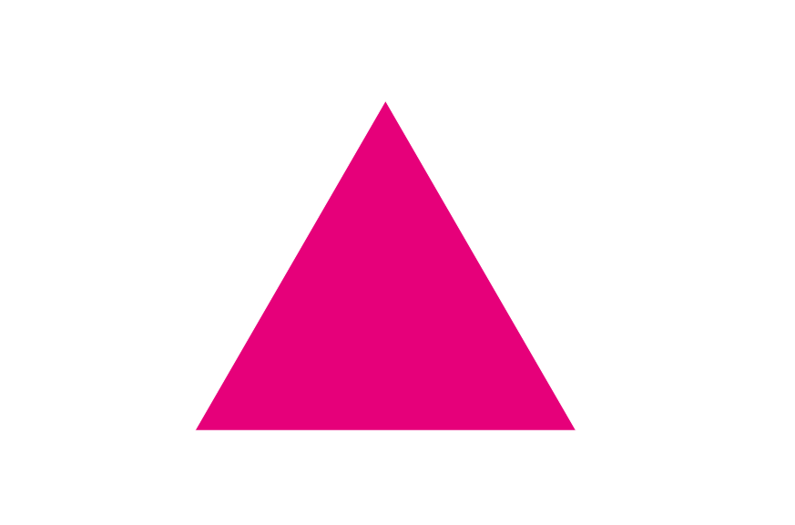
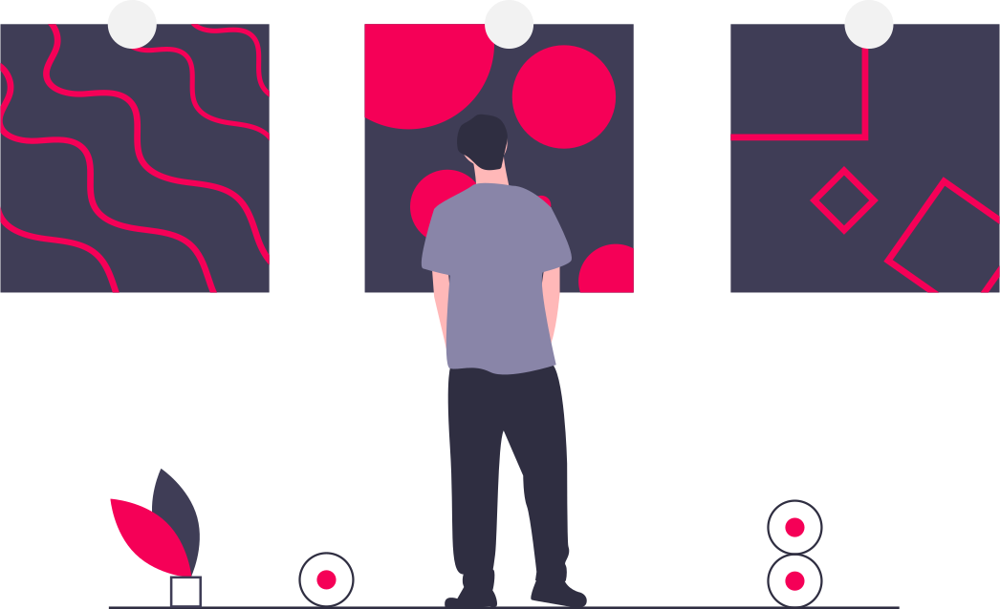
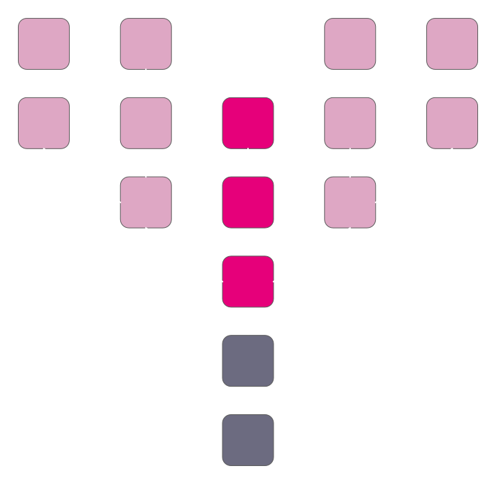
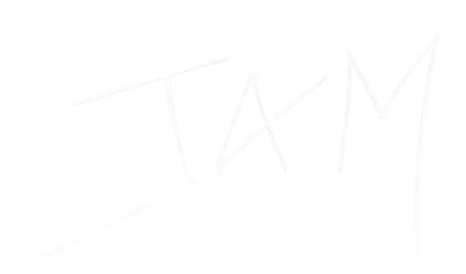

# The Decisions of Polkadot

---

## The Decisions of Polkadot

This presentation will try to explain the core decisions which define the Polkadot network.

---

## Creating an “Invention Machine”

Jeff Bezos outlined in an annual letter to Amazon shareholders how he approaches decision making, by categorizing decisions as either Type 1 or Type 2 decisions.

Notes:

https://www.sec.gov/Archives/edgar/data/1018724/000119312516530910/d168744dex991.htm <!-- markdown-link-check-disable-line -->

---

## Type 1 Decisions

> Some decisions are consequential and irreversible or nearly irreversible – **one-way doors** – and these decisions must be made methodically, carefully, slowly, with great deliberation and consultation. If you walk through and don't like what you see on the other side, you can't get back to where you were before. We can call these Type 1 decisions.

---

## Type 2 Decisions

> But most decisions aren't like that – they are changeable, reversible – **they're two-way doors**. If you've made a suboptimal Type 2 decision, you don't have to live with the consequences for that long. You can reopen the door and go back through. Type 2 decisions can and should be made quickly by high judgment individuals or small groups.

---

## In the context of blockchains...

<pba-cols>
<pba-col>

### Type 1 Decisions

Decisions that cannot easily be changed in the future.

- Must be a part of the original protocol design.
- Changes might as well be considered a new protocol.

</pba-col>
<pba-col>

### Type 2 Decisions

Decisions that can be easily changed in the future.

- Can be included into the protocol at a later time.
- Changes can be considered as part of the evolution of the protocol.

</pba-col>
</pba-cols>

---

## The Philosophies of Polkadot

---

Notes:

This is the slogan of the Web3 Summit, and seeing that Polkadot is our biggest bet on a Web3 future, it is apt that we use this phrase as a staple of the philosophy which backs Polkadot. The whole reason we have developed blockchain technologies was to address the trust problems that we face with those who wield power in our world.

I want to note the phrase is NOT “No Trust, Only Truth”. This, from what I can tell so far, is mostly impossible. We should not use points of trust to invalidate working solutions. For example, it is not an expectation everyone who uses Polkadot will read each individual line of open source code before they run it. Our goal should be to minimize trust, where possible, and make it obvious to everyone who uses our tools what kinds of trust assumptions they run on

---

## Against Blockchain Maximalism

Notes:

Polkadot fundamentally believes in a multi-chain future. One where chains cooperate and provide greater value to one another, rather than where they strictly compete and try to kill one another. This is rare to find today, since cryptocurrencies are prone to becoming “investment vehicles”, where the creation of a new blockchain can be seen as a threat to the existing “investments”. With the blockchain maximalism mentality, people are choosing to value their “investments” over innovation and progression, and this isn’t best for our goals to provide the best technologies to the world.

---

## “The best blockchain today will not be the best blockchain tomorrow.”

Notes:

This philosophy is a realization that building a blockchain is trying to build a piece of software which will last forever. The we will not be successful engineering Polkadot simply for the problems we find today. By the time we have built X, the world will need Y, and so on. This is why we have invested so much time building platforms and SDKs, not just products. We need to make sure these technologies are able to adapt and evolve in order to stay relevant for users

---

## The Goals of Polkadot

---

## The Blockchain Scalability Trilemma

- Security: How much does it cost to attack the network?

- Scalability: How much work can the network do?

- Decentralization: How decentralized is the network?

---

## In one sentence...

> Polkadot’s mission is to provide secure, scalable, and resilient infrastructure for Web3 applications and services.

Notes:

Note the difference between “decentralization” as a mission vs "resilience".

---

Polkadot tries to accomplish that mission by solving three problems:

<pba-flex center>

1. Computational Scalability
1. Shared Security
1. Interoperability

</pba-flex>

---

## The Decisions

What are the type 1 decisions which define Polkadot?

---

## Parallel Execution

Polkadot scales through parallelization.

Polkadot provides parallelized execution using parallel execution cores.

Execution cores allows Polkadot to provide blockspace-as-a-service, and are designed to work with any kind of Web3 application.

---

## Data Sharding

Polkadot is able to do parallel execution because it splits up data on its network into separate data shards.

Today, parallel chains (shards) are called Parachains.

---

## App-Chains

Another key scaling decision is the choice of heterogeneous shards, allowing for application specific chains.

Specialized solutions for problems are more performant than generalized solutions, as they can incorporate more details about the problem space.

---

## Execution Meta-Protocol

To provide heterogenous sharded execution we need a fast, safe, and open meta-protocol to power all of the state transitions in our ecosystem.

Today we use Wasm.

It standardizes how Web3 applications execute and sandboxes that execution for improved security.

It also allows teams to build on Polkadot using any language that can be compiled into Wasm.

---

## Shared Security

Blockspace is the capacity of a blockchain to commit and finalize operations.

An often overlooked problem is the economic scaling need to provide high quality blockspace.

Polkadot is unique in that it provides blockspace to other Web3 applications with the same security guarantees as Polkadot itself.

Notes:

Learn more about blockspace: https://www.rob.tech/blog/polkadot-blockspace-over-blockchains/

Security in proof-of-stake networks depends on economics, so there can only exist a limited amount of security in the world because economic value is, by definition, limited. As the number of blockchains increases due to scaling issues on single chains, their economic value — and therefore their security — gets spread out over multiple chains, leaving each one weaker than before.

Polkadot introduces a shared security model so that chains can interact with others while knowing full well that their interlocutors have the same security guarantees as their own chain. Bridge-based solutions — where each chain handles its own security — force the receiver to trust the sender. Polkadot’s security model provides the necessary guarantees to make cross-chain messages meaningful without trusting the security of the sender.

---

## Interoperability

Individual application chains will inherently lack the ability to provide a full suite of optimized solutions for end users.

Interoperability allows parachains to work together to complete, complex end-to-end scenarios.

A visual of XCMP channels between Parachains.

---

## Trust-Free Interactions

A key result of shared security through the Relay Chain is that it keeps track of the state of all parachains and keeps them in lock step.

That means blocks which are finalized on Polkadot imply **finalization of all interactions** between all parachains at the same height.

So, shared security not only secures the individual chains, but the interactions between chains too.

This is continuing to evolve with the addition of "accords" / SPREE.

---

## Hybrid Consensus

### Block Production

Current implementation is BABE, which is forkful with probabilistic finality.

### Finality Gadget

Current implementation is GRANDPA, which is robust and scalable against network partitions.

---

## Light Client First Mentality

Polkadot has a strong belief that light clients are a necessary component for a Web3 future. It has been uncompromising in enabling first class light client support as a primary part of its development process:

- In-Browser Wasm Client (Substrate Connect)
  - Wasm state transition function too!
- Consensus data integrated into block headers
- Merkle Tries and other LC compatible data structures
- Maximizing statically known metadata to offset reliance on full nodes.

---

## On-Chain Runtime & Forkless Upgrades

The Polkadot protocol specification defines a clear separation between the blockchain client and runtime (state transition function).

This is primarily useful to implement the Parachains protocol, but also allows for chains to “forklessly” upgrade their code.

This gives the Polkadot Relay Chain and all connected parachains an evolutionary advantage over others in the blockchain space.

---

## On-Chain Governance

Polkadot and its parachains need to change over time to stay relevant, and the network was designed from the beginning to have a transparent and sophisticated process to not only approve or reject changes but also **enact them automatically**.

- Governance decisions can literally change the underlying code of the chain (since it is on-chain).
- 50% of the total stake in the system should be able to control the future of the system.

---

## On-Chain Treasury

Polkadot has designed at its core a self-funded treasury pool to incentivize the development and evolution of the protocol.

It is entirely controlled on-chain by the governance system of Polkadot, which means that it is immune to the regulations which would normally be imposed to centralized entities.

---

## The Implementation of Polkadot

What are the type 2 decisions of Polkadot?

---

## Parachains

Polkadot was originally designed around Web3 applications in the form of Parachains, but this categorization is evolving.

 

- Originally, parachains would be long term applications-chains.
- Services and Agile Coretime changed that viewpoint to also include applications that can spin-up and spin-down at will.
- The future protocol will have even more exotic core scheduling and even more agile core usage, all because the type 1 decision around parachains is actually **execution cores**.

Notes:

- https://hackmd.io/9xhCNYIOQny0v0QTsWuNwQ#/
- https://www.youtube.com/watch?v=GIB1WeVuJD0

---

## XCM

### Cross-Consensus Message Format

Instructions to teleport an asset between parachains.

While cross-chain interoperability (XCMP) is a type 1 decision, exactly the language that chains speak to each other is not.

XCM is Parity's current flavor of a cross-consensus message format, but we already see other teams try out their own ideas, or push updates to the XCM format specification.

Notes:

https://github.com/paritytech/xcm-format

---

## Nominated Proof-of-Stake

One of Polkadot’s primary functions is to provide security not only to itself, but also to the connected Parachains.

The staking system is a critical focus of the network, and we have one of the most advanced staking systems to date.

- NPoS over DPoS to better allocate stake.
  - We see ~25% more stake behind the elected set on NPoS compared with DPoS.
  - At the cost of complexity and scaling.
- Economic incentives to distribute funds evenly across validators.
- Super-linear slashing system to discourage validator centralization.
- Actual value being generated by staking, justifying rewards.

 

The protocol has been actively evolving over time, making it more performant and accessible to users, for example with nomination pools.

---

## OpenGov

The specifics of Polkadot's on-chain governance system has changed multiple times in its history.

- To bootstrap the network, a Sudo account was used to initialize the chain.
- Then a multi-party system, including token holders, an elected council, and a technical council was used.
- Most recently, the councils have been removed, and token holders are now in full control of the Polkadot governance systems.

---

## Treasury and Fellowships

An on-chain treasury has and will always exist; but how exactly it spends funds and to whom has evolved over time:

- Initially there were just simple proposals which were approved by the governance system.
- Then Bounties and Tips were introduced, increasing access to larger and smaller funding mechanisms.
- Most recently, fellowships have started to form, which represent organizations who can earn regular salaries from the network itself.

---

## and many more...

Polkadot is **designed** to evolve, and make type 2 decision making fast and easy.

An invention machine.

---

# JAM

---

## What is JAM?

JAM is the next evolution of the Polkadot protocol.

The JAM chain will be the successor to the existing Polkadot Relay chain.

JAM will provide all the functionality of Polkadot v1, but also provide a more flexible foundation on which to build Web3 Applications.

---

## The Decisions of JAM

**Unchanged**

- The Philosophies of Polkadot
- The Goals of Polkadot
  - Parallel Execution and Heterogenous Sharding
  - Shared Security
  - Interoperability

**Changed**

- Upgradability of the Core Protocol
  - Substrate -> JAM Chain
- Services (as a superset of Parachains)
- Wasm -> PolkaVM (RISC-V)
- Synchronous Communication Capabilities

---

## Is JAM a new protocol?

JAM is certainly the next evolution of the Polkadot protocol.

- Some things have explicitly changed.
- But the problem we are trying to solve is the same.
- And almost all of the same technology is being used to solve it.

### JAM is Polkadot.

---

# So what is Polkadot?

---

## Polkadot is...

- A scalable, heterogeneous, sharded, multi-chain network.
- A permissionless and ubiquitous computer.
- A decentralized open-source community.
- A digital-native sovereign network.

---

<!-- .slide: data-background-color="#4A2439" -->

# Questions
