# Light clients<br/>and<br/>Unstoppable Apps

---

#### What we will see

- A brief history, the reality and the problem;
- What is a light client and why I should care (importance);
- How light client works;
- JSON-RPC past and future;
- Polkadot solutions and tools
- Unstoppable apps

---

#### Traditional Web 2

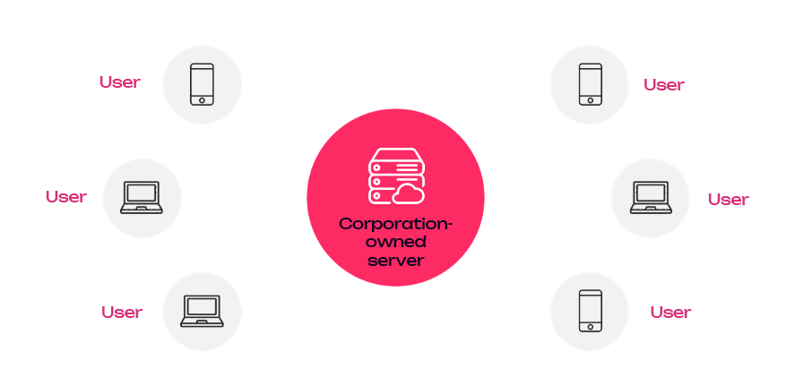
<!-- .element: class="fragment" data-fragment-index="1" -->

Notes:

Before I proceed with anything, let's take a moment to see the current state of the majority of the World Wide Web as we know it.

Welcome to the realm of Web 2.0, where the majority of web applications currently reside.
While I won't be roasting anyone, it's essential to recognize that platforms like Facebook, Twitter, WhatsApp, and many others fall under this category; (Describe image)

---v

#### The Web 3 vision

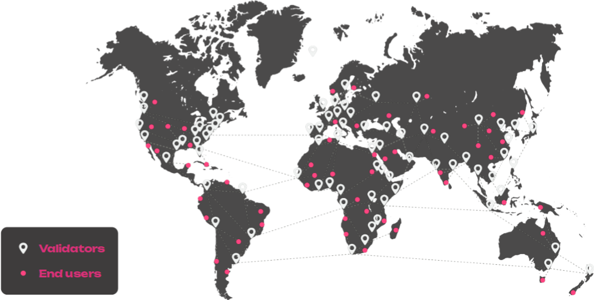
<!-- .element: class="fragment" data-fragment-index="1" -->

Notes:

This represents the vision of what Web3 should aspire to become:
a truly interconnected network where validators and end-users from all corners of the world can seamlessly connect, share information, and collaborate.

Now, show of hands:

- how many of you believe that we are close to achieving this vision at the moment?
- And how many think we still have a considerable distance to go?

---v

#### The Web 3 reality

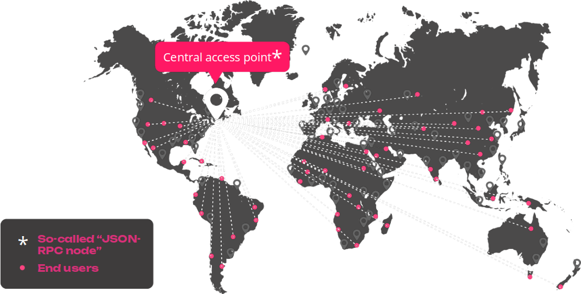
<!-- .element: class="fragment" data-fragment-index="1" -->

Notes:

Let's take a closer look at the reality of the situation.
As it stands, our entry into the blockchain network is channeled through a central access point, represented by a JSON-RPC node.
This node serves as the gateway to access the entire blockchain network.

While many applications claim to be decentralized, we must ask ourselves, how truly decentralized are they?

Now, I want to emphasize one crucial point - and I encourage you to take a moment to reflect on it.
I will pause there for a few seconds to let this sink in;

---v

<h1 style="font-size:7rem; font-weight: bold">Blockchain "decentralized” apps are still centralized</h1>

Notes:

I will pause there for a few seconds to let this sink in;

---v


Notes:

I will pause there for a few seconds to let this sink in;

---

# Node types in the network

<p style="text-align: left; padding-bottom: 2rem">The type of each node depends on different characteristics:</p>

<ul>
  <li>
    <span class="font-bold underline">Validator:</span> node configured to potentially produce blocks.
  </li>
<!-- .element: class="fragment" data-fragment-index="1" -->
  <li>
    <span class="font-bold underline">JSON-RPC:</span> node which gives public access to its JSON-RPC endpoint.
  </li>
<!-- .element: class="fragment" data-fragment-index="2" -->
  <li>
    <span class="font-bold underline">Bootnode:</span> node whose address can be found in the chain specification file (chainspec).
      Necessary to kick-off the network.
  </li>
<!-- .element: class="fragment" data-fragment-index="3" -->
  <li>
    <span class="font-bold underline">Archive:</span> stores the entire state of the chain at each block since block #0.
      Useful to access historical data.
  </li>
<!-- .element: class="fragment" data-fragment-index="4" -->
  <li>
    <span class="font-bold underline text-[var(--r-heading-color)]">Light client:</span><span class="text-[var(--r-heading-color)]"> doesn’t store the entire state of the chain but requests it on demand.</span>
  </li>
<!-- .element: class="fragment" data-fragment-index="5" -->
</ul>

Notes:

Before anything else – lets remember the node types in the network

Validator Nodes: These nodes are responsible for producing new blocks and validating transactions.
They participate in the consensus mechanism and play a crucial role in securing the network.

JSON-RPC nodes: serve as an interface for developers and applications to interact with the blockchain by sending JSON-formatted requests and receiving JSON-formatted responses.

Bootnodes: Bootnodes are nodes with well-known addresses that serve as entry points for new nodes joining the network.
They help new nodes discover and connect to other peers in the network.

Light Nodes: Light nodes are a lightweight version of full nodes that do not store the entire blockchain but rely on full nodes for transaction verification.
They are useful for users who want to interact with the network without the need to download the entire blockchain.

(......After the Clicks!....)

Any combination of “validator”, “bootnode” and “JSON-RPC node” is possible, except for “light” and “archive” that are mutually incompatible.

---v

#### The reality of blockchains today

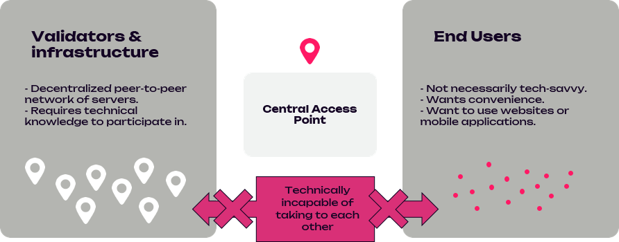
<!-- .element: class="fragment" data-fragment-index="1" -->

Notes:

Here is how this is happening in reality at the moment, or how one could possibly connect to the network today

(read slides)

Make a note that: For simplicity reasons from now on I will be using the word "UI" to refer to a client/user/app etc/
Ask: WHAT ARE THE WAYS to connect to the network from a UI like (e.g. polkadotJS apps or any custom one) today?

---v

#### USER-CONTROLLED NODE

<pba-cols>
  <pba-col left>
    <div>App connects to a node client that the user has installed on their machine</div>
    <div class="bg-green-600 rounded-2xl p-4 !mt-2"><span class="font-bold">Secure</span><br />Trustless: connects to multiple nodes, verifies everything</div>
    <div class="bg-red-600 rounded-2xl p-4 !mt-2"><span class="font-bold">Inconvenient:</span> Needs an installation process and having a node up and running, plus maintenance effort</div>
    
  </pba-col>
  <!-- .element: class="fragment" data-fragment-index="2" -->
   <pba-col left>
      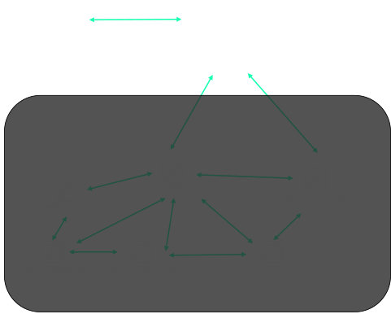
  </pba-col>
  <!-- .element: class="fragment" data-fragment-index="1" -->
</pba-cols>

Notes:

(Read slides)

---v

#### PUBLICLY-ACCESSIBLE NODE

<pba-cols>
  <pba-col left>
    <div>App connects to a third-party-owned publicly-accessible
node client</div>
    <div class="bg-red-600 rounded-2xl p-4 !mt-2"><span class="font-bold">Centralized and insecure:</span> Publicly-accessible node can be malicious</div>
    <div class="bg-green-600 rounded-2xl p-4 !mt-2"><span class="font-bold">Convenient:</span> Works transparently</div>
  </pba-col>
  <!-- .element: class="fragment" data-fragment-index="2" -->
  <pba-col left>
    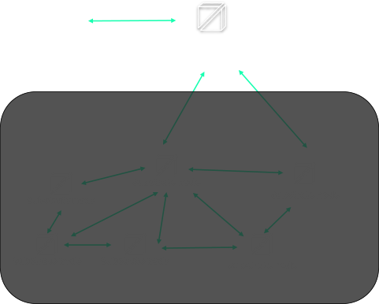
  </pba-col>
  <!-- .element: class="fragment" data-fragment-index="1" -->
</pba-cols>

Notes:

(Read slides)

---v

#### Why "this" needs fixing?

<pba-cols>
  <pba-col left>
      <h4>Reliability</h4>
      <!-- .element: class="fragment" data-fragment-index="1" -->
      <div>"The middleman" can stop working for a reason or another, leaving end users incapable of interacting with the blockchain.</div>
      <!-- .element: class="fragment" data-fragment-index="2" -->
  </pba-col>
  <!-- .element: class="fragment" data-fragment-index="1" -->
   <pba-col left>
    <h4>Possibility of censorship or hijacking</h4>
    <!-- .element: class="fragment" data-fragment-index="3" -->
    <div>"The middleman" can decide to ban some end users or some transactions, or can be taken control of by an attacker.</div>
    <!-- .element: class="fragment" data-fragment-index="4" -->
  </pba-col>
  <!-- .element: class="fragment" data-fragment-index="3 " -->
   <pba-col left>
     <h4>Frontrunning problem</h4>
     <!-- .element: class="fragment" data-fragment-index="5" -->
     <div>"The middleman" knows all the transactions that are submitted before they are actually applied, and can inject its own transactions ahead of time for its own monetary gains.</div>
     <!-- .element: class="fragment" data-fragment-index="6" -->
  </pba-col>
  <!-- .element: class="fragment" data-fragment-index="5" -->
</pba-cols>

Notes:

In the 3rd party case the user relies on the 3rd party node to connect to, in order to communicate with the network.
(audience) With a show of hands Why this needs fixing?
(pause and wait for possible answer)

- (we need) Reliability
- (there is a) Possibility of censorship or hijacking
- Front running is the act of placing a transaction in a queue with the knowledge of a future transaction

---v

## The reality of blockchains we want

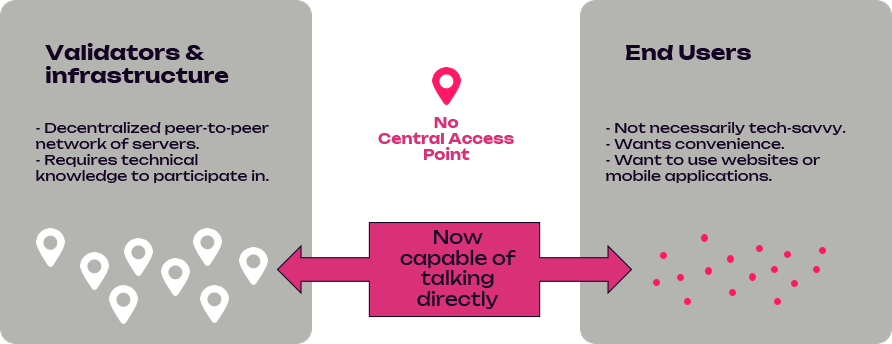
<!-- .element: class="fragment" data-fragment-index="1" -->

---v

# The solution


<!-- .element: class="fragment" data-fragment-index="1" -->

# Light Clients

<!-- .element: class="fragment" data-fragment-index="1" -->

---


---v

# What is a Light Client?

<p style="font-size:4rem">It's a client (a node)...</p>

<!-- .element: class="fragment" data-fragment-index="1" -->

<p style="font-size:2rem">...but lighter!</p>
<!-- .element: class="fragment" data-fragment-index="2" -->

<!-- .element: class="fragment" data-fragment-index="3" -->

Notes:

When I joined the team of substrate connect, I asked this same question.
And the response I got was…. (\*)
Back then I was like… “Yeah – thanks I guess”

But that was actually true!

---v

### So.... what is a Light Client ???

A Light Client is a compact blockchain node that enables users to interact with the blockchain network in a quick, secure and decentralized manner, without the need to download the entire blockchain.

<!-- .element: class="fragment" data-fragment-index="1" -->

Notes: Thats a mouthfull - Lets split this sentence into parts - in order to explain it better

---v

### A Light Client

##### is a compact blockchain node

It is a client that is lighter than a full node, in terms of memory consumption, number of threads, and code size;

<!-- .element: class="fragment" data-fragment-index="1" -->

Notes: A "Light Client" is a type of node implementation that allows applications to interact with the network, consuming fewer resources compared to full nodes, making them more suitable for resource-constrained devices like mobile phones, or (see substrate connect);

---v

### A Light Client

##### enables users to interact with the blockchain network

##### in a quick manner

> Polkadot's solution: initialization (from entering Rust code) to warp syncing being completely finished in a best case scenario....

<!-- .element: class="fragment" data-fragment-index="1" -->

> is 547ms with the Westend network

<!-- .element: class="fragment" data-fragment-index="2" -->

Notes: Light clients can synchronize with the blockchain more quickly since they only need to fetch recent data, using justifications (we will talk about it in a while), reducing the time needed to get up-to-date with the network (few seconds). This is especially advantageous for users on limited data plans or slow internet connections

---v

### A Light Client

##### enables users to interact with the blockchain network

#### in a secure manner

Does not connect to an JSON-RPC server but with the nodes' network using bootnodes

<!-- .element: class="fragment" data-fragment-index="1" -->

---v

### A Light Client

##### enables users to interact with the blockchain network

#### in a decentralized manner

It connects and interacts with the network in a fully trust-less way with it

<!-- .element: class="fragment" data-fragment-index="1" -->

---v

### A Light Client

##### enables users to interact with the blockchain network

##### without the need to download the entire blockchain.

It is a node that doesn’t store the entire state of the chain but requests it on demand

<!-- .element: class="fragment" data-fragment-index="1" -->

Notes: Instead of maintaining a complete copy of the blockchain, the node only carries a minimal amount of data necessary for its operations (e.g.chain specs).
It relies on full nodes or other network participants to provide the additional information it needs;

In the next slides we will explain "What is a Light Client" in a generic manner but also I will add some extra information around the Polkadot ecosystem solution that is implemented;

---v

### But .... why is a Light Client important?

<ul style="margin-left: 20%">
  <li>Accessibility</li>
<!-- .element: class="fragment" data-fragment-index="1" -->
  <li>Scalability</li>
<!-- .element: class="fragment" data-fragment-index="2" -->
  <li>Decentralization</li>
<!-- .element: class="fragment" data-fragment-index="3" -->
  <li>User Experience</li>
<!-- .element: class="fragment" data-fragment-index="4" -->
  <li>Security</li>
<!-- .element: class="fragment" data-fragment-index="5" -->
  <li>Cost Efficiency</li>
<!-- .element: class="fragment" data-fragment-index="6" -->

</ul>
<!-- .element: class="fragment" data-fragment-index="1" -->

Notes:

- Accessibility: Makes it feasible for devices with limited resources, such as smartphones or IoT devices, to participate in the blockchain network.
- Scalability: Contributes to the scalability of blockchain networks by reducing the resource requirements for nodes, enabling more widespread adoption.
- Decentralization: Enhances the decentralization of the network by allowing more nodes to participate without needing significant resources.
- User Experience: Improves user experience by providing faster access to blockchain data and quicker transaction verification.
- Security: Provides a balance between security and resource usage, offering a level of trust and verification without the need to fully synchronize with the blockchain.
- Cost Efficiency: Reduces the costs associated with running a node, such as storage and electricity, making it more economical for individual users.

Overall, blockchain light clients are crucial for making blockchain technology more accessible and usable for a wider range of applications and users.

---

### How does a Light Client know

### where to connect to

Notes:
A normal node has a

---v

## ChainSpec

#### (Chain Specification)

A component for defining the configuration and parameters of a blockchain within the Polkadot ecosystem

---v

<h2>Chainspec</h2>

```json[0|2|3|4|5-9|10-15|16-18|19-21|22-27]
{
  "name": "Polkadot",
  "id": "polkadot",
  "chainType": "Live",
  "properties": {
    "ss58Format": 0,
    "tokenDecimals": 10,
    "tokenSymbol": "DOT"
  },
  "bootNodes": [
    "/dns/bootnode-0.polkadot.io/tcp/30333/wss/p2p/12D3KooWHJBMZgt7ymAdTRtadPcGXpJw79vBGe8z53r9JMkZW7Ha",
    "/dns/bootnode-1.polkadot.io/tcp/30334/wss/p2p/12D3KooWSz8r2WyCdsfWHgPyvD8GKQdJ1UAiRmrcrs8sQB3fe2KU",
    ....
    "/dns/bootnode-n.polkadot.io/tcp/30334/wss/p2p/12D3KooWEjk6QXrZJ26fLpaajisJGHiz6WiQsR8k7mkM9GmWKnRZ"
  ],
  "forkBlocks": null,
  "badBlocks": null,
  "consensusEngine": null,
  "genesis": {
    "stateRootHash": "0x29d0d972cd2e8df205f00472e5ab354a4e17"
  },
  "lightSyncState": {
    "babeEpochChanges": "0x04a3aea....00000040000000000000002", // ~70k chars
    "babeFinalizedBlockWeight": 4767107,
    "finalizedBlockHeader": "0x34a6572....45314925780", // ~500 chars
    "grandpaAuthoritySet": "0xa5042f8da...005e4a2301" // ~70k chars
  }
}
```

Notes:

As you probably already learned a chain specification is a "configuration file" that defines the parameters and initial settings for a blockchain network.

It serves as a blueprint for launching and running a new blockchain node, providing essential information to set up the network;

Our Substrate nodes can produce what is called a Chain spec which Smoldot then uses in order to spin up a Light Client node based on that chain-spec;
(Show the chainspec on screen)

---v

### How does a Light Client know

### what/who to trust

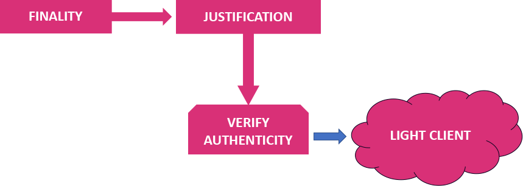
<!-- .element: class="fragment" data-fragment-index="1" -->

Notes:

As we know Substrate chains provides the concept of FINALITY which is VERY important for the light clients!
Once a block has been finalized, it is guaranteed to always be part of the best chain.
By extension, the parent of a finalized block is always finalized as well etc etc
For finality Substrate/Polkadot nodes use the GrandPa algorithm.
Authorized nodes, emit votes on the network, when 2/3rds or more have voted for a specific block, it effectively becomes finalized.
These votes are been collected in what is called a **justification**

**Justifications** play a crucial role in providing security and validity guarantees for light clients.
As said before, light clients are nodes that do not store blockchain's data but rely on other full nodes or the network to verify the blockchain's state and transactions.
While light clients offer reduced resource requirements and faster synchronization, they face the challenge of trusting the information they receive from other nodes.

Justifications address this trust issue for light clients by providing cryptographic proofs of the finality and validity of blocks.
When a block is justified, it means that it has been confirmed and agreed upon by a supermajority of validators, making it part of the finalized state of the blockchain.

It is also used by nodes who might not have received all the votes, or for example if they were offline, In order to verify the authenticity of the blocks;

A Light client receives these justifications and this way it verifies the authenticity of a block.

---v

<section>
  <diagram class="mermaid limit size-80">
    sequenceDiagram
        Network->>Justification: Finality and create
        Network->>Justification: Finality and create
        App->>LightClient: Wake up and sync!
        LightClient->>Justification: Hey! I'm here!
        Justification-->>LightClient: Here you go
        Justification-->>LightClient: Here you go
        Justification-->>LightClient: Here you go
        App->>LightClient: Ready?!
        LightClient->>App: Not yet! Syncing
        Justification-->>LightClient: Here you go
        LightClient-->>App: Verified and synced!
        App->>LightClient: 'right! Now gimme stuff
        LightClient->>Network: Lets talk! App wants stuff
        Network-->>LightClient: Ok then!
        LightClient-->>App: Here you go!
  </diagram>
</section>

---v

<pba-cols>
  <pba-col left>
    <h2 style="text-align: center">Full node</h2>
  </pba-col>
  <pba-col left>
    <h2 style="text-align: center">Light client</h2>
  </pba-col>
</pba-cols>
<pba-cols>
  <pba-col left>
    <div class="white bg-[var(--r-heading-color)] text-base rounded-2xl p-4 !mt-2">Fully verifies all blocks (authenticity/validity)</div>
    <div class="white bg-[var(--r-heading-color)] text-base rounded-2xl p-4 !mt-2">Holds all the chain’s storage in its database</div>
    <div class="white bg-[var(--r-heading-color)] text-base rounded-2xl p-4 !mt-2">Holds all past blocks in its database</div>
    <div class="white bg-[var(--r-heading-color)] text-base rounded-2xl p-4 !mt-2">At initial startup, can take hours to be
ready</div>
  </pba-col>

  <pba-col left>
  </pba-col>
</pba-cols>

---v

<pba-cols>
  <pba-col left>
    <h2 style="text-align: center">Full node</h2>
  </pba-col>
  <pba-col left>
    <h2 style="text-align: center">Light client</h2>
  </pba-col>
</pba-cols>
<pba-cols>
  <pba-col left>
    <div class="white bg-[var(--r-heading-color)] text-base rounded-2xl p-4 !mt-2">Fully verifies all blocks (authenticity/validity)</div>
    <div class="white bg-[var(--r-heading-color)] text-base rounded-2xl p-4 !mt-2">Holds all the chain’s storage in its database</div>
    <div class="white bg-[var(--r-heading-color)] text-base rounded-2xl p-4 !mt-2">Holds all past blocks in its database</div>
    <div class="white bg-[var(--r-heading-color)] text-base rounded-2xl p-4 !mt-2">At initial startup, can take hours to be
ready</div>
  </pba-col>

  <pba-col left>
    <div class="white bg-[var(--r-heading-color)] text-base rounded-2xl p-4 !mt-2">Only verifies the authenticity of blocks</div>
    <div class="white bg-[var(--r-heading-color)] text-base rounded-2xl p-4 !mt-2">Requests state of the chain on demand</div>
    <div class="white bg-[var(--r-heading-color)] text-base rounded-2xl p-4 !mt-2">No database whatsoever</div>
    <div class="white bg-[var(--r-heading-color)] text-base rounded-2xl p-4 !mt-2">Initializes in few seconds</div>
  </pba-col>
</pba-cols>

---

# Questions?

---

#### But before we go on... lets remember JSON-RPC

- stateless, light-weight remote procedure call (RPC) protocol;
- defines data structures and the rules around their processing;
- is transport agnostic;
- uses JSON (RFC 4627) as data format;

Notes: is transport agnostic in that the concepts can be used within the same process, over sockets, over HTTP, or in many various message passing environments.

---v

## Legacy vs New JSON-RPC API

  <diagram class="mermaid">
    stateDiagram-v2
      NEW_JSON_RPC_API: New JSON-RPC API
      LEGACY_JSON_RPC_API: Legacy JSON-RPC API
      Substrate --> NEW_JSON_RPC_API
      Substrate --> LEGACY_JSON_RPC_API
      Smoldot --> NEW_JSON_RPC_API
      Smoldot --> LEGACY_JSON_RPC_API
  </diagram>

---v

## Why a new JSON RPC is needed:

- Full Node Assumptions - not light client in-mind
<!-- .element: class="fragment" data-fragment-index="1" -->
- Runtime Dependency
<!-- .element: class="fragment" data-fragment-index="2" -->
- DoS Attack Vulnerabilities
<!-- .element: class="fragment" data-fragment-index="3" -->
- Load Balancer Challenges
<!-- .element: class="fragment" data-fragment-index="4" -->
- Documentation Issues
<!-- .element: class="fragment" data-fragment-index="5" -->

Notes:
Forum article of Pierre: https://forum.polkadot.network/t/new-json-rpc-api-mega-q-a/3048/1
New JSON RPC Spec: https://paritytech.github.io/json-rpc-interface-spec/

- Full Node Assumptions: "Legacy JSON-RPC APIs assume a full node implementation, leading to inefficiencies and limitations for light clients. State_getKeysPaged Example: "Functions like state_getKeysPaged are wasteful for light clients, requiring repeated downloads of the same data."
- Runtime Dependency: "Some JSON-RPC functions depend heavily on the chain's runtime details, necessitating version synchronization between the client and runtime."
- DoS Attack Vulnerabilities: "Legacy JSON-RPC functions aren't designed to be anti-DoS, leading to reliance on hacks and poor user experiences."
- Load Balancer Challenges: "Legacy JSON-RPC functions are not load-balancer-friendly, requiring client pinning to specific servers and complicating server downscaling."
- Documentation Issues: "Many JSON-RPC functions are poorly documented, especially regarding corner cases, leading to inconsistent behavior - some functions that search for a block - when not found return null - others error."

---v

## Timeline?

  <diagram class="mermaid">
    stateDiagram-v2
    NEW_JSON_RPC_API: New JSON-RPC API
    LEGACY_JSON_RPC_API: Legacy JSON-RPC API
    classDef badBadEvent fill:#343434,color:#ccc,font-weight:bold,stroke-width:2px,stroke:#999
      Substrate --> NEW_JSON_RPC_API
      Substrate --> LEGACY_JSON_RPC_API:::badBadEvent : X
      Smoldot --> NEW_JSON_RPC_API
      Smoldot --> LEGACY_JSON_RPC_API:::badBadEvent : X
  </diagram>

- When the Legacy JSON-RPC API will be removed?
- “as soon as realistically possible”

Notes:
Forum article of Pierre: https://forum.polkadot.network/t/new-json-rpc-api-mega-q-a/3048/1
New JSON RPC Spec: https://paritytech.github.io/json-rpc-interface-spec/

---

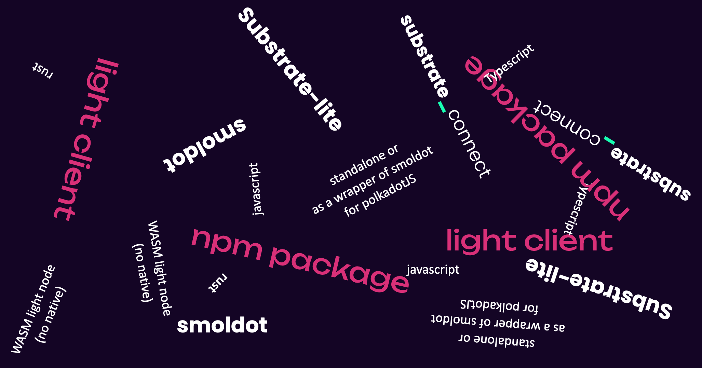

Notes:

Now, let's dive into the Polkadot solution of light clients for all Substrate chains.

As we progress through the slide, you might have come across or heard various terms and concepts related to light clients.

At this point, it's crucial to draw a clear distinction;
Let's proceed with a more focused and detailed exploration of light clients in the Polkadot Ecosystem.

---v

<h1>Smoldot<h1>

<div style="font-size:2rem; color: #fff">Light Client implementation from scratch</div>
  <!-- .element: class="fragment" data-fragment-index="1" -->

### rust

<!-- .element: class="fragment" data-fragment-index="2" -->
<div>
  <div style="font-size:2.2rem; color: #fff">smoldot (/lib) - Rust library</div>
  <!-- .element: class="fragment" data-fragment-index="3" -->
  <div style="font-size:2.2rem; color: #fff">smoldot-light (/light-base)</div>
  <!-- .element: class="fragment" data-fragment-index="4" -->
  <div style="font-size:2.2rem; color: #fff">smoldot-light-js (/wasm-node) - npm/deno</div>
  <!-- .element: class="fragment" data-fragment-index="5" -->
  <div style="font-size:2.2rem; color: #fff">smoldot-full-node (/full-node)</div>
  <!-- .element: class="fragment" data-fragment-index="6" -->
</div>
<!-- .element: class="fragment" data-fragment-index="3" -->

<p class="inline-table">
  
  <!-- .element: class="fragment" data-fragment-index="7" -->
  <div style="font-size:1.5rem; color: #fff">Pierre Krieger - tomaka</div>
  <!-- .element: class="fragment" data-fragment-index="7" -->
</p>
<!-- .element: class="fragment" data-fragment-index="7" -->

<p style="font-size:2rem; margin-top: 1rem"><a href="https://github.com/smol-dot/smoldot/">https://github.com/smol-dot/smoldot/</a></p>

<!-- .element: class="fragment" data-fragment-index="8" -->

Notes:

Smoldot - is the Light Client implementation from scratch - meaning, we did not make substrate lighter.
It was rewritten from scratch, in rust - and it comes with:

- smoldot (/lib): An unopinionated Rust library of general-purpose primitives that relate to Substrate and Polkadot.
  Serves as a base for the other components.
- smoldot-light (/light-base): A platform-agnostic Rust library that can connect to a Substrate-based chain as a Light Client.
  Serves as the base for the smoldot-light-js component explained above.
- smoldot-light-js (/wasm-node): A JavaScript package that can connect to a Substrate-based chains as a Light Client.
  Works both in the browser and in NodeJS/Deno.
  This is the main component of this repository.
- smoldot-full-node (/full-node): A work-in-progress prototype of a full node binary that can connect to Substrate-base chains.
  Doesn't yet support many features that the official client supports.

Powered by Pierre Krieger (a.k.a. tomaka)

---v

## Substrate Connect

<div style="font-size:1.75rem; color: #fff">uses smoldot as an implementation detail</div>
<!-- .element: class="fragment" data-fragment-index="1" -->

<div style="font-size:1.5rem; color: #d92f78; margin: 0.5rem 0">javascript/typescript</div>
<!-- .element: class="fragment" data-fragment-index="2" -->
  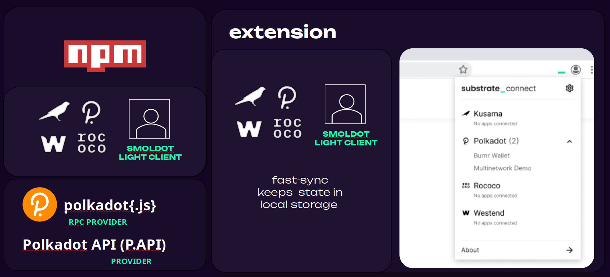
  <!-- .element: class="fragment" data-fragment-index="3" -->
<p class="inline-table">
  <!-- .element: class="fragment" data-fragment-index="4" -->
  <div style="font-size:2rem; color: #fff">Powered by: Parity</div>
  <!-- .element: class="fragment" data-fragment-index="4" -->
</p>
<p style="font-size:1.5rem; margin-top: 1rem"><a href="https://github.com/paritytech/substrate-connect/">https://github.com/paritytech/substrate-connect/</a></p>
<!-- .element: class="fragment" data-fragment-index="5" -->

Notes:

- npm package
- rpc provider from polkadotJS
- Chrome and Mozilla extension
- Comes with 4 integrated "Well Known" chains (Kusama, Polkadot, Westend, Rococo) - which means these chains can be used without the need of providing chainspecs;

---v

## The (NEW) Polkadot API

<div style="font-size:1.25rem; margin: -2rem 0 2rem 0; color: #d92f78;">(aka PAPI)</div>
<!-- .element: class="fragment" data-fragment-index="1" -->
<div style="font-size:1.75rem; color: #fff">Light Client first: built on top of the new JSON-RPC API</div>
<!-- .element: class="fragment" data-fragment-index="2" -->
<div style="font-size:1.5rem; color: #fff; margin: 1rem 0">Delightful <span style="color: #d92f78; font-weight: bold;">TypeScript</span> support with types and docs generated from on-chain metadata.</div>
<!-- .element: class="fragment" data-fragment-index="3" -->
<div style="font-size:1.5rem; color: #fff; margin: 1rem 0">First class support for storage reads, constants, transactions, events and runtime-calls.</div>
<!-- .element: class="fragment" data-fragment-index="4" -->
<div style="font-size:1.5rem; color: #d92f78; margin: 1rem 0">... and a lot more.</div>
<!-- .element: class="fragment" data-fragment-index="5" -->
<p class="inline-table">
  <div style="font-size:2rem; color: #fff">Powered by:</div>
  <!-- .element: class="fragment" data-fragment-index="6" -->
  <div style="display: inline-flex; "></div>
  <!-- .element: class="fragment" data-fragment-index="7" -->
</p>
<p style="font-size:1.5rem; margin-top: 1rem"><a href="https://github.com/polkadot-api/polkadot-api/">https://github.com/polkadot-api/polkadot-api/</a></p>
<!-- .element: class="fragment" data-fragment-index="8" -->

---v

## SubXT

<div style="font-size:1.25rem; margin: -2rem 0 2rem 0; color: #d92f78;">(Submit EXtrinsics)</div>
<!-- .element: class="fragment" data-fragment-index="1" -->

<div style="font-size:1.75rem; color: #fff">a (rust) library for interacting with Substrate based nodes in <span style="color: #d92f78; font-weight: bold;">Rust and WebAssembly</span></div>
<!-- .element: class="fragment" data-fragment-index="2" -->
<ul style="font-size:1.4rem; margin: 2rem 10rem">
  <li>Submit Extrinsics.</li>
  <li>Subscribe to blocks, reading the extrinsics and associated events from them.</li>
  <li>Read and iterate over storage values.</li>
  <li>Read constants and custom values from the metadata.</li>
  <li>Call runtime APIs, returning the results.</li>
  <li>Do all of the above via a safe, statically types interface or via a dynamic one when you need the flexibility.</li>
  <li>Compile to WASM and run entirely in the browser.</li>
  <li>Do a bunch of things in a #[no_std] environment via the subxt-core crate.</li>
  <li style="color: #d92f78; font-weight: bold;">Use a built-in light client (smoldot) to interact with chains.</li>
</ul>
<!-- .element: class="fragment" data-fragment-index="3" -->

<p class="inline-table">
  <!-- .element: class="fragment" data-fragment-index="4" -->
  <div style="font-size:2rem; color: #fff">Powered by: Parity</div>
  <!-- .element: class="fragment" data-fragment-index="4" -->
</p>
<p style="font-size:1.5rem; margin-top: 1rem"><a href="https://github.com/paritytech/subxt/">https://github.com/paritytech/subxt/</a></p>
<!-- .element: class="fragment" data-fragment-index="5" -->

---v

### Smoldot - On a diagram

<section>
  <diagram class="mermaid limit size-80">
    stateDiagram-v2
      NEW_JSON_RPC_API: New JSON-RPC API
      LEGACY_JSON_RPC_API: Legacy JSON-RPC API
      dAPP --> Smoldot
      Smoldot --> LEGACY_JSON_RPC_API
      Smoldot --> NEW_JSON_RPC_API
  </diagram>
</section>

Notes: meaning you need to send/receive and act with the JSONs

---v

### Substrate Connect - On a diagram

<section>
  <diagram class="mermaid limit size-80">
    stateDiagram-v2
      NEW_JSON_RPC_API: New JSON-RPC API
      LEGACY_JSON_RPC_API: Legacy JSON-RPC API
      substrate_connect: Substrate Connect
      sc_provider: SC Provider
      PJS_API: PolkadotJS API
      Pokadot_API: Polkadot API
      dApp --> substrate_connect
      state substrate_connect {
        [*] --> sc_provider
        [*] --> Providers
        sc_provider --> PJS_API
        Providers --> Pokadot_API
        PJS_API --> Smoldot
        Pokadot_API --> Smoldot
        Smoldot --> LEGACY_JSON_RPC_API
        Smoldot --> NEW_JSON_RPC_API
      }
  </diagram>
</section>
---v

### Polkadot API - On a diagram

<diagram class="mermaid">
  stateDiagram-v2
      NEW_JSON_RPC_API: New JSON-RPC API
      ws_provider_web: WS Provider/Web
      node_js_worker:  NodeJS/Worker
      ws_provider_node: WS Provider/Node
      smoldot_worker: Smoldot/Worker
    dApp --> Polkadot_API
    state Polkadot_API {
      [*] --> node_js_worker
      [*] --> ws_provider_web
      [*] --> ws_provider_node
      [*] --> smoldot_worker
      [*] --> Smoldot
      node_js_worker --> NEW_JSON_RPC_API
      ws_provider_web --> NEW_JSON_RPC_API
      ws_provider_node --> NEW_JSON_RPC_API
      smoldot_worker --> NEW_JSON_RPC_API
      Smoldot --> NEW_JSON_RPC_API
    }
</diagram>

---v

### SubXT - On a diagram

<diagram class="mermaid limit size-80">
  stateDiagram-v2
    NEW_JSON_RPC_API: New JSON-RPC API
    LEGACY_JSON_RPC_API: Legacy JSON-RPC API
    Backend_RPC_Legacy_methods: Backend RPC Legacy methods 
    Backend_RPC_New_methods: Backend RPC New methods
    dAPP --> SubXT
    state SubXT {
      [*] --> Backend_RPC_Legacy_methods
      [*] --> Backend_RPC_New_methods
      Backend_RPC_Legacy_methods --> Smoldot
      Backend_RPC_New_methods --> Smoldot
      Smoldot --> LEGACY_JSON_RPC_API
      Smoldot --> NEW_JSON_RPC_API
    }
</diagram>

---

## Publicly Accessible Node

The dApp (UI) connects to a third-party-owned publicly-accessible node client

<p class="bg-red-600 rounded-2xl p-4 !mt-2"><span class="font-bold">Centralized and insecure:</span> Publicly-accessible node can be malicious</p>
<p class="bg-green-600 rounded-2xl p-4 !mt-2"><span class="font-bold">Convenient:</span> Works transparently</p>

Notes:

We saw 3 different scenarios. Lets analyze each one in order to understand what is the most effecient and secure way for a dApp to connect to the nodes network and become unstoppable

---v

## So what one needs to do

- Find the web-socket url of a 3rd party node (JSON-RPC node) that one trusts;
<!-- .element: class="fragment" data-fragment-index="1" -->
- Add it to the code and use it;
<!-- .element: class="fragment" data-fragment-index="2" -->

---v

## In your dApp

```javascript[0|1|3-4|5|7-9]
import { ApiPromise, WsProvider } from "@polkadot/api";

// Maybe some more code that does some magic here
const provider = new WsProvider("wss://westend-rpc.polkadot.io");
const api = await ApiPromise.create({ provider });

// Interact using polkadotJS API
const header = await api.rpc.chain.getHeader();
const chainName = await api.rpc.system.chain();
```

---

## User-Controlled Node

The dApp (UI) connects to a node client that the user has installed on their machine

<div>
  <p class="bg-green-600 rounded-2xl p-4 !mt-2"><span class="font-bold">Secure Trustless:</span> connects to multiple nodes, verifies everything</p>
  <p class="bg-red-600 rounded-2xl p-4 !mt-2"><span class="font-bold">Inconvenient:</span> Needs an installation process and having a node up and running, plus maintenance effort</p>
</div>
<!-- .element: class="fragment" data-fragment-index="1" -->
---v

## So what one needs to do

<pba-flex center>

1. Install dependencies<br/>
(e.g. rust, openssl, cmake, llvm etc);
<!-- .element: class="fragment" data-fragment-index="1" -->
1. Clone from github the "polkadot" repo;
<!-- .element: class="fragment" data-fragment-index="2" -->
1. Build the node locally;
<!-- .element: class="fragment" data-fragment-index="3" -->
1. Start the node locally;
<!-- .element: class="fragment" data-fragment-index="4" -->
1. Wait for the node to synchronize;
   <!-- .element: class="fragment" data-fragment-index="5" -->
   <pba-flex>

---v

<p>...wait for the node to synchronize...</p>
<!-- .element: class="fragment" data-fragment-index="1" -->
<p>.......</p>
<!-- .element: class="fragment" data-fragment-index="2" -->
<p>..........</p>
<!-- .element: class="fragment" data-fragment-index="3" -->
<p>.....................</p>
<!-- .element: class="fragment" data-fragment-index="4" -->
<p>.................................</p>
<!-- .element: class="fragment" data-fragment-index="5" -->
<p>........ maybe get some water ? .........</p>
<!-- .element: class="fragment" data-fragment-index="6" -->
<p>...................................................</p>
<!-- .element: class="fragment" data-fragment-index="7" -->
<p>.............................................................</p>
<!-- .element: class="fragment" data-fragment-index="8" -->
<p>done</p>
<!-- .element: class="fragment" data-fragment-index="9" -->

---v

## In your dApp

```javascript[0|1|3-4|5|7-9]
import { ApiPromise, WsProvider } from "@polkadot/api";

// Maybe some more code that does some magic here
const provider = new WsProvider("wss://127.0.0.1:9944");
const api = await ApiPromise.create({ provider });

// Interact using polkadotJS API
const header = await api.rpc.chain.getHeader();
const chainName = await api.rpc.system.chain();
```

---

## Light Client in the Browser

The uApp (UI) connects to an _integrated_ Light Client

<div>
  <p class="bg-green-600 rounded-2xl p-4 !mt-2"><span class="font-bold">Secure Trustless:</span> connects to multiple nodes, verifies everything</p>
  <p class="bg-green-600 rounded-2xl p-4 !mt-2"><span class="font-bold">Convenient:</span> Works transparently</p>
</div>
<!-- .element: class="fragment" data-fragment-index="1" -->

---v

## So what one needs to do

<pba-flex center>

1. Install and configure the Light Client inside the dApp

</pba-flex>

---v

## Substrate Connect (PolkadotJS)

```javascript[0|1-2|4-7|9-11]
import { ScProvider } from "@polkadot/rpc-provider/substrate-connect";
import * as Sc from '@substrate/connect';

// Maybe some more code that does some magic here
const provider = new ScProvider(Sc, Sc.WellKnownChain.westend2);
await provider.connect();
const api = await ApiPromise.create({ provider });

// Interact using polkadotJS API
const header = await api.rpc.chain.getHeader();
const chainName = await api.rpc.system.chain();
```

<!-- ---v

## With Substrate Connect (without PJS API)

```javascript[0|1|4|5-10|12-15]
import { createScClient, WellKnownChain } from "@substrate/connect";

// Maybe some more code that does some magic here
const scClient = createScClient();
const mainChain = await scClient.addWellKnownChain(
  WellKnownChain.polkadot,
  jsonRpcCallback = (response) {
    console.log(response);
  }
);

// Communicate with the network
mainChain.sendJsonRpc(
  '{"jsonrpc":"2.0","id":"1","method":"chainhead_v1_follow","params":[true]}',
);
``` -->

---v

### Substrate Connect (Custom Chainspec)

```javascript[0|1|2,4|7|8,13|9|10-12| 15-18]
import { createScClient, WellKnownChain } from "@substrate/connect";
import myLovelyChainspec from './myLovelyChainspecFromSubstrateChain.json';

const myLovelyChainspecStringified = JSON.stringify(myLovelyChainspec);

// Maybe some more code that does some magic here
const scClient = createScClient();
const mainChain = await scClient.addChain(
  myLovelyChainspecStringified,
  jsonRpcCallback = (response) {
    console.log(response);
  }
);

// Communicate with the network
mainChain.sendJsonRpc(
  '{"jsonrpc":"2.0","id":"1","method":"chainhead_v1_follow","params":[true]}',
);
```

---v

### SubXT

```rust[0|3|5-6|9-12|19-22|24-28|30-35|36-40]
#![allow(missing_docs)]
use futures::StreamExt;
use subxt::{client::OnlineClient, lightclient::LightClient, PolkadotConfig};

// Generate an interface that we can use from the node's metadata.
#[subxt::subxt(runtime_metadata_path = "../artifacts/polkadot_metadata_small.scale")]
pub mod polkadot {}

const POLKADOT_SPEC: &str =
  include_str!("../../artifacts/demo_chain_specs/polkadot.json");
const ASSET_HUB_SPEC: &str =
  include_str!("../../artifacts/demo_chain_specs/polkadot_asset_hub.json");

#[tokio::main]
async fn main() -> Result<(), Box<dyn std::error::Error>> {
    // The lightclient logs are informative:
    tracing_subscriber::fmt::init();

    // Instantiate a light client with the Polkadot relay chain,
    // and connect it to Asset Hub, too.
    let (lightclient, polkadot_rpc) = LightClient::relay_chain(POLKADOT_SPEC)?;
    let asset_hub_rpc = lightclient.parachain(ASSET_HUB_SPEC)?;

    // Create Subxt clients from these Smoldot backed RPC clients.
    let polkadot_api =
      OnlineClient::<PolkadotConfig>::from_rpc_client(polkadot_rpc).await?;
    let asset_hub_api =
      OnlineClient::<PolkadotConfig>::from_rpc_client(asset_hub_rpc).await?;

    // Use them!
    let polkadot_sub = polkadot_api
        .blocks()
        .subscribe_finalized()
        .await?
        .map(|block| ("Polkadot", block));
    let parachain_sub = asset_hub_api
        .blocks()
        .subscribe_finalized()
        .await?
        .map(|block| ("AssetHub", block));

    let mut stream_combinator =
      futures::stream::select(polkadot_sub, parachain_sub);

    while let Some((chain, block)) = stream_combinator.next().await {
        let block = block?;
        println!("     Chain {:?} hash={:?}", chain, block.hash());
    }

    Ok(())
}
```

---v

### Smoldot

```javascript[0|1|3-5|7,16|8-15|18-23|25-26|28-29]
import * as smoldot from "smoldot";

const chainSpec = new TextDecoder("utf-8").decode(
  fs.readFileSync('./westend-chain-specs.json')
);

const client = smoldot.start({
    maxLogLevel: 3,  // Can be increased for more verbosity
    forbidTcp: false,
    forbidWs: false,
    forbidNonLocalWs: false,
    forbidWss: false,
    cpuRateLimit: 0.5,
    logCallback: (_level, target, message) =>
      console.log(_level, target, message)
});

client
  .addChain({ chainSpec, disableJsonRpc: true })
  .catch((error) => {
    console.error("Error while adding chain: " + error);
    process.exit(1);
  });

console.log('JSON-RPC server now listening on port 9944');
console.log('Please visit: https://cloudflare-ipfs.com/ipns/dotapps.io/?rpc=ws%3A%2F%2F127.0.0.1%3A9944');

// Now spawn a WebSocket server in order to handle JSON-RPC clients.
// See JSON-RPC protocol: https://github.com/paritytech/json-rpc-interface-spec/
```

---

# Some demo maybe…?

<p class="inline-table">
  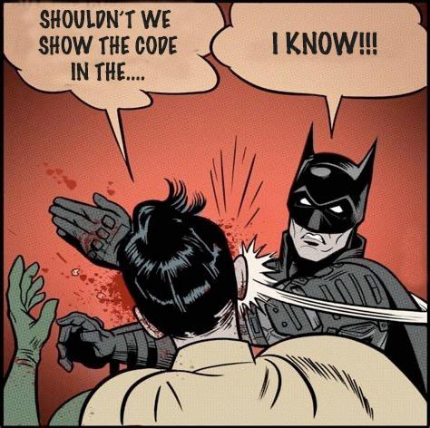
</p>

---

#### Known vulnerabilities

- Eclipse attacks (Full node & Light client)
<!-- .element: class="fragment" data-fragment-index="1" -->
- Long-range attacks (Full node & Light client)
<!-- .element: class="fragment" data-fragment-index="2" -->
- Invalid best block (Only Light client)
<!-- .element: class="fragment" data-fragment-index="3" -->
- Finality stalls (Mostly Light client)
<!-- .element: class="fragment" data-fragment-index="4" -->

Notes:

Stay with me - the next is the last but not the easiest part:

- **Eclipse attacks (full nodes and light clients both affected)**.
  "If smoldot is only ever connected to malicious nodes, it won't ever be able to reach non-malicious nodes
  !!! this attack is effectively a denial-of-service, as it will prevent smoldot from accessing the blockchain!"

  Blockchain is a P2P network - and Smoldot tries to connect to a variety of nodes of this network.
  Imagine if all these nodes were to refuse sending data back, that would isolate smoldot from the network - The way that smoldot learns which nodes exist (GOSSIP) is from the nodes themselves (bootnodes).
  If smoldot is only ever connected to malicious nodes, it won't ever be able to reach non-malicious nodes
  If the list of bootnodes contains a single honest node, then smoldot will be able to reach the whole network.

- **Long-range attacks (full nodes and light clients both affected)**.
  If more than 2/3rds of the validators collaborate, they can fork a chain, starting from a block where they were validator, even if they are no longer part of the active validators at the head of the chain.
  If some validators were to fork a chain, the equivocation system would punish them by stealing their staked tokens.
  However, they cannot be punished if they unstake their tokens (which takes 7 days for Kusama or 28 days for Polkadot) before creating the fork.

  If smoldot hasn't been online since the starting point of the fork, it can be tricked (through an eclipse attack) into following the false fork.
  In order to not be vulnerable, smoldot shouldn't stay offline for more than the unstaking delay time (as said 7 days for Kusama or 28 days for Polkadot) in a row.
  Alternatively, smoldot isn't vulnerable if the checkpoint provided in the chain specification, is not older than the unstaking delay.

  Given that this attack -> requires the collaboration of many validators, -> is "all-in", -> is detectable ahead of time, -> it requires being combined with an eclipse attack, and that it doesn't offer any direct reward, it is considered not a realistic threat.

- **Invalid best block (light clients only)**.
  Light clients don't verify validity but only authenticity of blocks.

  A block is authentic if it has been authored by a legitimate validator, at a time when it was authorized to author a block.
  A validator could author a block that smoldot considers as authentic, but that contains completely arbitrary data.

  Invalid blocks aren't propagated by honest full nodes on the gossiping network, but it is possible for the validator to send the block to the smoldot instance(s) that are directly connected to it or its complicit.
  While this attack requires a validator to be malicious and that it doesn't offer any direct reward it is unlikely to happen, but it is still a realistic threat.
  For this reason, when using a Light Client, do not assume any storage data coming from a best, that hasn't been finalized yet to be accurate.

  Once a block has been finalized, it means that at least 2/3rds of the validators consider the block valid.
  While it is still possible for a finalized block to be invalid, this would require the collaboration of 2/3rds of the validators.
  If that happens, then the chain has basically been taken over, and whether smoldot shows inaccurate data **doesn't really matter anymore**.

- **Finality stalls (mostly light clients)**.
  Because any block that hasn't been finalized yet can become part of the canonical chain in the future, a node, in order to function properly, needs to keep track of all the valid (for full nodes) or authentic (for light clients) non-finalized blocks that it has learned the existence of.
  Under normal circumstances, the number of such blocks is rather low (typically 3 blocks).
  If, however, blocks cease to be finalized but new blocks are still being authored, then the memory consumption of the node will slowly increase over time for each newly-authored block until there is no more memory available and the node is forced to stop.
  Substrate mitigates this problem by forcing blocks authors to gradually slow down the blocks production when the latest known finalized block is too far in the past.
  Since it is normally not possible for finality to stall unless there is a bug or the chain is misconfigured, this is not really an attack but rather the consequences of an attack.
  Full nodes are less affected by this problem because they typically have more memory available than a Light Client, and have the possibility to store blocks on the disk.

---

## Unstoppable apps?


<!-- .element: class="fragment" data-fragment-index="1" -->

Using smoldot with PAPI:

<!-- .element: class="fragment" data-fragment-index="2" -->

<p style="font-weight: bold; color: #d92f78; margin-top: 1rem">https://polkadot-blockchain-academy.github.io/onchain-id-verification/</p>
<!-- .element: class="fragment" data-fragment-index="2" -->

---v

## Unstoppable apps?


<!-- .element: class="fragment" data-fragment-index="1" -->

Using Substrate Connect with smoldot and PAPI

<!-- .element: class="fragment" data-fragment-index="2" -->

<p style="font-weight: bold; color: #d92f78; margin-top: 1rem">localhost:3001</p>
<!-- .element: class="fragment" data-fragment-index="2" -->

---v

## Unstoppable apps?

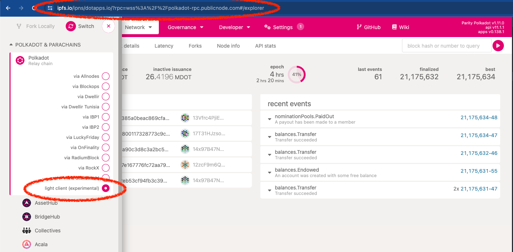
<!-- .element: class="fragment" data-fragment-index="1" -->

Using Substrate connect with smoldot and PolkadotJS API

<!-- .element: class="fragment" data-fragment-index="2" -->

<p style="font-weight: bold; color: #d92f78; margin-top: 1rem">https://ipfs.io/ipns/dotapps.io/</p>
<!-- .element: class="fragment" data-fragment-index="2" -->

Notes: IPFS: (InterPlanetary File System) is a protocol, hypermedia and file sharing peer-to-peer network for storing and sharing data in a distributed file system.
---v

## Unstoppable apps

<section>


- Decentralized Blockchain
<!-- .element: class="fragment" data-fragment-index="1" -->

- Light Clients
<!-- .element: class="fragment" data-fragment-index="2" -->

- Interplanetary File System (IPFS)
  <!-- .element: class="fragment" data-fragment-index="3" -->
  </section>

---

# Questions?
