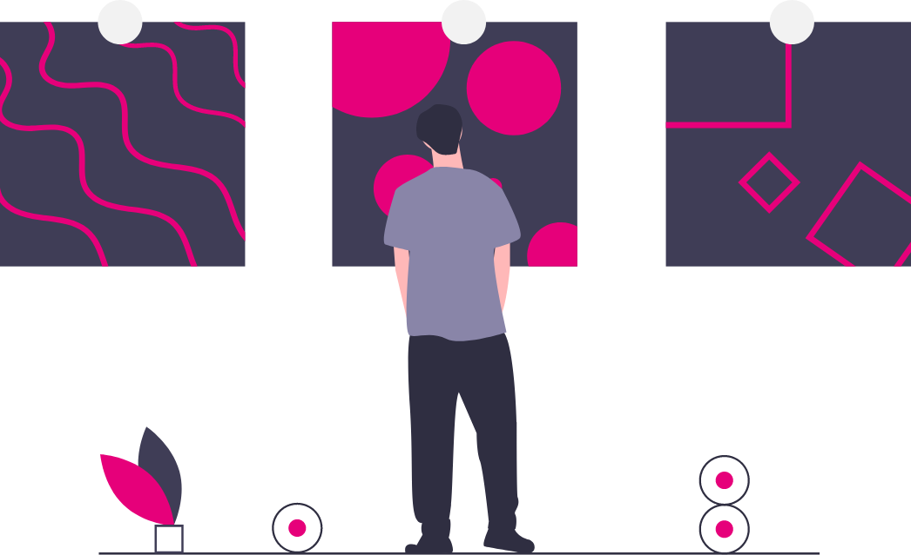
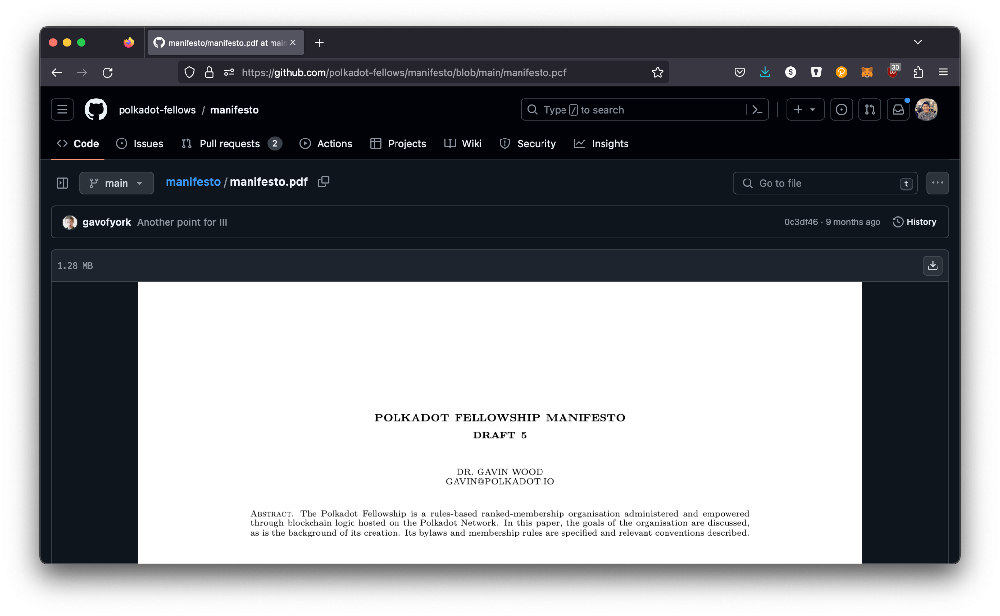
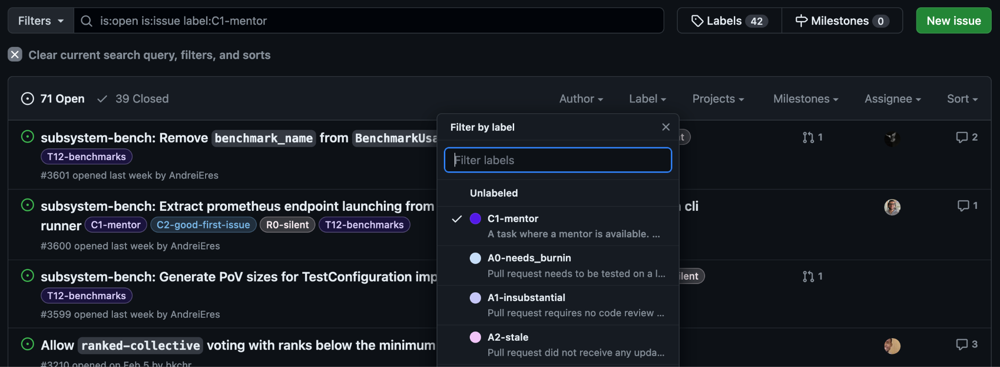
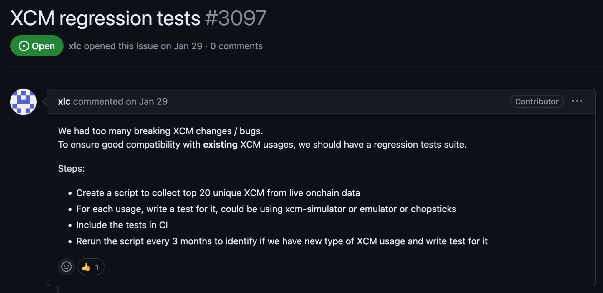
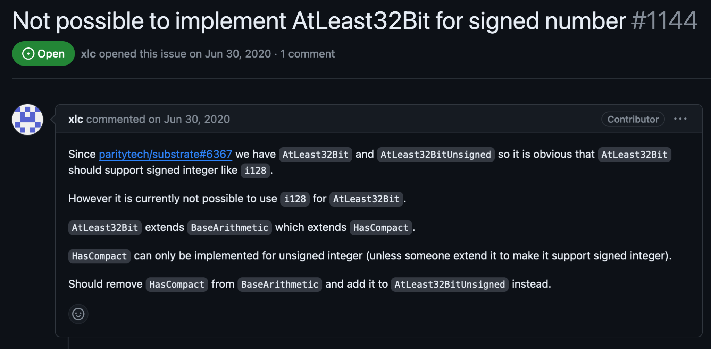

# Contributing to the Polkadot SDK

---

<!-- check size -->

---

## Prerequisite Knowledge

- Mid-Level Rust Programming Abilities
  - Fluency with the first 11 chapters of The Rust Book
- Mid-Level Understanding of Blockchains
  - Basics of Cryptography, Game Theory, Economics
  - Fundamentals of Bitcoin and Ethereum
  - Smart Contracts / State Machines
- Basic Understanding of Polkadot

---

## Learn Rust for Substrate

<pba-flex center>
https://dotcodeschool.com/
</pba-flex>

---

## The Polkadot Blockchain Academy

<!-- need to fix this, not sure how to have multiple images in the collage. Table can be on the right side -->

<pba-col right>
5 Global Cohorts
5 Weeks in Person
7 Modules
~1,000 Applicants*
~90 Students*
~50 Graduates*
~20 Hires*
</pba-col>

https://polkadot.network/academy/

---

# I just graduated from the Polkadot Blockchain Academy…

#### _... now what?_

---

### Polkadot SDK
<!-- original slides had 90 and -90 degree "Polkadot SDK text around a box-->

---

## The Mono Repo
<!-- skipped Polkadot SDK repo has evolved slide, not relevant for PBA-->

<pba-col right>
- Merging into a single repository simplifies the development process
- Eliminates the need for “companion” PRs across multiple repositories.
- Improves collaboration among team members. 
- Makes it easier to manage issues, pull requests, and documentation.
</pba-col>

---

## Runtime Extraction

<pba-col right>
Extraction of the various Polkadot Runtimes established the decentralized ownership of this code. Includes:
- Relay Chain Runtimes
  - Polkadot
  - Kusama
- System Parachains
  - Asset Hub
  - Bridges Hub
  - Collectives
  - etc...
</pba-col>

---

## Repository Ownership

<pba-col left>
Parity Technologies
</pba-col>

The Polkadot Network via the Fellowship
</pba-col>

---

## Polkadot RFCs
- Requests for Comment (RFCs) are proposed changes to the technical implementation of the Polkadot network.
- The Polkadot Fellowship reviews and provides feedback to the RFCs.
- RFC approval is done on-chain either by the fellowship or through public referendum.
- The Polkadot Fellowship also stewards forward approved RFCs.

https://github.com/polkadot-fellows/RFCs

---

### Fellowship
<!-- original slides had 90 and -90 degree "Fellowship" text around a box-->

---

## The Fellowship

- A technical organization that stewards the development of the Polkadot Network.
- Composed of core developers and researchers.
- Servants to the DOT holders via referendum signaling.

https://github.com/polkadot-fellows

---

https://github.com/polkadot-fellows/manifesto

---

The current Polkadot Fellows.

---

## Rank Summary

<table class="no-bullet-padding">
<tr>
  <td>Dan</td>
  <td>Title</td>
  <td>Time from Dan I</td>
  <td>Salary Factor (OECD)</td>
</tr>
<tr class="text-small">
<td>

- n/a
- I
- II
- III
- IV
- V
- VI
- VII
- VIII
- IX
</td>
<td>
- Candidate
- Humble
- Proficient
- Fellow
- Architect
- Architect Adept
- Grant Architect
- Free Master
- Master Constant
- Grand Master
</td>
<td>
- n/a
- n/a
- ~1 year
- ~2 years
- 3 years
- > 4 years
- > 5 years
- > 6 years!
- > 11 years!
- > 19 years!
</td>
<td>
- 0.0
- 0.125
- 0.25
- 1.0
- 1.5
- 2.0
- 2.5
- 2.5
- 2.5
- 2.5
</td>

Salary RFC: https://github.com/polkadot-fellows/RFCs/pull/50/
OECD: Organisation for Economic Co-operation and Development

<pba-col right>
- The fellowship has different ranks based on their contributions to Polkadot.
- The requirements to be promoted are defined in the manifesto.
- Fellowship members can choose to accept a salary for their rank.
- Salary is based on the OECD average salary for engineers.
</pba-col>

---

## Dan I

The requirements (condensed) to become a Dan I member of the Polkadot Fellowship are:

<pba-col left>
- Three clear examples of a modest but substantial contribution to protocol development.
- Actively been involved in the design of a component deployed to the network.
- Substantially assisted in the analysis, or authoring of formalisation or implementation of a protocol component.
- Should be able to list all key goals, principles and tenets of Polkadot’s overall philosophy.
</pba-col>
<pba-col right>
Possible examples of a “modest but substantial contribution” may be:
- identifying and correcting a non-trivial issue in protocol code or formalisation;
- being available and playing a crucial operational role for a network fix;
- proposing a reasonable and non-trivial protocol innovation; or
- doing a valuable, innovative and insightful refactoring or simplification.
</pba-col>

---

---

## Fellowship Clarity

- The Fellowship is a very new, and still developing organization.
- The Fellowship offers technical influence over the Polkadot Network and a regular income.
- It is attempting to provide human needs of consistent / regular income from a resilient decentralized source.
- _The barrier to entry is intentionally very high._
- It is NOT a requirement to contribute to the Polkadot SDK or broader ecosystem.
- It is NOT the path for everyone, even not necessarily for all core developers. 

---

## My recommended path to becoming a fellow…

- Join a team in the Polkadot (or broader) ecosystem aligned with the values of the fellowship.
- Work with them to split your time between their work and core contributions to the Polkadot SDK.
  - A team aligned with the values of the fellowship should be elated to have a fellow on their team.
- Navigate your way to Dan III, a clear milestone to receive a full-time living salary for your work.
  - ~3 years to learn, grow, and develop.
- If you want, transition to becoming a full time decentralized contributor to Polkadot.

---

## Issues / Ideas

<!-- original slides had 90 and -90 degree "ideas"/"issues" text around a box-->

---

## **Before you can contribute** you need to find an issue.

---

## A common mistake…

- Don’t come to the Polkadot SDK with brand new features that you want to implement.
- Polkadot is already a huge codebase, and does not want to maintain more code.
- As a new contributor in the ecosystem, you don’t necessarily have the context and knowledge to best understand what needs to be done, and how to integrate new features into the repo.
- The best way to start becoming an expert at Polkadot SDK (or any open source repo) is to pick up existing issues created by experts who can also mentor you.

---
## Find the right issues

Not all issues are created equal:

- _Difficulty:_ What level of Rust and/or Substrate expertise do you need to have to complete the issue?
- _Sensitivity:_ What parts of the codebase does the issue touch, and how could that potentially affect the network?
- _Clarity:_ How well understood is the solution to the issue?
- _Urgency:_ How quickly does this PR need to be completed?

---

## Issue Filters: C1-Mentor, C2-Good-First-Issue, D0-Easy

---

## A Nonsensitive Entry Point to the Runtime

---

## An Issue that Rust Compiler Can Entirely Check

---
## Become a subject expert and code owner

- Training new open source contributors is very much a long term investment mindset.
- You are more likely to find issues to work on and people to mentor you if you create a focus area for your contributions.
- If you can become an expert in a topic area, you will be able to develop deeper and more relevant skills, and be able to transfer those skills to other topic areas.

---
## Keep conversations in public.

- The urge is to always try to open a direct message to quickly discuss and resolve questions.
- Culture for Polkadot is: global and async.
- Long form messages force writers to think more deeply about what is being asked and answered.
- Use DMs to ping for attention, but bring important conversations and information to the Forum, GitHub, and other public spaces.
  - You will be surprised how many lurkers use these conversations to educate themselves.

---
### Pull Requests & Reviews
<!-- original slides had 90 and -90 degree Pull requests and reviews text around a box-->

---
## Breakdown Large PRs
A large PR is the easiest way to get repository owners to place your code at the bottom of their “TODO” stack. Split up large PRs into multiple parts!
- Take advantage of the Rust compiler.
  - Create a PR with just low sensitivity type changes
  - Sensitive logical changes in another PR which should be more compact to review.
  - Chain their dependencies on each other.
- Where you are refactoring many components (like pallets), do them one at a time where possible.

---