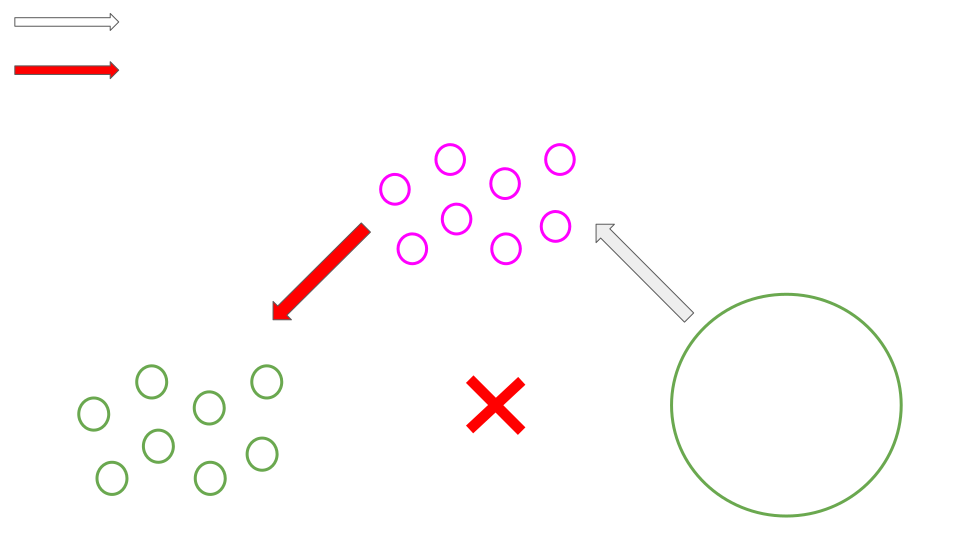
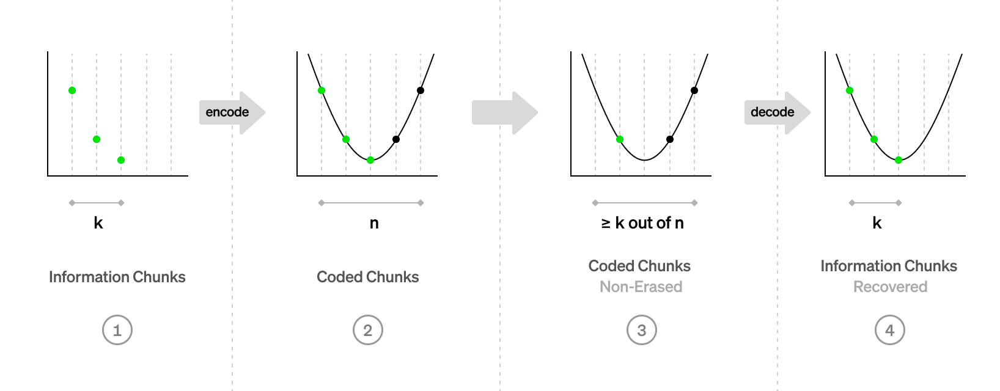

# Data Availability and Sharding

---

### Outline

<pba-flex center>

1. [Data Availability Problem](#data-availability-problem)
1. [Polkadot's Data Availability Solution](#polkadot's-data-availability-solution)
1. [Erasure coding](#erasure-coding)
1. [Further Work](#further-work)
1. [References](#references)

</pba-flex>

---

## Data Availability Problem

How do we ensure a piece of data is retrievable without storing it on every single node forever (on-chain)?

Incorrectness can be proven (merkle proofs), but unavailability can't.

Notes:
- You can't just hold a small number of nodes accountable for making some data available
- Needs an off chain solution! 
    - All other data added to relay chain per day: ~555M
    - 40 PoVs per block for a day: ~72G

---

### Data Availability Problem: Parachains

<!-- .element: class="fragment" data-fragment-index="1" -->

Notes:

Block producers withholding blocks can:
- Prevent nodes and users from learning the parachain state
- Prevent other collators from being able to create blocks

Solution: 
- Validators keep enough info for collators to reconstruct recent parachain blocks

---

### Data Availability Problem: Relay Chain

Notes:
- Malicious backers could distribute invalid PoV to only malicious approval checkers
- Really bad
- It means attackers could consistently finalize invalid parachain blocks with ~40 dishonest approval checkers

---

### Data Availability Problem: Relay Chain

Notes:
- With honest DA layer, selective distribution isn't possible

---

## Polkadot's Data Availability Solution

---

<!-- .slide: data-background-color="#4A2439" -->

# Questions

---

## Erasure coding

The goal:

<pba-flex center>

- Encode data of K chunks into a larger encoded data of N chunks
- Any K-subset of N chunks can be used to recover the data

</pba-flex>

---v

### Even More Polynomials

---v

### Polynomial we need

We want to have a polynomial, such that:

$$ p(x_i) = y_i$$

Notes:

Question: what is x_i and y_i wrt to our data?

---

## Polkadot's Data Availability Protocol

Notes:

The total amount of data stored by all validators is PoV \* 3.
With 5MB PoV and 1k validators, each validator only stores 15KB per PoV.
With this protocol, we've killed two birds with one stone!

---

### Availability Bitfields

Notes:

Each validator actually signs a statement per relay chain block, not per PoV to reduce the number of signatures.
These statements are gossiped off-chain and included in a block in a ParachainsInherent.

---

<!-- .slide: data-background-color="#4A2439" -->

# Questions

---

### Bonus

<pba-flex center>

- Polkadot uses a field of size $2^{16}$ with efficient arithmetic
- Polkadot uses an FFT-based Reed-Solomon algorithm (no Lagrange)

</pba-flex>

> https://github.com/paritytech/reed-solomon-novelpoly

---

## References

1. https://www.youtube.com/watch?v=1pQJkt7-R4Q
1. https://www.paradigm.xyz/2022/08/das