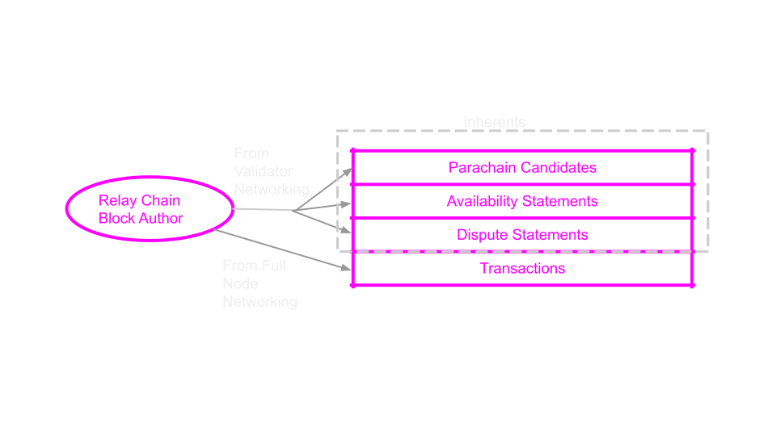
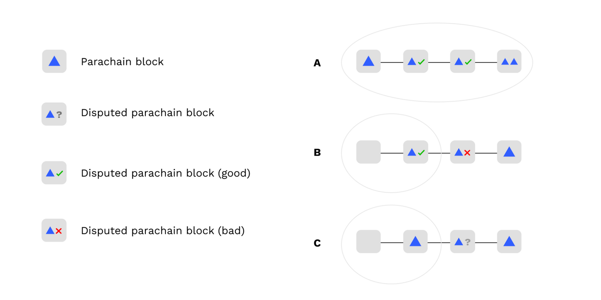

# Execution Sharding in Polkadot

---

## Execution Sharding

> Execution Sharding is the process of distributing blockchain execution responsibilities across a validator set.

---

## Execution Sharding in Polkadot

> In Polkadot, all validators execute every relay chain block, but only a subset execute each parachain block.

This enables Polkadot to scale.

---

## Lesson Agenda

<pba-flex center>

1. Discuss the high-level protocols and principles of Execution Sharding in Polkadot
1. Provide background on how complex on & offchain logic is implemented with Substrate

</pba-flex>

Notes:

[Polkadot v1.0: Sharding and Economic Security](https://polkadot.network/blog/polkadot-v1-0-sharding-and-economic-security/) is a comprehensive writeup of the content here in much more detail.
Please read it after the lesson if you would like to understand how Polkadot works from top to bottom.

---

## Goals of Execution Sharding

<pba-flex center>

1. A minimal amount of validator nodes should check every parachain block while still maintaining security
1. The relay chain will provide ordering and finality for parachain blocks
1. Only valid parachain blocks will become finalized

</pba-flex>

Notes:

Because GRANDPA finality faults require 33% or more stake to be slashed, Goal (3) implies Shared Security

---

## Interaction Between Client & Runtime

Since Polkadot involves not only on-chain logic but off-chain logic, the runtime is the central source of truth about validators, assignments, parachain states, etc.

Clients learn about the state by invoking **Runtime APIs** at recent blocks, and the runtime is updated with **new blocks**.


Notes:

Because the runtime is updated by new blocks, malicious or poorly connected validators have some choice in which information to provide the runtime with.
This must be accounted for in the protocol: we cannot assume that the runtime is always perfectly informed.

---

## Parachains Protocols

<pba-flex center>

1. **Collation**: Making parachain blocks
1. **Backing**: Validator initial checks & sign-off of blocks
1. **Availability**: Distributing data needed for checking
1. **Approval Checking**: Checking blocks
1. **Disputes**: Settling differences

</pba-flex>

---

## Motivation & Game Theory

Polkadot's approach is to have few validators check every parablock in the best case.

First, **backers** introduce new blocks and provide "skin in the game".

Then, randomly assigned **approval checkers** check their work, with an option to raise a dispute that involves all validators.

Rather than having every validator check every block, we just ensure that _detection_ of bad blocks is overwhelmingly likely and punishments are severe.

---

#### Validator Group Assignments and Execution Cores


Notes:

Every Session (4 hours), validators are _partitioned_ into small **groups** which work together.<br/>
Groups are assigned to specific **Execution Core**s, and these assignments change every few blocks.

---

## The relay chain is Forkful

Validators and collators run these protocols on every block of the relay chain.

Often they run an instance of the protocol for every parachain block in every block of the relay chain.


Notes:

In the slides, we will look at single instances of the protocols, but it should be known that the validators are actually doing these steps in parallel with each other and often many times at a time.

---

## Definition: Candidate

> A **Candidate** is a parachain block<br/>which has not yet been finalized in the relay chain.

---

## Definition: HeadData

> **Head Data** is an opaque and compact representation of a parachain's current state.
It can be a hash or a small block header, but must be small.

---

## Definition: Parachain Validation Function (PVF)

From a Validator's perspective, a parachain is a WebAssembly blob which exposes the following (simplified) function:

```rust
type HeadData = Vec<u8>;
struct ValidationResult {
  /// New head data that should be included in the relay chain state.
  pub head_data: HeadData,
  // more fields, like outgoing messages, updated code, etc.
}

fn validate_block(parent: HeadData, relay_parent: RelayChainHash, pov: Vec<u8>)
  -> Result<ValidationResult, ValidationFailed>;
```

---

#### Why might `validate_block` fail?

1. `parent` or `PoV` is malformed - the implementation can't transform it from an opaque to specific representation
1. `parent` and `PoV` decode correctly but don't lead to a valid state transition
1. `PoV` is a valid block but doesn't follow from the `parent`

```rust
fn validate_block(parent: HeadData, relay_parent: RelayChainHash, pov: Vec<u8>)
  -> Result<ValidationResult, ValidationFailed>;
```

---

## Relay Chain Block Contents



---

Any node can be selected as the next Relay Chain block author, so these data must be widely circulated.

---

## Collation

The collator's job is to build something which passes `validate_block`.

In the Collation phase, a collator for a scheduled parachain builds a parachain block and produces a candidate.

The collator sends this to validator group assigned to the parachain over the p2p network.

---

Some collator pseudocode:

```rust
fn simple_collation_loop() {
  while let Some(relay_hash) = wait_for_next_relay_block() {
    let our_core = match find_scheduled_core(our_para_id, relay_hash) {
      None => continue,
      Some(c) => c,
    };

    let parent = choose_best_parent_at(relay_hash);
    let (pov, candidate) = make_collation(relay_hash, parent);
    send_collation_to_core_validators(our_core, pov, candidate);
  }
}
```

---

## Backing

In the backing phase, the validators of the assigned group share the candidates they've received from collators, validate them, and sign statements attesting to their validity.

Validate means roughly this: execute `validate_block` and check the result.

They distribute their candidates and statements via the P2P layer, and then the next relay chain block author bundles candidates and statements into the relay chain block.

---

## Backing: Networking


---

## Backing: Skin in the Game

The main goal of backing is to provide "skin in the game".

Backers are agreeing that if the parablock turns out to be bad, they will lose 100% of their stake.

Backing on its own does not provide security, only accountability.

Notes:

The current minimum validator bond as of Aug 1, 2023 is ~1.7 Million DOT.

---

## Availability

At this point, the backers are responsible for making the data needed to check the parablock available to the entire network.

Validators sign statements about which data they have and post them to the relay chain.

If the parablock doesn't get enough statements fast enough, the relay chain runtime just throws it out.

---

#### Erasure Coding

<div class="grid grid-cols-3">

<div>


</div>

<div class="col-span-2">

Each validator is responsible for one piece of this data.
As long as enough of these pieces stay available, the data is recoverable.

The statements validators sign and distribute to all other validators essentially say "I have my piece".

Once 2/3 or more such statements land on-chain, the candidate is ready to be checked and is **included**.

</div>

</div>

---

Some pseudocode for availability:

```rust
fn get_availability_chunks() {
  while let Some(backed_candidate, backing_group) = next_backed_candidate() {
    let my_chunk = fetch_chunk(
      my_validator_index,
      backed_candidate.hash(),
      backing_group,
    );
    let signed_statement = sign_availability_statement(backed_candidate.hash());
    broadcast_availability_statement(signed_statement);
  }
}
```

---


Notes:

In practice, we allow more than a single block for availability to be timed out.

---

## Parablock Inclusion and Finality


---

## Parablock Inclusion and Finality

> (3) Only valid parachain blocks will become finalized

Notes:

Remember our goal from earlier?

---

## Parablock Inclusion and Finality

To fulfill this goal we need 2 things.

<pba-flex center>

1. A protocol for proving validity of included candidates
1. Consensus rules for the relay chain<br/>to avoid building on or finalizing<br/>relay chain forks containing bad candidates.

</pba-flex>

---

## What is "Checking" a Parablock?

Checking involves three operations:

<pba-flex center>

1. Recovering the data from the network (by fetching chunks)
1. Executing the parablock, checking success
1. Check that outputs match the ones posted<br/>to the relay chain by backers

</pba-flex>

Notes:

Step 3 is of crucial importance.
Without it, backers could create things like messages and runtime upgrades out of thin air, by backing a valid candidate but lying about the outputs of the candidate.

---

## Security Model: Gambler's Ruin

The security argument for Polkadot is based on Gambler’s Ruin.

An attacker who can take billions of attempts to brute-force the process would eventually be successful.

But because of slashing, every failed attempt means enormous amounts of DOT slashed.

---

## Approval Checking

Every validator node is running an approval checking process for every parachain block in every relay chain block.
This process has a few properties:

<pba-flex center>

1. The process on any particular node either outputs "good" or stalls.
1. The output of the process on a node is based on the statements it has seen from other validators or produced itself.
1. If the parachain block is valid (i.e. passes checks) then it will eventually output "good" on honest nodes.
1. If the parachain block is invalid then it will only output "good" on honest nodes with low probability

</pba-flex>

Notes:

Honest nodes output "good" only if there is a very large amount of malicious checkers and they mainly see votes
from those checkers as opposed to honest checkers.

Low probability here means 1 in 1 billion or so (assuming 3f < n)
Not cryptographic low probability, but good enough for crypto-economics.

---

## Approval Checking

Approval checking involves validators generating assignments to check parablocks.

Every validator is assigned to check every parablock, but at different times.

For later-assigned validators, if it's approved by the time it's their turn, they simply do not check.

---

## Approval Checking: Assignments and Approvals

Validator assignments are known only to the validator until revealed.

Validators reveal their assignment before downloading data and checking the parablock.

This ensures that others will notice if they disappear, leading to escalating requirements for checkers.

Notes:

If validators began downloading data before revealing their assignment, an attacker might notice this and attack them without anybody noticing.

---

## Approval Checking: The Hydra


Notes:

Approval Checking is like the hydra.
Every time an attacker chops off one head, two more heads appear.

---

## Disputes

When validators disagree about the validity of a parablock, a dispute is automatically raised.

Disputes involve all validators, which must then check the block and cast a vote.

Backing and Approval statements already submitted are counted as dispute votes.

Votes are transmitted by p2p and also collected on-chain.

---

## Dispute Resolution


Notes:

resolution requires a supermajority in either direction.

---

## Dispute Slashing

The validators on the losing side of the dispute are slashed.

The penalty is large when the candidate is deemed invalid by the supermajority and small when it is deemed valid.

---

## GRANDPA Voting Rules

Instead of voting for the longest chain, validators vote for the longest chain where all unfinalized candidates are a) approved and b) undisputed



---

## BABE Chain Selection Rule

Validators refuse to author relay chain blocks on top of forks containing parablocks which are invalid or have lost disputes.
This causes a "reorganization" whenever a dispute resolves against a candidate.


---

<!-- .slide: data-background-color="#4A2439" -->

> How are complex off-chain systems<br/>implemented using Substrate?

---

## Orchestra

https://github.com/paritytech/orchestra

**Orchestra** allows us to split up the node's logic into many "Subsystems" which run asynchronously.

These subsystems communicate with message passing and all receive signals which coordinate their activities.

---

## Orchestra: Signals

Signals are sent to all subsystems and act as a "heartbeat".

Messages sent after a signal arrives on one subsystem cannot arrive at another subsystem until it has received the same signal.

---

## Orchestra: Signals in Polkadot

```rust
/// Signals sent by the overseer (Polkadot's Orchestra name) to all subsystems.
pub enum OverseerSignal {
	/// Subsystems should adjust their jobs to start
	/// and stop work on appropriate block hashes.
	ActiveLeaves(ActiveLeavesUpdate),
	/// `Subsystem` is informed of a finalized block
	/// by its block hash and number.
	BlockFinalized(Hash, BlockNumber),
	/// Conclude the work of the `Overseer` and all `Subsystem`s.
	Conclude,
}
```

Notes:

The instantiation of Orchestra in Polkadot is called "Overseer".

---

## Without Orchestra:

```rust
fn on_new_block(block_hash: Hash) {
  let work_result = do_some_work(block_hash);
  inform_other_code(work_result);
}
```

Problem: There is a race condition!

The other code may receive `work_result` before learning about the new block.

---

## With Orchestra:

```rust
fn handle_active_leaves_update(update: ActiveLeavesUpdate) {
  if let Some(block_hash) = update.activated() {
    let work_result = do_some_work(block_hash);
    inform_other_subsystem(work_result);
  }
}
```

This works! Orchestra ensures that the message to the other subsystem only arrives
after it has received the same update about new blocks.

---

## Examples of Subsystems in Polkadot

<pba-flex center>

- Dispute Participation
- Candidate Backing
- Availability Distribution
- Approval Checking
- Collator Protocol
- everything!

</pba-flex>

---

## Implementers' Guide

[The Implementers' Guide](https://paritytech.github.io/polkadot/book) contains information about all subsystems, architectural motivations, and protocols used within Polkadot's runtime and node implementation.

---

<!-- .slide: data-background-color="#4A2439" -->

# Questions
