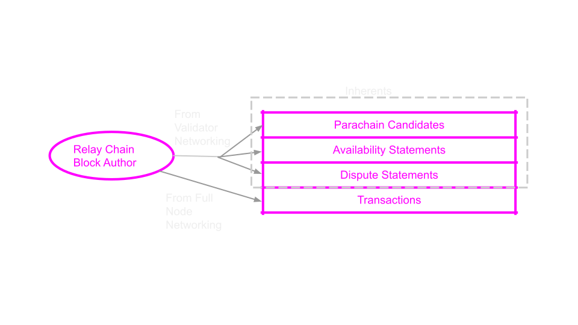
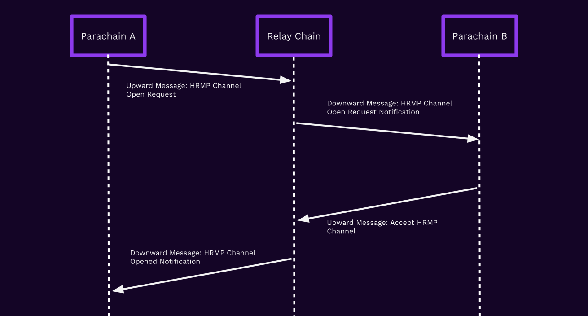

# XCMP: Cross Chain Message Passing

---

## Revisiting Interoperability

---

## Interoperability

> Interoperability is the ability for consensus systems to share data and value.

---

## Superadditive Value

The interoperation of people and systems<br/>creates superadditive economic value.

> The whole is greater than the sum of the parts.

Notes:

https://en.wikipedia.org/wiki/Superadditivity

---


---


---


---


---

## Interoperability & Specialization

Efficient economic systems create niches for specialization.

Different systems can exercise _comparative advantage_<br/>with others and focus on a single service or problem.

---

## XCMP in Practice

---

## XCMP vs XCM

XCMP is the data layer, while XCM is the language.

XCMP only focuses on the transmission of raw bytes between chains.<br/>
In this lesson we will focus only on XCMP.


Notes:

Communication requires a medium and a language to convey semantic meaning.
XCMP is the medium, like sound or writing, rather than the language.

---

## Messaging Kinds


---

## Using Messaging in Practice

This lesson is meant to communicate the underlying protocols and mechanics by which messages are sent and received.

In practice, these mechanisms are abstracted by the libraries you work with.

---

## Revisiting PVFs and Outputs


```rust
fn validate_block(ValidationParams) -> Result<ValidationResult, ValidationFailed>;
```

---

## Validation Inputs

```rust
/// Parameters provided to a PVF for validation
pub struct ValidationParams {
	/// The parent parachain block's Head Data
	pub parent_head: HeadData,
	/// The Proof-of-Validity.
	pub pov: PoV,
	/// The current relay-chain block number.
	pub relay_parent_number: RelayChainBlockNumber,
	/// The relay-chain block's storage root.
	pub relay_parent_storage_root: Hash,
}
```

Here, note that the `relay_parent_storage_root` allows us to handle **Merkle Proofs** of the Relay Chain state within the parachain.

---

## Validation Outputs

```rust
/// Outputs of _successful_ validation of a parachain block.
pub struct ValidationResult {
	/// The head-data produced as a result of execution.
  pub head_data: HeadData,
	/// Upward messages sent by the Parachain.
	pub upward_messages: Vec<UpwardMessage>,
	/// Outbound horizontal messages sent by the parachain.
	pub horizontal_messages: Vec<OutboundHrmpMessage>,
	/// Number of downward messages that were processed by the Parachain.
	///
	/// It is expected that the Parachain processes them from first to last.
	pub processed_downward_messages: u32,
	/// The mark which specifies the block number up to which all inbound HRMP messages are processed.
	pub hrmp_watermark: RelayChainBlockNumber,

	// ... more fields
}
```

---

The `ValidationResult` is the output of successful PVF execution.

Validators are responsible for checking that the outputs are correct.

---

## Unpacking Candidates

---

Candidates are posted to the relay chain in their entirety - everything except for the PoV.

---

What goes into a candidate?

1. Descriptor: defines inputs to the validation function
1. Commitments: expected outputs from the validation function

---

```rust
pub struct CandidateDescriptor {
  /// Relay chain block hash
  pub relay_parent: RelayChainBlockHash,
  /// The hash of the PoV
  pub pov_hash: Hash,
  /// Parent head data hash.
  pub parent_hash: Hash,
  /// The unique ID of the parachain.
  pub para_id: ParaId,

  // .. a few more fields
}
```

---

```rust
pub struct CandidateCommitments {
	/// Messages destined to be interpreted by the Relay chain itself.
	pub upward_messages: UpwardMessages,
	/// Horizontal messages sent by the parachain.
	pub horizontal_messages: HorizontalMessages,
	/// The head-data produced as a result of execution.
	pub head_data: HeadData,
	/// The number of messages processed from the DMQ.
	pub processed_downward_messages: u32,
	/// The mark which specifies the block number up to which all inbound HRMP messages are processed.
	pub hrmp_watermark: RelayChainBlockNumber,
}
```

---

Notice the similarities to `ValidationOutputs`?

---



---

(Polkadot runtime, simplified)

```rust
// Relay chain drains, parachain posts
UpwardMessages: StorageMap<ParaId, Deque<Message>>;

// Relay chain posts, parachain drains
DownwardMessages: StorageMap<ParaId, Deque<Message>>;

// (sender, receiver)
// Sender posts, receiver drains
HrmpChannels: StorageMap<(ParaId, ParaId), Deque<Message>>;

```

---

(in Polkadot runtime, inclusion pallet)

```rust
fn process_backed_candidate(CandidateDescriptor, CandidateCommitments) {
  let para_id = descriptor.para_id;

  assert!(is_scheduled_on_empty_core(para_id));
  assert!(descriptor.parent_hash == current_parachain_head);
  assert!(is_in_this_chain_recently(descriptor.relay_parent));

  // fails if too many
  assert!(check_upward(para_id, commitments.upward_messages).is_ok());

  // fails if too many or sending to a chain without a channel open.
  assert!(check_hrmp_out(para_id, commitments.hrmp_messages).is_ok());

  // fails if attempting to process more messages than exist.
  assert!(check_downward(para_id, commitments.processed_downward_messages).is_ok());

  // fails if the watermark is lower than the previous one.
  // updates all channels where this is a _receiver_.
  assert!(check_hrmp_in(para_id, commitments.hrmp_watermark).is_ok());
}
```

---

Candidates can't be _backed_ unless they pass all these checks.

The relay chain block author is responsible for selecting candidates which pass these checks.

---

Messages are not added to queues until the candidate is included (available).

This allows messages to be passed and acted upon before finality.

---

If the candidate turns out to be bad, the whole relay chain is forked to a point before messages were queued or acted upon.

---

## Parachain Host Configuration

```rust
pub struct HostConfiguration {
  // ... many many fields
}

// In Polkadot runtime storage:
CurrentConfiguration: StorageValue<HostConfiguration>;
```

These variables are updated by governance.

---

Challenge: Read the `activeConfig()` of the `configuration` pallet in Polkadot-JS Apps.

---

The host configuration specifies things like:

- How many messages can be in the upward, downward, or HRMP queues for a parachain
- How many bytes can be in the upward, downward, or HRMP queues for a parachain
- How large a single message can be in the upward, downward, or HRMP queues.

---

<!-- .slide: data-background-color="#000" -->

## What are messages?

---

Messages are just `Vec<u8>` byte strings.

---

The Relay Chain interprets messages as XCM.

The main takeaway for now is that it allows parachains to execute `Call`s on the Relay Chain.

---

```rust
// Act as a regular account with a deterministic ID based
// on the Para ID.
Origin::Signed(AccountId),
// Act as the parachain itself, for calls which may be made by parachains.
// Custom origin type added to the Relay Chain.
Origin::Parachain(ParaId),
```

Notes:

When parachains execute `Call`s on the Relay Chain, they have access to two origin kinds.

Note that this is only the case for the Relay Chain and parachains messages may be interpreted differently on other chains.

---

Parachains are free to interpret their incoming downward or HRMP messages however they like.

---

<!-- .slide: data-background-color="#000" -->

## Respecting Limits

---

Problem: Parachain candidates can't be backed unless they respect the constraints on sending & receiving messages

---

Solution: Parachain runtimes can _read relay chain state_ to find out these limits. They include these proofs in the PoV.

---

```rust
/// Parameters provided to a PVF for validation
pub struct ValidationParams {
	/// The relay-chain block's storage root.
	pub relay_parent_storage_root: Hash,
	pub pov: PoV,

	// ...
}

fn validate_block(ValidationParams) -> Result<ValidationResult, ValidationFailed> {
  // simplified
  let storage_proof = extract_storage_proof(pov);
  let current_messaging_proof = check_storage_proof(
    relay_parent_storage_proof,
    storage_proof,
  )?;

  // use this to ensure that `ValidationResult` respects limits.
}
```

---

## UMP Configuration

```rust
pub struct HostConfiguration {
	/// Total number of individual messages allowed in the
	/// parachain -> relay-chain message queue.
	pub max_upward_queue_count: u32,
	/// Total size of messages allowed in the
	/// parachain -> relay-chain message queue.
	pub max_upward_queue_size: u32,
	/// The maximum size of an upward message that can be sent by a candidate.
	///
	/// This parameter affects the size upper bound of the `CandidateCommitments`.
	pub max_upward_message_size: u32,
	/// The maximum number of messages that a candidate can contain.
	///
	/// This parameter affects the size upper bound of the `CandidateCommitments`.
	pub max_upward_message_num_per_candidate: u32,
	// ... more fields
}
```

---

## Validation Outputs for UMP

```rust
/// Outputs of _successful_ validation of a parachain block.
pub struct ValidationResult {
	/// Upward messages sent by the Parachain.
	pub upward_messages: Vec<UpwardMessage>,
	// ... more fields
}
```

---

## Message Queue Chains (MQC)

Let's take a small detour into a data structure used in DMP and XCMP.

**Problem**: Parachains should be able to cheaply determine the state of the entire message queue.

**Problem**: Relay Chain state proofs are expensive and should be minimized.

Solution: Message Queue Chains (MQC)

---

## MQC Architecture


---

## Benefits of MQCs

<pba-flex center>

1. Parachains only need to learn the most recent MQC Head to implicitly learn about all messages before it
1. MQC entries are small (~70 bytes)
1. MQCs can be backfilled and then processed forward with no further relay chain interaction

</pba-flex>

---

## Downward Message Passing (DMP)

DMP at a high level is Relay Chain to Parachain messaging.

The Relay Chain manages a queue of messages to each parachain, which are processed as the parachain produces blocks.

---

## DMP Pallet

The Relay Chain Runtime has a DMP pallet which manages

```rust
	/// The downward messages addressed for a certain para.
	#[pallet::storage]
	pub(crate) type DownwardMessageQueues<T: Config> = StorageMap<
		_,
		Twox64Concat,
		ParaId,
		Vec<InboundDownwardMessage<BlockNumberFor<T>>>,
		ValueQuery,
	>;

	/// A mapping that stores the downward message queue MQC head for each para.
	#[pallet::storage]
	pub(crate) type DownwardMessageQueueHeads<T: Config> =
		StorageMap<_, Twox64Concat, ParaId, Hash, ValueQuery>;
```

---

## DMP Configuration

```rust
pub struct HostConfiguration {
	/// The maximum size of a message that can be put in a downward message queue.
	pub max_downward_message_size: u32,
}
```

---

## Validation Outputs for DMP

```rust
/// Outputs of _successful_ validation of a parachain block.
pub struct ValidationResult {
	/// Number of downward messages that were processed by the Parachain.
	///
	/// It is expected that the Parachain processes them from first to last.
	pub processed_downward_messages: u32,
	// ... more fields
}
```

Notes:

Parachains can "process" messages simply by ignoring them.
The Relay Chain doesn't care what parachains do with the messages.
They can just be thrown out.

---

## XCMP-Lite / HRMP: Horizontal Message Passing

XCMP is the family of protocols by which parachains can transmit messages to each other.

In the planned Full XCMP, only the hashes of messages are posted to the Relay Chain.
In XCMP-Lite, the full messages are posted to the Relay Chain.

---

## Validation Outputs for XCMP-Lite

```rust
/// Outputs of _successful_ validation of a parachain block.
pub struct ValidationResult {
	/// Outbound horizontal messages sent by the parachain.
	pub horizontal_messages: Vec<OutboundHrmpMessage>,
	/// The mark which specifies the block number up
	/// to which all inbound HRMP messages are processed.
	pub hrmp_watermark: RelayChainBlockNumber,

	// ... more fields
}

pub struct OutboundHrmpMessage {
	/// The para that will get this message in its downward message queue.
	pub recipient: ParaId,
	/// The message payload.
	pub data: sp_std::vec::Vec<u8>,
}

```

---

<!-- .slide: data-background-color="#000" -->

## Opening Channels

---

Downward and Upward channels are implicitly available.

XCMP Channels must be explicitly opened.

---

XCMP Channels are one-way, and for two-way communication two channels must be opened.

---

The protocol for opening a channel is as follows:

<pba-flex center>

1. Chain A sends an upward message requesting a channel to Chain B
1. Chain B receives a downward message notifying of the channel request
1. Chain B sends an upward message accepting or rejecting the channel
1. The channel is either opened or rejected in the Relay Chain as a result

</pba-flex>

---

There are no fees for XCMP messages, but every channel comes with a `max_capacity` and `max_message_size`.

Each channel comes with a corresponding _deposit_ of DOT tokens to pay for the relay chain state utilization.

This deposit is returned when the channel is closed.

---

## XCMP-Lite / HRMP Channel Open Protocol



---

## HRMP Pallet: MQCs

Every open channel causes the HRMP pallet in the Relay Chain Runtime to manage an MQC for messages from the sender to the receiver.

Note that channels are one-way. Each channel comes with storage requirements, so a deposit is required from each side to collateralize the storage.

---

## XCMP Configuration by Governance

```rust
pub struct HostConfiguration {
	pub hrmp_max_parachain_outbound_channels: u32,

	pub hrmp_sender_deposit: Balance,
	pub hrmp_recipient_deposit: Balance,

	pub hrmp_channel_max_capacity: u32,
	pub hrmp_channel_max_total_size: u32,

	pub hrmp_max_parachain_inbound_channels: u32,
	pub hrmp_channel_max_message_size: u32,

  // more fields...
}
```

---

## The `hrmp_watermark` field

Parachains include an `hrmp_watermark` in their `ValidationResult` indicating a relay-chain block number.

This tells the relay chain state that the parachain has processed all messages from all inbound channels with `sent_at <= hrmp_watermark`.

---

<!-- .slide: data-background-color="#4A2439" -->

# Questions
