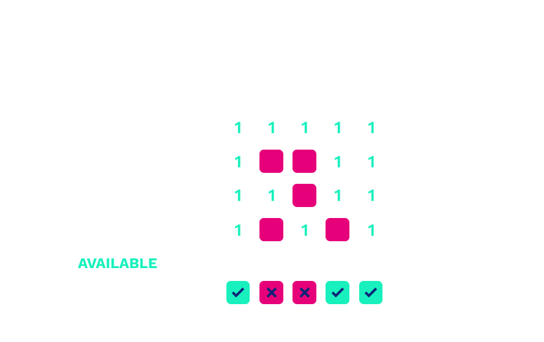
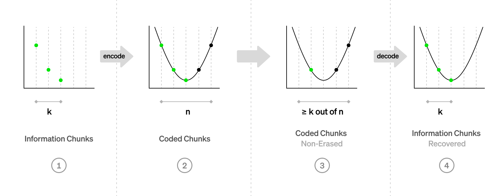
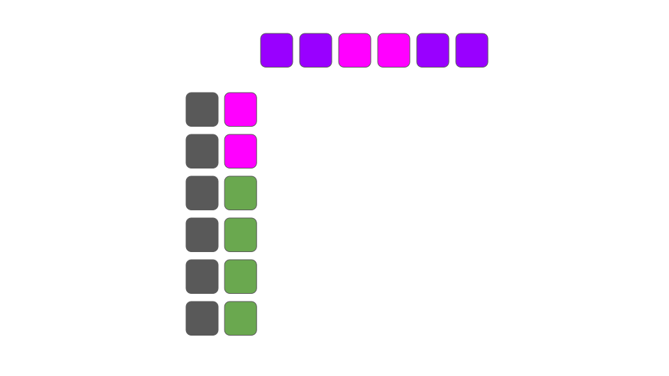
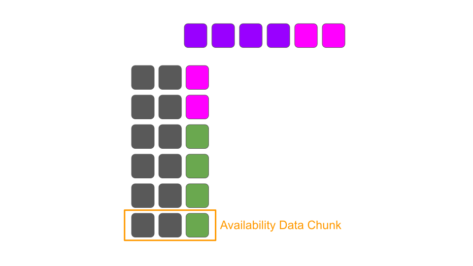

# Data Availability and Sharding

---

### Outline

<pba-flex center>

1. [Data Availability Problem](#what-data-needs-availability)
1. [Polkadot's Data Availability Solution](#polkadots-data-availability-solution)
1. [Erasure coding](#erasure-coding-revisited)
1. [Ongoing Work](#ongoing-work)
1. [References](#references)

</pba-flex>

---

## What Data Needs Offchain Availability?

<pba-flex center>

Sharded Permanent Record? ❌ **Parachains!**

Condensed Permanent Record? ❌ **Relay Chain!**

<!-- .element: class="fragment" data-fragment-index="1" -->

Comprehensive 24 Hour Record? ✅ **Polkadot DA!**

<!-- .element: class="fragment" data-fragment-index="2" -->

</pba-flex>

Notes:

- Most permanent data live solely on parachains
- Condensed data, hashes and commitments, stored on relay chain
- Polkadot DA secures proofs of validity. PoV's contain information critical to the secure progression of parachains. These are dropped from validators when old.
- Way too large for on-chain storage!
  - All other data added to relay chain per day: ~555M
  - 40 PoVs per block for a day: ~72G

---

## Data Availability Problem

How do we ensure a piece of data is retrievable without storing it on every single node forever (on-chain)?

Incorrectness can be proven (merkle proofs), but unavailability can't.

Notes:

- You can't just hold a small number of nodes accountable for making some data available

---

### Vulnerabilities With No DA: Malicious Collator

<div class="r-stack">


<!-- .element: class="fragment" data-fragment-index="1" -->
</div>

Notes:

Block producers withholding blocks can:

- Prevent nodes and users from learning the parachain state
- Prevent other collators from being able to create blocks

Solution:

- Validators keep enough info for collators to reconstruct recent parachain blocks

---

### Vulnerabilities With No DA: Malicious Backers


Notes:

- Malicious backers could distribute invalid PoV selectively to malicious approval checkers or not at all
- Really bad
- It means attackers could consistently finalize invalid parachain blocks with just a hand full of dishonest approval checkers

---

### Vulnerabilities With No DA: Malicious Backers


Notes:

- With honest DA layer, selective distribution isn't possible

---

## Polkadot's Data Availability Solution

---

### Design Considerations

<pba-flex center>

1. Avoid storing full PoV in each validator
1. Avoid fragility, where misbehavior can compromise PoV retrieval
<!-- .element: class="fragment" data-fragment-index="1" -->
1. Need cryptographic scheme to prove availability before approvals start
<!-- .element: class="fragment" data-fragment-index="2" -->
1. Need a way to verify retrieved PoV integrity
<!-- .element: class="fragment" data-fragment-index="3" -->

</pba-flex>

Notes:

- Passing full PoV copies to a large fraction of validators would work, but we can do much better!
- Misbehavior up to 1/3 should be accomodated to match threat model

---

### Laying the Foundation: Execution Cores

<pba-cols>
<pba-col center>

- Minimal unit of Polkadot execution scheduling
- Cores abstract over several processing and storage resources
<!-- .element: class="fragment" data-fragment-index="1" -->
- At most 1 candidate pending availability per relay block, per core
<!-- .element: class="fragment" data-fragment-index="2" -->
- Considered "occupied" while a candidate paired with that core is pending availability
<!-- .element: class="fragment" data-fragment-index="3" -->
- It saves resources to bundle signals about availability for all cores together
<!-- .element: class="fragment" data-fragment-index="4" -->

</pba-col>
<pba-col center>


</pba-col>
</pba-cols>

Notes:

- Cores abstract over
  - Backing processing
  - DA processing
  - DA storage
  - On-Chain Inclusion

---

### Laying the Foundation: Erasure Coding

The goal: Avoid storing full PoV in each validator

<pba-flex center>

- Encode data of K chunks into a larger code word of N chunks
<!-- .element: class="fragment" data-fragment-index="1" -->
- Any K-subset of N chunks can be used to recover the data
<!-- .element: class="fragment" data-fragment-index="2" -->

</pba-flex>


Notes:

- Erasure coding allows storing only 3x PoV size vs 334x for 1000 validators

---

### In code

```rust
type Data = Vec<u8>;

pub struct Chunk {
	pub index: usize,
	pub bytes: Vec<u8>,
}

pub fn encode(_input: &Data) -> Vec<Chunk> {
	todo!()
}

pub fn reconstruct(_chunks: impl Iterator<Item = Chunk>) -> Result<Data, Error> {
	todo!()
}
```

Notes:

- Opaque data and chunks
- encode: data -> chunks
- reconstruct: chunks -> data

---

### Polkadot Data Availability Overview

<pba-flex center>

- Each PoV is divided into $N_{validator}$ chunks
- Validator with index i gets a chunk with the same index
<!-- .element: class="fragment" data-fragment-index="1" -->
- Validators sign statements when they receive their chunk
<!-- .element: class="fragment" data-fragment-index="2" -->
- Once we have $\frac{2}{3} + 1$ of signed statements,<br/>PoV is considered available
<!-- .element: class="fragment" data-fragment-index="3" -->
- Any subset of $\frac{1}{3} + 1$ of chunks can recover the data
<!-- .element: class="fragment" data-fragment-index="4" -->
- When PoV is later retrieved by approvers,<br/>chunk validity is verified using a merkle proof
<!-- .element: class="fragment" data-fragment-index="5" -->

</pba-flex>

Notes:

- PoV is K chunks from erasure coding slide
- We store 3 K chunks, 3x PoV size among validators
- We need 1/3 + 1 of those chunks to reassemble PoV

---

### Availability Distribution


Notes:

- Validator i sees backing statements on chain and requests chunk i for each PoV from its associated backer
- Backers respond with chunks, or availability times out

---

### Availability Statement Format: Bitfields

One structure to sign them all!


Notes:

- Number of bits equivalent to the number of `AvailabilityCore`s
- Bit `i` represents one validator's report as to whether it has its chunk of the PoV occupying core `i`
- Condenses a validator's perspective into a minimal structure to be signed and gossiped
- Submitted on-chain by block producers

---

### Availability On-Chain


Notes:

- These statements are gossiped off-chain and included in a block in a ParachainsInherent.
- Why do we need bitfields on-chain?

---

### Availability Thresholds Visualized



Notes:

- Validator Y is producing a block
- Statements from validators a, f, g, and b determine availability for blocks occupying 5 cores
- Candidates 0, 3, and 4 are marked as included. Approvals start. Cores are freed to repeat process.

What is wrong with this diagram?

---

### PoV Chunk Validation

What happens if there's a bad chunk in the reconstructed PoV?

Solution: Merkle proofs!

<!-- .element: class="fragment" data-fragment-index="1" -->

<pba-flex center>

- PoV chunks form branches of a merkle tree
<!-- .element: class="fragment" data-fragment-index="2" -->
- Proof distributed with each chunk
<!-- .element: class="fragment" data-fragment-index="3" -->
- Chunks checked against erasure_root from CandidateReceipt
<!-- .element: class="fragment" data-fragment-index="4" -->

</pba-flex>

Notes:

- Corrupted PoV -> PVF failure not attributable to backers
- Can lead to punishment of innocent parties in disputes

---

## Erasure Coding Revisited

<pba-flex center>

- Encode data of K chunks into a larger code word of N chunks
- Any K-subset of N chunks can be used to recover the data
<!-- .element: class="fragment" data-fragment-index="1" -->

</pba-flex>


<br>

EX: Lagrange Interpolation

<!-- .element: class="fragment" data-fragment-index="2" -->

Notes:

- Polkadot uses: Fast fourier transform (FFT) based Reed-Solomon algorithm (https://github.com/paritytech/reed-solomon-novelpoly)
- Better visually intuitive example: Lagrange interpolation

---

### Lagrange Interpolating Polynomial

For any number $n$ of points $(x_i,y_i)$ there exists only one polynomial of degree $n-1$ such that $p(x_i) = y_i$ for all $i$


Notes:

- We can mathematically derive the interpolating polynomial for any set of points.

Question: What are x_i and y_i wrt to our data?

---

### Interpolation for Data Recovery



Notes:

- We want that polynomial of degree n-1
- We can obtain it using any n

---

### Summary: Reed-Solomon with Lagrange interpolation

1. Divide the data into chunks of size $P$ bits.
1. Interpret the chunks as (big) numbers $\mod P$.
1. Index of each chunk is $x_i$ and the chunk itself is $y_i$.
1. Construct the interpolating polynomial $p(x)$ and evaluate it at additional $n - k$ points.
1. The encoding is $(y_0, ..., y_{k-1}, p(k), ... p(n - 1))$ along with indices.

Notes:

How do we do reconstruction?

---

### Final Twist, Multiple Code Words


Notes:

- Previously described Reed Solomon as if we are encoding the PoV into a single code word
- Size limitations per code word -> many code words
- Each code word encodes a small subset of the original data

---

### Final Twist, Multiple Code Words



Notes:

- Previously described Reed Solomon as if we are encoding the PoV into a single code word
- Size limitations per code word -> many code words
- Each code word encodes a small subset of the original data

---

### Final Twist, Multiple Code Words



Notes:

- Chunk i is actually composed of smaller chunks i for each code word in a PoV
- If we can reassemble the data from any one code word, then we can reassemble all of them

---

### Ongoing Work

Reed Solomon is costly, taking 14-20% of validator CPU time.

**Obvious target for optimization!**

<!-- .element: class="fragment" data-fragment-index="1" -->

<pba-flex center>

- Systemic chunks recovery
  <!-- .element: class="fragment" data-fragment-index="2" -->
      - Removes need for decoding
  <!-- .element: class="fragment" data-fragment-index="2" -->
      - Instead, re-encode to check chunk validity
  <!-- .element: class="fragment" data-fragment-index="2" -->
      - ~50% CPU time improvement
  <!-- .element: class="fragment" data-fragment-index="2" -->
- Compiler elision of array bounds checks + inlining
  <!-- .element: class="fragment" data-fragment-index="3" -->
      - ~33-50% CPU time improvement depending on unsafe Rust use
  <!-- .element: class="fragment" data-fragment-index="3" -->
- Better implemented Reed Solomon library (potential 10x improvement!)
<!-- .element: class="fragment" data-fragment-index="4" -->

</pba-flex>

Notes:
Systemic chunks recovery RFC: https://github.com/alindima/RFCs/blob/av-chunk-indices/text/0047-assignment-of-availability-chunks.md

Better implemented Reed Solomon: https://github.com/paritytech/reed-solomon-novelpoly/issues/40

---

<!-- .slide: data-background-color="#4A2439" -->

# Questions

---

## References

1. https://www.youtube.com/watch?v=1pQJkt7-R4Q
1. https://github.com/alindima/RFCs/blob/av-chunk-indices/text/0047-assignment-of-availability-chunks.md
