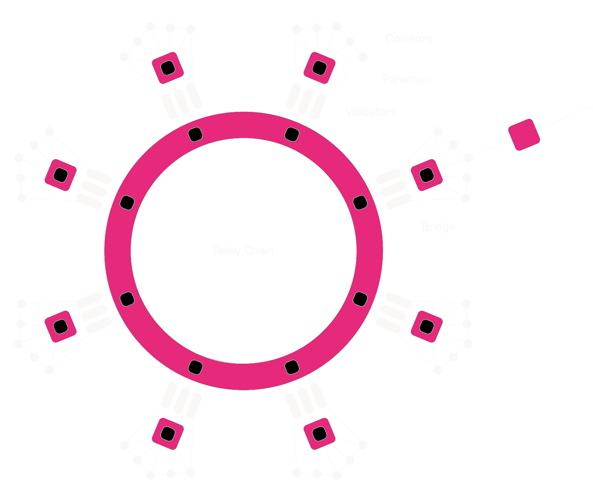
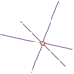
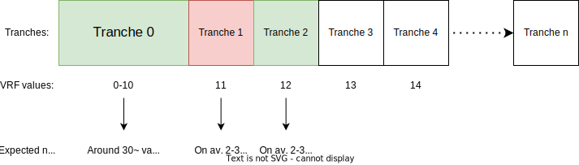

# Execution Sharding in Polkadot

Notes:
Introduction

---

## Execution Sharding in Polkadot


Notes:
First let's outline why we even need to go through all of that trouble. IN short sharding is our answer to scalability. And I could say that in general sharding is **solving** scalability. But in truth as many have heard...

---

## Execution Sharding in Polkadot

<pba-cols>
    <pba-col>
        
    </pba-col>
    <pba-col>
        <blockquote>
            <p>“There are no solutions. There are only trade-offs.”</p>
        </blockquote>
        <footer>― Thomas Sowell</footer>
    </pba-col>
</pba-cols>

Notes:
There are no solutions. There are only trade-offs. And this is no exception to it so we'll look into how sharding gets us closer to better scalability and what are the trade-offs that we have to make to get there. But first let's look at the problem itself.

---

## Scalability of Blockchains

**Why is there even an issue?**

Notes:
We all heard that blockchains supposedly don't scale. In short what causes blockchains to scale poorly? Anyone wants to give a very short answer?

-Question time-

---

## Scalability of Blockchains

**Why is there even an issue?**

Everyone checking everything is sacrificing scalability for security (and simplicity).

Notes:
Everyone checking everything is sacrificing scalability for security (and simplicity).
Everyone checking everything was a nice solution at first for things like BTC because it was the simplest option to guarantee safety. But unfortunately it introduces so much unnecessary work that it stops us for scaling.

---

## Company analogy

- Start-up with 3 employees
- All make hand-crafted bags
- At the end of the day they all share their bags between each other to check for defects

Notes:
Imagine a start-up company with 3 employees. They all make hand-crafted bags and at the end of the day they all share their bags between each other to check for defects. This is a simple approach and ensures that even if one employee was being lazy in the end we'll get a good product because the mistakes will be caught. That was BTC when it was a small network.

---

## Company analogy

- Company grows to **100** employees
- All make hand-crafted bags
- At the end of the day they all share their bags between each other to check for defects... **but there are too many bags!**

Notes:
But what if this company grows? What if we have 100 employees? Issues is there is too many bags to have everyone check everything.
Okay that's it! We close the company! Bag making clearly cannot be scaled. NO. We change our ways. We introduce new levels, abstractions, and responsibilities.

---

## Company analogy

- Company grows to **100** employees
- **Most** make hand-crafted bags
- **Some check for defects**

Notes:
Maybe people working in this company really dislike checking for defects and would rather make bags. So bag makers simply take turns checking for defects. If a bag checker spots a defect they can escalate the issue and the bag maker will be held accountable. And here we encountered the first absolutely core principle of sharding - **Issue Escalation**.

---

## Company analogy

- Company grows to 100 employees
- Most make hand-crafted bags
- Some check for defects
- **ESCALATE in case of defects**

Notes:
It's the "Hey, everyone check this out!" in the start-up setting. That's the whisteblowing of corporations, ticket sending of IT, and the "I want to speak to your manager" of Karens. If there is an issue we only need someone, anyone to raise it and then we can escalate and investigate in full force. Now how does that relate to Polkadot?

---

## Escalation in Polkadot

> In Polkadot not all validators checks everything, but enough of them check so that if there is a problem it will be escalated. Escalation causes everyone to check and always means consequences.

Notes:
Because if you imagine a whisteblower, you only need one such brave person in the most corrupt company to completely ruin their scheme. It's the same in Polkadot because we leverage this property to the fullest. As long as we get at least **one**, a single one validator doing the checks we can escalate them and ruin the day of the attackers, despite only a fraction of the network doing the checks.

---

## Properties of Escalation

Escalation is the happy path optimization. If there is no issue only very few checkers will participate in the process.

Notes:
Escalation is the happy path optimization. If there is no issue only very few checkers will participate in the process.
This solution is only effective because in reality most of the blocks produced are indeed valid and honest. So the happy path optimization brings insane gains and allows for shared workload.

It's worth pointing that optimistic rollups are also a happy path optimization, but our approach is just... less optimistic which gives us the perfect balance between security and scalability. And a bit of a spoiler but also reduces our time to finality to manageable numbers.

---

## Properties of Escalation

If there are issues, due to the escalation, everyone will check everything. We temporarily break sharding (slow down) to ensure security.

Notes:
If there are issues, due to the escalation, everyone will check everything. We temporarily break sharding (slow down) to ensure security.
If everyone has to check bags for defects they have no time to produce that many bags BUT when the quality of bags it the most important thing in the world for us that's a good trade. And in blockchain security is the most important thing in the world for us. So we are willing to temporarily slow down to maintain absolute security.

---

# Parachains Protocols

Notes:
Now that we have the core principle of sharding let's look at how it manifests in Polkadot and all the protocol components that make it work.

---

## Parachains Protocols

<pba-flex center>

1. **Collation**: Collect transactions.
1. **Backing**: Assign responsibility.
1. **Availability**: Distribute data.
1. **Approval Checking**: Verify correctness.
1. **Disputes**: Resolve escalations.

</pba-flex>

Notes:
Parachains Protocol which gives us execution sharding is a combination of 5 protocols. Collation, Backing, Availability, Approval Checking, and Disputes. Let's look at each of them in detail.

[Polkadot v1.0: Sharding and Economic Security](https://polkadot.network/blog/polkadot-v1-0-sharding-and-economic-security/) is a comprehensive writeup of the content here in much more detail. Please read it after the lesson if you would like to understand how Polkadot works from top to bottom.

---

## Parachains Protocols

Validators are constantly running many instances of these protocols, for candidates at different stages in their lifecycle.

Notes:
One important note about this whole system is that it runs asynchronously in multiple threads on the same validator. A validator can receive collations for one parachain, while managing availability chunks for a different parablock, while approval checking a totally different parablock. All of that happens at the same time in various subsystems.

---

## Parachains Protocols

<pba-flex center>

1. **Collation: Collect transactions.**
1. Backing: Assign responsibility.
1. Availability: Distribute data.
1. Approval Checking: Verify correctness.
1. Disputes: Resolve escalations.

</pba-flex>

Notes:
Okay so let's look at the first thing. We're starting from bottom up. Collation.

---

# 0. Assignment

Notes:
Or so you thought. There's actually a bit of a hidden step before collation that is not on the path of each parablock but it sets the stage for the other steps. And that's something I call assignment. To achieve that we'll be working with the set of...

---

## 0. Assignment - Active Validators


**Active validators** are given to the parachain protocol by the NPoS election subsystem.

Notes:
**Active validators**. They are given to the parachain protocol by the NPoS election subsystem. Currently there are 300 validators in the active set in Polkadot and a new active set get's elected every era which is 24h in Polkadot. For those 24h those validators are the core players of the Polkadot game. Others are temporarily sitting on the bench.

---

## 0. Assignment - Backing Groups


Validators are divided into small **Backing Groups**.

Notes:
Every Session (4 hours in Polkadot), the parachains consensus takes in those active validators and _partitions_ them into small **groups** which work together. Those groups are currently around 5 validators each in Polkadot and Kusama. Those groups are called backing groups.

Backing groups are mapping 1 to 1 to specific **Execution Core**s, and these assignments are rotated around every few blocks. Currently a parachain is connected to a specific execution core, think of it as a core that executes parachain blocks.

---

## 0. Assignment - Execution Cores



Each backing group is assigned to an **Execution Core**.

Notes:
In that map the white ovals are the validators. They are grouped into backing groups of size and each group is assigned to a specific execution core - that's the symbolic black square on the purple relay chain ring. Each execution core is capable of serving a single parachain or to be more precise a single parachain block.

---

## 0. Assignment - Rotations


Once every few blocks the backing groups **rotate**.

Notes:
Once every few blocks the backing groups **rotate** around and they change the execution core they are serving. This makes it so even if a backing group is full of malicious they cannot wholly block a specific execution core for too long.

---

# 1. Collation

Notes:
Now we can move to the first official step of the parachains protocol. Collation

---

## 1. Collation - Collator Nodes


Collators are **not** validators. They are parachain-specific nodes which produce parachain blocks by collecting (collating) transactions together.

Notes:
Collators build parachain blocks and in this image they are the white circles around the outer edge. They are directly linked to specific parachains which are the lone pink squares. Those collators bundle transactions coming from the network and form them into parachain blocks. Those parachain blocks transition the state of the parachain.

---

## 1. Collation - Collations


Notes:
A a bit simpler way to represent it is like this. Here we have 3 parachains scheduled on 3 cores. Collators from each parachain provide a bundle of transactions. They also attack something called a PoV - Proof of Validity which will be crucial to ensure to validate those transactions later on.

---

## 1. Collation - Networking

Collators once they build the parablock need to check who are the validators that are currently assigned to their execution core and send the collations to them over the p2p network.

Notes:
Collators once they build the parablock (often referred to as candidate parablocks or just candidates) need to check who are the validators that are currently assigned to their execution core and send the collations to them.

---

# 2. Backing

Notes:
Now we are at the next step. We just sent some collations to the validators in our backing group. What happens next?

---

## 2. Backing - Backers


Validators in the backing group are often called backers for those parablocks that are coming in to them from the collators.

Notes:
Validators in the backing group are often called backers for those parablocks that are coming in to them from the collators. That is the group we created in the assignment step. The few validators or backers (3 on the image) receive a bunch of parachain blocks / parablocks / collations / candidates (all the same thing).

---

## 2. Backing - Backers


Notes:
We can zoom in on a specific backing group. Here we cna see that backers are first point of contact to the outside world. They are the like club bouncers for the relay chain.

---

## 2. Backing - Checks

The backers receiving collations need to perform some initial checks to ensure their validity.

Notes:
But for them to do their job correctly backers after receiving collations need to perform some initial checks to ensure their validity. They simply cannot trust random data blobs coming from the external nodes. And to perform those checks we need to learn a bit about the PVF.

---

## 2. Backing - PVF definition


> **Parachain Validation Function** (PVF) is a function which takes in the current parachain state (PoV), the promised parachain state, and the parachain state transition arguments. It re-executes the parachain logic/runtime/STF using the arguments on the current state and checks if it matches the promised state. If it does, the parachain block is valid.

Notes:
Read definition.
PVF reruns the STF in a sandbox environment to test its outputs.

---

## 2. Backing - PVF reminder


Notes:
Just as a reminder this is nothing new. It is the same mechanism covered in the shared security lecture. The wasm blobs are our STFs and to check we rerun the transition and match the state.

---

## 2. Backing - PVF code

From a Validator's perspective, a parachain is a WebAssembly blob which exposes the following (simplified) function:

```rust
type HeadData = Vec<u8>;
struct ValidationResult {
  /// New head data that should be included in the relay chain state.
  pub head_data: HeadData,
  // more fields, like outgoing messages, updated code, etc.
}

fn validate_block(parent: HeadData, relay_parent: RelayChainHash, pov: Vec<u8>)
  -> Result<ValidationResult, ValidationFailed>;
```

Notes:
That's a slightly simplified code example of how it might look. The validator has access to the parachain Wasm blob which is the parachain state transition logic. They also have the current state as pointed to by the parent HeadData. We only need to provide the transactions, details about the old state (merkle proof) and the new state root and both of those are located in the PoV variable - Proof of Validity.

PoV contains the elements necessary for the state transition and the resulting state so it's something the validator can easily check if it's correct or not.

---

## 2. Backing - PVF results

In the end the backer performing the `validate_block` knows that the transition is either correct or not.

Notes:
In the end the backer performing the `validate_block` knows that the transition is either correct or not. Actually what even can cause it to fail?

---

### Backing - PVF failure

**Why might `validate_block` fail?**

1. `parent` or `PoV` is malformed - the implementation can't transform it from an opaque to specific representation
1. `parent` and `PoV` decode correctly but don't lead to a valid state transition
1. `PoV` is a valid block but doesn't follow from the `parent`

```rust
fn validate_block(parent: HeadData, relay_parent: RelayChainHash, pov: Vec<u8>)
  -> Result<ValidationResult, ValidationFailed>;
```

Notes:
Point 1. To verify the state transition we need the pre-state and the transition arguments. If we cannot decode them we cannot verify the transition so it fails by definition.
Point 2. Everything decodes nicely but the state we are reaching using the pre-state and those transition arguments is not allowed by the parachain logic. So it's a bad transition.
Point 3. Transitions seems legal but they are anchored to a different parent so we cannot allow recontextualizing them.

The biggest one that we are concerned about is point 2. We need to make sure that no malicious actors adds a malicious transaction that suddenly for instance pays them a million coins from an empty account. That would be an example of a bad transition.

---

## 2. Backing - Statements

<pba-flex center>

- Receive collation
- Validate
- Sign a statement
- Share statement with other backers

</pba-flex>

Notes:
Once backers verify that the parablock is correct they create and sign their backing statement. This will be a receipt, a proof that they approved this block which is crucial for...

---

## 2. Backing - Skin in the Game

<pba-flex center>

- The main goal of backing is to provide "skin in the game".

- Backers are agreeing that if the parablock turns out to be bad, they will lose 100% of their stake.

</pba-flex>

Notes:
Making sure that the backers put some skin in the game. Backers are validators so they have a lot of stake, generally millions of DOT, so if they make incorrect statements they are putting a lot on the table.

---

## 2. Backing - Skin in the Game

<pba-flex center>

- The main goal of backing is to provide "skin in the game".

- Backers are agreeing that if the parablock turns out to be bad, they will lose 100% of their stake.

- Backing on its own does not provide security, only **accountability**.

- Parablock head data as well as the backing statements are embedded into the relay chain (can be multiple parablocks)

</pba-flex>

Notes:
The main goal of backing is not immediate security but accountability. Backers are doing the checks to protect themselves from being punished. Those details will be embedded into the chain so backers can be held accountable.

---

## 2. Backing - Networking


Notes:
Once a certain threshold of backers (3 of 5 in Polkadot) in the group approves the parablock it moves to the next stage. It can be broadcasted beyond it's backing group.

---

# 3. Availability

Notes:
Backers accepted the responsibility for the parablock but now there's some more work to be done.

---

## 3. Availability - Data

At this point, the backers are responsible for making the data needed to check the parablock available to the **entire network**.

Notes:
For the parablock to proceed in its lifecycle at one point or another others will need to verify it. To do it they need to have the necessary data. And that's where data availability comes in. Backers need to ensure that the data is available to the entire network. Naively this could be done by making it so everyone just downloads the whole thing but that is yet again... not scalable. So we need to do something else. Let's go on a small detour about erasure coding which is our solution for data availability and data sharding. Because execution is not the only thing that needs to be sharded. Later today we'll have a more in=depth lecture on data sharding but let's look at the high level idea.

So now back to erasure coding.

---

## 3. Availability - Erasure Coding


Notes:
That's a line. If we have those two red points everyone agrees that there is only 1 specific line we can draw through those. Line is a 1st degree polynomial.

---

## 3. Availability - Erasure Coding


Notes:
Let's keep going further... thats a quadratic polynomial. So a second degree. We need exactly 3 points to be able to draw it exactly.

---

## 3. Availability - Erasure Coding


Notes:
You might start seeing a pattern but now that's a 3rd degree polynomial, we need exactly 4 points to draw it.

---

## 3. Availability - Erasure Coding


Notes:
Now let's go back to the nice and simple line. What if they gave us 3 points from the line? We can remove any one of them and we are still able to draw the line. That's a nice property.

Imagine you have 3 friends. Each remembers a single point from the line. But remembering the whole line is too difficult for any of you. If any of you goes missing you can still recreate the line by combining the other two points and remembering a point is much easier than a line.

---

## 3. Availability - Erasure Coding



Notes:
Of course if two of your friends go missing we have a problem. We can no longer recreate the line because we don't have enough points.

---

## 3. Availability - Erasure Coding

- Represent the data as a high degree polynomial (very curvy curve)
- Each validator is responsible for one point (small availability chunk)
- Distribute more points than needed
- As long as enough of these points remain recoverable from validators we can recover the data

Notes:
In Polkadot instead of a line we have the data needed to verify the parablock but we simply represent it as a very complicated curve. Each validator is responsible for a single point on that curve. And we distribute more points than needed. As long as enough of these points remain recoverable from validators we can recover the data. And that's the core idea of erasure coding. We only need 2/3rds of the points to recover the data. (2/3rds is a custom parameter)

---

## 3. Availability - Statements

Once a validator receives it's availability chunk it signs an availability statement essentially saying "I have my piece". Those will be embedded into the relay chain.

Notes:
Validators that receive their chunks put some signed statements on chain to essentially say "I have my piece". Those are used to track the progress of the data distribution step.

---

## 3. Availability - Inclusion

Once 2/3rds of the validators have signed availability statements and those land on chain, the parablock is considered **Included**.

Notes:
Inclusion happens on an individual core so we can have a single candidate included per core per relay-chain block. If something is included in a relay-chain block it means that this transaction happens in that block. That does not yet mean that the block it final. It's just included and not only mentioned as it was in backing. Before we reach finality there's one core property we need to ensure.

---

## 3. Availability - Inclusion and Finality

> Only valid parachain blocks will become finalized.

Notes:
This is imperative. It can very much be possible for included blocks to be malicious or full of invalid transactions, but from that point on we finished setting up the stage and we need to do the final checks. And that's where approval checking comes in.

---

# 4. Approval Checking

Notes:
Approval Checking is the most important part of the protocol and it's also the biggest chunk of the work. It's the battle royale for the blocks and only those that survive can get to finalization.

---

## 4. Approval Checking - Validation

**What is validating a Parablock?**

<pba-flex center>

1. Recovering the data from the network (by fetching chunks)
1. Executing the parablock using the PVF, checking success
1. Check that outputs match the ones posted to the relay chain by backers
1. Share a statement with other validators

</pba-flex>

Notes:
It is very similar to the initial checks of backers but instead of getting the data from collators data is recovered from availability chunks.

Step 3 is of crucial importance.
Without it, backers could create things like messages and runtime upgrades out of thin air, by backing a valid candidate but lying about the outputs of the candidate.

---

## 4. Approval Checking - Kick-off

When a relaychain block is authored it includes a list of included parablocks chosen by the block author.
For each of those included parablocks a separate approval checking process is started.

Notes:
The whole approval checking process is simply started whenever we spot some included blocks. We then move on to the tranche assignment of approval checkers. And remember that a relay chain block includes a bunch of parablocks so we repeat the same process for all of them at the same time.

---

## 4. Approval Checking - Assignment (simplified)

- Imagine you use a VRF to randomize a number between 0 and 100.
- The number you get is for how much you should wait before doing the check yourself.
- Others don't know what number you got.

Notes:
Everyone generates a random number and thus suggests for how long they should wait before doing the check themselves. This essentially makes it so everyone will potentially do the check at one point, but hopefully as explained in a second, in the happy path not everyone will have to.

Polkadot doesn't necessarily use the number 100 and divides the validator into discrete tranches of 2-3 validators by generating the random VRF output.

---

## 4. Approval Checking - Tranches

- Validators starting with the lowest numbers (in the lowest tranches) start validating the parablock.

Notes:
Validators starting with the lowest numbers (in the lowest tranches) start validating the parablock. So initially the checks are made with people that randomized very low numbers...

---

## 4. Approval Checking - Tranches

- Validators starting with the lowest numbers (in the lowest tranches) start validating the parablock.
- Gradually higher and higher numbers start revealing themselves continuing the process.


Notes:
but over time more and more people start checking because higher and higher numbers are called in to reveal themselves. This is how it can be visualized. We group up validators with similar roles together into those small tranches. Every single active validator is one of those tranches. The more time passes the more tranches are woken up and do their checks. You can notice that the first tranche is a bit larger. That is because...

---

## 4. Approval Checking - Threshold

- Validators starting with the lowest numbers (in the lowest tranches) start validating the parablock.
- Gradually higher and higher numbers start revealing themselves continuing the process.
- Once a certain threshold of validators (30) have submitted valid statements, the parablock is considered **Approved**.


Notes:
The protocol is parametrised to such a way that we require around 30 checks made in total. If we get 30 positive checks the parablock is considered approved. But wait... wait if it's invalid?

---

## 4. Approval Checking - Invalidity

- Validators starting with the lowest numbers (in the lowest tranches) start validating the parablock.
- Gradually higher and higher numbers start revealing themselves continuing the process.
- Once a certain threshold of validators (30) have submitted valid statements, the parablock is considered Approved.
- If even a single validator submits an invalid statement, the issue is **escalated** into a **Dispute**.

Notes:
So this is the moment we've been building up to all this time. If at least one node out of those 30 is honest then at this point if we have an invalid block it is time to raise the alarm. It is time to escalate the problem. The node will send a special statement called a dispute statement and that will cause the issue to be escalated. We'll cover the consequences of that in the next step.

Also for those wondering what are the chances that all 30 are malicious it's 1/3^30 which is around 1 in 205 trillions.

---

## 4. Approval Checking - No-Shows

- Validators starting with the lowest numbers (in the lowest tranches) start validating the parablock.
- Gradually higher and higher numbers start revealing themselves continuing the process.
- Once a certain threshold of validators (30) have submitted valid statements, the parablock is considered Approved.
- If even a single validator submits an invalid statement, the issue is **escalated** into a **Dispute**.
- If a validator disappears (no-shows) after revealing themselves we assume a DoS attack and we require more checkers (+ 1 tranche).

Notes:
Malicious attackers can try and eliminate good guys so that they get the first 30 votes in. The best way to do it is to DoS honest guys causing them to miss their spot. Although assignments are hidden so they don't even know who to DoS. Only option is to DoS them after they reveal themselves which gives us an option to react and be extra cautious when nodes suddenly disappear.

---

## 4. Approval Checking - No-Shows



Notes:
So this will look something like that. In one tranche one of the validators will wake up because it is their time to check. They announce themselves first, start rebuilding the PoV, but before they can publish they PVF result they get DoSed. We never receive their result so remaining validators raise a soft alarm, they start requiring more checkers. And because of that another tranche will be called in before finishing the approval process.

---

## 4. Approval Checking - No-Shows


Notes:
Fighting DoS should be like fighting a hydra. Even if you eliminate a few honest nodes even more will raise in their place. 2/3 \* 3 gives us 2 extra honest nodes per one no-show.

---

## 4. Approval Checking - Summary


Notes:
This is a flow chart from the perspective of an individual approval checker. First once we notice inclusion we generate the assignment. Then we wait for our turn but if the parablock got approved before that we call it a day, we locally mark it as approved for us and finish the process.
In case our voice is still needed we reveal our assignment, recover data, do checks and send our statement. If we don't like the block we start a dispute with a dispute statement.

## Interesting this state machine either outputs or stalls. In case of stalling it might be because there is a dispute started in the dispute coordinator subsystem.

# 5. Disputes

Notes:
Disputes are the last step of the protocol. They are the last resort to ensure security. This is the part of the protocol that is definitely not on the happy path, that's the path of war. Disputes is the logic that if written correctly should never ever trigger, because the incentives will be stacked against the attackers so much that why even bother attacking.

---

## 5. Disputes - Gambler's Ruin

The security argument for Polkadot is based on Gambler’s Ruin.

An attacker who can take billions of attempts to brute-force the process would eventually be successful.

But because of slashing, every failed attempt means enormous amounts of DOT slashed.

Disputes is the part of the protocol that is dispensing those consequences and slashes.

Notes:
The security argument for Polkadot is based on Gambler’s Ruin. It's a very simple game theory argument. The attackers can technically win but it will cost them so many many tries that the expected cost of even attempting it greatly outweighs the potential gains.

---

# 5. Disputes - Initiation

- When validators disagree about the validity of a parablock, a dispute is automatically raised.
- Disputes involve all validators, which must then check the block and cast a vote.
- Backing and Approval statements already submitted are counted as dispute votes.
- Votes are transmitted by p2p and also collected on-chain.

Notes:
When a dispute is initiated it means that we have two validators with opposing statements for a parablock. One believing it's valid and someone else it's invalid. TO determine the truth we escalate the issue and involve all the validators.

---

# 5. Disputes - Sharding

> In Polkadot disputes break execution sharding. They temporarily sacrifice scalability to ensure security.

Notes:
Disputes are very inefficient but they are the ultimate source of truth. We forego sharding to ask everyone for their opinion. Majority vote in our system should always reveal the truth because only a 1/3 can be malicious.

---

# 5. Disputes - Resolution

Dispute reaches a resolution when a supermajority of validators (2/3rds) agree on the validity of the parablock.

The parablock was either valid or invalid.

Notes:
To be extra careful the dispute reaches its resolution only when we get to 2/3rds of the validators agreeing on the validity of the parablock. The parablock was either valid or invalid. This cannot fail. It's expensive to get this confirmation because everyone makes the checks but it reveals the truth. So now that we know it we need to make someone pay for it.

---

# 5. Disputes - Slashing

The validators on the losing side of the dispute are punished.

If block is invalid the backers are slashed 100% of their stake.

If block is valid the dispute initiators are slashed a small part of their stake for raising a false alarm.

Notes:
In short whoever lost needs to be punished. There is some nuance here but the general idea is that if the block was actually invalid the backers that approved it will pay the price by loosing al their stake.
If the dispute says that the block was actually valid it means it was a false alarm dispute. Someone might have done it to waste the network's time so the there needs to be a cost. The node that initiated the dispute will pay a small price in their stake.

---

## Parachains Protocols

<pba-flex center>

1. **Collation**: Collect transactions.
1. **Backing**: Assign responsibility.
1. **Availability**: Distribute data.
1. **Approval Checking**: Verify correctness.
1. **Disputes**: Resolve escalations.

</pba-flex>

Notes:
So now we have the full picture of the path a parablock would take through the parachains protocol. There's a few more things in the bigger picture and then we'll be done. Just to recap the 5 steps. Collation was the bundling of transactions into parablocks. Backing was the initial checks and accepting responsibility for the parablock. Availability was the encoding and distribution of data. Approval checking was the main part of the protocol where we checked the parablock and in case of issues we escalate into disputes.

---

# Block Production

Notes:
It might be a time to maybe mention block authoring or production. The protocol we covered so far gives us parablocks which are the necessary building blocks of relay chain blocks.

---

## Block Production - BABE

As of today we use BABE for block production. BABE is a block production protocol that is based on VRFs.

Block producers when elected can author a single relay chain block and they can fill up that block with backed and available parablocks.

Notes:
BABE is a block production protocol that is based on VRFs. It's a protocol that allows us to elect block producers and those block producers when elected can author a single relay chain block and they can fill up that block with backed and available parablocks. They have some freedom in what parablocks they choose. They of course get some rewards for making the block as it's a bit of extra effort. They do this totally alongside all the parachains logic we went over so far.

Sometimes BABE can elect multiple authors for the same slot so we naturally get some forks at the head of the chain. That is not a huge issues but its just some wasted effort.

---

## Block Production - Candidate Receipts

**Candidate receipt:**

- The parachain ID.
- The collator's ID and signature.
- A hash of the parent block's candidate receipt.
- A Merkle root of the block's erasure-coded pieces.
- A Merkle root of any outgoing messages.
- A hash of the block.
- The state root of the parachain before block execution.
- The state root of the parachain after block execution.

Notes:
I mentioned that authors add a parablock into the relay chain block they are authoring. But in reality adding a whole parablock to the relay chain block is not feasible. We need a compact representation of the parablock/candidate - a candidate receipt. In it we store all the elements needed to identify the block later on and ensure that the data and transitions match to what was approved.

---

## Block Production - SASSAFRAS

Soon BABE will be superseded by SASSAFRAS. SASSAFRAS is a "forkless" block production protocol.

Notes:
Interestingly despite being forkless SASSAFRAS can result in forks due to imperfect network conditions. But if everyone works fine on the happy path there generally should be no forks.

---

## Chain Selection Rule

Validators refuse to author relay chain blocks on top of forks containing parablocks which are invalid or have lost disputes.
This causes a "reorganization" whenever a dispute resolves against a candidate.


Notes:
The authoring mechanism is also paired with a chain selection logic. This logic helps us leverage forks to our advantage by tactically ignoring relay blocks with invalid parablocks so the chain can easily reorg those out.

---

# Block Finalization

Notes:
We technically could depend on probabilistic finality just like BTC does so assume that once enough blocks are built on top of a block it's final. Probabilistic finality is quite slow and somewhat annoying to reason about and it would be nice to get some proper guaranteed finality.

---

## Block Finalization - GRANDPA

GRANDPA is a finality gadget that allows us to get finality in a few seconds.

Notes:
There is a whole another game where validators participate in a voting game to get finality. It allows us to with some extra effort vote on blocks and get a 100% consensus if they are final or not. And that's a true 100% not a 99.99%.

---

## Block Finalization - GRANDPA Voting Rules

Instead of voting for the longest chain, validators vote for the longest chain where all unfinalized included parablocks are

<pba-flex center>

1. approved (according to their local state machine)
1. undisputed (according to their best knowledge)

</pba-flex>


Notes:
Similarly to the fork choice rules here grandpa will also ignore voting on invalid/disputed blocks.

---

# The Nitty Gritty Details

> How are complex off-chain systems implemented using Substrate?

Notes:
That's it from the high-level overview. Now I have a few small minor implementation details and how we make it all work together nicely.

---

## Interaction Between Client & Runtime

Since Polkadot involves not only on-chain logic but off-chain logic, the runtime is the central source of truth about validators, assignments, parachain states, etc.

Clients learn about the state by invoking **Runtime APIs** at recent blocks, and the runtime is updated with **new blocks**.


Notes:

Because the runtime is updated by new blocks, malicious or poorly connected validators have some choice in which information to provide the runtime with.
This must be accounted for in the protocol: we cannot assume that the runtime is always perfectly informed.

---

## Orchestra

https://github.com/paritytech/orchestra

**Orchestra** allows us to split up the node's logic into many "Subsystems" which run asynchronously.

These subsystems communicate with message passing and all receive signals which coordinate their activities.

---

## Orchestra: Signals

Signals are sent to all subsystems and act as a "heartbeat".

Messages sent after a signal arrives on one subsystem cannot arrive at another subsystem until it has received the same signal.

---

## Orchestra: Signals in Polkadot

```rust
/// Signals sent by the overseer (Polkadot's Orchestra name) to all subsystems.
pub enum OverseerSignal {
	/// Subsystems should adjust their jobs to start
	/// and stop work on appropriate block hashes.
	ActiveLeaves(ActiveLeavesUpdate),
	/// `Subsystem` is informed of a finalized block
	/// by its block hash and number.
	BlockFinalized(Hash, BlockNumber),
	/// Conclude the work of the `Overseer` and all `Subsystem`s.
	Conclude,
}
```

Notes:

The instantiation of Orchestra in Polkadot is called "Overseer".

---

## Without Orchestra:

```rust
fn on_new_block(block_hash: Hash) {
  let work_result = do_some_work(block_hash);
  inform_other_code(work_result);
}
```

Problem: There is a race condition!

The other code may receive `work_result` before learning about the new block.

---

## With Orchestra:

```rust
fn handle_active_leaves_update(update: ActiveLeavesUpdate) {
  if let Some(block_hash) = update.activated() {
    let work_result = do_some_work(block_hash);
    inform_other_subsystem(work_result);
  }
}
```

This works!
Orchestra ensures that the message to the other subsystem only arrives after it has received the same update about new blocks.

---

## Examples of Subsystems in Polkadot

<pba-flex center>

- Dispute Participation
- Candidate Backing
- Availability Distribution
- Approval Checking
- Collator Protocol
- everything!

</pba-flex>

---

## Implementers' Guide

[The Implementers' Guide](https://paritytech.github.io/polkadot/book) contains information about all subsystems, architectural motivations, and protocols used within Polkadot's runtime and node implementation. This is the gospel for the parachains protocol team.

---

<!-- .slide: data-background-color="#4A2439" -->

# Questions
