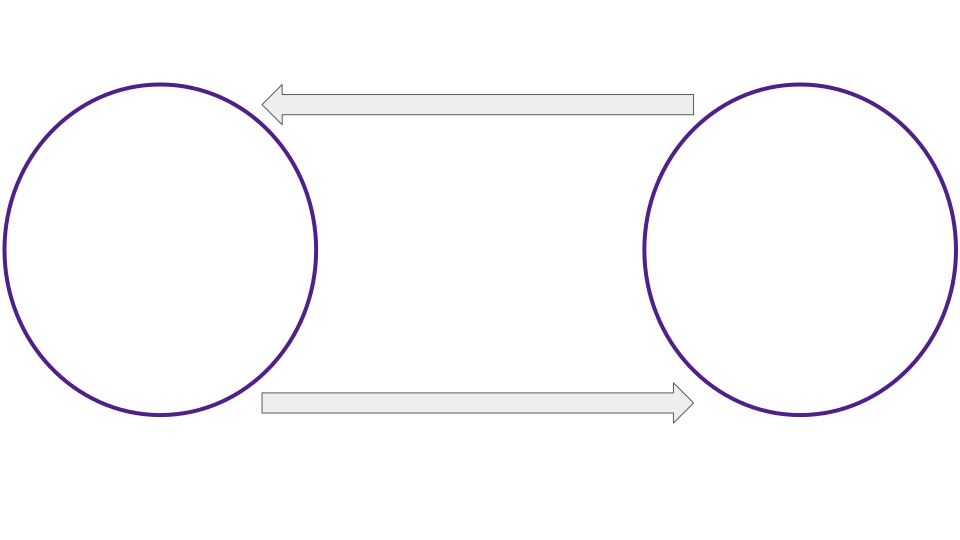
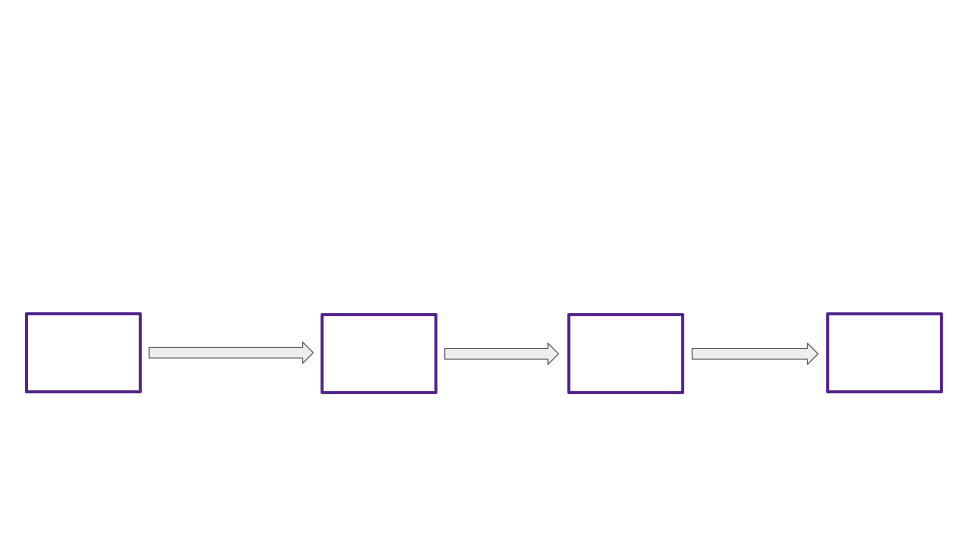
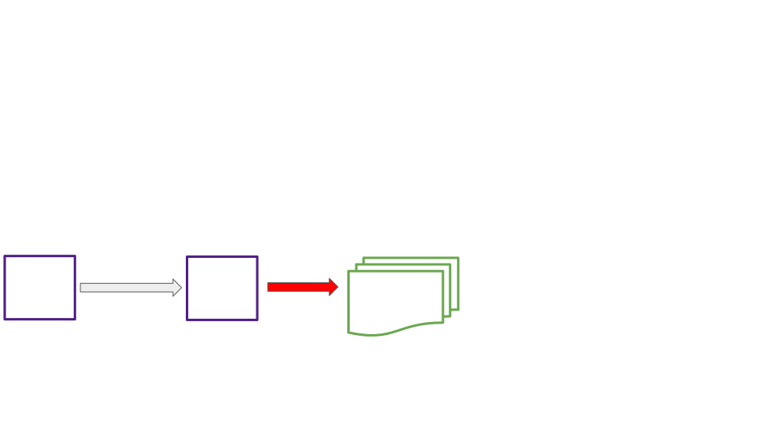
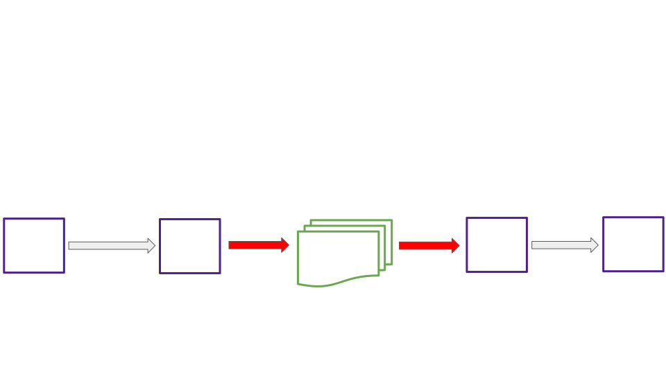
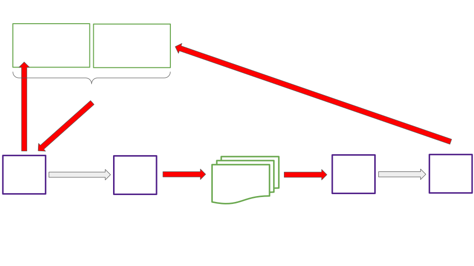
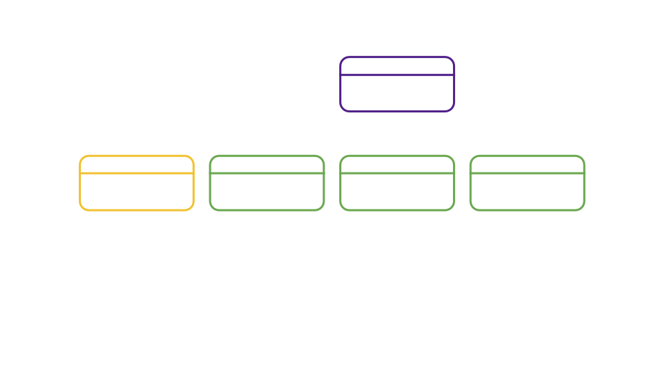
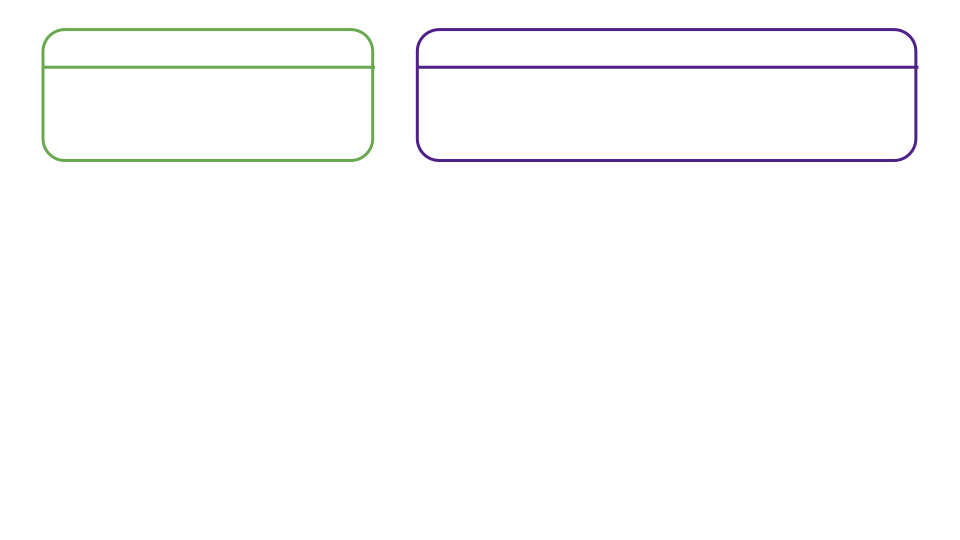
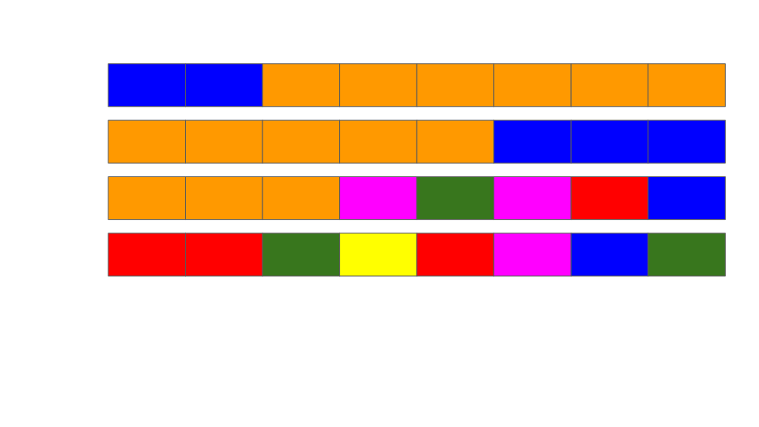

# Shallow Dive, Asynchronous Backing

Notes:

Hello again everyone

Today I'll be speaking to you about asynchronous backing, the new feature which delivers shorter parachain block times and an order of magnitude increase in quantity of Polkadot blockspace.

Lets get to it

---

## Overview

<pba-flex center>

- Synchronous vs asynchronous
- Why is asynchronous backing desirable?
<!-- .element: class="fragment" data-fragment-index="1" -->
- High level mechanisms of async backing
<!-- .element: class="fragment" data-fragment-index="2" -->
- The unincluded segment, and prospective parachains
<!-- .element: class="fragment" data-fragment-index="3" -->
- Async backing enabling other roadmap items
<!-- .element: class="fragment" data-fragment-index="4" -->

</pba-flex>

---

## Synchronous Backing Simplified

Notes:

- In synchronous backing: Backing for block `N+1` starts after inclusion for block `N` is complete. Backing and inclusion cannot take place simultaneously for different candidates of the same parachain and neither can outpace the other.
- White arrows represent execution flow
- The tasks within each of these purple circles take place during the time of a single relay chain block.
- Why might each of these two groupings of tasks need its own relay block to execute?
- Approvals, disputes, and finality not represented. Why?

---

## Async Backing Simplified

<!-- .element: class="fragment" data-fragment-index="1" -->

<!-- .element: class="fragment" data-fragment-index="2" -->

Notes:

- Notice difference in white execution arrow. Backing repeats, looping over and over. How is this possible?
- Our cache of backable parablock candidates allows inclusion to loop independently

---

## The Async Backing Optimistic Collator Assumptions

<pba-flex center>

1. "The best existing parablock I'm aware of will eventually be included in the relay chain."
1. "There won't be a chain reversion impacting that best parablock."
<!-- .element: class="fragment" data-fragment-index="1" -->

</pba-flex>

 
 

> The Stakes Are Low

<!-- .element: class="fragment" data-fragment-index="2" -->

Notes:

Best is determined by a process similar to the BABE fork choice rule.
Brief BABE fork choice rule review

---

## Advantages of Asynchronous Backing

<pba-flex center>

1. 3-5x more extrinsics per block
1. Shorter parachain block times 6s vs 12s
<!-- .element: class="fragment" data-fragment-index="1" -->
1. Resulting 6-10x boost in quantity of blockspace
<!-- .element: class="fragment" data-fragment-index="2" -->
1. Fewer wasted parachain blocks
<!-- .element: class="fragment" data-fragment-index="3" -->

</pba-flex>

Notes:

1. Collators have more time to fill each block
1. Advance work ensures backable candidates for each parachain are present to be backed on the relay chain every 6 seconds
1. Self explanatory
1. Allow parachain blocks to be ‘reused’ when they don’t make it onto the relay chain in the first attempt

---

## Parablock Validation Pipelining

---

## Synchronous Backing, Another Look

<!-- .element: class="fragment" data-fragment-index="1" -->

<!-- .element: class="fragment" data-fragment-index="2" -->

Notes:

Image version 1:

- Now let's take a closer look at when each step of backing and inclusion takes place both with synchronous and asynchronous backing.

Image version 3:

- The execution context for a new parablock requires its parablock parent and relay parent
- Whole process is a cycle of duration 12 seconds (2 relay blocks).
- No part of this cycle can be started for a second candidate of the same parachain until the first is included.

---

## Async Backing, Another Look

<!-- .element: class="fragment" data-fragment-index="1" -->

<!-- .element: class="fragment" data-fragment-index="2" -->

Note:

Image version 1:

- Candidates stored in prospective parachains (detail on that later)

Image version 2:

- Now we see our relay block cycle.
- It is 6 seconds rather than 12.
- It completes on-chain backing for one candidate and inclusion for another each cycle.

Image version 3:

- Collation generation and off-chain backing are outside of the relay block cycle.
- Because of this, collators have the freedom to work several blocks in advance. In practice, even working 2-3 blocks in advance gives a collator ample time to fully fill blocks (PoV size 5MiB)
- Notice that a part of the collation generation context, the unincluded segment, comes from the collator itself.

---

## The Unincluded Segment

<pba-flex center>

- A parachain's record of all parablocks on a particular chain fork that have been produced but not yet included
- Used to apply limitations when constructing future blocks
<!-- .element: class="fragment" data-fragment-index="1" -->
- Lives in the parachain runtime
<!-- .element: class="fragment" data-fragment-index="2" -->
- Viewed from the perspective of a new parablock under construction
<!-- .element: class="fragment" data-fragment-index="3" -->

</pba-flex>

Notes:

Limitation example: upward messages remaining before the relay chain would have to drop incoming messages from our parachain

---

## Unincluded Segment

Notes:

- Segment filled with ancestors from the perspective of a new candidate being built
- Segment added to as each new block is imported into the parachain runtime
- Segment shrinks when one of its ancestor blocks becomes included
- Maximum unincluded segment capacity is set both on the parachain and relay chain

---

## Unincluded Segment

Notes:

UsedBandwidth:

- pub ump_msg_count: u32,
- pub ump_total_bytes: u32,
- pub hrmp_outgoing: BTreeMap\<ParaId, HrmpChannelUpdate\>,

---

## Prospective Parachains

<pba-flex center>

- The relay chain's record of all unincluded candidates on all chain forks from all parachains
- As if you folded all unincluded segments into one huge structure
<!-- .element: class="fragment" data-fragment-index="1" -->
- Used to store candidates and later provide them to the on-chain backing process
<!-- .element: class="fragment" data-fragment-index="2" -->
- Lives in the relay client (off chain)
<!-- .element: class="fragment" data-fragment-index="3" -->

</pba-flex>

---

## Prospective Parachains Snapshot

Notes:

- Fragment tree composed of multiple unincluded segments for the same parachain
- Fragment trees are rooted in relay chain active leaves
- Fragment trees built per scheduled parachain at each leaf
- Fragment trees may have 0 or more fragments representing potential parablocks making up possible futures for a parachain's state.
- Collation generation and seconding work has already been completed for each fragment.

---

## Async Backing Simplified

Notes:

Returning to our most basic diagram

- Q: Which parablock storage structure did I leave out the name of for simplicity, and where should that name go in our diagram?
- Q: Which parablock storage structure did I omit entirely?

---

## Async Backing and Exotic Core Scheduling

Notes:

- What is exotic core scheduling?
  - Multiple cores per parachain
  - Overlapping bulk coretime leases of varying lengths
  - Lease + On-demand
- How does asynchronous backing help?
  - The unincluded segment is necessary to build 2 or more parablocks in a single relay block

---

## Resources

<pba-col center>

1. [Polkadot Async Backing PR](https://github.com/paritytech/polkadot/pull/5022)
1. [Cumulus Async Backing PR](https://github.com/paritytech/cumulus/pull/2300)
1. [Implementers Guide: Prospective Parachains](https://github.com/paritytech/polkadot/blob/631b66d5daa642fad7ed0a9712194c5b85b96563/roadmap/implementers-guide/src/node/backing/prospective-parachains.md)

</pba-col>

---

<!-- .slide: data-background-color="#4A2439" -->

# Questions
