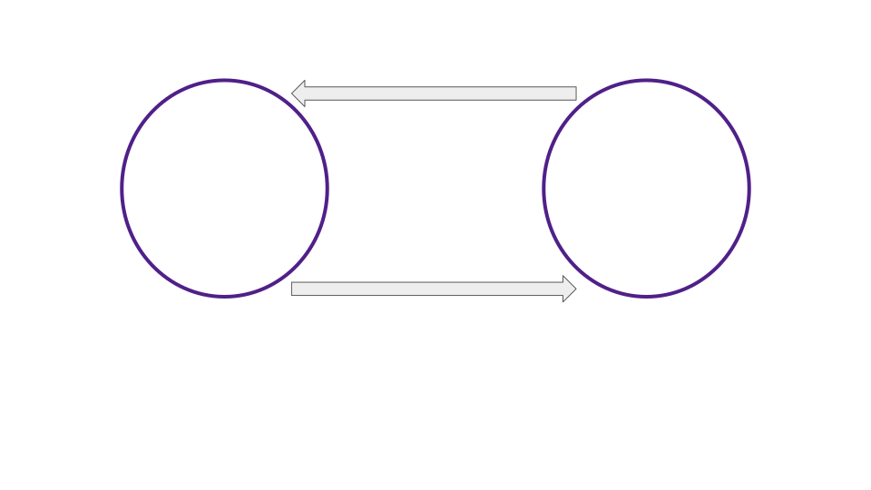
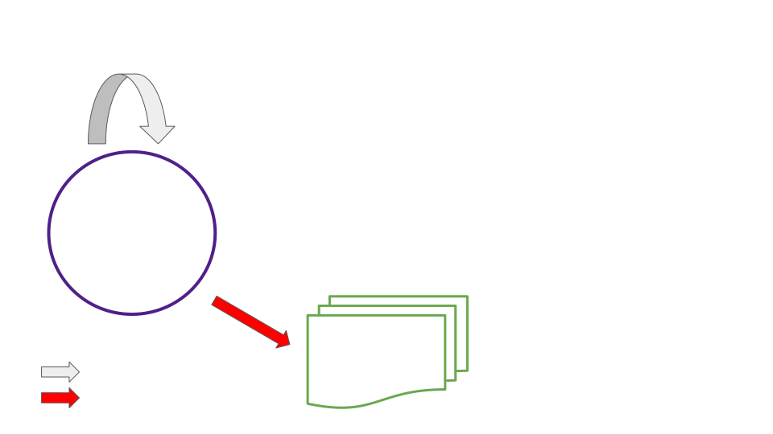
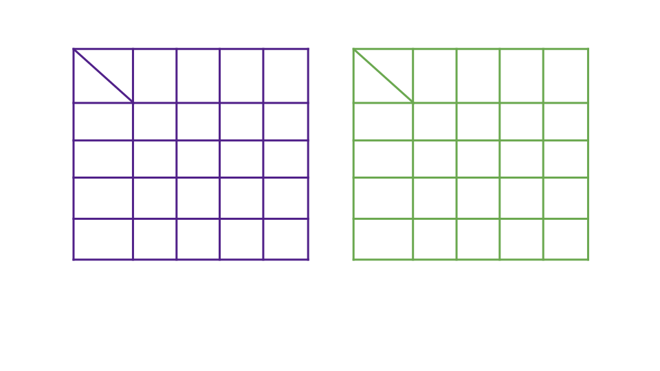
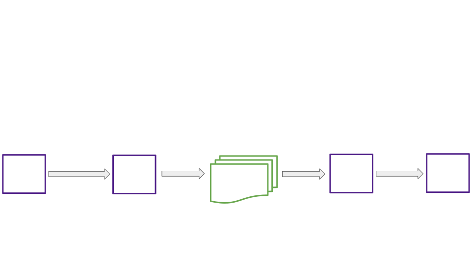

# Shallow Dive, Asynchronous Backing

Notes:

Hello again everyone

Today I'll be speaking to you about asynchronous backing, the new feature which delivers shorter parachain block times and an order of magnitude increase in quantity of Polkadot blockspace.

Lets get to it

---

## Overview

<pba-flex center>

- Synchronous vs asynchronous
- Why is asynchronous backing desirable?
- High Level Mechanisms of Async Backing
- The Unincluded Segment, and Prospective Parachains
- Async Backing and other roadmap items

</pba-flex>

---

## Synchronous Backing Simplified

Notes:

- Approvals, disputes, and finality don't immediately gate the production of farther candidates.
  So we don't need to represent those steps in this model.

---

## Async Backing Simplified

---v

## Async Backing Simplified

---v

## Async Backing Simplified

---

## The Async Backing Reasonable Collator Assumptions

<pba-flex center>

1. "The best existing parablock I'm aware of will eventually be included in the relay chain."
1. "There won't be a chain reversion impacting that best parablock."

</pba-flex>

 
 

> The Stakes Are Low

Notes:

Best is determined by a process similar to the BABE fork choice rule.
Brief BABE fork choice rule review

---

## Advantages of Asynchronous Backing

<pba-flex center>

1. 5-10x more extrinsics per block
1. Shorter parachain block times 6s vs 12s
1. Resulting 10-20x boost in quantity of blockspace
1. Fewer wasted parachain blocks

</pba-flex>

Notes:

1. Collators have more time to fill each block
1. Advance work ensures backable candidates for each parachain are present to be backed on the relay chain every 6 seconds
1. Self explanatory
1. Allow parachain blocks to be ‘reused’ when they don’t make it onto the relay chain in the first attempt

---

## Parablock Validation Pipelining

---

## Synchronous Backing, Another Look

Notes:

Now let's take a closer look at when each step of backing and inclusion takes place both with synchronous and asynchronous backing.

---v

## Synchronous Backing, Another Look

---v

## Synchronous Backing, Another Look

Notes:

- Whole process is a cycle of duration 12 seconds (2 relay blocks).
- No part of this cycle can be started for a second candidate of the same parachain until the first is included.

---

## Async Backing, Another Look

Note:

- Collation generation and off-chain backing are outside of the relay block cycle.
- Number of candidates produced and backed off chain only limited by compute power, network latency, and `max_depth` configured on the relay chain.

---v

## Async Backing, Another Look

Note:

Now we see our relay block cycle.
  It is 6 seconds rather than 12.
  It completes on-chain backing for one candidate and inclusion for another each cycle.

---v

## Async Backing, Another Look

---

## The Unincluded Segment

<pba-flex center>

- A parachain's record of all parablocks on a particular chain fork produced but not yet included
- Used to apply limitations when constructing future blocks
- Lives in the parachain runtime
- Viewed from the perspective of a new parablock under construction

</pba-flex>

Notes:

Limitation example, upward messages remaining before the relay chain would have to drop incoming messages from our parachain

---

## Unincluded Segment

Notes:

- Segment added to as each new block is imported on chain
- Segment shrinks when one of its ancestor blocks becomes included
- Maximum unincluded segment capacity is set both on the parachain and relay chain

---v

## Unincluded Segment

Notes:

UsedBandwidth:
pub ump_msg_count: u32,
pub ump_total_bytes: u32,
pub hrmp_outgoing: BTreeMap\<ParaId, HrmpChannelUpdate\>,

---

## Prospective Parachains

<pba-flex center>

- The relay chain's record of all candidates on all chain forks from all parachains
- As if you folded all unincluded segments into one huge structure
- Used to store candidates and later provide them to the on-chain backing process
- Lives in the relay client (off chain)

</pba-flex>

---

## Prospective Parachains Snapshot

Notes:

- Prospective parachains represents all unincluded segments in one subsystem of the polkadot client
- Fragment trees only built for active leaves
- Fragment trees built per scheduled parachain at each leaf
- Fragment trees may have 0 or more fragments representing potential parablocks making up possible futures for a parachain's state.
- Collation generation, passing, and seconding work has already been completed for each fragment.

---

## Async Backing and Exotic Core Scheduling

Notes:

- What is exotic core scheduling?
  - Multiple cores per parachain
  - Overlapping leases of many lengths
  - Lease + On-demand
- How does asynchronous backing help?
- The unincluded segment is necessary to build 2 or more parablocks in a single relay block

---

## Resources

<pba-col center>

1. [Polkadot Async Backing Feature Branch](https://github.com/paritytech/polkadot/tree/rh-async-backing-feature)
1. [Cumulus Async Backing Feature Branch](https://github.com/paritytech/cumulus/tree/slumber-async-backing-feature)
1. [Implementers Guide: Prospective Parachains](https://github.com/paritytech/polkadot/blob/rh-async-backing-feature-while-frozen/roadmap/implementers-guide/src/node/backing/prospective-parachains.md)

</pba-col>

---

<!-- .slide: data-background-color="#4A2439" -->

# Questions
