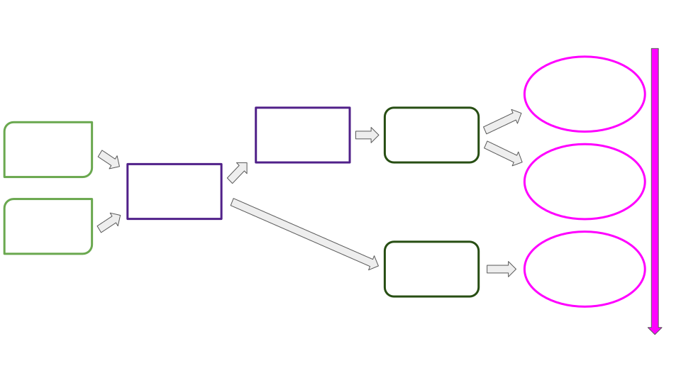
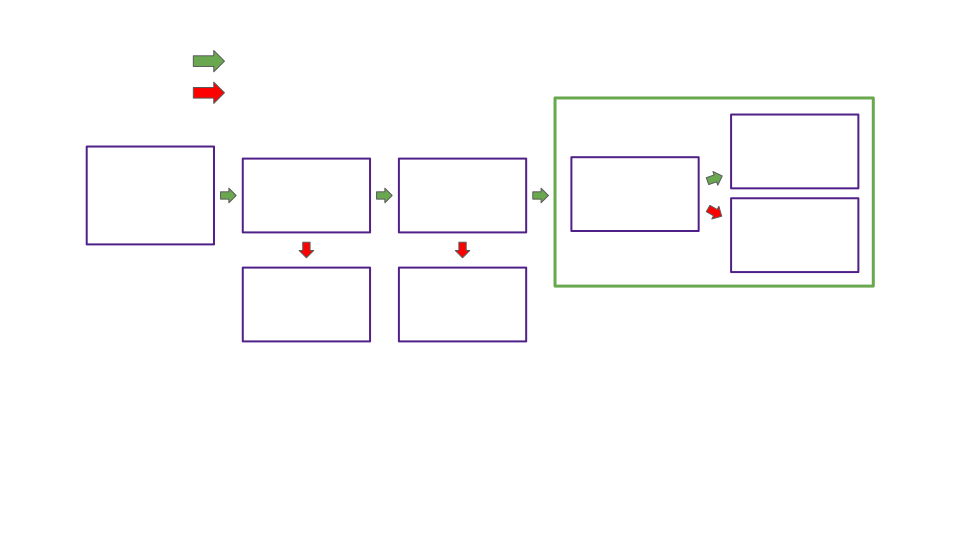

# Deep Dive, Availability Cores

Notes:

Hello!

I'm Bradley Olson

Was student at first Academy in Cambridge

Currently on Parachains Core Team at Parity

Will present 3 lectures providing a window into Polkadot core, a slice of where we're at and where we're headed.

First a look at availability cores, the abstraction enabling flexible purchases of blockspace under the umbrella of Polkadot shared security.

Lets get to it

---

## Overview

<pba-flex center>

- What do availability cores represent?
- How do cores map parachain leases and claims to validator subsets?
- How do cores gate each step of the parachains protocol?
- What advantages do cores give us now?
- What roadmap items do cores accommodate?

</pba-flex>

---

## Review, Blockspace

> Blockspace is the capacity of a blockchain<br/>to finalize and commit operations

Polkadot's primary product is _blockspace_.

---

## Blockspace, Use It or Lose It

Polkadot blockspace is consumed in two ways:

<pba-flex center>

1. When the relay chain validates,<br/>includes, and finalizes a parachain block
1. When the capacity to validate a parachain block<br/> is left unused and expires

</pba-flex>


---

## Availability Core Defined

<pba-cols>
<pba-col center>

- Availability cores are the abstraction we use to allocate Polkadot's blockspace.
- Allocated via leases and on-demand claims
- Cores divide blockspace supply into discrete units, 1 parachain block per relay chain block per core
- Why "availability"?
- Why "core"?

</pba-col>
<pba-col center>


</pba-col>
</pba-cols>

Notes:

- "Availability", because a core is considered occupied by a parachain block candidate while that candidate is being made available. But cores mediate access to the entire parablock validation pipeline, not just availability.
- "Core", because many candidates can be made available in parallel, mimicking the parallel computation per core in a computer processor.

---

## Availability

Though cores gate the entire parachain block pipeline,<br/> the availability process alone determines when these cores are considered occupied vs free.

To recap, the goals of availability are:

1. To ensure that approvers will always be able to recover the PoVs to validate their assigned blocks
2. To ensure that parachain nodes can recover blocks in the case that a parablock author maliciously refuses to share them

---

## The Availability Process

Core States: Free, Scheduled, Occupied

<pba-flex center>

1. Block author places a candidate on-chain as backed, immediately occupying its scheduled core
1. Candidate backers distribute erasure coded PoV chunks
1. Validators distribute statements as to which candidates they have chunks for
1. Availability threshold is met (2/3 vs the 1/3 needed to reconstruct POV)
1. Candidate marked as included on chain and core freed
1. Approvers or parachain nodes retrieve PoV chunks as needed

</pba-flex>

Notes:

- CoreState: Free -> core has not been assigned a parachain via lease or on-demand claim
- CoreState: Scheduled -> Core has an assigned parachain and is currently unoccupied
- CoreState: Occupied -> Core has assignment and is occupied by a parablock pending availability

---

## Cores and Blockspace Over Time


Notes:

- Metaphor: Freight train
- Relay block: Train leaving station every 6 seconds
- Potential Parablock: Car space in scheduled train
- Availability core: Car index within all trains

If you have a lease on core 4, then you have the right to fill train car 4 on each train with whatever you want to ship.

Q: How would an on-demand claim be represented in this metaphor?

---

# Mapping Leases and Claims to Validator Subsets

---

## The Big Picture



Notes:

- Which steps of the parachains protocol are missing, and why?
- Going to dive into each piece
- Questions?

---

## Assigning Leases and Claims to Cores


Notes:

- Leases have indices and pair to cores with the same index
- Cores not designated as on-demand and without a paired lease are left free, their blockspace wasted
- When on-demand claims are queued, they are each assigned a designated core in ascending order bounded by the on-demand core count

---

## Assigning Backing Groups to Cores


Notes:

- Round robin, fixed intervals

This prevents a byzantine backing group from interrupting the liveness of any one parachain for too long.

---

## Backing Group Formation


Notes:

- Validators randomly assigned to groups at start of session.
- Group count is active validator count / max group size rounded up

---


## Assigning Approvers to Cores

<pba-flex center>

- Randomness via schnorrkel::vrf
- Delay tranches add approvers until threshold met
- Results in 30-40 assigned approvers per core
- Different assignments each block prevent DOS

</pba-flex>

Notes:

Q: Why don't we just have all active validators approve each candidate?

---

## Putting the Pieces Together


Notes:

---

## Occupying Assigned Cores: With Lease



Notes:

Q: What step of the parachains protocol takes place between "Supplied backable candidate" and "availability process?

---

## Occupying Assigned Cores: On Demand


---

## Core States in the Runtime

In file: polkadot/runtime/parachains/src/scheduler.rs

<div style="font-size: 0.82em;">

```rust

#[pallet::storage]
#[pallet::getter(fn availability_cores)]
pub(crate) type AvailabilityCores<T> = StorageValue<_, Vec<Option<CoreOccupied>>, ValueQuery>;


pub enum CoreOccupied {
    /// A parathread (on-demand parachain).
    Parathread(ParathreadEntry),
    /// A lease holding parachain.
    Parachain,
}

/// Parathread = on-demand parachain
pub struct ParathreadEntry {
	/// The claim.
	pub claim: ParathreadClaim,
	/// Number of retries.
	pub retries: u32,
}

```

</div>

Notes:

Q: When Option is None, what does that indicate?

---

## Core Assignments in The Runtime

In file: polkadot/runtime/parachains/src/scheduler.rs

<div style="font-size: 0.82em;">

```rust

#[pallet::storage]
#[pallet::getter(fn scheduled)]
pub(crate) type Scheduled<T> = StorageValue<_, Vec<CoreAssignment>, ValueQuery>;

pub struct CoreAssignment {
    /// The core that is assigned.
    pub core: CoreIndex,
    /// The unique ID of the para that is assigned to the core.
    pub para_id: ParaId,
    /// The kind of the assignment.
    pub kind: AssignmentKind,
}

pub enum AssignmentKind {
	/// A parachain.
	Parachain,
	/// A parathread (on-demand parachain).
	Parathread(CollatorId, u32),
}

```

</div>

Notes:

- Vec of all core assignments
- Pairs ParaId with CoreIndex
- AssignmentKind carries retry info for on-demand

---

## On-Demand Queue in The Runtime

In file: polkadot/runtime/parachains/src/scheduler.rs

<div style="font-size: 0.82em;">

```rust

#[pallet::storage]
pub(crate) type ParathreadQueue<T> = StorageValue<_, ParathreadClaimQueue, ValueQuery>;

pub struct ParathreadClaimQueue {
    queue: Vec<QueuedParathread>,
    // this value is between 0 and config.parathread_cores
    next_core_offset: u32,
}

/// A queued parathread (on-demand parachain) entry, pre-assigned to a core.
pub struct QueuedParathread {
	claim: ParathreadEntry,
	core_offset: u32,
}

```

</div>

Notes:

- Why ParathreadClaimQueue in the code? (Naming change)
- Vec of queued parathreads
- `next_core_offset` determines the parathread core which will be pre-assigned the next claim to enter the queue

---

# How Cores Gate Each Step of the Parachains Protocol

---

## How Core Assignments Mediate Backing

Each parablock candidate is built in the context of a particular `relay_parent`. 

Validators query their core assignment as of `relay_parent` and refuse to second candidates not assiciated with their backing group.

Notes:

- Relay parent context: max PoV size, current parachain runtime code, and backing group assignments.

---

## How Core Assignments Mediate Backing (Cont.)

`handle_second_message()` in the Backing Subsystem.

```rust

// Sanity check that candidate is from our assignment.
if Some(candidate.descriptor().para_id) != rp_state.assignment {
	gum::debug!(
		target: LOG_TARGET,
		our_assignment = ?rp_state.assignment,
		collation = ?candidate.descriptor().para_id,
		"Subsystem asked to second for para outside of our assignment",
	);

	return Ok(())
}

```

---

## Cores and Backing On-Chain

<pba-flex center>

- For each scheduled (un-occupied) core a candidate is retrieved from the off-chain backing process
- Candidates are provided to block author according to core assignment
- Backed on-chain -> immediately occupies core

</pba-flex>

Notes:

- Review possible core states
- Mention time-out vs made available

Q: What does "immediately occupies core" imply?

---

## Cores and Backing On-Chain, Code

Function `request_backable_candidates` from the Provisioner subsystem, simplified for readability

<div style="font-size: 0.82em;">

```rust
/// Requests backable candidates based on core states.
async fn request_backable_candidates(
	availability_cores: &[CoreState],
	bitfields: &[SignedAvailabilityBitfield],
	relay_parent: Hash,
	sender: &mut impl overseer::ProvisionerSenderTrait,
) -> Result<Vec<CandidateHash>, Error> {
	let block_number = get_block_number_under_construction(relay_parent, sender).await?;

	let mut selected_candidates = Vec::with_capacity(availability_cores.len());

	for (core_idx, core) in availability_cores.iter().enumerate() {
		let (para_id) = match core {
			CoreState::Scheduled(scheduled_core) => {
				scheduled_core.para_id
			},
			CoreState::Occupied(occupied_core) => {
				if bitfields_indicate_availability(core_idx, bitfields, &occupied_core.availability)
				{
					if let Some(ref scheduled_core) = occupied_core.next_up_on_available {
						scheduled_core.para_id
					} else {
						continue
					}
				} else {
					if occupied_core.time_out_at != block_number {
						continue
					}
					if let Some(ref scheduled_core) = occupied_core.next_up_on_time_out {
						// Candidate's availability timed out, practically same as scheduled.
						scheduled_core.para_id
					} else {
						continue
					}
				}
			},
			CoreState::Free => continue,
		};

		let candidate_hash =
			get_backable_candidate(relay_parent, para_id, required_path, sender).await?;

		match candidate_hash {
			Some(hash) => selected_candidates.push(hash),
			None => (),
		}
	}

	Ok(selected_candidates)
}

```

</div>

Notes:

- Per core
  - Discuss core states free, scheduled, occupied
  - Discuss core freeing criteria
    - `bitfields_indicate_availability`
      - next_up_on_available
    - availability time out
      - next_up_on_timeout

---

## Cores and Approvals, Disputes, Finality

Each included candidate has already occupied an availability core

Approvals, Disputes, and Finality are only provided to included candidates

---

## Advantages Cores Give us Now

<pba-flex center>

1. Improved liveness
1. Flexibility of market structure
1. Flexibility of allocation
1. Intuitive unit of capacity over time

</pba-flex>


Notes:

1. Regularly rotating pairings between cores and backing groups
1. Market structures: common good, lease, on-demand
1. Cores accommodate huge changes in validation recipients from one block to the next
1. Train metaphor

---

# Cores and Roadmap Items


---

## Exotic core scheduling

<pba-flex center>

- Multiple cores per parachain
- Overlapping leases of many lengths
- Lease + On-demand

</pba-flex>


Notes:

- Each color represents a parachain

---

## Divisible and Marketable Blockspace

We want Parachains to buy, sell, and split blockspace such that they are allocated exactly as much as fits their needs.<br><br>

<pba-flex center>

- Core sharing via use-threshold blockspace regions
- Secondary markets for blockspace regions

</pba-flex>

Notes:

- Example: Region spanning 100 blocks. Split the region use so that each of two parties can submit up to 50 parablocks. Ownership proportion is enforced throughout the region such that each party can't submit more than 5 out of the first 10 blocks.

---

## Framing Shift: Blockspace vs Core Time

Blockspace is a universal term for the product of blockchains, while core time is Polkadot's particular abstraction for allocating blockspace or other computation.

Cores can secure computation other than blocks. For example, a smart contract could be deployed on a core directly.

Allocating cores by time rather than for a fixed block size could allow for smaller or larger parachain blocks to be handled seamlessly.

---

## Resources

<pba-col center>

1. [Implementers Guide: Scheduler Pallet](https://paritytech.github.io/polkadot/book/runtime/scheduler.html)
1. [RFC: Agile Coretime](https://github.com/polkadot-fellows/RFCs/pull/1)
1. [RFC: Coretime Scheduling Regions](https://github.com/polkadot-fellows/rfcs/pull/3)
1. [Rob Habermeier's Blog: Polkadot Blockspace Over Blockchains](https://www.rob.tech/polkadot-blockspace-over-blockchains/)

</pba-col>

---

<!-- .slide: data-background-color="#4A2439" -->

# Questions
