<style>
    .colored-light-green {
        color: #c2ff33;
    }
</style>

# Introduction to Dapps

---

## Agenda

- What is a Dapp?
- Dapp Communication With Substrate Runtimes
- Interacting with Web Extensions
- Working with Polkadot JS API
- Constructing Transactions with Polkadot JS API
- Dapp Optimisation
- Miscellaneous Mentions

---

## Putting everything together

How do humans interact with Substrate-based chains?

<!-- .element: class="fragment" -->

We use dapps

<!-- .element: class="fragment" -->

---

# What is a Dapp?

---v

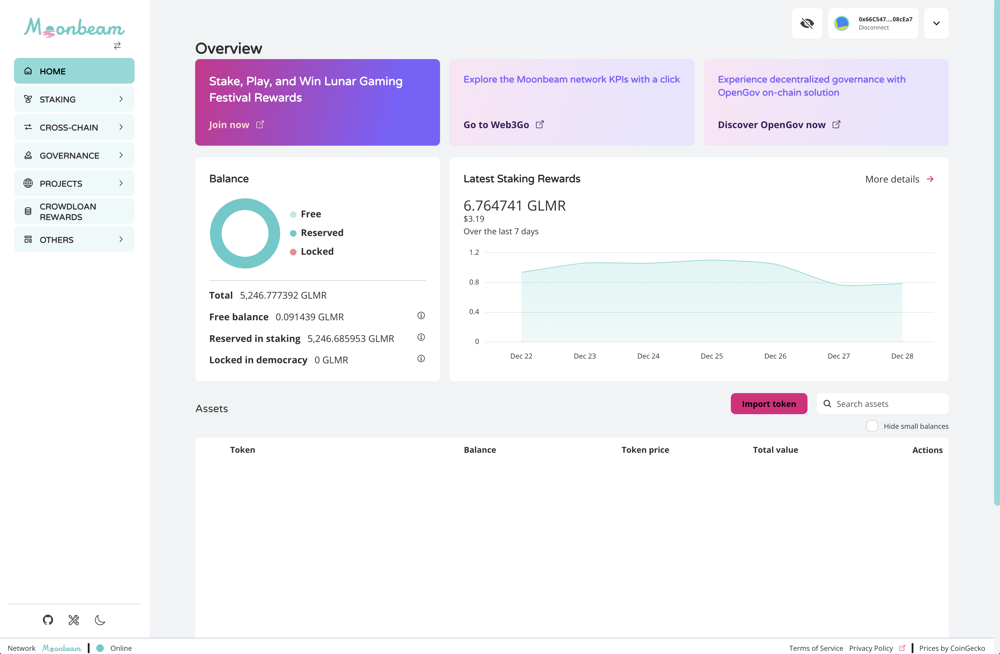

<pba-flex center>

https://apps.moonbeam.network/moonbeam

</pba-flex>

---v

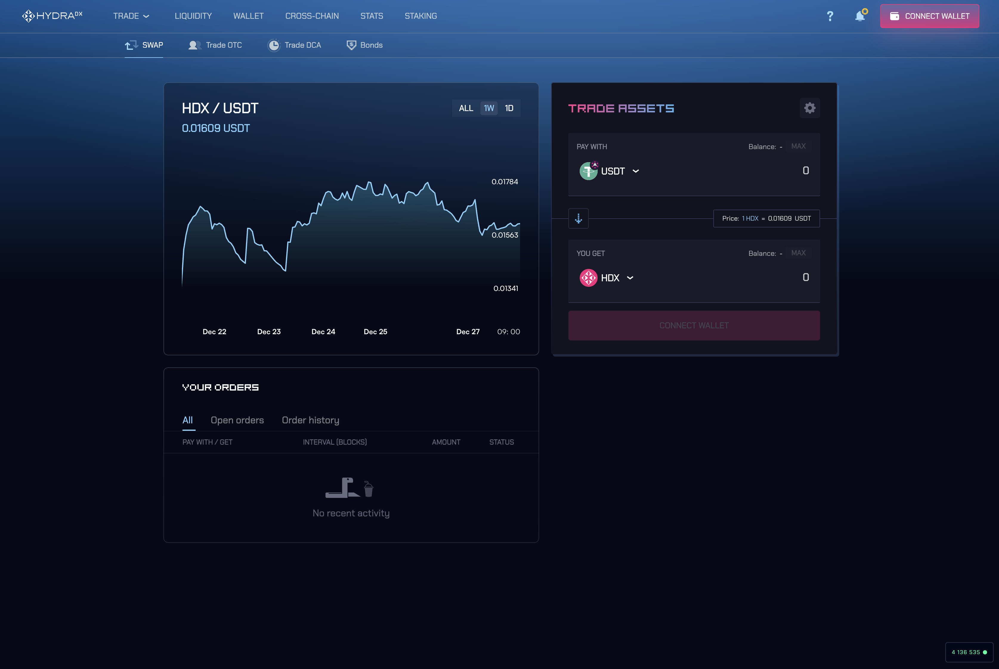

<pba-flex center>

https://app.hydradx.io/trade/swap

</pba-flex>

---v

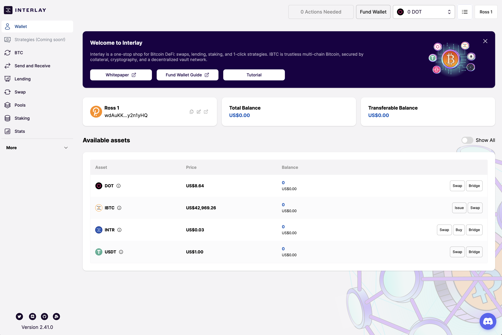

<pba-flex center>

https://app.interlay.io/wallet

</pba-flex>

---v

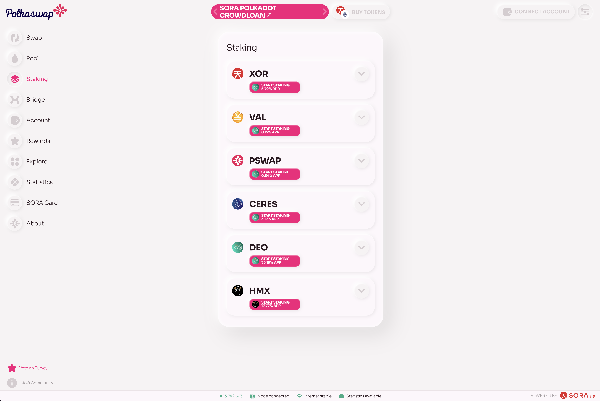

<pba-flex center>

https://polkaswap.io/#/staking

</pba-flex>

---v


<pba-flex center>

https://staking.polkadot.network

</pba-flex>

---v

## Dapp Characteristics

Although no strict definition, dapps have certain characteristics:

<br/>

- Account management using cryptographic primitives
<!-- .element: class="fragment" -->
- Interaction with a blockchain or decentralised network
<!-- .element: class="fragment" -->
- Not reliant on centralised APIs
<!-- .element: class="fragment" -->
- Allows signing and submitting of transactions
<!-- .element: class="fragment" -->

---v

### Is a dapp a dapp if it is hosted via traditional web hosting, versus something like IPFS?

<br/>

### Does a dapp have to be open source to be a dapp?

<!-- .element: class="fragment" -->

---v

## Is a Web Extension a Dapp?

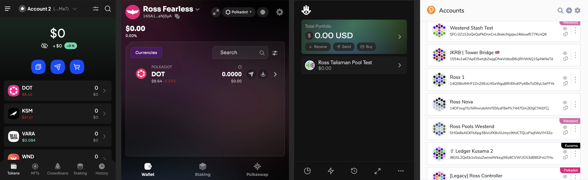

---v

## Nova Wallet?

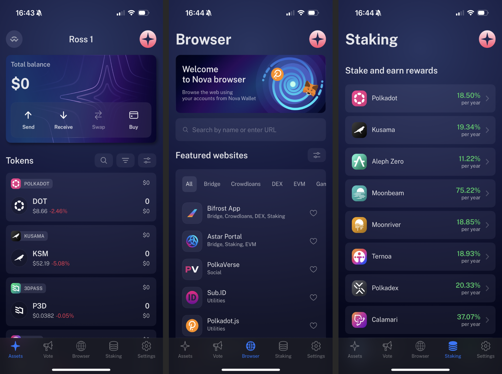

---v

## Ledger Live?

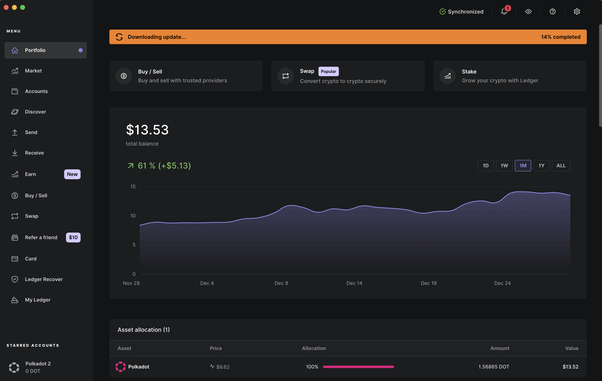

---v

## Polkadot Vault?

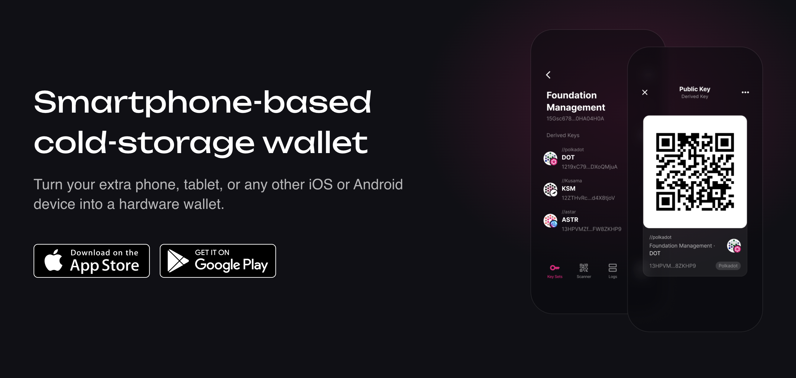

---v

## Subscan?


---v

## Polkassembly?

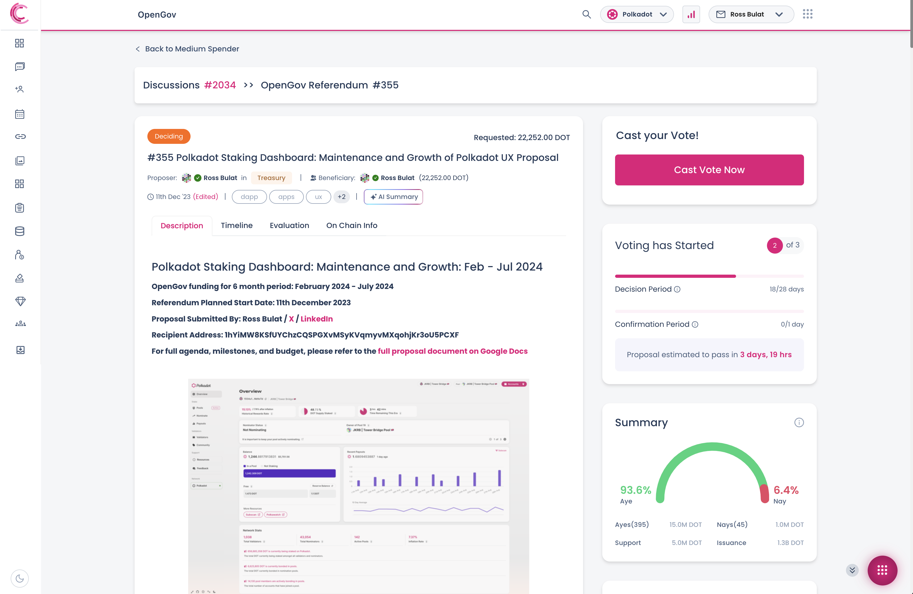

---v

## What is a Dapp

- The more “decentralized” the application is, the more it’s considered a Dapp
- Does not necessarily need connection with a blockchain node (E.g. Polkadot Vault)
<!-- .element: class="fragment" -->
- Can the app function if all centralised services are turned off?
  <!-- .element: class="fragment" -->
  - If it can, it is more likely to be a dapp
  <!-- .element: class="fragment" -->
- No strict form factor - web, mobile, desktop apps can all be dapps
<!-- .element: class="fragment" -->
- Dapps are becoming increasingly technical
<!-- .element: class="fragment" -->
- They are more suited to agile development
<!-- .element: class="fragment" -->

---v

## Value Proposition of a Dapp

<span style="text-align: left;">

✅ Maximally resilient: most important

<!-- .element: class="fragment" -->

✅ Easy to understand and use

<!-- .element: class="fragment" -->

✅ In demand use case

<!-- .element: class="fragment" -->

✅ Offers real utility to the chain

<!-- .element: class="fragment" -->

✅ Stability, reliability, 24/7 uptime

<!-- .element: class="fragment" -->

❌ The latest and greatest JavaScript Framework

<!-- .element: class="fragment" -->

❌ Marketing gimmicks, airdrops, bonuses, etc

<!-- .element: class="fragment" -->

</span>

---

# Dapp Tech Stack

---v

## Dapp Tech Stack

- <span class="colored-light-green">TypeScript</span>, JS Framework (<span class="colored-light-green">React</span>, Vue, ….) and a toolchain (<span class="colored-light-green">Vite</span>, CRA, Webpack…)

<!-- .element: class="fragment" -->

- A Modern package manager: NPM / Yarn / PNPM
<!-- .element: class="fragment" -->
- Linting: ESLint, Stylistic, Prettier, etc...
<!-- .element: class="fragment" -->
- GitHub CI (dependabot, auto-merge, gh-pages publish, releases, stale, license, link-checker)
<!-- .element: class="fragment" -->
- Automated release management (Release Please)
<!-- .element: class="fragment" -->
- Desktop: Electron (Ledger API supported)
<!-- .element: class="fragment" -->
- Testing frameworks - vary (or test in prod)
<!-- .element: class="fragment" -->
- APIs. Polkadot JS API being the most popular
<!-- .element: class="fragment" -->
- SCSS, HTML
<!-- .element: class="fragment" -->

---

# Dapp Communication With Substrate Runtimes

---v

## Metadata

APIs need to know a chain’s metadata before it can interact with it.

<br>

- A chain’s metadata describes calls, storage items, runtime constants, and types, used by the chain
<!-- .element: class="fragment" -->
- Once metadata is known, APIs can query chain state, and know what types to use when submitting transactions
<!-- .element: class="fragment" -->
- APIs can either fetch metadata dynamically, or store it statically
<!-- .element: class="fragment" -->

---v

### Why would a dapp opt to store metadata statically instead of dynamically?

<br/>

<pba-flex center>

- Designed for one runtime version (not the best idea)
<!-- .element: class="fragment" -->
- Ability to load with app bundle instead of fetching on API Initialisation
<!-- .element: class="fragment" -->

</pba-flex>

---v

## How Can Dapps interact with Substrate?

<br/>

- Fetch system related information (blocks, transaction version, genesisHash…)
<!-- .element: class="fragment" -->
- Read chain storage items
<!-- .element: class="fragment" -->
- Read runtime constants
<!-- .element: class="fragment" -->
- Interact with runtime APIs
<!-- .element: class="fragment" -->
- Transaction submission
<!-- .element: class="fragment" -->

---v

## Runtime Constants: Runtime

Types decorated with `#[pallet::constant]` will be exposed by metadata.

<br/>

<pba-cols>
<pba-col style="font-size:24px">

### Pallet (taken from pallet-staking)

```rust

#[pallet::constant]
type HistoryDepth: Get<u32>;

#[pallet::constant]
type SessionsPerEra: Get<SessionIndex>;

#[pallet::constant]
type BondingDuration: Get<EraIndex>;

#[pallet::constant]
type SlashDeferDuration: Get<EraIndex>;

#[pallet::constant]
type MaxUnlockingChunks: Get<u32>;

...

```

</pba-col>
<pba-col style="font-size:24px">

### Runtime

```rust

parameter_types! {
  pub const SessionsPerEra: SessionIndex = prod_or_fast!(6, 1);
  pub const BondingDuration: sp_staking::EraIndex = 28;
  pub const SlashDeferDuration: sp_staking::EraIndex = 27;

  ...
}

impl pallet_staking::Config for Runtime {
  type HistoryDepth = frame_support::traits::ConstU32<84>;
  type SessionsPerEra = SessionsPerEra;
  type BondingDuration = BondingDuration;
  type SlashDeferDuration = SlashDeferDuration;
  type MaxUnlockingChunks = frame_support::traits::ConstU32<32>;

  ...
}

```

</pba-col>
</pba-cols>

---v

## Runtime Constants: RPC

Metadata defines what runtime constants can be queried through the JSON RPC.

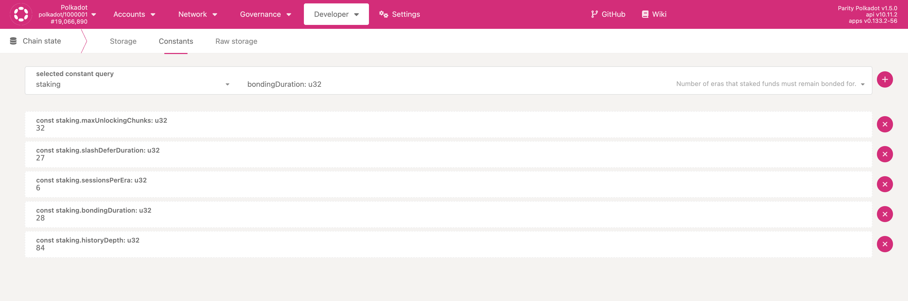

---v

## Storage Values

Storage values decorated with `#[pallet::storage]` will be exposed to metadata.

<span style="font-size:24px">

```rust
#[pallet::storage]
#[pallet::getter(fn validator_count)]
pub type ValidatorCount<T> = StorageValue<_, u32, ValueQuery>;

#[pallet::storage]
#[pallet::getter(fn minimum_validator_count)]
pub type MinimumValidatorCount<T> = StorageValue<_, u32, ValueQuery>;

#[pallet::storage]
pub type Bonded<T: Config> = StorageMap<_, Twox64Concat, T::AccountId, T::AccountId>;

#[pallet::storage]
pub type MinNominatorBond<T: Config> = StorageValue<_, BalanceOf<T>, ValueQuery>;
```

</span>

---v

## Storage Values: RPC

Storage items can be queried once they are known.

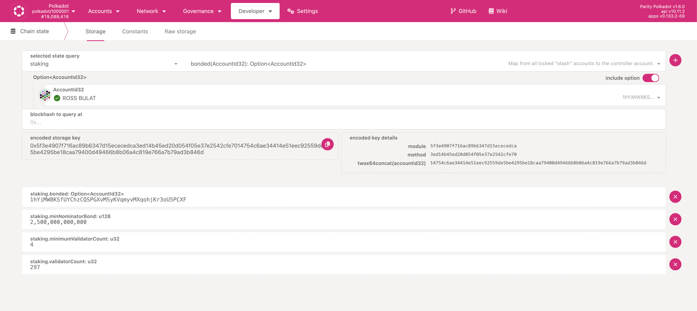

---v

### Why might opting to use a storage value make more sense than to use a pallet constant?

<br/>

Can be updated by governance (or `pallet-sudo` if your chain supports it!). Useful when you know values will change over time, or may urgently need to change.
E.g. nomination pools: `maxPools`, `maxPoolMembers`, `globalMaxCommission`.

<!-- .element: class="fragment" -->

---v

## Runtime Calls

Functions that act like more traditional REST APIs. Defined in pallet, & have full access to pallet config.

<br/>

<span style="font-size:24px">

```rust
impl pallet_nomination_pools_runtime_api::NominationPoolsApi<
  Block,
  AccountId,
  Balance,
> for Runtime {
  fn pending_rewards(member: AccountId) -> Balance {
    NominationPools::api_pending_rewards(member).unwrap_or_default()
  }

  fn points_to_balance(pool_id: pallet_nomination_pools::PoolId, points: Balance) -> Balance {
    NominationPools::api_points_to_balance(pool_id, points)
  }

  fn balance_to_points(pool_id: pallet_nomination_pools::PoolId, new_funds: Balance) -> Balance {
    NominationPools::api_balance_to_points(pool_id, new_funds)
  }
}
```

</span>

---v

## Runtime Calls: Example

<br/>

<span style="font-size:24px">

```rust
/// Returns the pending rewards for the specified `who` account.
///
/// In the case of error, `None` is returned. Used by runtime API.
pub fn api_pending_rewards(who: T::AccountId) -> Option<BalanceOf<T>> {
  if let Some(pool_member) = PoolMembers::<T>::get(who) {
    if let Some((reward_pool, bonded_pool)) = RewardPools::<T>::get(pool_member.pool_id)
      .zip(BondedPools::<T>::get(pool_member.pool_id))
    {
      let commission = bonded_pool.commission.current();
      let (current_reward_counter, _) = reward_pool
        .current_reward_counter(pool_member.pool_id, bonded_pool.points, commission)
        .ok()?;
      return pool_member.pending_rewards(current_reward_counter).ok()
    }
  }

  None
}
```

</span>

---v

## About Runtime Calls

- Not a storage item or constant, but a function that returns a value
- Also compiled into the WASM runtime, but not exposed by metadata
- Runtime APIs can be useful for dapps:
  - Performing additional calculations with on chain data
  - Type conversions
  - Key generation and decoding / light-weight computation

---v

## Summary

- Dapps (generally) need to know metadata of a chain to communicate with it
<!-- .element: class="fragment" -->
- Chain-level info: block::{events, extrinsics}, genesisHash, transactionVersion, etc, can be queried
<!-- .element: class="fragment" -->
- Runtime constants and storage items can be queried
<!-- .element: class="fragment" -->
- Runtime calls are an additional means to query values derived from runtime
<!-- .element: class="fragment" -->
- Substrate exposes HTTP and Websocket endpoints, implements JSON RPC protocol
<!-- .element: class="fragment" -->
- All these communication methods should be supported in a good API - more on this later
<!-- .element: class="fragment" -->

---

# Interacting with Web Extensions

---v

<pba-cols>
<pba-col style="font-size:24px">

### Web Extensions Are Found in window

<br/>

- Web extensions inject an interface into window.injectedWeb3, and keyed with an id
<!-- .element: class="fragment" -->
- Dapps can communicate with extensions by interacting with window.injectedWeb3 once it has been injected
<!-- .element: class="fragment" -->
- Commonly used with Chrome / Brave browsers
<!-- .element: class="fragment" -->

</pba-col>
<pba-col style="font-size:24px">

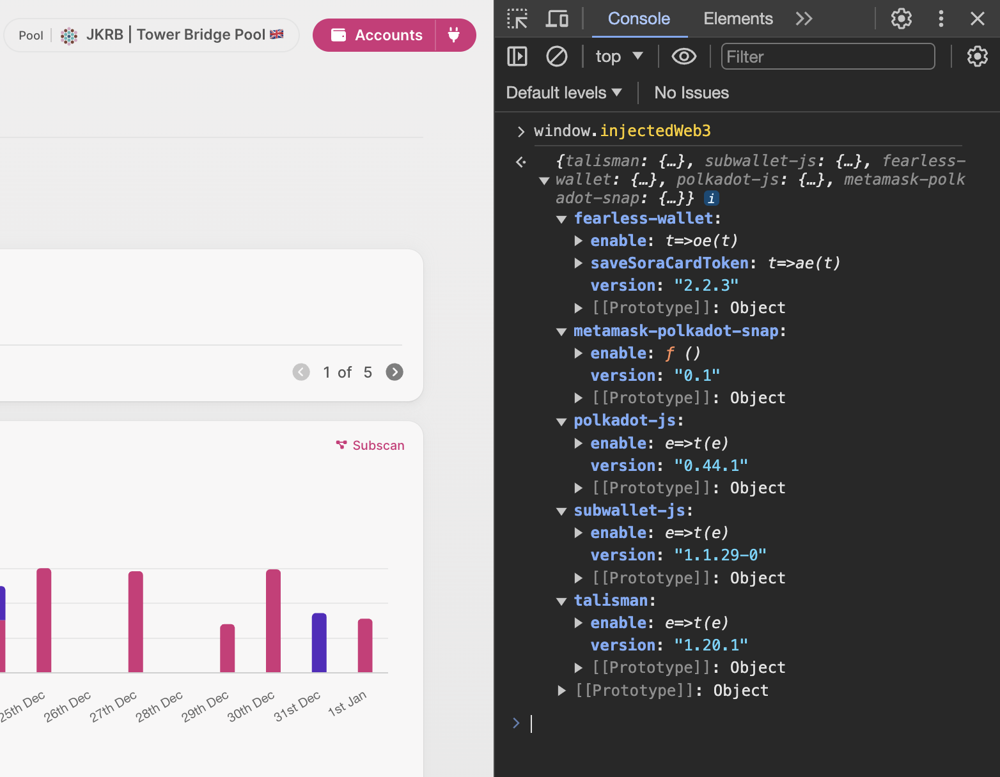

</pba-col>
</pba-cols>

---v

## Connect & Retrieving Accounts

- Connect: Call `enable()` to retrieve extension API (popup here)

- Retrieve: Retrieve accounts and signer (to sign transactions)

<br/>

<span style="font-size:24px">

```javascript
// If account subscriptions are not supported, simply
// get the account(s) from the extension.
// Otherwise, subscribe to accounts.
if (!extensionHasFeature(id, "subscribeAccounts")) {
  const accounts = await extension.accounts.get();
  handleAccounts(accounts);
} else {
  const unsub = extension.accounts.subscribe(accounts => {
    handleAccounts(accounts || []);
  });
  addToUnsubscribe(id, unsub);
}
```

</span>

---v

## Avoid @polkadot/extension-dapp


---v

## Web Extensions: Summary

- Access extension APIs from window.injectedWeb3
<!-- .element: class="fragment" -->
- Web extensions are unpredictable and might break (this has happened multiple times)
<!-- .element: class="fragment" -->
- They are a necessary evil for many dapps
<!-- .element: class="fragment" -->
- Dapps can support alternatives to web extensions (Ledger, Polkadot Vault, Wallet Connect)
<!-- .element: class="fragment" -->
- Avoid @polkadot/extension-dapp
<!-- .element: class="fragment" -->
- Alternative: @polkadot-cloud/react (in Beta)
<!-- .element: class="fragment" -->

---

# Polkadot JS API

---v

## Polkadot JS API: Basics

- JS/(~TS) API used for interacting with Substrate based chains
<!-- .element: class="fragment" -->
- Dynamically fetches chain metadata on connect
<!-- .element: class="fragment" -->
- Provides helpers for decoding SCALE, and encodes under the hood when constructing extrinsics / transactions
<!-- .element: class="fragment" -->
- Websocket and HTTP Interface support
<!-- .element: class="fragment" -->
- Supports Smoldot light client (with @substrate/connect)
<!-- .element: class="fragment" -->
- It is the only poduction ready Polkadot API existing today
<!-- .element: class="fragment" -->

---v

## Connecting to a Chain

<span style="font-size:24px">

```javascript
import { ApiPromise, WsProvider } from "@polkadot/api";

// The WebSocket Provider allows sending requests using WebSocket to a WebSocket RPC server TCP port.
// Unlike the [[HttpProvider]], it does support subscriptions and allows listening to events such
// as new blocks or balance changes.
const provider = new WsProvider("wss://westend-rpc.polkadot.io");

this.provider.on('connected', () => {
  ...
});

this.provider.on('disconnected', () => {
  ...
});

this.provider.on('error', () => {
  ...
});

// ApiPromise is a standard JavaScript wrapper around the RPC and interfaces on the Polkadot network.
const api = await ApiPromise.create({ provider });
```

<br/>

### `ApiPromise.create` is asynchronous. Why might this be?

<!-- .element: class="fragment" -->

</span>

---v

## Namespaces

- `api.rpc`: System level information (JSON-RPC).

```
const chain = await api.rpc.system.chain();
const lastHeader = await api.rpc.chain.getHeader();
```

- `api.query`: Gets storage items

```
const payees = await api.query.staking.payee(stash);
```

- `api.consts`: Gets runtime constants

```
const historyDepth = await api.consts.staking.historyDepth();
```

- `api.call`: Calls a runtime api

```
const await api.call.nominationPoolsApi.pointsToBalance(poolId, points);
```

- `api.derive`: Helpers that combine queries from multiple sources

---v

## Formatting Results

- Polkadot JS API results are SCALE encoded.
<!-- .element: class="fragment" -->
- API provides helpers to format results into different formats, depending on the type returned
<!-- .element: class="fragment" -->
- toNumber(), toJson(), toString(), toHuman(), are available depending on data type returned
<!-- .element: class="fragment" -->
- toHuman(): "human-readable representation", usually to strings.
<!-- .element: class="fragment" -->
- Safer to format balances as strings - numbers may overflow.
<!-- .element: class="fragment" -->

---v

## Query Subscriptions

Subscribe to a query. Callback function is executed when a update happens on chain.

<br/>

```javascript
// Subscribe to balance changes for an account.
const unsub =
  await api.query.system.account(ADDR, ({ nonce, data: balance }) => {
    console.log(`free balance is ${balance.free.toString()}`);
    console.log(`reserved balance is ${balance.reserved.toString()}`);
    console.log(`nonce of ${nonce.toString()}`);
});

...

// When the dapp does not need this data anymore, unsubscribe.
unsub();
```

---v

## Query Multi Subscriptions

Subscribe to multiple queries. Callback function is executed any time one of the queries changes.

<br/>

```javascript
const unsub = await api.queryMulti(
  [
    [api.query.staking.ledger, address],
    [api.query.system.account, address],
    [api.query.balances.locks, address],
  ],
  async ([ledger, { data: accountData, nonce }, locks]) => {
    // Handle results.
  }
);
```

---v

## Entries

Fetch every entry of a storage item as entries (as in `Object.entries()`).

```javascript
const bondedPools = await api.query.nominationPools.bondedPools.entries();

let exposures = bondedPools.map(([keys, val]) => {
  const id = keys.toHuman()[0];
  return getPoolWithAddresses(id, val.toHuman());
});
```

---v

## Entries with Double Maps

Use a value for the first part of a double map to get a subset of all entries.

```javascript
const slashedKeys = await api.query.staking.nominatorSlashInEra.keys(652);
```

---

# Constructing Transactions

---v

## Constructing Transactions

<span>

- Polkadot JS API contains methods that sign extrinsic payloads and submits them
- `api.tx.<pallet>.<call>(...args)`

```javascript
const tx = api.tx.staking.bond(amount);
```

</span>
<!-- .element: class="fragment" -->

<span>

- Multiple `api.tx` calls can be batched:

```javascript
const tx = api.tx.utility.batch(...txs);
```

</span>
<!-- .element: class="fragment" -->

<span>

- `batchAll` is also available, requiring all txs to succeed

</span>
<!-- .element: class="fragment" -->

<span>

- `api.tx` calls can be wrapped in a proxied call:

```javascript
const tx = api.tx.proxy.proxy(
  {
    id: fromAddress,
  },
  null,
  tx
);
```

</span>
<!-- .element: class="fragment" -->

---v

## Submitting Transactions: Easy Way

- When using an extension signer, it is pretty easy: `signAndSend`

- We are able to subscribe to transaction events, dapps can react to `inBlock` and `isFinalized`

<br/>

<span style="font-size: 24px">

```javascript
// Create alice account.
const from = keyring.addFromUri("//Alice");

// Make a transfer from Alice to Bob, waiting for inclusion.
const unsub = await api.tx.balances.transfer(BOB, 12345).signAndSend(from, { signer }, result => {
  console.log(`Current status is ${result.status}`);

  if (result.status.inBlock) {
    console.log(`Transaction included at blockHash ${result.status.inBlock}`);
  } else if (result.status.isFinalized) {
    console.log(`Transaction finalized at blockHash ${result.status.isFinalized}`);
    unsub();
  }
});
```

</span>

---v

## Building Payloads

- When a signer is not available in the dapp, payloads need to be built and signed “manually”
<!-- .element: class="fragment" -->
- This is achieved by creating an extrinsic payload using Polkadot JS API
<!-- .element: class="fragment" -->
- The payload needs to be signed, which creates a transaction signature
<!-- .element: class="fragment" -->
- Flow: build payload -> sign (signature) -> submit transaction
<!-- .element: class="fragment" -->

---v

<div style="padding:0 2rem">

### When do we call something an extrinsic and when a transaction?

</div>

---v

## Constructing a Payload

Polkadot JS API types format tx data under the hood.

<span style="font-size:22px;">

```Javascript
const lastHeader = await api.rpc.chain.getHeader();
const blockNumber = api.registry.createType(
  'BlockNumber',
  lastHeader.number.toNumber()
);
const method = api.createType('Call', tx);
const era = api.registry.createType('ExtrinsicEra', {
  current: lastHeader.number.toNumber(),
  period: 64,
});

const accountNonce = getNonce(from);
const nonce = api.registry.createType('Compact<Index>', accountNonce);

const payload = {
  specVersion: api.runtimeVersion.specVersion.toHex(),
  transactionVersion: api.runtimeVersion.transactionVersion.toHex(),
  address: from,
  blockHash: lastHeader.hash.toHex(),
  blockNumber: blockNumber.toHex(),
  era: era.toHex(),
  genesisHash: api.genesisHash.toHex(),
  method: method.toHex(),
  nonce: nonce.toHex(),
  signedExtensions: api.registry.signedExtensions,
  tip: api.registry.createType('Compact<Balance>', 0).toHex(),
  version: tx.version,
};
const raw = api.registry.createType('ExtrinsicPayload', payload, {
  version: payload.version,
});
```

</span>

---v

### Example: Payload to Polkadot Vault

- Build a payload using Polkadot JS API

- Generating a QR Code representation of the payload

- Scan QR Code with Polkadot Vault

- Scan the resulting signature from Polkadot Vault back to dapp

- Send the transaction with the payload AND signature

---v

### Submitting Payload from QR

<span style="font-size:21px;">

```javascript
import { decodeAddress } from '@polkadot/util-crypto';

// New transaction
const tx = api.tx.balances.transferKeepAlive({ Id: '//Alice' }, '100');

// Construct Payload
const payload = await constructPayload(tx);

// Sign Payload
const payloadU8a = payload.toU8a();
const SUBSTRATE_ID = new Uint8Array([0x53]);
const CRYPTO_SR25519 = new Uint8Array([0x01]);
const COMMAND = 2;

const qrData = u8aConcat(
  SUBSTRATE_ID,
  CRYPTO_SR25519,
  new Uint8Array([cmd]),
  decodeAddress(address),
  u8aToU8a(payload),
  u8aToU8a(genesisHash)
);

// Scan resulting QR signature from Webcam.
const signature = await scanSignature();

// Add signature & payload to tx and send.
tx.addSignature('//Bob', signature, payload);

const unsub = await tx.send(
  ({ status, events = [] }: AnyApi) => {
    ...
  });
```

</span>

---

# Dapp Optimisation

---v

## Dapp Optimisation

<br/>


---v

## Visualising Dapp Bundle

Use a visualizer for package analysis, cutting down on dependencies.

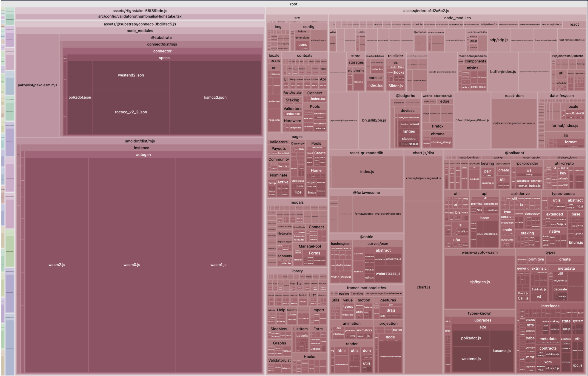

---v

<pba-cols>
<pba-col style="font-size:24px">

## Local Storage

- Use local storage to cache data derived from heavy computations

- Size limits vary per browser, most have 5MB / 2.5M character limits

- Test local storage limits: http://dev-test.nemikor.com/web-storage/support-test/

- Brave localStorage: limited to 5101k characters

</pba-col>
<pba-col style="font-size:24px">

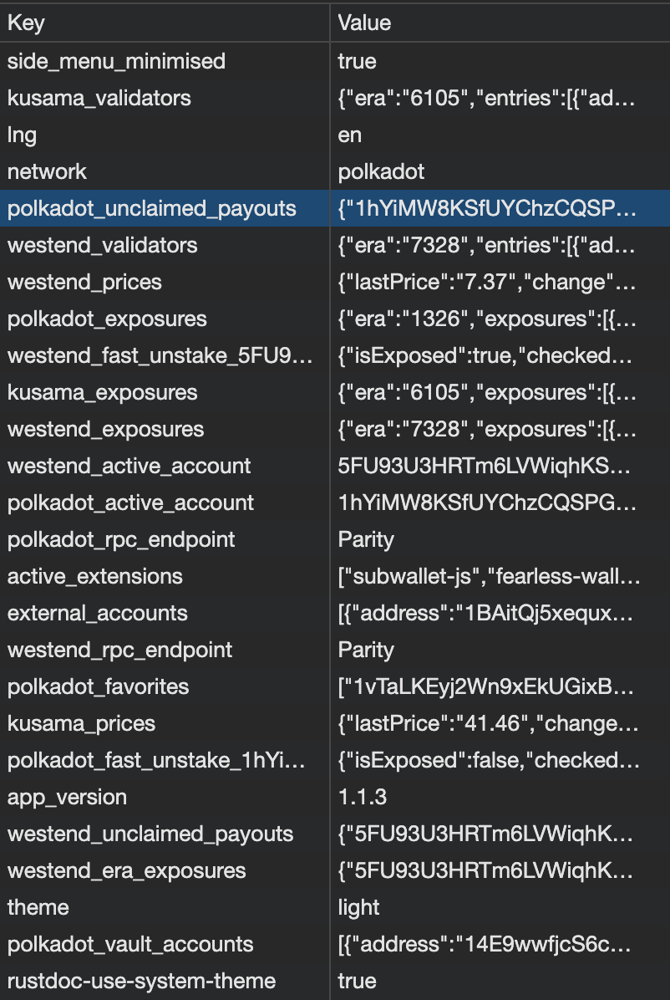

</pba-col>
</pba-cols>

---v

## Offline / Online Detection

- Dapps tend to host interfaces for real time data.
<!-- .element: class="fragment" -->
- Therefore, they need to reflect their connection status at all times.
<!-- .element: class="fragment" -->

<span>

- Tools:
  - Navigator.onLine, query or subscribe
  - Polling (for VPN / Virtualisation scenarios)

</span>
<!-- .element: class="fragment" -->

<br/>

### How might a dapp decentralise polling?

<!-- .element: class="fragment" -->

---v

## Rendering in React

- React apps are constructed of components
<!-- .element: class="fragment" -->
- Components are constructed with JSX markup
<!-- .element: class="fragment" -->
- Every component can store state, and pass down data to child components as props
<!-- .element: class="fragment" -->
- When state changes, the component re-renders and the DOM is refreshed
<!-- .element: class="fragment" -->
- Every child component could potentially re-render if its props have changed
<!-- .element: class="fragment" -->

---v

## Simple React State Example

<span style="font-size: 24px">

```tsx
import type { Dispatch, FC, SetStateAction } from "react";
import { useState } from "react";

// React Component: App entry
const App: FC = () => {
  const [title, setTitle] = useState<string>("Hello World");

  return (
    <div>
      <h1>{title}</h1>
      <UpdateTitleButton setTitle={setTitle} />
    </div>
  );
};

// React component: update button
const UpdateTitleButton: FC = ({ setTitle }: { setTitle: Dispatch<SetAction<string>> }) => {
  const handleChangeTitle = () => {
    setTitle(generateRandomPhrase());
  };

  return <button onClick={() => handleChangeTitle()}>Update Title</button>;
};
```

</span>

---v

## Rendering in React with Polkadot JS API

- Now imagine if a Polkadot JS API subscription is setting state.
<!-- .element: class="fragment" -->
- Many components will be using this state via hooks and context providers (out of scope of this lecture).
<!-- .element: class="fragment" -->
- Every time the callback function is executed, component state is updated.
<!-- .element: class="fragment" -->
- This can lead to excessive re-renders.
<!-- .element: class="fragment" -->
- This issue is exacerbated the more API calls you introduce.
<!-- .element: class="fragment" -->
- Your dapp will eventually experience slowdown and performance issues.
<!-- .element: class="fragment" -->

---v

## Tools to prevent excessive re-renders

<span>

- Populate all initial state values with one update, then subscribe.

</span>
<!-- .element: class="fragment" -->

<span>

- `useMemo`: Caches a computation result between re-renders.

</span>
<!-- .element: class="fragment" -->

<span>

- `useCallback`: Caches a functon definition between re-renders.

</span>
<!-- .element: class="fragment" -->

<span>

- `useRef`: Allows persisting of values between re-renders without causing a re-render - useful for `unsub`s.

</span>
<!-- .element: class="fragment" -->

<span>

<br/>
<span style="font-weight: bold">

- Only use state required to determine UI updates.

- Deliver custom events from outside React.

</span>
<!-- .element: class="fragment" -->

---v

## Only Use State Required to Determine UI Updates

What should be stored in state?

<br/>

<div style='text-align: left; padding-left: 2rem'>

✅ &nbsp;&nbsp;The `network` the dapp is trying to connect to.

❌ &nbsp;&nbsp;Polkadot JS API `provider`

❌ &nbsp;&nbsp;Polkadot JS API `api` instance

✅ &nbsp;&nbsp;Connection status (connected, disconnected, connecting, error).

✅ &nbsp;&nbsp;API is ready to be used.

</div>

---v

<div style="padding: 0 2rem">

## Deliver Custom Events From Outside React

Better separation of concerns

<br/>

</div>

<pba-cols>
<pba-col style="font-size:24px; width: 500px">

Outside React

```typescript
// `BalancesController.ts
//
// Static class that handles API subscriptions
// and dispatches custom events to `document`.
const unsub = api.query.system.account(
    '//Alice',
    (result) => {
      document.dispatchEvent(
        new CustomEvent('new-balance-update', {
          detail: {
            result.toHuman()
          },
        })
      );
});


this._unsubs.push(unsub);
```

</pba-col>
<pba-col style="font-size:24px; width: 500px">

Inside React

```typescript
// Balances.tsx
//
// Listens to custom events and updates state
// accordingly.
const newBalanceUpdateCallback = (e: Event) => {
  if (isCustomEvent(e)) {
    const { balances } = e.detail;
    setBalances(balances);
  }
};

// Add event listener for notifications.
const ref = useRef<Document>(document);
useEventListener("new-balance-update", newBalanceUpdateCallback, ref);
```

</pba-col>
</pba-cols>

</span>

---

# Miscellaneous Mentions

---v

## XCM Tools

<br/>

### Asset Transfer API

Typescript API for transferring XCM assets across chains.

https://github.com/paritytech/asset-transfer-api

<br/>

### ParaSpell

General purpose XCM API, Router and SDK.

https://paraspell.github.io/docs/

---v

## Using AI in Your Workflows

<span>

- ChatGPT has various use cases:
  - Can simplify code. “Can you make this code more efficient or simpler?”
  - Can provide in-app Q&A with latest models.

</span>
<!-- .element: class="fragment" -->

<span>

- Github Copilot - becoming very useful and is worth using.
  - Predicts code as you write it, oftentimes with impressive accuracy, provides help & solutions to inline errors.

</span>
<!-- .element: class="fragment" -->

- Dall-E can be used to generate dapp interfaces.
<!-- .element: class="fragment" -->
- Illustrator AI prompts can generate vector artwork.
<!-- .element: class="fragment" -->

<br/>

<span style="font-weight: bold">

- It will become easier to mimic or fake dapps - social engineering.
  - Remember: Not your keys, not your coins.

</span>
<!-- .element: class="fragment" -->

---v

# Questions?
