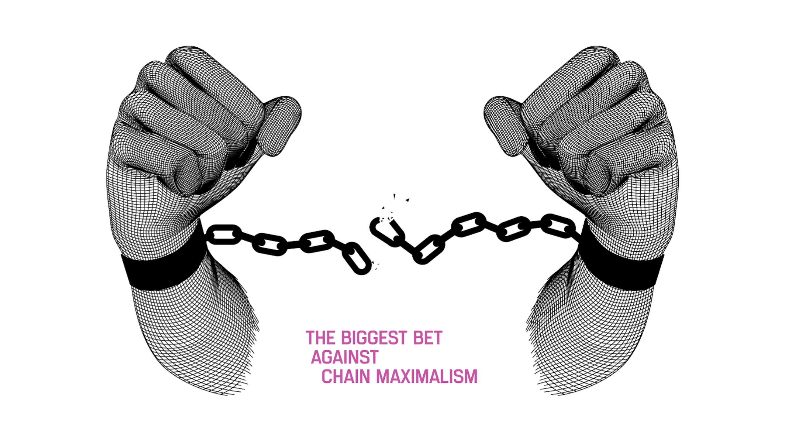

# The Decisions of Polkadot

---

## The Decisions of Polkadot

This presentation will try to distinguish the core decisions of Polkadot from the current implementation details of the network.

---

## Creating an “Invention Machine”

Jeff Bezos outlined in an annual letter to Amazon shareholders how he approaches decision making, by categorizing decisions as either Type 1 or Type 2 decisions.

Notes:

https://www.sec.gov/Archives/edgar/data/1018724/000119312516530910/d168744dex991.htm

---

## Type 1 Decisions

> Some decisions are consequential and irreversible or nearly irreversible – **one-way doors** – and these decisions must be made methodically, carefully, slowly, with great deliberation and consultation. If you walk through and don't like what you see on the other side, you can't get back to where you were before. We can call these Type 1 decisions.

---

## Type 2 Decisions

> But most decisions aren't like that – they are changeable, reversible – **they're two-way doors**. If you've made a suboptimal Type 2 decision, you don't have to live with the consequences for that long. You can reopen the door and go back through. Type 2 decisions can and should be made quickly by high judgment individuals or small groups.

---

## In the context of blockchains...

<pba-cols>
<pba-col>

### Type 1 Decisions

Decisions that cannot easily be changed in the future.

- Must be a part of the original protocol design.
- Changes might as well be considered a new protocol.

</pba-col>
<pba-col>

### Type 2 Decisions

Decisions that can be easily changed in the future.

- Can be included into the protocol at a later time.
- Changes can be considered as part of the evolution of the protocol.

</pba-col>
</pba-cols>

---

## The Philosophies of Polkadot

---

<image src="../../../assets/img/7-Polkadot/less-trust-more-truth.svg" style="width: 1000px; filter: invert();">

Notes:

This is the slogan of the Web3 Summit, and seeing that Polkadot is our biggest bet on a Web3 future, it is apt that we use this phrase as a staple of the philosophy which backs Polkadot. The whole reason we have developed blockchain technologies was to address the trust problems that we face with those who wield power in our world.

I want to note the phrase is NOT “No Trust, Only Truth”. This, from what I can tell so far, is mostly impossible. We should not use points of trust to invalidate working solutions. For example, it is not an expectation everyone who uses Polkadot will read each individual line of open source code before they run it. Our goal should be to minimize trust, where possible, and make it obvious to everyone who uses our tools what kinds of trust assumptions they run on

---

## Against Blockchain Maximalism

Notes:

Polkadot fundamentally believes in a multi-chain future. One where chains cooperate and provide greater value to one another, rather than where they strictly compete and try to kill one another. This is rare to find today, since cryptocurrencies are prone to becoming “investment vehicles”, where the creation of a new blockchain can be seen as a threat to the existing “investments”. With the blockchain maximalism mentality, people are choosing to value their “investments” over innovation and progression, and this isn’t best for our goals to provide the best technologies to the world.

---

## “The best blockchain today will not be the best blockchain tomorrow.”

Notes:

This philosophy is a realization that building a blockchain is trying to build a piece of software which will last forever. The we will not be successful engineering Polkadot simply for the problems we find today. By the time we have built X, the world will need Y, and so on. This is why we have invested so much time building platforms and SDKs, not just products. We need to make sure these technologies are able to adapt and evolve in order to stay relevant for users

---

## The Goals of Polkadot

---

## The Blockchain Scalability Trilemma

<image src="../../../assets/img/7-Polkadot/trilemma.svg" style="height: 400px;">

- Security: How much does it cost to attack the network?

- Scalability: How much work can the network do?

- Decentralization: How decentralized is the network?

---

## In one sentence...

> Polkadot’s mission is to provide secure, scalable, and resilient infrastructure for Web3 applications and services.

Notes:

Note the difference between “decentralization” as a mission vs "resilience".

---

Polkadot tries to accomplish that mission by solving three problems:

<pba-flex center>

1. Computational Scalability
2. Shared Security
3. Interoperability

</pba-flex>
---

## The Decisions

---

## Wasm

WebAssembly is the backbone of Polkadot. It is a fast, safe, and open meta-protocol which powers all of the state transitions of our ecosystem.

It standardizes how chains execute, sandboxes that execution for improved security, and allows teams to build on Polkadot using any language that can be compiled into Wasm.

---

## Sharding

Polkadot scales primarily by parallelizing execution on separate data shards.

These parallel chains (shards) are called Parachains.

---

## App-Chains

Another key scaling decision is the choice of heterogeneous shards, allowing for application specific chains.

Specialized solutions for problems are more performant than generalized solutions, as they can incorporate more details about the problem space.

---

## Interoperability

Individual application chains will inherently lack the ability to provide a full suite of solutions for end users.

Interoperability allows parachains to work together to complete, complex end-to-end scenarios.

---

## XCMP & XCM

<pba-cols>
<pba-col>

### Cross-Chain Message-Passing

<image src="../../../assets/img/7-Polkadot/xcmp-2.svg" style="height: 500px;">

</pba-col>
<pba-col>

### Cross-Consensus Message Format

<image src="../../../assets/img/7-Polkadot/xcm-stack.svg" style="height: 500px;">

- Type 2 Decision

</pba-col>
</pba-cols>

---

## Shared Security

An often overlooked problem is economic scaling of the entire blockchain ecosystem.

Polkadot is unique in that it provides all connected parachains with the same security guarantees as the Relay Chain itself.

<image src="../../../assets/img/0-Shared/parachains/parachains-transparent.png" style="width: 500px">

Notes:

Security in proof-of-stake networks depends on economics, so there can only exist a limited amount of security in the world because economic value is, by definition, limited. As the number of blockchains increases due to scaling issues on single chains, their economic value — and therefore their security — gets spread out over multiple chains, leaving each one weaker than before.

Polkadot introduces a shared security model so that chains can interact with others while knowing full well that their interlocutors have the same security guarantees as their own chain. Bridge-based solutions — where each chain handles its own security — force the receiver to trust the sender.  Polkadot’s security model provides the necessary guarantees to make cross-chain messages meaningful without trusting the security of the sender.

---

## Trust-Free Interactions

<pba-cols>
<pba-col>

<image src="../../../assets/img/7-Polkadot/xcmp-finalization.svg" style="height: 500px;">

</pba-col>
<pba-col>

A key result of shared security through the Relay Chain is that it keeps track of the state of all parachains and keeps them in lock step.

That means blocks which are finalized on Polkadot imply finalization of all interactions between all parachains at the same height.

So, shared security not only secures the individual chains, but the interactions between chains too.

</pba-col>
</pba-cols>

---

## Hybrid Consensus

## BABE

### Block Production

BABE is forkful, with probabilistic finality.

## GRANDPA

### Finality Gadget

---

## Light Client First Mentality

Polkadot has a strong belief that light clients are a necessary component for a Web3 future. It has been uncompromising in enabling first class light client support as a primary part of its development process:

- In-Browser Wasm Client (Substrate Connect)
	- Wasm state transition function too!
- Consensus data integrated into block headers
- Merkle Tries and other LC compatible data structures
- Maximizing statically known metadata to offset reliance on full nodes.

---

## On-Chain Runtime & Forkless Upgrades

The Polkadot protocol specification defines a clear separation between the blockchain client and runtime (state transition function).

This is primarily useful to implement the Parachains protocol, but also allows for chains to “forklessly” upgrade their code.

This gives the Polkadot Relay Chain and all connected parachains an evolutionary advantage over others in the blockchain space.

---

## On-Chain Governance

Polkadot and its parachains need to change over time to stay relevant, and the network was designed from the beginning to have a transparent and sophisticated process to not only approve or reject changes but also **enact them automatically**.

- Governance decisions can literally change the underlying code of the chain (since it is on-chain).
- 50% of the total stake in the system should be able to control the future of the system.
- Users have the option to lock their tokens to increase the “conviction” of their vote.

---

## On-Chain Treasury

Polkadot has designed at its core a self-funded treasury pool to incentivize the development and evolution of the protocol.

It is entirely controlled on-chain by the governance system of Polkadot, which means that it is immune to the regulations which would normally be imposed to centralized entities.

---

## Nominated Proof-of-Stake

- Type 2 Decision

One of Polkadot’s primary functions is to provide security not only to itself, but also to the connected Parachains. The staking system is a critical focus of the network, and we have one of the most advanced staking systems to date.

- NPoS over DPoS to better allocate stake.
	- At the cost of complexity and scaling.
- Economic incentives to distribute funds evenly across validators.
- Super-linear slashing system to discourage validator centralization.
- Actual value being generated by staking, justifying rewards.

---

## Other Type 2 Decisions

Polkadot has made many Type 2 decisions, many of which have already, and will continue to change over time:

- The specifics of the governance process (most recently OpenGov)
- Extensions to staking (like nomination pools, fast unstake, etc…)
- Integrated multi-sig, proxies, batching, account abstractions, etc…
- Treasury spending outlets (tips, bounties, fellowship, etc…)
- On-chain storage management, data structures, and deposits.
- Allocation of Parachain execution cores (pay-as-you-go vs long term).
- XCM format, available instructions, and message queue behavior.
- and so on…

---

## A Format for Discussing Decisions

- What is (the decision)?
- What do we need to consider when making (the decision)?
	- Is it a Type 1 or Type 2 decision?
- What decisions has (chain) decided to make and why?
	- What tradeoffs have they chosen?
- What decisions have others decided to make?
	- How might those decisions be better or worse?
- Where can the blockchain community still improve on (the decision)?
