# Cross-Consensus Messaging (XCM)

## _Core Concepts, Terms, and Logic_

Notes:

**Pre-requisites**

- FRAME (Storage Items, Dispatchables, Event, Errors, etc.)
- Polkadot & parachains conceptually
- Assets (NFTs and fungibles)

---v

## _At the end of this lecture, you will be able to:_

<pba-flex center>

- Define the concepts, syntax, and terms of XCM
- Navigate existing resources that relate to XCM
- Differentiate between XCM and message-passing protocols like XCMP

---

# Cross-chain use cases

Why would we want to perform operations on different blockchains?

Notes:

EXERCISE: ask the class to raise hands and postulate on generally what one might do.
We are expecting them to say transfers, but there are so many other things you could do, so many more problems worth solving with cross-chain:
- One contract calling another contract
- Credential checking
- Voting

---v

## 🎬 Some Concrete Use-cases

<pba-flex center>

- Cross-consensus asset transfers
- Execute platform-specific actions such as governance voting
- Enables single use-case chains
    - [Collectives](https://github.com/paritytech/cumulus/tree/master/parachains/runtimes/collectives)
    - Identity chains

Notes:

While the goal of XCM is to be general, flexible and future-proof, there are of course practical needs which it must address, not least the transfer of tokens between chains.
We need a way to reason about, and pay for, any required fees on the receiving CS.
Platform-specific action; for example, within a Substrate chain, it can be desirable to dispatch a remote call into one of its pallets to access a niche feature.
XCM enables a single chain to direct the actions of many other chains, which hides the complexity of multi-chain messaging behind an understandable and declarative API.

---

> XCM is a **language** for communicating **intentions** between **consensus systems**.

---v

### Consensus systems

A chain, contract or other global, encapsulated, state machine singleton.

<pba-flex center>

It does not even have to be a _distributed_ system, only that it can form _some_ kind of consensus.

Notes:

A consensus system does not necessarily have to be a blockchain or a smart contract.
It can be something that already exists in the Web 2.0 world, such as an EC2 instance in an AWS server.
XCM is Cross-Consensus since it's much more than cross chain.

---v

### ✉️ A Format, not a Protocol

XCM is a **_messaging format_**.

It is akin to the post card from the post office.

It is _not_ a messaging protocol!

A post card doesn't send itself!

Notes:

It cannot be used to actually "send" any message between systems; its utility is only in expressing what should be done by the receiver.
Like many aspects core to Substrate, this separation of concerns empowers us to be far more generic and enable much more.
A post card relies on the postal service to get itself sent towards its receivers, and that is what a messaging protocol does.

The transport layer concerns itself with sending arbitrary blobs, it doesn't care about the format.
A common format has its benefits though, as we'll see next.

---

## 😬 Why not _native_ messages?

Drawbacks of relying on native messaging or transaction format:

<pba-flex center>

- Native message format changes from system to system, it also could change within the _same_ system, e.g. when upgrading it
- Common cross-consensus use-cases do not map one-to-one to a single transaction
- Different consensus systems have different assumptions e.g. fee payment

Notes:

- A system which intends to send messages to more than one destination would need to understand how to author a message for each.
  On that note, even a single destination may alter its native transaction/message format over time.
  Smart contracts might get upgrades, blockchains might introduce new features or alter existing ones and in doing so change their transaction format.
- Special tricks may be required to withdraw funds, exchange them and then deposit the result all inside a single transaction.
  Onward notifications of transfers, needed for a coherent reserve-asset framework, do not exist in chains unaware of others.
  Some use-cases don't require accounts.
- Some systems assume that fee payment had already been negotiated, while some do not.

TODO: Why not just send EVM programs. Why XCVM instead of EVM?
Add Shawn's picture.
It's up to the interpreter to interpret the intention how it makes sense.

---v

### Message format changes


---v

### Message format changes


---v

### Message format changes


Notes:

XCM abstracts away the actual on-chain operation that will be called, which lets the recipient redirect calls to always make them valid.

---v

### No one-to-one mapping


Notes:

You might want to withdraw some assets and deposit some amount to one account and another to another.
Using transactions, you'd have to send many messages to achieve this.

---v

### Different assumptions


Notes:

Different systems have different assumptions.
Using native messages, you'd have to tailor your messages to all systems you want to message.

---

## Four 'A's

XCM assumes the following things from the underlying environment.

<pba-flex center>

- **Agnostic**
- **Absolute**
- **Asynchronous**
- **Asymmetric**

Notes:

The 4 'A's are assumptions XCM makes over the transport protocol and overall the environment where these messages are sent and processed.

---v

## Agnostic

XCM makes no assumptions about the nature of the Consensus System between which messages are being passed.

Notes:

XCM is not restricted to Polkadot, it's a language that can be used for communication between any systems.
For example, EVM-chains or Cosmos hubs.

---v

## Absolute

XCM assumes that the environment guarantees delivery, interpretation, and ordering of messages.

Notes:

The message format does not do much about the message possibly not being delivered.
In IBC, for example, you factor in fallibility of the transport protocol into your messages.

---v

## Asynchronous

XCMs crossing the barrier between a single consensus system cannot generally be synchronous.

XCM in no way assume that the sender will be blocking on messages.

Notes:

You can't just block execution in the middle of a block, it has to be asynchronous.
Different systems have different ways of tracking time.
No assumption of blocking for sender/receiver.

Generally, consensus systems are not designed to operate in sync with external systems.
They intrinsically need to have a uniform state to reason about and do not, by default, have the means to verify states of other consensus systems.
Thus, each consensus system cannot make any guarantees on the expected time required to deliver results; doing so haphazardly would cause the recipient to be blocked waiting for responses that are either late or would never be delivered, and one of the possible reasons for that would be an impending runtime upgrade that caused a change in how responses are delivered.

---v

## Asymmetric

XCM doesn't assume there'll be messages flowing in the other direction.

If you want to send responses, you have to make it explicitly.

Notes:

There are no results or callbacks.
Any results must be separately communicated to the sender with an additional message.
The receiver side can and does handle errors, but the sender will not be notified, unless the error handler specifically tries to send back an XCM that makes some sort of XCM that notifies status back to the origin, but such an action should be considered as constructing a separate XCM for the sole purpose of reporting information, rather than an intrinsic functionality built into XCM.
XCM is a bit like REST. XCMP is a bit like TCP/IP. Not quite. Analogies can often hurt more than they help.

---

## 📍 Locations in XCM

How does one consensus system address another?

We need a concept of locations.

A location might be the whole system or an isolatable part in the system.

<pba-flex center>

Examples:

- Accounts
- Smart contracts
- Pallets
- Blockchains

Notes:

The `Location` type identifies any single _location_ that exists within the world of consensus.
Representing a scalable multi-shard blockchain such as Polkadot, an ERC-20 asset account on a parachain, a smart contract on some chain, etc.
It is always represented as a location _relative_ to the current consensus system, and never as an absolute path, due to the fact that the network structure can always change, and so absolute paths can quickly go out of date.

---v

## Location hierarchy


Notes:

Locations form a hierarchy.

---v

## Location Representation

<pba-cols>

<pba-col>

```rust
struct Location {
    parents: u8,
    junctions: Junctions,
}
```

</pba-col>

<pba-col>

```rust
enum Junction {
    Parachain,
    AccountId32,
    PalletInstance,
    GeneralIndex,
    GlobalConsensus,
    ...
}
```

</pba-col>

</pba-cols>

Notes:

Junctions are ways to descend the location hierarchy

---v

## Universal location

We can imagine a hypothetical location that contains all top-level consensus systems.


---v

## Relative vs absolute

We can express locations in two ways, relative or absolute.

In general, relative locations are better.

In the case of bridges, absolute locations are needed.

Notes:

We need relative locations because some consensus systems might change their location.
If a system moves, relative is better.

---v

## Cross-Consensus Origins

`Location`s are used to denote where an XCM originated from

_Relative_ to the current location

Can be converted into a pallet origin in a FRAME runtime

Used for determining privileges during XCM execution.

Notes:

Reanchoring:
Since `Location`s are relative, when an XCM gets sent over to another chain, the origin location needs to be rewritten from the perspective of the receiver, before the XCM is sent to it.

---

## Location Examples

---v

### Sibling parachain

`../Parachain(1001)`

```mermaid
graph TD
    Polkadot(Polkadot)-->AssetHub("📍 AssetHub (1000)")
    Polkadot-->Collectives("Collectives (1001)")
```

Notes:

What does the location resolve to if evaluated on Parachain(1000)?

---v

### Sibling parachain

`../Parachain(1001)`

```mermaid
graph TD
    Polkadot(Polkadot)-->AssetHub("📍 AssetHub (1000)")
    Polkadot-->Collectives("Collectives (1001)")
    AssetHub-->Polkadot
    linkStyle 0 opacity:0.3
    linkStyle 2 stroke-dasharray:5
```

---v

### Relay account

`../AccountId32(0x1234...cdef)`

```mermaid
graph TD
    Polkadot-->AssetHub("📍 AssetHub (1000)")
    Polkadot-->Collectives("Collectives (1001)")
    Polkadot-->Account("AccountId32 (0x1234...cdef)")
```

Notes:

What does the location resolve to if evaluated on Parachain(1000)?

---v

### Relay account

`../AccountId32(0x1234...cdef)`

```mermaid
graph TD
    Polkadot(Polkadot)-->AssetHub("📍 AssetHub (1000)")
    Polkadot-->Collectives("Collectives (1001)"):::disabled
    Polkadot-->Account("AccountId32 (0x1234...cdef)")
    AssetHub-->Polkadot
    linkStyle 0 opacity:0.3
    linkStyle 1 opacity:0.3
    linkStyle 3 stroke-dasharray:5
    classDef disabled opacity:0.3
```

---v

### Parachain account

`Parachain(1000)/AccountId32(0x1234...cdef)`

```mermaid
graph TD
    Polkadot("📍 Polkadot")-->AssetHub("AssetHub (1000)")
    Polkadot-->Collectives("Collectives (1001)")
    AssetHub-->Account("AccountId32 (0x1234...cdef)")
```

Notes:

What does the location resolve to if evaluated on the relay chain?

---v

### Parachain account

`Parachain(1000)/AccountId32(0x1234...cdef)`

```mermaid
graph TD
    Polkadot("📍 Polkadot")-->AssetHub("AssetHub (1000)")
    Polkadot-->Collectives("Collectives (1001)"):::disabled
    AssetHub-->Account("AccountId32 (0x1234...cdef)")
    linkStyle 1 opacity:0.3
    classDef disabled opacity:0.3
```

---v

### Bridge

`../../GlobalConsensus(Kusama)/Parachain(1000)`

```mermaid
graph TD
    Universe(Universal Location)-->Polkadot(Polkadot)
    Universe-->Kusama(Kusama)
    Polkadot-->PolkaA("📍 Asset Hub (1000)")
    Polkadot-->PolkaB(Bridge Hub)
    PolkaA-->Alice(Alice)
    PolkaA-->AssetsPallet(Pallet Assets)
    AssetsPallet-->Asset(USDT)
    Kusama-->KusamA("Asset Hub (1000)")
    Kusama-->KusamB(Bridge Hub)
```

Notes:
Speak to an example of non-parachain multi-location that would use a bridge
XCM reasons about addressing (as in a postal address) that must include understanding where you are, not just where you are going!
This will be very powerful later on (Origins)

---v

### Bridge

`../../GlobalConsensus(Kusama)/Parachain(1000)`

```mermaid
graph TD
    Universe(Universal Location)-->Polkadot(Polkadot)
    Universe-->Kusama(Kusama)
    Polkadot-->PolkaA("📍 Asset Hub (1000)")
    Polkadot-->PolkaB(Bridge Hub):::disabled
    PolkaA-->Alice(Alice):::disabled
    PolkaA-->AssetsPallet(Pallet Assets):::disabled
    AssetsPallet-->Asset(USDT):::disabled
    Kusama-->KusamA("Asset Hub (1000)")
    Kusama-->KusamB(Bridge Hub):::disabled
    PolkaA-->Polkadot
    Polkadot-->Universe
    linkStyle 0 opacity:0.3
    linkStyle 2 opacity:0.3
    linkStyle 3 opacity:0.3
    linkStyle 4 opacity:0.3
    linkStyle 5 opacity:0.3
    linkStyle 6 opacity:0.3
    linkStyle 8 opacity:0.3
    linkStyle 9 stroke-dasharray:5
    linkStyle 10 stroke-dasharray:5
    classDef disabled opacity:0.3
```

Notes:

Even with Bridge Hubs, the relative location is what you'd expect.
Bridge Hubs are just a way for routing messages.
They are an implementation detail of the transport layer.

---

<pba-col>

## 💰 Assets in XCM

Most messages will deal with assets in some way.

How do we address these assets?

---v

### Asset Representation

```rust
struct Asset {
    pub id: AssetId,
    pub fun: Fungibility,
}

struct AssetId(Location); // <- We reuse the location!

enum Fungibility {
    Fungible(u128),
    NonFungible(AssetInstance),
}
```

Notes:

We use locations, which we've already discussed, to refer to assets.

A Asset is composed of an asset ID and an enum representing the fungibility of the asset.
Asset IDs are the location that leads to the system that issues it, this can be just an index in an assets pallet, for example.

Assets can also either be fungible or non-fungible:
Fungible - each token of this asset has the same value as any other
NonFungible - each token of this asset is unique and cannot be seen as having the same value as any other token under this asset

---v

### Asset filtering and wildcards

```rust
enum AssetFilter {
    Definite(Assets),
    Wild(WildAsset),
}

enum WildAsset {
    All,
    AllOf { id: AssetId, fun: WildFungibility },
    // Counted variants
}

enum WildFungibility {
    Fungible,
    NonFungible,
}
```

Notes:

Sometimes we don't want to specify an asset, but rather filter a collection of them.
In this case, we can either list all the assets we want or use a wildcard to select all of them.
In reality, it's better to use the counted variant of the wildcards, for benchmarking.

---

## Reanchoring

How do different locations reference the same asset?


Notes:

Locations are relative, so they must be updated and rewritten when sent to another chain.

---v

### DOT from Asset Hub

```mermaid
graph TD
    Polkadot(Polkadot)-->AssetHub("📍 Asset Hub (1000)")
    Polkadot-->Collectives("Collectives (1001)"):::disabled
    AssetHub-->Alice(Alice):::disabled
    AssetHub-->AssetsPallet(Pallet Assets):::disabled
    AssetsPallet-->Asset(USDT):::disabled
    AssetHub-->Polkadot
    linkStyle 0 opacity:0.3
    linkStyle 1 opacity:0.3
    linkStyle 2 opacity:0.3
    linkStyle 3 opacity:0.3
    linkStyle 4 opacity:0.3
    linkStyle 5 stroke-dasharray:5
    classDef disabled opacity:0.3
```

`../Here`

Notes:

Native tokens are referenced by the location to their system.

---v

### DOT from Alice

```mermaid
graph TD
    Polkadot(Polkadot)-->AssetHub("Asset Hub (1000)")
    Polkadot-->Collectives("Collectives (1001)"):::disabled
    AssetHub-->Alice("📍 Alice")
    AssetHub-->AssetsPallet(Pallet Assets):::disabled
    AssetsPallet-->Asset(USDT):::disabled
    Alice-->AssetHub
    AssetHub-->Polkadot
    linkStyle 0 opacity:0.3
    linkStyle 1 opacity:0.3
    linkStyle 2 opacity:0.3
    linkStyle 3 opacity:0.3
    linkStyle 4 opacity:0.3
    linkStyle 5 stroke-dasharray:5
    linkStyle 6 stroke-dasharray:5
    classDef disabled opacity:0.3
```

`../../Here`

---v

### Universal Location of DOT

```mermaid
graph TD
    Universe("📍 Universal Location")-->Polkadot(Polkadot)
    Polkadot-->AssetHub("Asset Hub (1000)"):::disabled
    Polkadot-->Collectives("Collectives (1001)"):::disabled
    AssetHub-->Alice(Alice):::disabled
    AssetHub-->AssetsPallet(Pallet Assets):::disabled
    AssetsPallet-->Asset(USDT):::disabled
    linkStyle 1 opacity:0.3
    linkStyle 2 opacity:0.3
    linkStyle 3 opacity:0.3
    linkStyle 4 opacity:0.3
    linkStyle 5 opacity:0.3
    classDef disabled opacity:0.3
```

`GlobalConsensus(Polkadot)`

---v

### USDT from Asset Hub

```mermaid
graph TD
    Polkadot(Polkadot):::disabled-->AssetHub("📍 Asset Hub (1000)")
    Polkadot-->Collectives("Collectives (1001)"):::disabled
    AssetHub-->Alice(Alice):::disabled
    AssetHub-->AssetsPallet(Pallet Assets)
    AssetsPallet-->Asset(USDT)
    linkStyle 0 opacity:0.3
    linkStyle 1 opacity:0.3
    linkStyle 2 opacity:0.3
    classDef disabled opacity:0.3
```

`PalletInstance(50)/GeneralIndex(1984)`

---v

### USDT from Collectives

```mermaid
graph TD
    Polkadot(Polkadot)-->AssetHub("Asset Hub (1000)")
    Polkadot-->Collectives("📍 Collectives (1001)")
    AssetHub-->Alice(Alice):::disabled
    AssetHub-->AssetsPallet(Pallet Assets)
    AssetsPallet-->Asset(USDT)
    Collectives-->Polkadot
    linkStyle 1 opacity:0.3
    linkStyle 2 opacity:0.3
    linkStyle 5 stroke-dasharray:5
    classDef disabled opacity:0.3
```

`../Parachain(1000)/PalletInstance(50)/GeneralIndex(1984)`

---v

### Reanchoring to the rescue


<!-- TODO: Here it would be better to link to the subgraphs themselves, but we need a newer version of MermaidJS for that -->

---

## 🤹 Cross-consensus transfers

Notes:

The two ways of transferring assets between consensus systems are teleports and reserve transfers.

---v

### Sovereign Accounts


Notes:

A sovereign account is an account on one system that is controlled by another on a different system.
A single account on a system can have multiple sovereign accounts on many other systems.
In this example, Alice is an account on AssetHub, and it controls a sovereign account on Collectives.

When transferring between consensus systems, the sovereign account is the one that gets the funds on the destination system.

---v

### 1. Asset teleportation


Notes:

Teleportation works by burning the assets on the source chain and minting them on the destination chain.
This method is the simplest one, but requires a lot of trust, since failure to burn or mint on either side will affect the total issuance.

---v

### 2. Reserve asset transfers


Notes:

Reserve asset transfers are more complicated, since they bring in a third actor called the reserve chain.
Chain A and B needn't trust each other, they only need to trust the reserve chain.
The reserve chain holds the real assets, A and B deal only with derivatives.
The transfer is made by burning derivatives from A, moving them from A's SA to B's SA in R, then minting on B.

In some cases, the sender, A, can also be the reserve for a particular asset, in which case the process is simplified, there's no burning of derivatives.
This usually happens with parachains' native tokens.

---v

## Next steps

<pba-flex center>

1. Blog series introducing XCM: Parts [1](https://medium.com/polkadot-network/xcm-the-cross-consensus-message-format-3b77b1373392), [2](https://medium.com/polkadot-network/xcm-part-ii-versioning-and-compatibility-b313fc257b83), and [3](https://medium.com/polkadot-network/xcm-part-iii-execution-and-error-management-ceb8155dd166).
2. XCM Format [repository](https://github.com/paritytech/xcm-format)
3. XCM [Docs](https://paritytech.github.io/xcm-docs/)

---

<figure>
    
    <figcaption>Source: <a href="https://polkadot.subscan.io/xcm_dashboard">Subscan</a></figcaption>
</figure>
