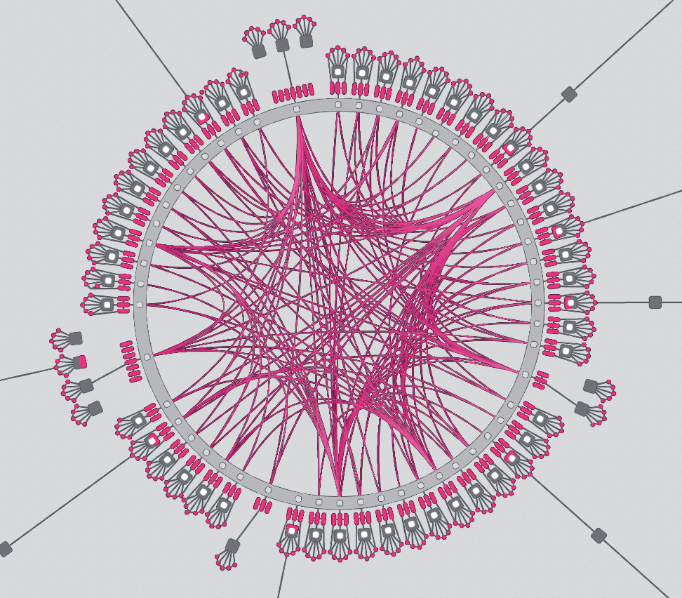

# Cross Consensus Messaging (XCM)

## _Core Concepts, Terms, and Logic_

Notes:

**Pre-requisites**

- FRAME (Storage Items, Dispatchables, Event, Errors, etc.)
- Polkadot & parachains conceptually
- Assets (NFTs and fungibles)

---

## _At the end of this lecture, you will be able to:_

- Define the concepts, syntax, and terms of XCM
- Navigate exiting resources that relate to XCM
- Differentiate between XCM and message-passing protocols like XCMP

---

## What cross-chain use cases exist?

Performing operations on different blockchains?

How might you go about designing a _system_ to facilitate them?

Notes:

EXERCISE: ask the class to raise hands and postulate on generally what one might do.

---

## 🎬 Some Concrete Use-cases

1. Cross-consensus asset transfers
2. Execute platform-specific actions (extrinsics) such as governance voting
3. Enables single use-case chains e.g. [Statemint/e](https://github.com/paritytech/cumulus/tree/master/parachains/runtimes/assets) as asset parachains

Notes:

While the goal of XCM is to be general, flexible and future-proof, there are of course practical needs which it must address, not least the transfer of tokens between chains.
We need a way to reason about, and pay for, any required fees on the receiving CS.
Platform-specific action; for example, within a Substrate chain, it can be desirable to dispatch a remote call into one of its pallets to access a niche feature.
XCM enables a single chain to direct the actions of many other chains, which hides the complexity of multi-chain messaging behind an understandable and declarative API.

---

### XCM aims to be a _language communicating ideas between consensus systems._

---

## Cross _Consensus_?

**Consensus systems**: A chain, contract or other global, encapsulated, state machine singleton.

- Can be any programmatic state-transition system that exists within consensus which can send/receive datagrams.
- It does not even have to be a _distributed_ system, only that it can form _some_ kind of consensus.

Notes:

A consensus system does not necessarily have to be a blockchain or a smart contract, it can be something that already exists in the Web 2.0 world, such as an AWS server.

---

## 🤟 A Format, not a Protocol

XCM is a **_messaging format_**.

- It is akin to the post card from the post office

It is _not_ a messaging protocol!

- A post card doesn't send itself!

Notes:

It cannot be used to actually “send” any message between systems; its utility is only in expressing what should be done by the receiver.
like many aspects core to Substrate, this separation of concerns empowers us to be far more generic and enable much more.
A post card relies on the postal service to get itself sent towards its receivers, and that is what a messaging protocol does.

---

## 😬 Why not _native_ messages?

Drawbacks of relying on native messaging or transaction format:

- Lack of uniformity between consensus systems on message format
- Common cross-consensus use-cases do not map one-to-one to a single transaction
- Operations on consensus systems have different assumptions e.g. fee payment

Notes:

- A system which intends to send messages to more than one destination would need to understand how to author a message for each.
  On that note, even a single destination may alter its native transaction/message format over time.
  Smart contracts might get upgrades, blockchains might introduce new features or alter existing ones and in doing so change their transaction format.
- Special tricks may be required to withdraw funds, exchange them and then deposit the result all inside a single transaction.
  Onward notifications of transfers, needed for a coherent reserve-asset framework, do not exist in chains unaware of others.
- Some systems assume that fee payment had already been negotiated, while some do not.

---

## XCM Versioning

Based on the upcoming XCMv3

Most XCM can be auto-converted to the next version, but some require manual involvement

Every release only supports 2 versions: previous and current

Notes:

This would mean that when XCMv3 gets released, version 0 and 1 support will be dropped completely.
Expect a cadence of a release every 6 months.

---

## 📍 Locations in XCM

`MultiLocation` = a **_relative_** location in the consensus multiverse.

All entities are addressed as paths to them, _relative_ to the current consensus system.

```rust
pub struct MultiLocation {
    pub parents: u8,
    pub interior: Junctions,
}
```

Notes:

The `MultiLocation` type identifies any single _location_ that exists within the world of consensus.
Representing a scalable multi-shard blockchain such as Polkadot, a lowly ERC-20 asset account on a parachain, a smart contract on some chain, etc.
It is always represented as a location _relative_ to the current consensus system, and never as an absolute path, due to the fact that the network structure can always change, and so absolute paths can quickly go out of date.

---

## Junction

A single item in a path to describe the relative location of a consensus system:

- `Parachain`
- `AccountId32`
- `PalletInstance`
- `GeneralKey`

Notes:

This is akin to a directory on a file path, e.g. the `foo` in `/foo/bar`.

---

## Junction*s*\*

Enum containing multiple `Junction`s

```rust
enum Junctions {
    X1(Junction),
    X2(Junction, Junction),
    X3(Junction, Junction, Junction),
    // ...
    X8(Junction, /*...*/),
}
```

Notes:

An array like `[Junction; 8]` or a `Vec` is explicitly not used in place of the `Junctions` enum. This is because `Vec`s cannot be pattern-matched, and arrays have a fixed size at compilation time, and thus unused `Junction` "element slots" will always be required to be filled in, bloating the _encoded_ size of a `Junctions` data structure.

---

## MultiLocation Examples

<!-- TODO DESIGN: use multilocation graphic from above and add labels in fragment / new slide here -->
<!-- Base on this set of slides: https://docs.google.com/presentation/d/18qRqqw73L9NTWOX1cfGe5sh484UgvlpMHGekQHu9_8M/edit#slide=id.g8063ab3d6f_0_1418 . If hard, just make these into images via screenshot & use full screen -->

- `../Parachain(1000)`: Evaluated within a parachain, this would identify our sibling parachain of index 1000. (In Rust we would write `MultiLocation { parents: 1, junctions: X1(Parachain(1000)) }` or alternatively `ParentThen(Parachain(1000)).into()`.)
- `../AccountId32(0x1234...cdef)`: Evaluated within a parachain, this would identify the 32-byte account 0x1234…cdef on the relay chain.
- `Parachain(42)/AccountKey20(0x1234...abcd)`: Evaluated on a relay chain, this would identify the 20-byte account 0x1234…abcd on parachain number 42 (presumably something like Moonbeam which hosts Ethereum-compatible accounts).

<!-- TODO: speak to an example of non-parachain multi-location that would use a bridge -->

Notes:

XCM reasons about addressing (as in a postal address) that must include understanding where you are, not just where you are going!
This will be very powerful later on (Origins)

<!-- TODO: does XCM explicitly need to know the Origin of the message? Could there be anonymous XCM? (no "return to sender" field on mail) -->

---

## Construct a `MultiLocation`!

1. What is _your_ location?

2. Where do you _want to send to_?

3. Write your `MultiLocation`!

Notes:

EXERCISE: Prompt students to decide whe a MultiLocation correctly.
Encourage non-trivial (but direct!) paths like a specific contract on a parachain from Bitcoin.
Call on students to state their path and where they want to go.

---

## Cross-Consensus Accounts

### Sovereign Account

Within a consensus system, an account which belongs to another consensus system

encoded_bits = encoded(b"para") ++ encoded(ParaID) ++ 000000...

Parachain sovereign account = decoded(encoded_bits)

**ParaID CAN change over time!** Don't hard code these into a dapp!!

Notes:

A parachain sovereign account is created via encoding the byte string "para" first, then concatenated with the encoded `ParaId`, and after that, padded with a number of 0's until a 32-byte array is created out of it.
Note that the concatenation of an encoded "para" byte string and an encoded `ParaId` is always equal to 8 bytes, since the "para" byte string is only 4 characters long and the `ParaId` is defined as a 32-bit unsigned integer, therefore we can never grow beyond 32 bytes and will always need additional trailing zeroes to pad it until the resultant array becomes 32 bytes large.
We must have a 32-byte array, because that is how an `AccountId32` can be decoded from.

---

## Cross-Consensus Origins

A `MultiLocation` denoting where an XCM originated from

- _Relative_ to the current location

Can be converted into a pallet origin in a FRAME runtime

- Used for access control

Notes:

Since `MultiLocation`s are relative, when an XCM gets sent over to another chain, the origin location needs to be rewritten from the perspective of the receiver, before the XCM is sent to it. This is calling re-anchoring.

---

## `MultiLocation` established!

Now we know how to describe the destination, what _do we want to send_?

Let's start with messages (XCVM Programs!) about **_assets_**.

Notes:

---

## 🤹 Many models for transferring assets

1. "Remote control" an account on another system
2. Reserve transfers
3. Teleport transfers

Notes:

We might want to simply control an account on a remote chain, allowing the local chain to have an address on the remote chain for receiving funds and to eventually transfer those funds it controls into other accounts on that remote chain.

---


<!-- TODO DESIGN: get these in nice flexbox side-by-side -->

Notes:

<!-- TODO: use examples from here https://medium.com/polkadot-network/xcm-the-cross-consensus-message-format-3b77b1373392 to describe the images -->

---

<widget-columns>
<widget-column>

### 💰 `MultiAsset` in XCM

There are many _classes_ of assets (fungible, NFTs,...)

The datatype `MultiAsset` describes them all.

</widget-column>
<widget-column>

```rust
struct MultiAsset {
   id: AssetId,
   fun: Fungibility,
}
```

</widget-column>
</widget-columns>

---

## Asset Representation

```rust
struct MultiAsset {
    pub id: AssetId,
    pub fun: Fungibility,
}

enum AssetId {
    Concrete(MultiLocation),
    Abstract([u8; 32]),
}

enum Fungibility {
    Fungible(u128),
    NonFungible(AssetInstance),
}

enum AssetInstance {
    Undefined,
    Index(u128),
    Array4([u8; 4]),
    Array8([u8; 8]),
    Array16([u8; 16]),
    Array32([u8; 32]),
}
```

Notes:

A MultiAsset is composed of an asset ID and an enum representing the fungibility of the asset.
Asset IDs can either be Concrete or Abstract:
Concrete assets - can be identified by a `MultiLocation` path that leads to the system that issues it
Abstract assets - can be identified only by a label/name

Assets can also either be fungible or non-fungible:
Fungible - each token of this asset has the same value as any other
NonFungible - each token of this asset is unique and cannot be seen as having the same value as any other token under this asset

Non-fungible assets will then also need to further specify which exact token it represents under the same asset ID, and we use the AssetInstance enum to express the uniqueness of such a token.

---

## Convenience methods to create `MultiAsset`

```rust
/// Creates 10 billion units of fungible native tokens
let fungible_asset: MultiAsset = (Here, 10_000_000_000u128).into(); // or MultiAsset::from((Here, 10_000_000_000u128))

/// Creates an abstract NFT with an undefined asset instance
let nft_asset: MultiAsset = ([0; 32], ()).into();
```

Notes:

In Polkadot, a unit of native token = 1 planck, and 10 billion plancks = 1 DOT

---

## Asset Wildcards and Filters

```rust
enum WildMultiAsset {
    All,
    AllOf { id: AssetId, fun: WildFungibility },
    AllCounted(u32),
    AllOfCounted { id: AssetId, fun: WildFungibility, count: u32 },
}

enum WildFungibility {
    Fungible,
    NonFungible,
}

enum MultiAssetFilter {
    Definite(MultiAssets),
    Wild(WildMultiAsset),
}

struct MultiAssets(Vec<MultiAsset>);
```

Notes:

These are types used by various instructions that want to express the idea to select all of one kind of assets in the holding register, but do not know the exact amount of assets that already exists in holding.
"Wild" in this context has the same meaning as the "wild" in "wildcard".
The "counted" variants is used when we want to limit the amount of assets that the wildcard can select.
This is very useful in cases where we want to give an upper limit to the execution time required to select the assets within the holding register, or that we simply just want the specified number of types of assets within the specified class of assets.

---

## Reanchoring

`MultiLocation`s are relative.

Scenario:

Current consensus system is `Para(1337)`.
Destination consensus system is `Para(6969)`.

- Where is `Here`?
- What happens when I send a `MultiAsset` with an `AssetId` of `Concrete(Here)` to `Para(6969)`?

Notes: 
MultiLocations are relative, so they must be updated and rewritten when sent to another chain.

---

## 🫀 The XCVM

At the core of XCM lies the **Cross-Consensus Virtual Machine (XCVM)**.

A “message” in XCM is an XCVM program.

The XCVM is a state machine, state is kept track in **Registers**.

Notes:

It’s an ultra-high level non-Turing-complete computer whose instructions are designed to be roughly at the same level as transactions.
Messages are one or more XCM instructions.
The program executes until it either runs to the end or hits an error, at which point it finishes up and halts.
An XCM executor following the XCVM specification is provided by Parity, and it can be extended or customized, or even ignored altogether and users can create their own construct that follows the XCVM spec.

---

### XCVM Instructions

XCM Instructions might change a register, they might change the state of the consensus system or both.

One example of such an instruction would be `TransferAsset` which is used to transfer an asset to some other address on the remote system.
It needs to be told which asset(s) to transfer and to whom/where the asset is to be transferred.

```rust
enum Instruction {
    TransferAsset {
        assets: MultiAssets,
        beneficiary: MultiLocation,
    }
    /* snip */
}
```

Notes:

<!-- TODO: add detail for speaker -->

---

## XCVM Instructions preview

Four kinds of instructions:

- Instruction
- Trusted Indication
- Information
- System Notification

Notes:

`Instruction` is a bad name for the kind of XCVM instructions that we have, but it means instructions that result in a state change in the local consensus system, or instruct the local consensus system to achieve some desired behaviour.

<!-- TODO example of XCM message that intuitively makes sense for students that can reason about assets and fees, highlight lines in code block and talk to them. Highlight LOCATION and ASSET instructions, that we will go into next -->

---

## XCVM Registers

<!-- TODO: split each register into slides to talk to each explicitly -->

```rust
pub struct XcmExecutor<Config: config::Config> {
    holding: Assets,
    holding_limit: usize,
    context: XcmContext,
    original_origin: MultiLocation,
    trader: Config::Trader,
    error: Option<(u32, XcmError)>,
    total_surplus: u64,
    total_refunded: u64,
    error_handler: Xcm<Config::Call>,
    error_handler_weight: u64,
    appendix: Xcm<Config::Call>,
    appendix_weight: u64,
    transact_status: MaybeErrorCode,
    fees_mode: FeesMode,
    topic: Option<[u8; 32]>,
    _config: PhantomData<Config>,
}
```

- Registers _are_ the state of XCVM
- Note that XCVM registers are temporary/transient

Notes:

<!-- TODO: add detail for speaker -->

---

<widget-columns>
<widget-column>

### 💁 The Holding Register

`WithdrawAsset` has no location specified for assets.

They are _temporarily_ held in what in the Holding Register.

</widget-column>
<widget-column>

```rust
WithdrawAsset(MultiAssets),

// There are a number of instructions which operate on the Holding Register.
// One very simple one is the `DepositAsset` instruction.

enum Instruction {
    DepositAsset {
        assets: MultiAssetFilter,
        max_assets: u32,
        beneficiary: MultiLocation,
    },
    /* snip */
}
```

</widget-column>
</widget-columns>

Notes:

Let’s take a look at another XCM instruction: `WithdrawAsset`. On the face of it, this is a bit like the first half of `TransferAsset`: it withdraws some assets from the account of the place specified in the Origin Register.
But what does it do with them? — if they don’t get deposited anywhere then it’s surely a pretty useless operation.

---

## Key configurable XCM

- Barrier
- WeightTrader
- XcmSender
- OriginConverter
- AssetTransactor

Notes:

There are more, but these are the key ones that are important enough to be mentioned, others are sort of optional features that can be configured with `()`.

---

## Barrier

Specifies whether or not an XCM is allowed to be executed on the local consensus system.

Notes:

This is the configurable "firewall" rules that gets to judge and decide whether or not an XCM can be executed locally.
It is **highly** important to configure this correctly, otherwise XCMs gets dropped, or the local consensus system becomes vulnerable to DDoS attacks.

---

## XcmSender

Specifies the message passing protocol that the XCM executor uses to send XCMs

Notes:

This is what ties XCM and XCMP together, and can take a tuple to allow for various kinds of message passing protocols to attempt to send XCMs to different destinations, e.g. a parachain can include an `ParentAsUmp` router to communicate with the relay chain and an `XcmpQueue` pallet to send/receive XCMs from other sibling parachains.

---

## 🤑 Fee payment in XCM

Most systems require these to mitigate “transaction spam” and a denial-of-service (DOS) attacks.

XCM does _not_ include the idea of fees and fee-payment as a first-class citizen

Notes:

Exceptions to this exist when chains have good reason to believe that their interlocutor will be well-behaved—this is the case when the Polkadot Relay Chain corresponds with the Polkadot Statemint common-good chain.
However for the general case, fees are a good way of ensuring that XCM messages and their transport protocols cannot be over-used.
Like Rust with its zero-cost abstractions, fee payment comes with no great design overhead in XCM.

---

<widget-columns>
<widget-column>

### XCM with Fees Example

For systems that do require some fee payment though, XCM provides the ability to buy execution resources with assets. Doing so, broadly speaking, consists of three parts:

1. Assets provided
2. Negotiate exchange of assets for compute time (weight)
3. XCM operations will be performed as instructed

</widget-column>
<widget-column>

```rust [1|]
WithdrawAsset((Here, 10_000_000_000).into()),
BuyExecution {
    fees: (Here, 10_000_000_000).into(), // MultiAsset
    weight: 3_000_000, // u64
},
DepositAsset {
    assets: All.into(), // MultiAssets
    max_assets: 1,
    beneficiary: Parachain(1000).into(), // MultiLocation
},
```

</widget-column>
</widget-columns>

Notes:

The first part is managed by one of a number of XCM instructions which provide assets.
We already know one of these (WithdrawAsset), but there are several others which we will see later.
The resultant assets in the Holding Register will of course be used for paying fees associated with executing the XCM.
Any assets not used to pay fees we will be depositing in some destination account.
For our example, we’ll assume that the XCM is happening on the Polkadot Relay Chain and that it’s for 1 DOT (which is 10,000,000,000 indivisible units).
This brings us to the second part, exchanging (some of) these assets for compute time to pay for our XCM.
For this we have the XCM instruction BuyExecution.
Let’s take a look at it:
The first item fees is the amount which should be taken from the Holding Register and used for fee-payment.
It’s technically just the maximum since any unused balance is immediately returned.
The amount that ends up being spent is determined by the interpreting system — fees only limits it and if the interpreting system needs to be paid more for the execution desired, then the BuyExecution instruction will result in error.
The second item specifies an amount of execution time to be purchased.
This should generally be no less than the weight of the XCM programme in total.
In our example we’ll assume that all XCM instructions take a million weight, so that’s two million for our two items so far (WithdrawAsset and BuyExecution) and a further one for what’s coming next.
We’ll just use all the DOT that we have to pay those fees (which is only a good idea if we trust the destination chain not to have crazy fees — we’ll assume that we do).
The third part of our XCM comes in depositing the funds remaining in the Holding Register.
For this we will just use the DepositAsset instruction.
We don’t actually know how much is remaining in the Holding Register, but that doesn’t matter since we can specify a wildcard for the asset(s) which should be deposited.
We’ll place them in the sovereign account of Statemint (which is identified as Parachain(1000).

---

## Next steps

1. Gav's blog series introducing XCM: Parts [1](https://medium.com/polkadot-network/xcm-the-cross-consensus-message-format-3b77b1373392), [2](https://medium.com/polkadot-network/xcm-part-ii-versioning-and-compatibility-b313fc257b83), and [3](https://medium.com/polkadot-network/xcm-part-iii-execution-and-error-management-ceb8155dd166).
1. XCM Format [repository](https://github.com/paritytech/xcm-format)
<!-- 1. TODO: fill this in - polkadot / cumulus / parachains repos?  -->

---

## Glossary

<!-- TODO: ensure these are in the class glossary! Remove this slide and simply reference in the slides -->

- UMP (Upward Message Passing) allows parachains to send messages to their relay chain.
- DMP (Downward Message Passing) allows the relay chain to pass messages down to one of their parachains.
- HRMP (Horizontal Message Passing)
- XCM
- XCVM
- XCMP (Cross-Consensus Message Passing), which is perhaps the best known of them, allows the parachains to send messages between themselves.
- {XCM} Junctions
- MultiLocations
- Sovereign account(s)
- Holding register
- Consensus system
- {XCM} Instructions
- {XCM config} Barriers
- {XCM config} Filters
- UDP {networking}
- TTL {networking}

---

## Polkadot Network Diagram


