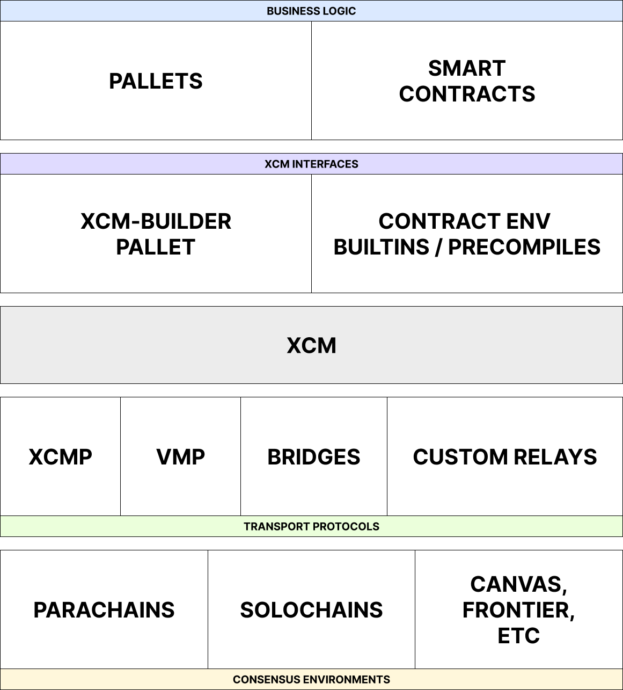

# Writing, Sending, and Execution of XCM

---

### _At the end of this lecture, you will be able to:_

- Construct XCMs via a combination of basic instructions
- Contribute to the discussions on upcoming changes to the XCM format
- Understand the basic structure and architecture behind cross-consensus asset transfers

---

# XCM is an evolving format!

We are presently in V2 with V3 on the way!

Notes:

XCM is a work-in-progress, versioned format!
A goal of this module is to make you capable of contributing to it.

<!-- TODO: activity to look at proposed but not finalized addition (something like a ZK instruction set) -->

---

## The XCM format

The specification document for the XCM format:
https://github.com/paritytech/xcm-format

Notes:

<!-- TODO: add detail for speaker -->

---

### 8 Main Sections in the XCM format specification

1. Background
1. Basic Top-Level Format
1. XCVM Registers (covered in lesson 1)
1. Basic XCVM Operation
1. XCVM Instruction Set
1. Universal Asset Identifiers (`MultiAsset`)
1. Universal Consensus Location Identifiers (`MultiLocation`; covered in lesson 1)
1. XCM Error Types

Notes:

1. Talks about terms used in XCM, the entire architecture around XCM (namely the communication model and XCVM)
1. Is about the `VersionedXcm` type and how XCM versioning is done
1. All registers (states) of the XCVM
1. The steps undertaken by the XCVM to execute one single instruction
1. All instructions and their semantics, the registers that they may change, and their behavior
1. The kind of assets that can be represented using `MultiAsset`
1. How locations are represented in XCM via `MultiLocation`
1. The kinds of errors that one can encounter during the execution of an XCM

---

## XCM Communication Model

XCM is designed around four 'A's:

- **Agnostic**: No assumptions about Consensus System messaged
- **Absolute**: Guaranteed delivery, interpretation, and ordering
- **Asynchronous**: No assumption of blocking for sender/receiver
- **Asymmetric**: No results or callbacks (separately communicated!)

Notes:

- **Agnostic**: XCM makes no assumptions about the nature of the Consensus System between which messages are being passed.
- **Absolute**: XCM messages are guaranteed to be delivered and interpreted accurately, in order and in a timely fashion.
- **Asynchronous**: XCM messages in no way assume that the sender will be blocking on its completion.
- **Asymmetric**: XCM messages do not have results.
  Any results must be separately communicated to the sender with an additional message.

---

## Async vs Sync

XCM crossing the barrier between a single consensus system cannot generally be synchronous.

- No guarantees on delivery time

Notes:

Generally, consensus systems are not designed to operate in sync with external systems.
They intrinsically need to have a uniform state to reason about and do not, by default, have the means to verify states of other consensus systems.
Thus, each consensus system cannot make any guarantees on the expected time required to deliver results; doing so haphazardly would cause the recipient to be blocked waiting for responses that are either late or would never be delivered, and one of the possible reasons for that would be an impending runtime upgrade that caused a change in how responses are delivered.

---

## XCM is "fire and forget"

XCM has no results:

- No errors reported to sender
- No callbacks for sender

Similar to UDP

Notes:

The receiver side can and does handle errors, but the sender will not be notified, unless the error handler specifically tries to send back an XCM that makes some sort of XCM that notifies status back to the origin, but such an action should be considered as constructing a separate XCM for the sole purpose of reporting information, rather than an intrinsic functionality built into XCM, akin to how UDP can also create a "response" to an incoming datagram, yet the response is too considered as a separate UDP datagram instance.

---

## Async XCM

We _could_ have XCM describe async behavior but do not because:

- Complexity, custom per sender/receiver pair
- Expense of operating in fee-based systems

Notes:

Asynchronous systems vary widely by implementation, and as a protocol that attempts to bridge between disparate consensus systems, XCM does not attempt to define the behavior or architecture of its interlocutors.
Rather, XCM defines and standardizes the interface and semantics that two or more consensus systems can use to interact with each other, but leaves the ultimate implementation details to its participating systems.

---

## Basic Top-Level Format

```rust
pub enum VersionedXcm {
    /*
    Obsolete versions
    #[codec(index = 0)]
    V0(v0::Xcm),
    #[codec(index = 1)]
    V1(v1::Xcm),
    */
    #[codec(index = 2)]
    V2(v2::Xcm),
    #[codec(index = 3)]
    V3(v3::Xcm),
}
```

Notes:

All the XCM format documentation does is state that the SCALE encoding index for the enums are in `u8`, and is defined by the `#[codec(index)]` attribute as we see in the code.
It also concretely states that in XCMv2, the `v2::Xcm` struct is simply defined as a wrapper type around a `Vec<Instruction>`, where `Instruction` is the enum representing the XCM instruction set that exists in version 2.

---

## Basic XCVM Operation

XCVM operates as a fetch-dispatch loop

- Common in state machines

<!-- TODO: Graphics about a state machine similar to how the XCVM operates -->

---

### Differences from a standard state machine

1. Error register
1. Error _handler_ register
1. Appendix register

Notes:

1. The error register is _not_ cleared when an XCM program completes successfully.
   This allows the code in the Appendix register to use its value.
1. Code that is run in the case where the XCM program fails or errors.
   Regardless of the result, when the program completes, the error handler register is cleared.
   This ensures that error handling logic from a previous program does not affect any appended code (i.e. the code in the error handler register does not loop infinitely, the code in the Appendix register cannot access the result of the code execution in the error handler).
1. Code that is run regardless of the execution result of the XCM program.

---

## Kinds of XCM instructions recap

Four kinds of XCM instructions:

- Instruction
- Trusted Indication
- Information
- System Notification

Notes:

Instruction - instructions that result in a state change in the local consensus system, or instruct the local consensus system to achieve some desired behavior.
Trusted Indication - instructions that notify the recipient that the sender wants the recipient to trust that the sender has performed some sort of (usually) state-altering action.
Information - instructions that report information that the recipient has requested for.
System Notification - instructions that notify about transport protocol events.
These instructions usually originate from the relay chain.

---

## Instruction

Split into a few categories:

- Instructions that handle assets
  - Asset instructions that handle local assets only
  - Asset instructions that transfer assets to another consensus system
  - Asset instructions that deal with asset locking
  - Asset instructions that burn, recover or exchange specified assets
- Instructions that changes the state of the XCVM registers
- Instructions that report information back to the sender
- Instructions that deal with version negotiation
- Instructions that assert a certain condition of the XCVM
- Instructions that relates to weight fee payment
- Instructions that interact with other subsystems of the blockchain

---v

## Asset Instructions

```rust
enum Instruction {
    // instructions that handle local assets only
    WithdrawAsset(MultiAssets),
    DepositAsset { assets: MultiAssetFilter, beneficiary: MultiLocation },
    TransferAsset { assets: MultiAssets, beneficiary: MultiLocation },
    // instructions that transfer assets to another consensus system
    InitiateReserveWithdraw { assets: MultiAssetFilter, reserve: MultiLocation, xcm: Xcm },
    DepositReserveAsset { assets: MultiAssetFilter, dest: MultiLocation, xcm: Xcm },
    TransferReserveAsset { assets: MultiAssets, dest: MultiLocation, xcm: Xcm },
    InitiateTeleport { assets: MultiAssetFilter, dest: MultiLocation, xcm: Xcm },
    // instructions that deal with asset locking
    LockAsset { asset: MultiAsset, unlocker: MultiLocation },
    UnlockAsset { asset: MultiAsset, target: MultiLocation },
    RequestUnlock { asset: MultiAsset, locker: MultiLocation },
    // instructions that burn, recover or exchange specified assets
    BurnAsset(MultiAssets),
    ClaimAsset { assets: MultiAssets, ticket: MultiLocation },
    ExchangeAsset { give: MultiAssetFilter, want: MultiAssets, maximal: bool },
}
```

Notes:

The withdrawal destination is always the holding register if the instruction does not have parameters specifying the beneficiary.
Similarly, the deposit source is always from the holding register.

---v

## Register State Change Instructions

```rust
enum Instruction {
    // instructions that modify the origin register
    AliasOrigin(MultiLocation),
    DescendOrigin(InteriorMultiLocation),
    UniversalOrigin(Junction),
    // instructions that provide additional instructions to execute upon certain conditions
    SetErrorHandler(Xcm),
    SetAppendix(Xcm),
    // instructions that modify the topic register
    SetTopic([u8; 32]),
    // instructions that modify the error register
    Trap(u64),
    // instructions that modify the fees mode register
    SetFeesMode { jit_withdraw: bool },
    // instructions that clears the specified register
    ClearTopic,
    ClearError,
    ClearOrigin,
    ClearTransactStatus,
}
```

Notes:

The origin register is used for access control, hence it has the most number of instructions to modify the state of it.

---v

## Information Reporting Instructions

```rust
enum Instruction {
    ReportError(QueryResponseInfo),
    ReportHolding { response_info: QueryResponseInfo, assets: MultiAssetFilter },
    ReportTransactStatus(QueryResponseInfo),
    QueryPallet { module_name: Vec<u8>, response_info: QueryResponseInfo },
}
```

```rust
pub struct QueryResponseInfo {
    pub destination: MultiLocation,
    pub query_id: QueryId,
    pub max_weight: Weight,
}
```

Notes:

All of these instructions contain a `QueryResponseInfo` struct, which contains information about the intended destination of the response, the ID of the query, and the maximum weight that the dispatchable call function can use.
The dispatchable call function is an optional operation that XCM author can specify, and is executed upon receiving the response, effectively acting as a lifecycle hook on response.

---v

## Version Negotiation Instructions

```rust
enum Instruction {
    SubscribeVersion { query_id: QueryId, max_response_weight: Weight },
    UnsubscribeVersion,
}
```

Notes:

SubscribeVersion - instructs the local system to notify the sender whenever the former has its XCM version upgraded or downgraded.
UnsubscribeVersion - if the sender was previously subscribed to XCM version change notifications for the local system, then this instruction tells the local system to stop notifying the sender on version changes.

---v

## Assertion Instructions

```rust
enum Instruction {
    ExpectAsset(MultiAssets),
    ExpectOrigin(Option<MultiLocation>),
    ExpectError(Option<(u32, Error)>),
    ExpectPallet { index: u32, name: Vec<u8>, module_name: Vec<u8>, crate_major: u32, min_crate_number: u32 },
}
```

Notes:

Upon failure, these instructions will throw an `ExpectationFalse` error.

---v

## Weight Payment Instructions

```rust
enum Instruction {
    RefundSurplus,
    BuyExecution { fee: MultiAsset, weight_limit: WeightLimit },
}
```

Notes:

For consensus systems that require senders to pay for executing XCMs, the `BuyExecution` instruction specifies which asset will be used to pay for it and the maximum weight that the sender is willing to pay.
One important point to understand is that `BuyExecution` itself doesn't contain the fees -- rather, it contains a `fee` parameter which is used to indicate which of the assets in the holding register can be used to pay for fees.
If the specified asset does not exist in holding, or if the local system does not recognize the `fee` asset as an eligible asset to pay for fees, then an error is thrown.
If the maximum weight specified by the sender in `weight_limit` is too low, then the asset up to the limit is deducted from the holding and an error is thrown.

---v

## Subsystem Interaction Instructions

```rust
enum Instruction<Call> {
    ExportMessage { network: NetworkId, destination: InteriorMultiLocation, xcm: Xcm<()> },
    Transact { origin_kind: OriginKind, require_weight_at_most: u64, call: DoubleEncoded<Call> },
}
```

Notes:

We finally introduce the `Call` type parameter here to indicate where it is actually used within the `Instruction` enum, which is by the `Transact` instruction to encode the destination's runtime `Call` type.
XCMs that do not make use of the `Transact` instruction can simply use the `()` (unit) type as the type parameter to `Instruction` or `Xcm`, as evidenced by the `xcm` field in `ExportMessage`.
The result of executing the decoded `Call` parameter in `Transact` is stored in the transaction status register.

---

## Trusted Indication

Sender must have performed some sort of state-altering action prior to sending these instructions

```rust
enum Instruction {
    ReserveAssetDeposited(MultiAssets),
    ReceiveTeleportedAsset(MultiAssets),
    NoteUnlockable { asset: MultiAsset, owner: MultiLocation },
}
```

Notes:

ReserveAssetDeposited - The specified assets must have been transferred/deposited to the recipient's sovereign account on the sender.
The sender is trusted to be acting as a reserve for the specified assets -- such a trust is configured via the `IsReserve` XCM configuration item on the recipient.
ReceiveTeleportedAsset - The specified assets must have been removed out of total circulation by the sender.
Like `ReserveAssetDeposited`, the sender needs to configured as a trusted teleport location via `IsTeleport`.
NoteUnlockable - The specified assets must have been locked by the sender.
The exact definition of "asset locking" is defined by the sender; however this would not cause any incompatibilities as long as "asset unlocking" as defined by the sender undoes the asset lock.

---

## Information

Offering some requested information that the local system is expecting

```rust
enum Instruction {
    QueryResponse { query_id: QueryId, response: Response, max_weight: Weight, querier: Option<MultiLocation> },
}
```

Notes:

This instruction is generally safe to execute, the only tidbit here is that the local system may not be expecting the response from the sender.
Therefore, the `querier` parameter should be checked to ensure that the system that requested the information matches with what is expected.

---

## System Notification

Handling operations for the underlying transport layer

```rust
enum Instruction {
    HrmpNewChannelOpenRequest { sender: u32, max_message_size: u32, max_capacity: u32 },
    HrmpChannelAccepted { recipient: u32 },
    HrmpChannelClosing { initiator: u32, sender: u32, recipient: u32 },
}
```

Notes:

<!-- TODO: Get someone familiar with XCMP to comment on whether or not these XCM instructions would still exist when we switch over to XCMP -->

---

## Common XCM instruction patterns

Most systems expect execution fee payment

```rust
Xcm(vec![
    WithdrawAsset(some_asset), // ReceivedTeleportedAsset(..) | ReserveAssetDeposited(..) | ClaimAsset { .. }
    ClearOrigin, // optional
    BuyExecution { fee: some_asset, weight_limit: Unlimited },
    // ... the rest of the instructions
 ])
```

Notes:

This pattern is a requirement from the `AllowTopPaidExecutionsFrom` barrier condition, which we expect most systems that collect fees for execution to use.
The aim of the first instruction is to fill up the holding register with assets, so that `BuyExecution` can use the holding register to pay for execution.
`ClearOrigin` is optional here, but if it exists, it is to prevent the subsequent instructions from gaining the privileges of the origin system.

---

### `MultiAsset` deep dive (limitations & gotchas)

<!-- TODO: Things to add as slides, not that we have context on all the concepts needed : -->

- Limits to how many multiassets can exist in the holding registrar
- Only supports NFTs and Fungibles, and only supports "identifying" these assets, versus representing any kind of underlying behavior
  - for example, when transferring an NFT, you only know its unique GUID, if you do a bunch of other logic around NFTs, obviously that information is not transferred
  - The behavior of NFT is chain local, you can't really transfer that...
- Complexity of managing multiple assets
  - Represented as a vector over the message
    - There is a strict limit to number of items in the vector
    - We also expect users to provide a certain level of ordering to the assets (nfts then fungibles)
  - Represented as a hash-map in the registrar
    - There is complexity overhead to map items from the vector into the hashmap, and to access values
- Unsupported assets and behavior
- Describe the MultiAsset APIs, manipulations, common behaviors, etc...

Notes:

<!-- TODO: add detail for speaker -->

---

## Asset Representation

```rust
struct MultiAsset {
    pub id: AssetId,
    pub fun: Fungibility,
}

enum AssetId {
    Concrete(MultiLocation),
    Abstract([u8; 32]),
}

enum Fungibility {
    Fungible(u128),
    NonFungible(AssetInstance),
}

enum AssetInstance {
    Undefined,
    Index(u128),
    Array4([u8; 4]),
    Array8([u8; 8]),
    Array16([u8; 16]),
    Array32([u8; 32]),
}
```

Notes:

A MultiAsset is composed of an asset ID and an enum representing the fungibility of the asset.
Asset IDs can either be Concrete or Abstract:
Concrete assets - can be identified by a `MultiLocation` path that leads to the system that issues it
Abstract assets - can be identified only by a label/name

Assets can also either be fungible or non-fungible:
Fungible - each token of this asset has the same value as any other
NonFungible - each token of this asset is unique and cannot be seen as having the same value as any other token under this asset

Non-fungible assets will then also need to further specify which exact token it represents under the same asset ID, and we use the AssetInstance enum to express the uniqueness of such a token.

---

## Convenience methods to create `MultiAsset`

```rust
/// Creates 10 billion units of fungible native tokens
let fungible_asset: MultiAsset = (Here, 10_000_000_000u128).into(); // or MultiAsset::from((Here, 10_000_000_000u128))

/// Creates an abstract NFT with an undefined asset instance
let nft_asset: MultiAsset = ([0; 32], ()).into();
```

Notes:

In Polkadot, a unit of native token = 1 planck, and 10 billion plancks = 1 DOT

---

## Asset Wildcards and Filters

```rust
enum WildMultiAsset {
    All,
    AllOf { id: AssetId, fun: WildFungibility },
    AllCounted(u32),
    AllOfCounted { id: AssetId, fun: WildFungibility, count: u32 },
}

enum WildFungibility {
    Fungible,
    NonFungible,
}

enum MultiAssetFilter {
    Definite(MultiAssets),
    Wild(WildMultiAsset),
}

struct MultiAssets(Vec<MultiAsset>);
```

Notes:

These are types used by various instructions that want to express the idea to select all of one kind of assets in the holding register, but do not know the exact amount of assets that already exists in holding.
"Wild" in this context has the same meaning as the "wild" in "wildcard".
The "counted" variants is used when we want to limit the amount of assets that the wildcard can select.
This is very useful in cases where we want to give an upper limit to the execution time required to select the assets within the holding register, or that we simply just want the specified number of types of assets within the specified class of assets.

---

## XCM Errors

Error register - set upon execution failure with `XcmError` variant
Error handler register - if set, the XCM in the register is executed upon error

Notes:

The error register also includes a `u32` which denotes the instruction index that can be used to locate which XCM instruction failed.
The code in the error handler register can only be used once, otherwise the executor can go into an infinite loop if it too errors during execution.

---

# Message Passing Protocols

Notes:

This is not just XCMP; we'll explain in the next slide what XCMP means.

---

## XCMP has two _meanings_

<!-- TODO: out of place? we want to discuss this somewhere... -->

1. Generalized category of transport mechanisms (HRMP, DMP, UMP)
   - This should really be called "message passing protocols"
1. Concretely the one transport protocol for parachains on the same relay chain.

Notes:

These two definitions are not concretely defined anywhere, but they are a result of an observation based on what people use XCMP to describe.
As such, the two meanings are often incorrectly interchanged.

---

## XCM is _not_ XCMP

Nor do they have any sort of dependency with each other!

Notes:

It is often mistaken that XCMP includes XCM or vice-versa, but this is not true.
XCMP is an _agnostic_ message passing protocol; it actually does not care what kind of message is being passed by it, meaning it does not simply handle XCMs, but can also transfer any arbitrary blob data, provided the receiver recognizes the message format and knows how to decode it appropriately.
XCM and XCMP are two completely distinct and separate subsystems.

---



#### _XCM Protocol Stack_

Notes:

Polkadot systems for executing XCM: UMP, DMP and XCMP.
UMP (Upward Message Passing) allows parachains to send messages to their relay chain.
DMP (Downward Message Passing) allows the relay chain to pass messages down to one of their parachains.
XCMP, which is perhaps the best known of them, allows the parachains to send messages between themselves.
In addition to sending messages between chains, XCM is also useful in other contexts, for transacting with a chain whose transaction format you don’t necessarily know well in advance.
With chains whose business logic changes little (for example Bitcoin), the transaction format — or the format used by wallets to send instructions to the chain —tends to remain exactly the same, or at least compatible, indefinitely.

---

## ⛓ Moving Assets between Chains in XCM

<!-- TODO: add slide details, migrated paragraph to notes ;) -->

Notes:

Sending an asset to another chain is probably the most common use-case for inter-chain messaging.
Allowing one chain to administer another chain’s native asset allows for all sorts of derivative use-cases (no pun intended), the simplest being a decentralized exchange but generally grouped together as decentralized finance or DeFi.

---

<widget-columns>
<widget-column>

### ✨ Teleporting

<!-- TODO: add slide details, migrate this paragraph to notes ;) -->

For chains that trust each other (such a homogeneous shards under the same overall consensus and security umbrella), we can use a framework that Polkadot calls teleporting, which basically just means destroying an asset on the sending side and minting it on the receiving side.
This is simple and efficient — it only requires the coordination of the two chains and only involves one action on either side.
Unfortunately, if the receiving chain cannot 100% trust the sending chain to actually destroy the asset which it is minting (and indeed not to mint assets outside of the agreed rules for the asset), then the sending chain really has no basis for minting the asset on the back of a message.

</widget-column>
<widget-column>

```rust
// XCM teleported (most of) 1 DOT from the Polkadot Relay Chain to its sovereign account on Statemint.
// We’ll assume that the fees are already paid on the Polkadot side.

WithdrawAsset((Here, 10_000_000_000).into()),
InitiateTeleport {
    assets: All.into(),
    dest: Parachain(1000).into(),
    xcm: Xcm(vec![
        BuyExecution {
            fees: (Parent, 10_000_000_000).into(),
            weight: 3_000_000,
        },
        DepositAsset {
            assets: All.into(),
            max_assets: 1,
            beneficiary: Parent.into(),
        },
    ]),
}

// When Statemint eventually gets the message, it looks like this:

ReceiveTeleportedAsset((Parent, 10_000_000_000).into()),
BuyExecution {
    fees: (Parent, 10_000_000_000).into(),
    weight: 3_000_000,
},
DepositAsset {
    assets: All.into(),
    max_assets: 1,
    beneficiary: Parent.into(),
},

```

</widget-column>
</widget-columns>

Notes:

<!-- TODO: add detail for speaker -->

---

### 🏦 Reserves

- TODO

Notes:

<!-- TODO: cut this down into a few key sentences for the speaker, HTML comments for extra detail -->

The name comes from reserve banking, where assets are held “in reserve” to give credibility to the idea that some issued promise is valuable.
For example, if we can reasonably believe exactly 1 “real” (e.g. Statemint or Relay Chain) DOT is redeemable for each “derivative” DOT issued on an independent parachain, then we can treat the parachain’s DOT as being economically equivalent to real DOT.
(Most banks do something called fractional reserve banking, which means they keep less than the face-value in reserve.
This works fine until too many people wish to redeem, and then everything can go quite wrong quite fast.) So, the reserve is the place which stores the “real” assets and, for the purposes of transferral, whose logic and security is trusted by both sender and receiver.
Any corresponding assets on the sender and receiver side would then be derivatives, but they would be backed with the “real” reserve asset 100%.
Assuming that the parachain behaved well (i.e. that it was bug-free and its governance didn’t decide to run off with the reserve), this would make the derivative DOT more or less of the same value as the underlying reserve DOT.
The reserve assets are held in the sender/receiver’s sovereign account (i.e. the account controllable by the sender or receiver chain) on the reserve chain, so there’s good reason that unless something went wrong with the parachain, they’d be well guarded.

---

#### _Reserve Asset Example_

```rust [0|4-8|8-17|17-29]
// Sending 1 DOT from parachain 2000 to parachain 2001, which use reserve-backed DOT on parachain 1000
// We’ll assume the fees are already paid on the sender side.

WithdrawAsset((Parent, 10_000_000_000).into()),
InitiateReserveWithdraw {
    assets: All.into(),
    dest: ParentThen(Parachain(1000)).into(),
    xcm: Xcm(vec![
        BuyExecution {
            fees: (Parent, 10_000_000_000).into(),
            weight: 3_000_000,
        },
        DepositReserveAsset {
            assets: All.into(),
            max_assets: 1,
            dest: ParentThen(Parachain(2001)).into(),
            xcm: Xcm(vec![
                BuyExecution {
                    fees: (Parent, 10_000_000_000).into(),
                    weight: 3_000_000,
                },
                DepositAsset {
                    assets: All.into(),
                    max_assets: 1,
                    beneficiary: ParentThen(Parachain(2000)).into(),
                },
            ]),
        },
    ]),
},

```

Notes:

<!-- TODO: add detail for speaker -->

---

## Weight (in XCM)

<!-- - TODO: Add some content -->

Notes:

<!-- TODO: add detail for speaker -->
