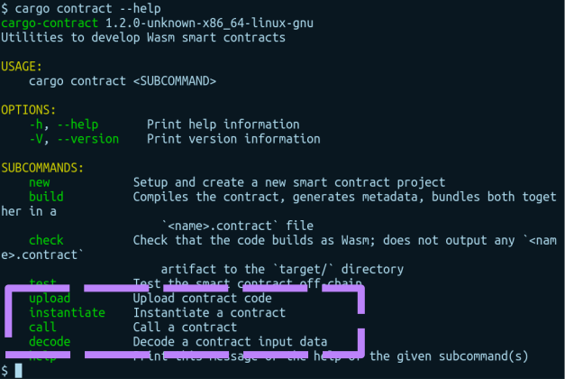

---

# 

---

<pba-cols>
<pba-col>

### Agenda

</pba-col>
<pba-col>

|              |        |                    |
|--------------|--------|:-------------------|
| Today        | 1pm    | ink! Intro         |
|              | 2pm    | Activity           |
|              | 3:30pm | Hints for tomorrow |
| | | &nbsp;             |
| Tomorrow | 1pm    | We help you        |
| | 2pm    | Game               |
| | 3:30pm  | Perfect Solutions  |

---

## How does ink! tie into Substrate?


Notes:
How does ink! tie into Substrate?

---

## How does ink! tie into Substrate?


---


---


---


---


---


---


---


Notes:

Smart Contract vs. Parachain
Parachain:

- Only requirement: Minimal Polkadot API
- Trusted Code

Smart Contracts:

- Untrusted Code
- Requires Metering
- Fixed payment paradigm (gas fees)

---


Notes:

- Motivation
- Use Case 1: Wrap Pallet
- Smart Contracts as “first class citizen”
  - ➜ Smart Contract Parachain + $UVP_for_Contracts

---


Notes:

- Use Case 2: Expose Business Logic
- Smart Contracts as “second class citizen”
  - ➜ Parachain adding customizability for its business logic

---


Notes:

- Use Case 3: Embrace Prototyping
- Prototyping before going for own parachain

---

# The ink! language

Notes:

Just Rust
Debugging, Testing, Tooling, clippy, cargo fmt, fuzzing

---

## `Cargo.toml`

```toml [1-9|2|4-5|7-8]
[dependencies]
ink = { version = "4.0.0", default-features = false }

# Encoding/Decoding
scale = { package = "parity-scale-codec", ... }

# Metadata
scale-info = { version = "2", ... }
```

---

```rust [1-48]
mod my_contract {

    struct MyContract {
        value: bool,
    }


    impl MyContract {

        fn new() ➜ Self {
            MyContract { value: true }
        }


        fn get(&self) ➜ bool {
            self.value
        }


        fn flip(&mut self) {
            self.value = !self.value;
        }
    }
}
```

Notes:

Hello ink!

---

```rust [1-24|1-2|3-6|9-12|14-17|19-22]
#[ink::contract]
mod my_contract {
    #[ink(storage)]
    struct MyContract {
        value: bool,
    }

    impl MyContract {
        #[ink(constructor)]
        pub fn new() ➜ Self {
            MyContract { value: true }
        }

        #[ink(message)]
        pub fn get(&self) ➜ bool {
            self.value
        }

        #[ink(message)]
        pub fn flip(&mut self) {
            self.value = !self.value;
        }
    }
}
```

---

## Idiomatic Rust

```rust
#[ink(message)]
pub fn do_it(&self) -> Result<(), Error> {
  Err(Error:OhNo)
}
```

---

## Trait Definitions

```rust [1-2,8|3-7]
#[ink::trait_definition]
pub trait BaseErc20 {
  #[ink(message)]
  fn total_supply(&self) -> Balance;

  #[ink(message)]
  fn transfer(&mut self, to: AccountId, amount: Balance) -> Result;
}
```

Notes:

Can be implemented by multiple contracts.

---


---

## Unit Tests

```rust
#[cfg(test)]
mod tests {

    #[test]
    fn default_works() {
        let flipper = Flipper::default();
        assert_eq!(flipper.get(), true);
    }

}
```

---

## Integration Tests

```rust [1-5,17,19|6-9|11-13|15-16]
#[cfg(test)]
mod tests {

    #[ink::test]
    fn default_works() {
        // given
        let my_contract = MyContract::default();
        let accounts =
            ink_env::test::default_accounts::<ink_env::DefaultEnvironment>();

        // when
        ink_env::test::set_caller::<ink_env::DefaultEnvironment>(accounts.alice);
        ink_env::test::set_value_transferred::<ink_env::DefaultEnvironment>(10);

        // then
        assert!(my_contract.received_ten());
    }

}
```

---

## E2E Tests

```rust [1-30|1-2|3-4|6-9|11-17]
#[ink_e2e::test]
async fn default_works(mut client: ink_e2e::Client<C, E>) -> E2EResult<()> {
    // given
    let constructor = FlipperRef::new_default();

    // when
    let contract_acc_id = client
        .instantiate("flipper", &ink_e2e::bob(), constructor, 0, None)
        .await.expect("instantiate failed").account_id;

    // then
    let get = build_message::<FlipperRef>(contract_acc_id.clone())
        .call(|flipper| flipper.get());
    let get_res = client
        .call(&ink_e2e::bob(), get, 0, None)
        .await.expect("get failed");
    assert!(matches!(get_res.return_value(), false));

    Ok(())
}
```

Notes:
When the function is entered, the contract was already
built in the background via `cargo contract build`.
The `client` object exposes an interface to interact
with the Substrate node.

---

# `$ cargo contract`

[https://crates.io/crates/cargo-contract](https://crates.io/crates/cargo-contract)

<!-- .element: class="fragment" data-fragment-index="1" -->

---

## Metadata?


---


Notes:

Build Artifacts

---


---


---

# ink!-ternals


---

# ink!-ternals


---

# ink!-ternals


---

# ink!-ternals


---

# ink!-ternals


---

## Environment

```rust
pub enum DefaultEnvironment {}

impl Environment for DefaultEnvironment {
    const MAX_EVENT_TOPICS: usize = 4;

    type Balance = u128;
    type Timestamp = u64;
    type BlockNumber = u32;
    // --snip--
}
```

---

## Local Development


[`substrate-contracts-node`](https://github.com/paritytech/substrate-contracts-node)

---

## Testnet


[Rococo Testnet](https://ink.substrate.io/testnet)

---

## Developer UIs

<div class="flex-container">
<div class="left"> <!-- Gotcha: You Need an empty line to render MD inside <div> -->


[https://contracts-ui.substrate.io](https://contracts-ui.substrate.io)

</div>
<div class="right"> <!-- Gotcha: You Need an empty line to render MD inside <div> -->


[https://polkadot.js.org/apps](https://polkadot.js.org/apps)

</div>
</div>

---

## Developer UIs



---

## Documentation


[www.use.ink](https://use.ink)

---


---

## Documentation


---

# Building a Dapp on ink!

---

## Reading Contract Values: RPC


<!-- .element: class="fragment" data-fragment-index="1" -->

---

## Reading Contract Values: Events


<!-- .element: class="fragment" data-fragment-index="1" -->

---


---

# Security Comparison Solidity

---

<div class="flex-container">
<div class="left fragment" data-fragment-index="1">

<br/>

</div>
<div class="right fragment" data-fragment-index="2" style="margin-left: 5%;">


- Built-in reentrancy protection
- Fine-grained control

</div>
</div>

Notes:

Re-entrancy Protection

---

<div class="flex-container">
<div class="left fragment" data-fragment-index="1">


```solidity
pragma solidity 0.7.0;

contract Lottery {

  function withdrawWinnings() {
    require(msg.sender = …);
    _sendWinnings(msg.sender);
  }

  function _sendWinnings() {
    msg.sender.transfer(this.balance);
  }

}
```

</div>
<div class="right fragment" data-fragment-index="2" style="margin-left: 5%;">


- Functions private by default
- Needs to be annotated explicitly
- Required: `pub` + `#[ink(message)]`

</div>
</div>

---


---


Notes:

- Mutating values
- Ownership & Borrow checker

---


