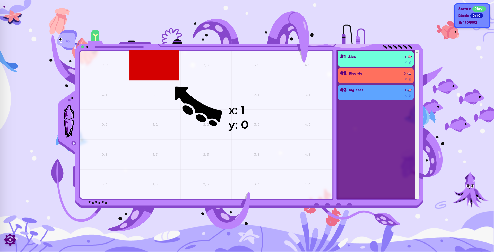

# 

---

## Outline

1. Explainer
1. Trial Run
1. Real Run
1. Tomorrow: Advanced Workshop

---


---

## Components

<br/>

<div class="flex-container fragment">
<div class="left"> <!-- Gotcha: You Need an empty line to render MD inside <div> -->
<div style="text-align: center"> <center><h2><pre> game.contract </pre></h2></center> </div>
<ul>
<li>We deploy + run it.</li>
<li>Runs game loop.</li>
<li>Invokes each player.</li>
<li>Determines the score.</li>
</ul>
</div>

<div class="left fragment"> <!-- Gotcha: You Need an empty line to render MD inside <div> -->
<div style="text-align: center"> <center><h2><pre> player.contract </pre></h2></center> </div>

<ul>
<li>You take care of it.</li>
</ul>
</div>
<div class="right fragment"> <!-- Gotcha: You Need an empty line to render MD inside <div> -->
<div style="text-align: center"> <center><h2><pre> frontend </pre></h2></center> </div>
<ul>
<li>On big screen during game.</li>
</ul>
</div>
</div>

---

1. Code contract that plays on your behalf<!-- .element: class="fragment" data-fragment-index="1" -->
1. Deploy contract to Rococo testnet <!-- .element: class="fragment" data-fragment-index="2" -->
1. Register contract as player with game contract<!-- .element: class="fragment" data-fragment-index="3" -->
1. We start the game<!-- .element: class="fragment" data-fragment-index="4" -->
1. It runs for some minutes, we watch it on screen<!-- .element: class="fragment" data-fragment-index="5" -->

---

## How the Game looks


Notes:

- Your player gets a random color assigned

---

## How the Game looks



---

## How the Game looks


---

## How to score?

> Use as little gas as possible to paint as many fields as possible.

<!-- .element: class="fragment" data-fragment-index="1" -->

> The later you manage to still paint a field the better you score.

<!-- .element: class="fragment" data-fragment-index="2" -->

---

## Basic Player Contract

```rust [1-21|3-4|7-10|12-17]
#[ink::contract]
mod player {
    #[ink(storage)]
    pub struct Player {}

    impl Player {
        #[ink(constructor)]
        pub fn new() -> Self {
            Self {}
        }

        /// Called during every game round.
        /// Return `(x, y)` coordinate of pixel you want to color.
        #[ink(message, selector = 0)]
        pub fn your_turn(&self) -> Option<(u32, u32)> {
            Some(1, 2)
        }
    }
}
```

---

## How to play


---

## How to play


---

## How to play


---

## How to play


---

## Now (1)

[github.com/paritytech/squink-splash-beginner ➜ todo-1.md](https://github.com/paritytech/squink-splash-beginner/blob/main/todo-1.md)


Notes:
<br/>

1. Install Rust stable
1. Install `cargo-contract`
1. Install `polkadot-js` Browser Extension
1. Create account in Browser Extension
1. Get `ROC` Tokens via Faucet

---

## Now (2)

[github.com/paritytech/squink-splash-beginner ➜ todo-2.md](https://github.com/paritytech/squink-splash-beginner/blob/main/todo-2.md)


Notes:
<br/>

1. Clone `squink-splash-beginner`
1. `player.rs`: change line XX to your favorite numbers [0-50]
1. `cargo contract build`
1. Upload & Instantiate via Contracts UI
1. Upload & Instantiate `game-metadata.json` via Contracts UI
1. Register your player

---

## Frontend

https://splash.use.ink


---

## Now

- 15 Minutes: Find a strategy for your player
- Use as little gas as possible to paint as many fields as possible.
- The later you manage to still paint a field the better you score.<br/><br/>
- Inspiration:
  - Random numbers?
  - Query which fields unused?
