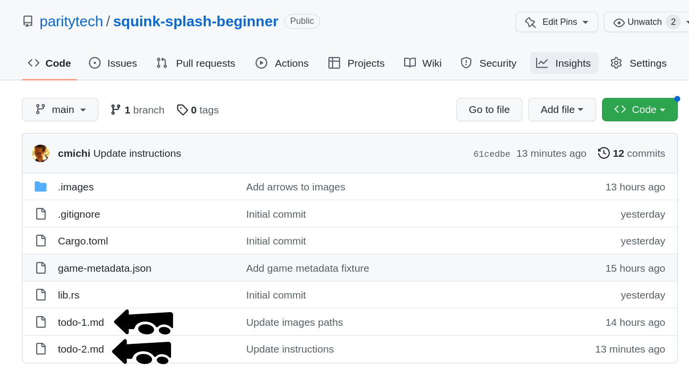

---

<pba-cols>
<pba-col>

### Agenda

</pba-col>
<pba-col>

|          |        |                    |
| -------- | ------ | :----------------- |
| Today    | 1pm    | ink! Intro         |
|          | 2pm    | Activity           |
|          | 3:30pm | Hints for tomorrow |
|          |        | &nbsp;             |
| Tomorrow | 1pm    | We help you        |
|          | 2pm    | Game               |
|          | 3:30pm | Perfect Solutions  |

</pba-col>
</pba-cols>

---


---

## Components

<br/>

<div class="flex-container fragment">
<div class="left"> <!-- Gotcha: You Need an empty line to render MD inside <div> -->
<div style="text-align: center"> <center><h2><pre> game.contract </pre></h2></center> </div>
<ul>
<li>We deploy + run it.</li>
<li>Runs game loop.</li>
<li>Invokes each player.</li>
<li>Determines the score.</li>
</ul>
</div>

<div class="left fragment"> <!-- Gotcha: You Need an empty line to render MD inside <div> -->
<div style="text-align: center"> <center><h2><pre> player.contract </pre></h2></center> </div>

<ul>
<li>You take care of it.</li>
</ul>
</div>
<div class="right fragment"> <!-- Gotcha: You Need an empty line to render MD inside <div> -->
<div style="text-align: center"> <center><h2><pre> frontend </pre></h2></center> </div>
<ul>
<li>On big screen during game.</li>
</ul>
</div>
</div>

---

1. Create contract that plays on your behalf<!-- .element: class="fragment" data-fragment-index="1" -->
1. Deploy contract to Rococo testnet <!-- .element: class="fragment" data-fragment-index="2" -->
1. Register contract as player with game contract<!-- .element: class="fragment" data-fragment-index="3" -->
1. We start the game<!-- .element: class="fragment" data-fragment-index="4" -->
1. It runs for some minutes, we watch it on screen<!-- .element: class="fragment" data-fragment-index="5" -->

---

## How the Game looks


Notes:

- Your player gets a random color assigned

---

## How the Game looks


---

## How the Game looks


---

## How to score?


* Use as little gas as possible to paint as many fields as possible.<!-- .element: class="fragment" -->
* Stay within your gas budget.<!-- .element: class="fragment" -->
* The later you manage to still paint a field the better you score. <!-- .element: class="fragment" -->

---

## Basic Player Contract

```rust [1-2,19|3-4|7-10|12-17|1-19]
#[ink::contract]
mod player {
    #[ink(storage)]
    pub struct Player {}

    impl Player {
        #[ink(constructor)]
        pub fn new() -> Self {
            Self {}
        }

        /// Called during every game round.
        /// Return `(x, y)` coordinate of pixel you want to color.
        #[ink(message, selector = 0)]
        pub fn your_turn(&self) -> Option<(u32, u32)> {
            Some(1, 2)
        }
    }
}
```

---

## How to play


---

## How to play


---

## How to play


---

## How to play



---

## Now (1)

[github.com/paritytech/squink-splash-beginner ➜ todo-1.md](https://github.com/paritytech/squink-splash-beginner/blob/main/todo-1.md)

---

## Now (2)

[github.com/paritytech/squink-splash-beginner ➜ todo-2.md](https://github.com/paritytech/squink-splash-beginner/blob/main/todo-2.md)

---

## Frontend

[https://splash.use.ink](https://splash.use.ink)

---

## The Game Contract

- Use as little gas as possible to paint as many fields as possible.
- The later you manage to still paint a field the better you score.<br/><br/>
- Inspiration:
  - Random numbers?
  - Query which fields unused?


---

## The Game Contract

- [`ink-workshop/game/lib.rs`](https://github.com/paritytech/ink-workshop/blob/main/game/lib.rs)
<br/><br/>
- `pub fn submit_turn(&mut self)`
- `pub fn board(&self) -> Vec<Option<FieldEntry>>`
- `pub fn gas_budget(&self) -> u64`
- `pub fn dimensions(&self) -> (u32, u32)`

---

## Until Tomorrow 🧠

- Find a strategy for your player.
- Use as little gas as possible to paint as many fields as possible.
- Stay within your gas budget.
- The later you manage to still paint a field, the better you score.<br/><br/>
- Helpful Resources:
  - [paritytech/ink-workshop ➜ `game` folder](https://github.com/paritytech/ink-workshop)
  - [paritytech/squink-splash-advanced](https://github.com/paritytech/squink-splash-advanced)
  - [ink! repository ➜ `examples` folder](https://github.com/paritytech/ink/tree/master/examples)
  - [use.ink](https://use.ink)

---

## How to test locally

1. `cargo contract build` your `player` and `game` contract
2. Upload `player` and `game`
3. Call `game.register_player` via Contracts UI
4. Call `game.start_game` via Contracts UI
5. Open [https://splash.use.ink](https://splash.use.ink)
6. Call `game.submit_turn`

---

## Hint: Playfield Dimensions

- Paint within the bounds of the playfield!
- Otherwise you wasted a turn.
- Constructor argument, cross-contract call to `game.dimensions()`

---

## Ideas

- You can call your own contract as often as you want! <!-- .element: class="fragment" -->
- Random number <!-- .element: class="fragment" -->
- Query which fields are free <!-- .element: class="fragment" -->
  - Query game state via cross-contract
  - Off-chain computation


---


