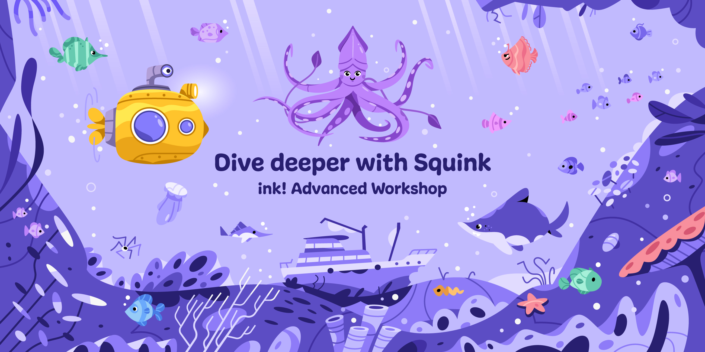

---

<pba-cols>
<pba-col center>

### Now

We help you debug!

</pba-col>
<pba-col center>

### Then

🕹️🎮🕹️🎮

</pba-col>
<pba-col center>

### Thereafter

Strategy Explainer

</pba-col>
</pba-cols>

<br/>
<br/>

- Use as little gas as possible to paint as many fields as possible.
- Stay within your gas budget.
- The later you manage to still paint a field, the better you score.

<br/>
<br/>

[paritytech/squink-splash-advanced](https://github.com/paritytech/squink-splash-advanced)

---

## Frontend

https://splash.use.ink


---

## Questions

- What strategy did the winner choose?

<!-- .element: class="fragment" -->

- What strategies did the others choose?

<!-- .element: class="fragment" -->

- What do you think would be the perfect strategy?

<!-- .element: class="fragment" -->

---

## Board Dimensions

- Best:
  - `const width: u32` or `new(width: u32, height: u32)`

---

## Strategy 1: Return Random Number

- Wasm-compatible RNG
- Use Storage to hold seed for random number
- Uses little Gas
- Quickly runs into collisions
- Score function rewards players that late in game still paint fields

---

## Strategy 2: Query board for free fields, paint only free ones

- Cross-contract call
- Need to iterate over `Mapping`: `O(n)`
- Expensive

---

## Strategy 3: Shift computation off-chain

- Off-chain Script
  - Query board, search free field
  - Call player: `fn set_next_turn(Option<(u32, u32)>)`

<!-- .element: class="fragment" -->

- ```rust
  #[ink(message, selector = 0)]
  pub fn your_turn(&mut self) -> Option<(u32, u32)> {
    self.next_turn
  }
  ```

<!-- .element: class="fragment"  -->

---

## Strategy 4: 🤯

- Off-chain computation from prior slide
- Exploit that game loop uses same sorting for invoking `submit_turn` on players

---


