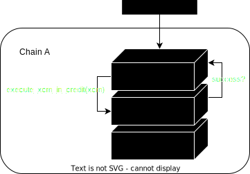
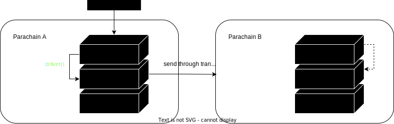
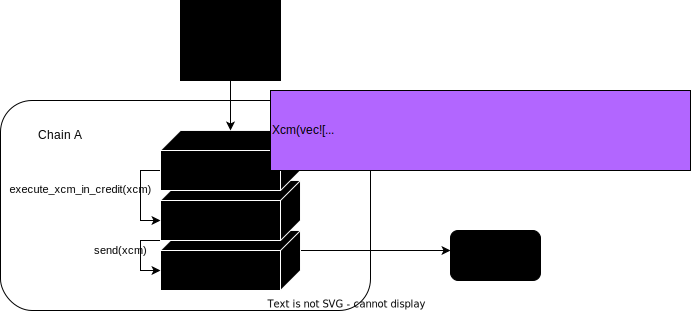
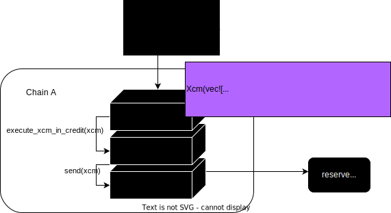

# XCM Pallet

---

#### Lesson goals:

- Understand what the interface of the pallet is and its implementation.
- How versioning discovery works.
- How receiving responses work.
- Understand how to craft XCM in FRAME pallets.

---

## The XCM pallet

We have now learnt about the XCVM and FRAME.

The XCM pallet is the bridge between the XCVM subsystem and the FRAME subsystem.

**It also allows us to send/execute XCM and interact with the XCM executor**.

---

## How XCM is expected to be used

XCM is not intended to be written by end-users.

Instead, _parachain developers_ write XCVM programs, and package them up into FRAME extrinsics.

Notes:

How do wallets wallet providers use XCM ?

We will see examples of XCM being built in the runtime when exploring `teleport_assets` and `reserve_transfer_assets` extrinsics.

---

### Key roles of `pallet-xcm`

<pba-flex center>

1. Allows to interact with the `xcm-executor` by executing xcm messages.
   These can be filtered through the `XcmExecuteFilter`.
1. Provides an easier interface to do reserve based transfers and teleports.
   The origins capable of doing these actions can be filtered by `XcmTeleportFilter` and `XcmReserveTransferFilter`.
1. Handles XCM version negotiation duties.
1. Handles asset-trap/claim duties.
1. Allows sending arbitrary messages to other chains for certain origins.
   The origins that are allowed to send message can be filtered through `SendXcmOrigin`.

</pba-flex>

Notes:

- Even when the XCM pallet allows any FRAME origin to send XCMs, it distinguishes root calls vs any other origin calls.
  In the case of the latter, it appends the `DescendOrigin` instruction to make sure non-root origins cannot act on behalf of the parachain.

---

## The XCM Pallet

`pallet-xcm` provides default implementations for many traits required by `XcmConfig`.

`pallet-xcm` also provides an interface containing 10 different extrinsics, which can be split into three categories:

- Primitive functions to locally `execute` or `send` an XCM.
- High-level functions for asset transfers between systems, e.g. teleportation and reserve asset transfers.
- Extrinsics aimed exclusively at version negotiation.

---

## `pallet-xcm` Primitive extrinsics

- `execute`

  Direct access to the XCM executor.

  It is necessarily executed on behalf of the account that signed the extrinsic (i.e. the origin).



Notes:

It checks the origin to ensure that the configured `SendXcmOrigin` filter is not blocking the execution.
It executes the message **locally** and returns the outcome as an event.

---v

## `pallet-xcm` Primitive extrinsics

- `send`

Sends a message to the provided destination.



Notes:

This extrinsic is a function to send a message to a destination.
It checks the origin, the destination and the message.
Then it lets the `XcmRouter` handle the forwarding of the message.

---

## `pallet-xcm` Asset Transfer extrinsics

<pba-cols>
<pba-col>

</pba-col>

<pba-col>

</pba-col>
</pba-cols>

Notes:

We have already seen what teleports and reserve transfers mean in lesson 7.1; A quick reminder.

---v

## `pallet-xcm` Asset Transfer extrinsics

`teleport_assets` & `limited_teleport_assets`

These extrinsics allow the user to perform an asset teleport.
The limited version takes an extra argument (`Option<WeightLimit>`).



---v

## `pallet-xcm` Asset Transfer extrinsics

`reserve_transfer_assets` & `limited_reserve_transfer_assets`

Allow the user to perform a reserve-backed transfer.
Its limited version takes an extra argument as well (`Option<WeightLimit>`).



---

## 🗣️ version negotiation with `pallet-xcm`

XCM is a **versioned message format**.

One version may contain more or different instructions than another, so for parties to communicate via XCM, it is important to know which version the other party is using.

The version subscription mechanism allows parties to subscribe to version updates from others.

<pba-flex center>

```rust
pub enum VersionedXcm {
  V2(v2::Xcm),
  V3(v3::Xcm),
}
```

Notes:

- V0 and V1 were removed with the addition of XCM v3.

---v

## 🗣️ version negotiation with `pallet-xcm`

But chains need to be aware of the version supported by each other.
`SubscribeVersion` and `QueryResponse` play a key role here:

<pba-flex center>

```rust
enum Instruction {
  // --snip--
  SubscribeVersion {
        query_id: QueryId,
        max_response_weight: u64,
  },
  QueryResponse {
        query_id: QueryId,
        response: Response,
        max_weight: u64,
  },
  // --snip--
}
```

Notes:

- `query_id` would be identical in the `SubscribeVersion` and `QueryResponse` instructions.
- Likewise, `max_response_weight` should also match `max_weight` in the response

---v

## 🗣️ version negotiation with `pallet-xcm`

- `ResponseHandler`: The component in charge of handling response messages from other chains.
- `SubscriptionService`: The component in charge of handling version subscription notifications from other chains

<pba-flex center>

```rust
 impl Config for XcmConfig {
  // --snip--
  type ResponseHandler = PalletXcm;
  type SubscriptionService = PalletXcm;
 }
```

Notes:

- `PalletXcm` keeps track of the versions of each chain when it receives a response.
- It also keeps track of which chains it needs to notify whenever we change our version

---

## Subscription Service

Any system can be notified of when another system changes its latest supported XCM version.
This is done via the `SubscribeVersion` and `UnsubscribeVersion` instructions.

The `SubscriptionService` type defines what action to take when processing a `SubscribeVersion` instruction.

Notes:

`pallet-xcm` provides a default implementation of this trait.
When receiving a `SubscribeVersion`, the chain sends back an XCM with the `QueryResponse` instruction containing its current version.

---

## Version Negotiation

The subscription service leverages any kind of exchange of XCMs between two systems to begin the process of version negotiation.

Each time a system needs to send a message to a destination with an unknown supported XCM version, its location will be stored in the `VersionDiscoveryQueue`.
This queue will then be checked in the next block and `SubscribeVersion` instructions will be sent out to those locations present in the queue.

Notes:

SubscribeVersion - instructs the local system to notify the sender whenever the former has its XCM version upgraded or downgraded.
UnsubscribeVersion - if the sender was previously subscribed to XCM version change notifications for the local system, then this instruction tells the local system to stop notifying the sender on version changes.

---v

## 🗣️ XCM Version Negotiation

XCM version negotiation:
<pba-flex center>

1. Chain A sends `SubscribeVersion` to chain B.
1. Chain B responds `QueryResponse` to chain A with the same query_id and max_weight params, and puts the XCM version in the response
1. Chain A stores chain B's supported version on storage.
1. The same procedure happens from chain B to chain A.
1. Communication is established using the highest mutually supported version.

---v

## 🗣️ XCM Version Negotiation


---

## Response Handler

Version negotiation is just one example among many kinds of queries one chain can make to another.
Regardless of which kind of query was made, the response usually takes the form of a `QueryResponse` instruction.

---v

## Response Handler

We have talked about XCM being asymmetric, so why are there responses ?

---v

## Information Reporting

Every instruction used for information reporting contains `QueryResponseInfo`.

<pba-flex center>

```rust
pub struct QueryResponseInfo {
    pub destination: MultiLocation,
    pub query_id: QueryId,
    pub max_weight: Weight,
}
```

Notes:

All Information Reporting instructions contain a `QueryResponseInfo` struct, which contains information about the intended destination of the response, the ID of the query, and the maximum weight that the dispatchable call function can use.
The dispatchable call function is an optional operation that XCM author can specify, and is executed upon receiving the response, effectively acting as a lifecycle hook on response.

---v

## Information retrieval

<pba-flex center>

```rust
enum Instruction {
    // --snip--
    QueryResponse {
        query_id: QueryId,
        response: Response,
        max_weight: Weight,
        querier: Option<MultiLocation>,
    },
    // --snip--
}
```

Notes:

The above instruction is the one used for offering some requested information that the local system is expecting.
`querier` parameter should be checked to ensure that the system that requested the information matches with what is expected.

---

## Asset Trap/Claims with `pallet-xcm`

What happens when there are still funds in the holding register after the execution of every instruction is done?

Any situation in which the holding register contains assets after the execution of the XCM message would lead to asset trapping.

These traps need to be **stored** to allow for future claiming of these trapped assets, FRAME provide us with means for this.

Notes:

- This is handled in the `post_execute` function of the xcm-executor.

---v

## Asset Trap/Claims with `pallet-xcm`

- **`pallet-xcm` asset trapper**: Trapped assets are stored in the `AssetTraps` storage item and indexed by `BlakeTwo256((origin, assets))`

- **`pallet-xcm` asset claimer**: `pallet-xcm` also allows for claiming trapped assets, providing that:
  - the origin claiming the assets is identical to the one that trapped them.
  - the `Asset` being claimed is identical to the one that was trapped

Notes:

- Each map element on `AssetTraps` holds a counter of how many times such origin has trapped such `Asset`.
- Every time such `Asset` gets reclaimed, the counter decrements by one.

---

## Extrinsic breakdown

Let's jump into the code and have a look at `limited_reserve_transfer_assets` extrinsic.

[source 🔍](https://github.com/paritytech/polkadot/blob/02905341f7f7d1b3aa1944ccbe3a86072fbf4b06/xcm/pallet-xcm/src/lib.rs#L1042)

Notes:

One way of walking through the implementation of `limited_reserve_transfer_assets` could be:

- Function interface
- Checking wether runtime origin has execution permissions
- Decoding destination and assets
- Other safety checks
- Figure out what is the asset to use for paying fees --> Maybe stop for double clicking on reanchoring
- Set weight_limit if defined or estimate what the weight would be at destination
- Build the actual XCM to be sent
- Weight the message locally and finally request for its execution to `XcmExecutor`

---

## Exercise

1. Code an extrinsic that creates an XCM which traps some funds.
1. Code an extrinsic that creates an XCM to claim back trapped funds.

---

## Exercise

Usually trapping funds is not a desired outcome.

In the first XCM, what modification is needed to avoid such scenario?
