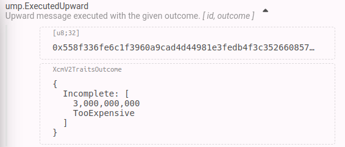
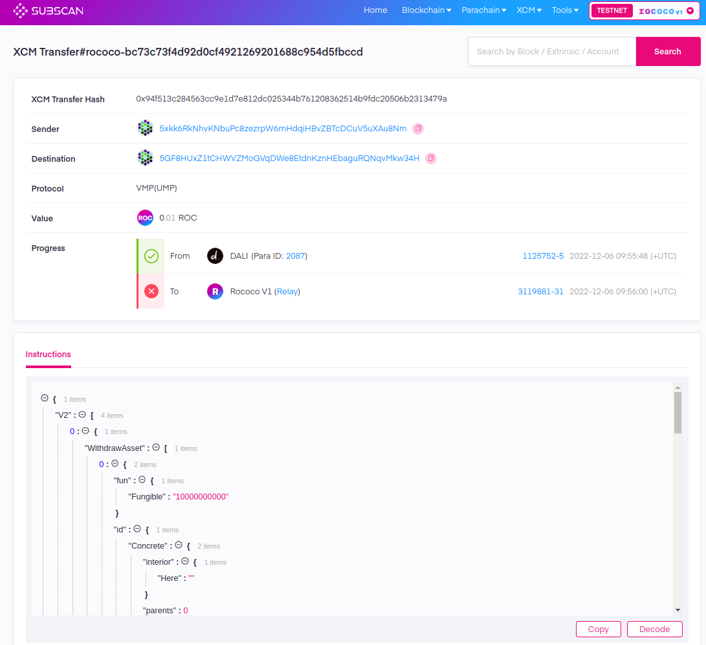

# Parachain XCM Configuration

---

## _At the end of this lecture, you will be able to:_

<pba-flex center>

- Understand the different XCM configurable parts for a chain
- Construct different XCM configurations for chains with different needs
- Understand how Versioning is handled across chains

</pba-flex>

---

## 🛠️ Configurables in `XcmConfig`

- Common vs configurable implementation in `xcm-executor`

- Configurable parts are defined in the `xcm-executor` config!

Notes:

EXERCISE: ask the class to raise hands and postulate on what they think should be configurable.

---

## 🛠️ Configurables in `XcmConfig`

```rust [0|1|5-6|7-8|9-10|11-12|13-14]
pub type SovereignAccountOf = ?;

pub struct XcmConfig;
impl Config for XcmConfig {
  // How we route the XCM outside this chain
  type XcmSender = XcmRouter;
  // How we withdraw/deposit assets
  type AssetTransactor = LocalAssetTransactor;
  // How we convert a ML to a FRAME dispatch origin
  type OriginConverter = LocalOriginConverter;
  // The absolute Location of the current system
  type UniversalLocation = UniversalLocation;
  // Pre-execution filters
  type Barrier = Barrier;
  // Who we trust as reserve chains
  type IsReserve = ?;
  // Who do we trust as teleporters
  type IsTeleporter = ?;
  // ...
}

```

Notes:

- `SovereignAccountOf`: Means of converting a `Location` into an account ID
  Used later for: `OriginConverter` , `AssetTransactor`

- `xcm-pallet` is a pallet that not only allows sending and executing XCM messages, but rather it also implements several of the configuration traits and thus can be used perform several XCM configuration actions.

---

## 🛠️ Introducing `xcm-builder`

`xcm-builder` is a crate containing common configuration shims to faciliate XCM configuration.

Most pre-built configuration items can be found in `xcm-builder`.

---

### 🤔 Grab your chain's requirements before starting

Questions that you should have answers for:

- _Is my chain going to transfer just the native token?_
  _Is my chain going to receive several other kinds of assets?_

- _Is my chain going to allow free execution?_
  _Maybe only limited to some parachains/relay chain?_

- _Is my chain a 20 byte account chain?_
  _a 32 byte account chain?_

- _How will my chain accept fee payment?_
  _In one asset?_
  _In several?_

Notes:

- Some of the answers to these questions might imply you need to use your own custom primitives.

---

### Our starting example setup requirements

1. Parachain that does not charge for relay incoming messages.
1. Parachain that trusts the relay as the reserve chain for the relay chain tokens.
1. Parachain that mints in `pallet-balances` when it receives relay chain tokens.
1. Users can execute XCMs locally.

---

## 🛠️ XcmRouter in `XcmConfig`

- `ParentAsUmp` routes XCM to relay chain through UMP.
- `XcmpQueue` routes XCM to other parachains through XCMP.

```rust
pub type XcmRouter = (
	// Two routers - use UMP to communicate with the relay chain:
	cumulus_primitives_utility::ParentAsUmp<ParachainSystem, PolkadotXcm>,
	// ..and XCMP to communicate with the sibling chains.
	XcmpQueue,
);
```

Notes:

- `ParachainSystem` is a pallet in cumulus that handles incoming DMP messages and queues, among other miscellaneous parachain-related matters.
- If the destination location matches the form of `Location { parents: 1, interior: Here }`, the message will be routed through UMP.
  The UMP channel is available by default.
- If the destination matches the form of `Location { parents: 1, interior: X1(Parachain(para_id)) }`, the message will be routed through XCMP.
  As of today, an HRMP channel should be established before the message can be routed.

---

### 📁 `SovereignAccountOf` via `xcm-builder`

- Defines how we convert a `Location` into a local account ID.
- Useful when we want to withdraw/deposit tokens from a `Location` defined origin
- Useful when we want to dispatch as signed origins from a `Location` defined origin.


Notes:

- This will define how we convert a `Location` into a local account ID.
- This is useful when we want to withdraw/deposit tokens from a `Location` defined origin or when we want to dispatch as signed origins from a `Location` defined origin.

---v

### 📁 List of `SovereignAccountOf` converters

- `HashedDescription`: Hashes the description of a MultiLocation and converts that into an AccountId. 

```rust

pub struct HashedDescription<AccountId, Describe>(PhantomData<(AccountId, Describe)>);
impl<AccountId: From<[u8; 32]> + Clone, Describe: DescribeLocation> ConvertLocation<AccountId>
	for HashedDescription<AccountId, Describe>
{
	fn convert_location(value: &MultiLocation) -> Option<AccountId> {
		Some(blake2_256(&Describe::describe_location(value)?).into())
	}
}
```

---v

### 📁 `SovereignAccountOf` via `xcm-builder`

- `HashedDescription`. An example of a converter definition:

<pba-flex center>

```rust
pub type LocationToAccount = HashedDescription<
  // Legacy conversion - MUST BE FIRST!
  LegacyDescribeForeignChainAccount,
  // Other conversions
  DescribeTerminus,
  DescribePalletTerminal,
>;
```

---v

### 📁 `SovereignAccountOf` via `xcm-builder`

- `DescribeLocation`: Means of converting a location into a stable and unique descriptive identifier.

```rust
pub trait DescribeLocation {
	/// Create a description of the given `location` if possible. No two locations should have the
	/// same descriptor.
	fn describe_location(location: &MultiLocation) -> Option<Vec<u8>>;
}
```

Notes:

[Impl for Tuple](https://github.com/paritytech/polkadot/blob/c7f58c17f906467634a5b236d7b3c1df24057419/xcm/xcm-builder/src/location_conversion.rs#L34)

---v

### 📁 `SovereignAccountOf` via `xcm-builder`

- `DescribeAccountId32Terminal`

```rust
fn describe_location(l: &MultiLocation) -> Option<Vec<u8>> {
	match (l.parents, &l.interior) {
		(0, X1(AccountId32 { id, .. })) => Some((b"AccountId32", id).encode()),
		_ => return None,
	}
}
```

---v

### 📁 `SovereignAccountOf` via `xcm-builder`

- `DescribeTerminus`

```rust
fn describe_location(l: &MultiLocation) -> Option<Vec<u8>> {
	match (l.parents, &l.interior) {
		(0, Here) => Some(Vec::new()),
		_ => return None,
	}
}
```

---v

### 📁 `SovereignAccountOf` via `xcm-builder`

- `DescribePalletTerminal`

```rust
fn describe_location(l: &MultiLocation) -> Option<Vec<u8>> {
	match (l.parents, &l.interior) {
		(0, X1(PalletInstance(i))) =>
			Some((b"Pallet", Compact::<u32>::from(*i as u32)).encode()),
		_ => return None,
	}
}
```

---v

### 📁 `SovereignAccountOf` via `xcm-builder`

- `DescribeAccountKey20Terminal`

```rust
fn describe_location(l: &MultiLocation) -> Option<Vec<u8>> {
	match (l.parents, &l.interior) {
		(0, X1(AccountKey20 { key, .. })) => Some((b"AccountKey20", key).encode()),
		_ => return None,
	}
}
```

---v

### 📁 `SovereignAccountOf` via `xcm-builder`

- `Account32Hash`: Hashes the `Location` and takes the lowest 32 bytes as account.

- `ParentIsPreset`: Converts the parent `MultiLocation` into an account of the form `b'Parent' + trailing 0s`

- `ChildParachainConvertsVia`: Converts the **child** parachain `MultiLocation` into an account of the form `b'para' + para_id_as_u32 + trailing 0s`

- `SiblingParachainConvertsVia`: Convert the **sibling** parachain `MultiLocation` into an account of the form `b'sibl' + para_id_as_u32 + trailing 0s`

- `AccountId32Aliases`: Converts a local `AccountId32` `MultiLocation` into an account ID of 32 bytes.

---

### 🪙 `AssetTransactor` via `xcm-builder`

- Define how we are going to withdraw and deposit assets
- Heavily dependant on the assets we want our chain to transfer


Notes:

- The relay chain is a clear example of a chain that handles a **single token**.
- AssetHub on the contrary acts as an asset-reserve chain, and it needs to handle **several assets**

---v

### 🪙 `AssetTransactor` via `xcm-builder`

- `CurrencyAdapter`: Single currency `asset-transactor`.
  Used for withdrawing/depositing the native token of the chain.

<div style="font-size:smaller">

```rust
impl
 TransactAsset
  for CurrencyAdapter<Currency, Matcher, AccountIdConverter, AccountId, CheckedAccount>
{
  /* snip */
  fn deposit_asset(what: &Asset, who: &Location) -> Result {
    // Check we handle this asset.
    let amount: u128 =
      Matcher::matches_fungible(&what).ok_or(Error::AssetNotFound)?.saturated_into();
    // Convert Location to accountId
    let who =
      AccountIdConverter::convert_ref(who).map_err(|()| Error::AccountIdConversionFailed)?;
    // Convert amount to balance
    let balance_amount =
      amount.try_into().map_err(|_| Error::AmountToBalanceConversionFailed)?;
    // Deposit currency on the account
    let _imbalance = Currency::deposit_creating(&who, balance_amount);
    Ok(())
  }
}
```

</div>

Notes:

- **Matcher**: Matches the `Asset` against some filters and returns the amount to be deposited/withdrawn
- **AccountIdConverter**: Means of converting a `Location` into an account

---v

### 🪙 `AssetTransactor` via `xcm-builder`

- `FungiblesAdapter`: Used for depositing/withdrawing from a set of defined fungible tokens.
  An example of these would be `pallet-assets` tokens.

Notes:

- For our example, it suffices to uses `CurrencyAdapter`, as all we are going to do is mint in a single currency (Balances) whenever we receive the relay token.

---

### 📍 `OriginConverter` via `xcm-builder`

- Defines how to convert an XCM origin, defined by a `Location`, into a frame dispatch origin.
- Used mainly in the `Transact` instruction.

Notes:

- `Transact` needs to dispatch from a frame dispatch origin.
  However the `xcm-executor` works with XCM origins which are defined by `Location`s.
- `OriginConverter` is the component that converts one into the other

---v

### 📍 List of origin converters

- `SovereignSignedViaLocation`: Converts the `Location` origin (typically, a parachain origin) into a signed origin.

- `SignedAccountId32AsNative`: Converts a local 32 byte account `MultiLocation` into a signed origin using the same 32 byte account.

- `ParentAsSuperuser`: Converts the parent origin into the root origin.

- `SignedAccountKey20AsNative`: Converts a local 20 byte account `MultiLocation` into a signed origin using the same 20 byte account.

Notes:

- `ParentAsSuperuser` can be used in common-good chains as they do not have a local root origin and instead allow the relay chain root origin to act as the root origin.

---v

### 📍 `SovereignSignedViaLocation`

Converts the `MultiLocation` origin (typically, a parachain origin) into a signed origin.

```rust [0|6|18|20|22]
pub struct SovereignSignedViaLocation<LocationConverter, RuntimeOrigin>(
  PhantomData<(LocationConverter, RuntimeOrigin)>,
);
impl<
    // Converts a Location into account
    LocationConverter: Convert<Location, RuntimeOrigin::AccountId>,
    RuntimeOrigin: OriginTrait,
  > ConvertOrigin<RuntimeOrigin>
  for SovereignSignedViaLocation<LocationConverter, RuntimeOrigin>
where
  RuntimeOrigin::AccountId: Clone,
{
  fn convert_origin(
    origin: impl Into<Location>,
    kind: OriginKind,
  ) -> Result<RuntimeOrigin, Location> {
    let origin = origin.into();
    if let OriginKind::SovereignAccount = kind {
      // Convert Location to account
      let location = LocationConverter::convert(origin)?;
      // Return signed origin using the account
      Ok(RuntimeOrigin::signed(location).into())
    } else {
      Err(origin)
    }
  }
}
```

Notes:

- `LocationConverter ` once again defines how to convert a `Location` into an account ID.
- It basically grants access to dispatch as Signed origin after the conversion.

---v

### 📍 `SignedAccountId32AsNative`

Converts a local 32 byte account `Location` into a signed origin using the same 32 byte account.

```rust [0|18|19-22|24]
pub struct SignedAccountId32AsNative<
  Network,
  RuntimeOrigin
>(PhantomData<(Network, RuntimeOrigin)>);
impl<Network: Get<NetworkId>, RuntimeOrigin: OriginTrait>
  ConvertOrigin<RuntimeOrigin>
for SignedAccountId32AsNative<Network, RuntimeOrigin>
where
  RuntimeOrigin::AccountId: From<[u8; 32]>,
{
  fn convert_origin(
    origin: impl Into<Location>,
    kind: OriginKind,
  ) -> Result<RuntimeOrigin, Location> {
    let origin = origin.into();
    match (kind, origin) {
      (
        OriginKind::Native,
        Location {
		  parents: 0,
		  interior: X1(Junction::AccountId32 { id, network })
		},
      ) if matches!(network, NetworkId::Any) || network == Network::get() =>
        Ok(RuntimeOrigin::signed(id.into())),
      (_, origin) => Err(origin),
    }
  }
}
```

Notes:

- Matches a local `AccountId32` `Location` to a signed origin.
- Note the difference `OriginKind` filter: this is not an account controlled by another consensus system, but rather a Native dispatch.
- **This structure fulfills one of our requirements**

---

### `UniversalLocation`

The absolute location of the consensus system being configured.

```rust
pub enum NetworkId {
  /// Network specified by the first 32 bytes of its genesis block.
  ByGenesis([u8; 32]),
  /// Network defined by the first 32-bytes of the hash and number of some block it contains.
  ByFork { block_number: u64, block_hash: [u8; 32] },
  /// The Polkadot mainnet Relay-chain.
  Polkadot,
  /// An Ethereum network specified by its chain ID.
  Ethereum {
    /// The EIP-155 chain ID.
    #[codec(compact)]
    chain_id: u64,
  },
  /// The Bitcoin network, including hard-forks supported by Bitcoin Core development team.
  BitcoinCore,
  // ...
}

type InteriorLocation = Junction;
parameter_types! {
  pub const UniversalLocation: InteriorLocation = GlobalConsensus(NetworkId::Polkadot);
}
```

---

### 🚧 `Barrier` via `xcm-builder`

- Barriers specify whether or not an XCM is allowed to be executed on the local consensus system.
- They are checked before the actual XCM instruction execution.
- **Barriers should not involve any heavy computation.**

Notes:
  **At the point at which barriers are checked nothing has yet been paid for its execution**.

---v

### 🚧 `Barrier` via `xcm-builder`

Physical vs Computed origin

- Physical origin: the consensus system that built this particular XCM and sent it to the recipient
- Computed origin: the entity that ultimately instructed the consensus system to build the XCM


**Must make sure which origin a barrier should apply to!**

Those that filter on the origin (e.g. `AllowTopLevelPaidExecutionFrom<T>`) would most likely be operating upon the _computed origin_.

---v

### 🚧 `Barrier` via `xcm-builder`

Barriers that operate upon **computed origins** must be put inside of `WithComputedOrigin`:

```rust
pub struct WithComputedOrigin<InnerBarrier, LocalUniversal, MaxPrefixes>(
  PhantomData<(InnerBarrier, LocalUniversal, MaxPrefixes)>,
);
```

---v

### 🚧 `Barrier` via `xcm-builder`

- `TakeWeightCredit`: Subtracts the maximum weight the message can consume from the available weight credit.
  Usually configured for local `xcm-execution`

- `AllowTopLevelPaidExecutionFrom<T>`: For origins contained in `T`, it makes sure the first instruction puts asset into the holding register (`TeleportAsset`, `WithdrawAsset`, `ClaimAsset`, `ReserveAssetDeposit`), followed by a `BuyExecution` instruction capable of buying sufficient weight.
  **Critical to avoid free DOS**.

Notes:

- A chain without `AllowTopLevelPaidExecutionFrom` could potentially receive several heavy-computation instructions without paying for it.
  Checking that the first instructions are indeed paying for execution helps to quick-discard them.

- While `BuyExecution` is crucial for messages coming from other consensus systems, local XCM execution fees are paid as any other substrate extrinsic.

---v

### 🚧 `Barrier` via `xcm-builder`

- `AllowUnpaidExecutionFrom<T>`: Allows free execution if `origin` is contained in `T`.
  Useful for chains that "trust" each other (e.g., AssetHub or any system parachain with the relay)

```rust
/// Allows execution from any origin that is contained in `T`
/// (i.e. `T::Contains(origin)`) without any payments.
/// Use only for executions from trusted origin groups.
pub struct AllowUnpaidExecutionFrom<T>(PhantomData<T>);
impl<T: Contains<Location>> ShouldExecute for AllowUnpaidExecutionFrom<T> {
  fn should_execute<RuntimeCall>(
    origin: &Location,
    _message: &mut Xcm<RuntimeCall>,
    _max_weight: Weight,
    _weight_credit: &mut Weight,
  ) -> Result<(), ()> {
    ensure!(T::contains(origin), ());
    Ok(())
  }
}
```

Notes:

- **This fulfills our requirements**
- To meet our example use case, we only need the relay to have free execution.

- XCMv3 adds a new `AllowExplicitUnpaidExecutionFrom`, which not only checks the origin but also that the **first instruction is the new `UnpaidExecution` instruction**.

---v

### 🚧 `Barrier` via `xcm-builder`

- `AllowKnownQueryResponses`: Allows the execution of the message if it is a `QueryResponse` message and the `ResponseHandler` is expecting such response

- `AllowSubscriptionsFrom<T>`: If the `origin` that sent the message is contained in `T`, it allows the execution of the message if it contains only a `SubscribeVersion` or `UnsubscribeVersion` instruction.

---

### 🏋️ `Weigher` via `xcm-builder`

- Specifies how instructions are weighed
- `FixedWeightInfoBounds`: Apply a constant weight value to all instructions except for `Transact`, `SetErrorHandler` and `SetAppendix`.
- `WeightInfoBounds`: Apply instruction-specific weight (ideally, benchmarked values) except for `Transact`, `SetErrorHandler` and `SetAppendix`.

Notes:

Benchmarking can easily be done with the `pallet-xcm-benchmarks` module.
Note that the benchmarks need to reflect what your runtime is doing, so fetching the weights done for another runtime can potentially turn into users abusing your system.

---v

### 🏋️ `Weigher` via `xcm-builder`

- `Transact` weight is defined by `require_weight_at_most` value.
- `SetErrorHandler` and `SetAppendix`, besides their own weight, need to account for the XCM instructions they will execute.

<div style="font-size:smaller">

```rust [0|6|7
  fn instr_weight_with_limit(
		instruction: &Instruction<C>,
		instrs_limit: &mut u32,
	) -> Result<Weight, ()> {
		use xcm::GetWeight;
		let instr_weight = match instruction {
			Transact { require_weight_at_most, .. } => *require_weight_at_most,
			SetErrorHandler(xcm) | SetAppendix(xcm) => Self::weight_with_limit(xcm, instrs_limit)?,
			_ => Weight::zero(),
		};
		instruction.weight().checked_add(&instr_weight).ok_or(())
	}
```

<div>

---

### 🤝 `IsReserve` and `IsTeleporter`

- They define filters for accepting `ReserveAssetDeposited` and `ReceiveTeleportedAsset` respectively.
- Filters are applied for specific `Asset-Location` pairs.

```rust
/// Combinations of (Asset, Location) pairs which we trust as reserves.
type IsReserve: ContainsPair<Asset, Location>;

/// Combinations of (Asset, Location) pairs which we trust as teleporters.
type IsTeleporter: ContainsPair<Asset, Location>;
```

Notes:

- For our test exercise, it is sufficient to set this `IsReserve` to `Everything`.
- In your production network, you will need to match these values to your reserve/teleporting trust assumptions.

---

### 🔧 `WeightTrader` via `xcm-builder`

- Specifies how to charge for weight inside the XCM execution.
- Used in the `BuyExecution` instruction
- Used in the `RefundSurplus` instruction

---v

### 🔧 `WeightTrader` via `xcm-builder`

- `FixedRateOfFungible`: Converts weight to fee at a fixed rate and charges in a specific fungible asset

```rust [0|7|17|19-21|28-30]|34
pub struct FixedRateOfFungible<T: Get<(AssetId, u128)>, R: TakeRevenue>(
  Weight,
  u128,
  PhantomData<(T, R)>,
);
impl<
  T: Get<(AssetId, u128)>,
  R: TakeRevenue
> WeightTrader for FixedRateOfFungible<T, R> {
  /* snip */
  fn buy_weight(
	&mut self,
	weight: Weight,
	payment: Assets
  ) -> Result<Assets, XcmError> {
    // get the assetId and amount per second to charge
    let (id, units_per_second) = T::get();
    // Calculate the amount to charge for the weight bought
    let amount =
	  units_per_second * (weight as u128)
	  / (WEIGHT_REF_TIME_PER_SECOND as u128);

    if amount == 0 {
      return Ok(payment)
    }

    // Take amount from payment
    let unused =
      payment.checked_sub((id, amount).into())
	  .map_err(|_| XcmError::TooExpensive)?;

    self.0 = self.0.saturating_add(weight);
    self.1 = self.1.saturating_add(amount);
    Ok(unused)
  }
  /* snip */
}
```

Notes:

- It is crucial that we return the unused portion of the tokens, as these need to be refunded back in to the holding register.
- We keep how much it has been bought to be able to refund later on.

---v

### 🔧 `WeightTrader` via `xcm-builder`

- `UsingComponents`: uses `TransactionPayment` pallet to set the right price for weight.

Notes:

- `TransactionPayment` pallet already defines how to convert weight to fee.
  We do not need to define a rate in this case.

---

## Example XCM configuration

Let's put everything together and see how it looks like!

---v

### Setup requirements

1. Parachain that does not charge for relay incoming messages.
1. Parachain that trusts the relay as the reserve chain for the relay chain tokens.
1. Parachain that mints in `pallet-balances` when it receives relay chain tokens.
1. Users can execute XCMs locally.

---v

### Do not charge relay for any XCM-related fees

```rust
match_types! {
	pub type ParentLocation: impl Contains<MultiLocation> = {
		MultiLocation { parents: 1, interior: Here }
	};
}
impl xcm_executor::Config for XcmConfig {
  // ...
  type Barrier = AllowExplicitUnpaidExecutionFrom<ParentLocation>;
  // ...
}
```

---v

### Trust the relay as the reserve chain for relay chain tokens

```rust
parameter_types! {
  pub const RelayLocation: MultiLocation = (1, Here).into_location();
	pub const RelayToken: MultiAssetFilter = Wild(AllOf { fun: WildFungible, id: Concrete(RelayLocation::get()) });
	pub const RelayTokenFromRelay: (MultiAssetFilter, MultiLocation) = (RelayToken::get(), RelayLocation::get());
}
pub type TrustedReserves = xcm_builder::Case<RelayTokenFromRelay>;
impl xcm_executor::Config for XcmConfig {
  // ...
  type IsReserve = TrustedReserves;
  // ...
}
```

---v

### Mint tokens in balances pallet when relay tokens are received

```rust
parameter_types! {
  pub const RelayLocation: MultiLocation = (1, Here).into_location();
}

pub type LocalAssetTransactor = XcmCurrencyAdapter<
	Balances,
	IsConcrete<RelayLocation>,
	ParentIsPreset<AccountId>,
	AccountId,
	(),
>;
impl xcm_executor::Config for XcmConfig {
  // ...
  type AssetTransactors = LocalAssetTransactor;
  // ...
}
```

---v

### Users can execute XCM locally

```rust
parameter_types! {
  pub const ThisNetwork: NetworkId = /* ... */;
}

type LocalOriginToLocation = SignedToAccountId32<RuntimeOrigin, AccountId, ThisNetwork>;

impl pallet_xcm::Config for Runtime {
  // ...
	type ExecuteXcmOrigin = xcm_builder::EnsureXcmOrigin<RuntimeOrigin, LocalOriginToLocation>;
	type XcmExecuteFilter = Everything;
  // ...
}
```

---

<!-- .slide: data-background-color="#4A2439" -->

# Debugging XCM

---

## 🧐 Debugging XCM message failures

Involves knowledge of the chain XCM configuration!

Common steps to debug:

1. Identify what the error means which will help you identify the context in which the error happened.
1. Look in the XCM codebase to check where this error might have been thrown.
   Was it thrown in the barrier?
   Or in any specific instruction?
1. Retrieve the failed received XCM.
1. Check the chain XCM configuration to verify what could have failed.

---

## 🕵️‍♂️ Identifying the error kind

Look at the `ump.ExecutedUpward` event:



---v

## 🕵️‍♂️ Identifying the error kind

- `UntrustedReserveLocation`: a `ReserveAssetDeposited` was received from a location we don't trust as reserve.
- `UntrustedTeleportLocation`: a `ReceiveTeleportedAsset` was received from a location we don't trust as teleporter.
- `AssetNotFound`: the asset to be withdrawn/deposited is not handled by the asset transactor.
  Usually happens when the `Location` representing an asset does not match to those handled by the chain.

---v

## 🕵️‍♂️ Identifying the error kind

- `FailedToTransactAsset`: the withdraw/deposit of the asset cannot be processed, typically it's because the account does not hold such asset, or because we cannot convert the `Location` to an account.
- `FailedToDecode`: tied to the `Transact` instruction, in which the byte-blob representing the dispatchable cannot be decoded.
- `MaxWeightInvalid`: the weight specified in the `Transact` instruction is not sufficient to cover for the weight of the transaction.
- `TooExpensive`: Typically tied to `BuyExecution`, means that the amount of assets used to pay for fee is insufficient.

---v

## 🕵️‍♂️ Identifying the error kind

- `Barrier`: One of the barriers failed, we need to check the barriers individually.
- `UnreachableDestination`: Arises when the supported XCM version of the destination chain is unknown.
  When the local chain sends an XCM to the destination chain for the very first time, it does not know about the XCM version of the destination.
  In such a case, the safe XCM version is used instead.
  However, if it is not set, then this error will be thrown.

---

## 🔨 Decoding SCALE-encoded messages

- **RelayChain**:
  - XCM can be retrieved in the `paraInherent.enter` inherent
  - The candidate for a specific parachain contains the ump messages sent to the relay.
  - **UMP messages are usually executed one block after they are received**
- **Parachain**:
  - XCM can be retrieved in the `parachainSystem.setValidationData` inherent.
  - **DMP and HRPM messages are usually executed in the block they are received**, at least, as long as the available weight permits.

---v

## 🔨 Decoding SCALE-encoded messages

But all we see is a **SCALE-encoded message** which does not give us much information.
To solve this:

- We build a SCALE-decoder to retrieve the XCM message (the hard way).
- We rely on subscan/polkaholic to see the XCM message received.

---v

## 🔨 Subscan XCM retrieval


