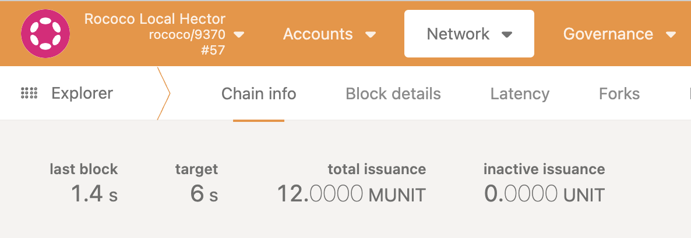

# Week 4 Assignment - Polkadot and XCM

This is the final graded assignment where we will apply everything we have learned about Polkadot & XCM.

## Description

The overall goal for this assignment is to be able to send some ROC (native asset of the Rococo relay chain) via reserve asset transfer to a parachain built by you and then send them back to the relay chain using a custom pallet. Please take into account that some configuration is needed on the `xcm_config.rs` for the parachain.

## Build requirements.

For this assignment, you will be provided with:

- Rococo Relay Chain.

https://github.com/paritytech/polkadot

- Parachain template.

< SHARE THE LINK >

You will have to build both projects following these guideliness:

- Use Rococo 0.9.37 release for your relay chain.
- Build your chain and Rococo and set up a zombienet file (local) that launches and please provide the zombienet config file.
- For Rococo, please rename the value from **Rococo Local Testnet** to **Rococo Local < YOUR NAME >**
https://github.com/paritytech/polkadot/blob/master/node/service/src/chain_spec.rs#L1918
- For your parachain please rename the value from **Local Testnet** to **Local Testnet < YOUR NAME >**
**< PROVIDE THE LINK >**

This is how it should looks like:

## Requirements
### XCM Configuration (xcm_config.rs)

- We will provide you with a parachain template with some missing XCM configurations. Part of the assignment is to complete these configurations and make the process to work (the configuration quality will be graded). These configurations will be:

- Barrier:
  - You can configure the Barrier in the way you consider best. Please note that copying and pasting from other parachains might not work as expected for this assignment. So please be mindful of your Barrier setup.
  - Extra points: Explain in your own words what each element of the Barrier config is doing (point out where and how all these are used in the xcm_builder).

- AssetTransactor:
  - The easiest way to configure this is by using the transactor related to the pallet_balance. This is the minimum accepted solution for this configuration.
  - Local transactor.
  - Extra points: 
      - Add the Fungible transactor and instead of minting the received token using the pallet_balances, use the `pallet_assets` to mint a derived (a.k.a wrapped) asset for ROC. You might call this asset in the parachain WROC

- IsReserve: Configure the parachain to recognize the relay chain as the valid reserve of assets.

- Filters: As the calls from pallet_xcm are not supposed to be used in the parachain, all the corresponding filters are set to `Nothing`. Please do not change anything from it.

### Pallet requirements

For sending the ROC back from the parachain to the relay chain, you will have to create a new pallet with a specific call that commits this purpose. The logic for the pallet shouldn't be super complex as its only purpose is to send the XCM message only.
As a requirement for the pallet, when the message is dispatched please add a custom event that confirms the XCM message was attempted and also add your name in it.

Extra points: Provide the corresponding tests using the XCM Simulator.

### README.md

As previous assigments, please provide a README.md file with all the necessary information to understand your project and your reasoning behind it.

### Screenshots

- Once you have your local environment running, please provide screenshots of the following events generated:

  - On Rococo, please share the DMP event showing the XCM message attempt.
  - On the parachain, please share the DMP event confirming the token was received and minted.
  - When the pallet is called, please please provide screenshots of the custom event generated with your name.
  - On Rococo, share the UMP event that confirms the asset was received successfully.

## Aside notes.

- For sending the ROC tokens from Rococo to the parachain, you can use the existing extrinsic `limitedReservedTransferAssets` from the `xcmPallet`.

 
