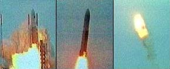
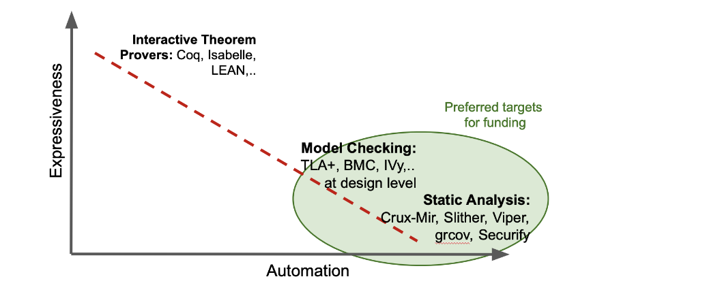

# Formal Methods for Rust

---

## Outline

<!--
You can reference slides within this presentation like [this other slide](#at-the-end-of-this-lecture-you-will-be-able-to) by use of the header title.

Please make your lecture precise.

- Limit the main points in a lecture to five or fewer.
- Create effective visuals, analogies, demonstrations, and examples to reinforce the main points.
  {TAs and the Parity design team can assist! Please let us know marking an item here as `TODO`}
- Emphasize your objectives and key points in the beginning, as you get to them, and as a summary at the end.

-->

<pba-flex center>

1. Intro to Formal Methods
1. Overview of Techniques
1. Formal Method Tools for Rust: 
    * Kani: Bounded Model Checker
    * MIRAI: Abstract Interpreter
1. Applications to Polkadot 

</pba-flex>

---

##  Introduction to Formal Methods 

#### _Story Time!_

---v

### _Ariane 5 Rocket - Flight 501_



- in **1996**, the launcher [rocket disintegrated](https://www-users.cse.umn.edu/~arnold/disasters/ariane.html) 39 secs after take-off.
- **Failure**: An _overflow_, caused by a conversion from 64-bit to 16-bit floating point
- **Mistake**: reusing inertial reference platform of Ariane-4, where overflow cannot happen due to different operational conditions
- **Cost**: `$`500M payload, `$`8B development program

Notes:

---v

## Software Correctness is _very_ important

> Program testing can be used to show the presence of bugs, but never to show their absence! - Edgard Dijkstra

#### Hence, the necessity to go beyond Testing <!-- .element: class="fragment" -->

---v

## Formal Methods to the Rescue!

- Verify/prove correctness of software with reasonable mathematical guarantees.
- **Traditionally**, costs and efforts were justifiable in _safety-critical_ software like avionics, nuclear reactors, medical imaging, etc. 
- however, things have changed ...


Notes:

Speaker view ONLY notes

---v

## It is no longer Rocket Science!


- AWS formally verifies Key-Value storage nodes in Amazon S3 (Rust Implementation). 
- Meta detects resource leaks and race conditions in Android apps
- Uber uses static analysis to find Null-pointer exceptions
- Ethreum's Beacon chain and Tendermint consensus formally verified for safety and liveness guarantees

Notes:

Stuff you should remember to say. Are more examples required? maybe rust specific? 

---v

## Formal Methods Today

> _...have gone from being theoretical research interests to delivering practical cost-effective tools_

<pba-flex center>

- verification tools more efficient

- goals more focused, promises less lofty

- combination of analysis techniques

</pba-flex>

## More like _Light-weight Formal Methods_

1. rigorously **detecting bugs** >> proving overall correctness of system.
1. Developer-centric **Usability** (e.g. workflow integration)


Notes:
- Drastic Speed-up in Underlying Constraint-Solver engines
- reduce the scope of bugs; focus on particular bugs like resource leaks,  
- combine symbolic and concrete executions executions;

---v

## Key Takeaways

<pba-flex center>

### Formal Methods is ...

- **not a Panacea** but can improve software quality

- getting more and more **accessible**

- useful for increasing **reliability and security** of blockchains
</pba-flex>

Notes:

Make sure to include things here to say to students, perhaps a hint or two.
Realize that students will be able to view the speaker's notes, as they will have access to them on their devices.

---

## Landscape of Techniques



<!-- TODO: Need to convert an image similar to this into an svg. Want the green circle to appear as a transition. Use Figma for creating the image. -->


Our Focus: Rust Verification

---v

## Spectrum of Tools for Rust

(Descending order in terms user interactions): 

- KMIR
- Prusti
- Creusot
- Crux-MIR
- MIRAI
- Kani
- Flux
- Fuzzers: AFL, Honggfuzz, LibFuzzer

(TODO: tabular form of advantages, disadvantages, application scenarios, automation )
<!-- TODO: Give a brief overview of the existing tools, advantages/disadvantages and scenarios to use them. Preferable in a tabular format.   -->


---


## Our Focus

<pba-flex center>

- **Bounded Model Checking** with [Kani](https://github.com/model-checking/kani)
- **Abstract Interpretation** with [MIRAI](https://github.com/facebookexperimental/MIRAI)

</pba-flex>

---

## Kani: Model Checking tool for Rust

- open-source Rust verifier by AWS 
- underlying technique used: [Bounded Model Checking](https://www.cs.cmu.edu/~emc/papers/Books%20and%20Edited%20Volumes/Bounded%20Model%20Checking.pdf)
- Can be used to _prove_:
    - absence of arithmetic overflows
    - absence of runtime errors (index out of bounds, panics)
    - User Specified Properties (enhanced PropTesting)
    - memory safety when using unsafe Rust

---v

lets see some Magic and then the Trick

> Demo of the Rectangle-Example from Kani repo

---v

## Proof Harness

<pba-col centre>

### Template

```rust
use my_crate::{function_under_test, meets_specification, precondition};

#[kani::proof]
fn check_my_property() {
   // Create a nondeterministic input
   let input = kani::any();

   // Constrain it according to the function's precondition
   kani::assume(precondition(input));

   // Call the function under verification
   let output = function_under_test(input);

   // Check that it meets the specification
   assert!(meets_specification(input, output));
}
```

- Kani tries to prove that all valid inputs produce outputs that meet specifications, without panicking.

- Otherwise Kani will generate a trace that points to the failure. 

</pba-col>

---v

SCALE codec property: `decode(encode(x)) == x`

<pba-cols>
<pba-col center>

#### Test

```rust
#[cfg(test)]
fn test_u32 {
  let val: u16 = 42;
  assert_eq!(u16::decode(&mut 
    val.encode()[..]).unwrap(), val)
}
```
fixed value `42`

</pba-col>

<pba-col center>

#### Fuzzing

```rust
#[cfg(fuzzing)]
fuzz_target!(|data: &[u8]|) {
  let val = u16::arbitrary(data);
  assert_eq!(u16::decode(&mut 
    val.encode()[..]).unwrap(), val)
}
```

random value of `u16`

</pba-col>
</pba-cols>

<pba-col center>

#### Kani Proof 

```rust
#[cfg(kani)]
#[kani::proof]
fn proof_u32_roundtrip {
  let val: u16 = kani::any();
  assert_eq!(u16::decode(&mut 
    val.encode()[..]).unwrap(), val)
}
```
verifies exhaustively all values of `u16`
</pba-col>

---v

### Under the Hood: Bounded Model Checking

#### Idea:
- Search for counterexamples in (bounded) executions paths
- However, this search is an NP-hard problem

#### Method:
- Efficiently reduce problem to a Propositional Satisfiability (SAT) problem
- counterexmaple for property $\phi$ exists in $P$ $\iff$ $SAT_{\phi,P}$ is satisfiable.
- verification reduced to problem of searching satisfiable assignment to a SAT formula.
- leverages highly optimized SAT solvers making the search tractable. 

---v

### Translation to constraints

<pba-cols>

<pba-col centre>

#### Code

```rust
fn foo(x: i32) -> i32 {
    let mut y: i32 = 8;
    let mut w: i32 = 0;
    let mut z: i32 = 0;
    if x != 0 {
        z -= 1;
    } else {
        w += 1;
    }
    assert!(z == 7 || w == 9);
    w+z
}
```
</pba-col>

<pba-col centre>

#### Constraints

```rust
y = 8,
z = x? y-1: 0,
w = x? y+1: 0,
z != 7 /\ w != 9 (negation of the assert condition)
```

- Constraints fed into a Solver (minisat)

- for no value of `x` the constraints hold $\implies$ Assert conditions verified

- else the solver found a failing test (counterexample)

<!-- show the number of clauses and variables used in the formula in the demo-->>

</pba-col>
</pba-cols>


<!--
TODO: Depict this reduction with a diagram. 

-->


---v

## How does it handle loops?

- *Bounded* in BMC to the rescue!

- loops are unwinded up to a certain bounded depth $k$, else the verification does not terminate. (show in Demo)

- determining the *sweet-spot* $k$ is a trade-off between _tractability_ and _verification confidence_ . 

---v

## Demo: Unwinding Loops

```rust
fn initialize_prefix(length: usize, buffer: &mut [u8]) {
    // Let's just ignore invalid calls
    if length > buffer.len() {
        return;
    }

    for i in 0..=length {
        buffer[i] = 0;
    }
}

#[cfg(kani)]
#[kani::proof]
#[kani::unwind(1)] // deliberately too low
fn check_initialize_prefix() {
    const LIMIT: usize = 10;
    let mut buffer: [u8; LIMIT] = [1; LIMIT];

    let length = kani::any();
    kani::assume(length <= LIMIT);

    initialize_prefix(length, &mut buffer);
}
```

---v

## Dealing with Loops: Summary

**Process:**
- start with unwinding $k$ times
- if no bug is found, increase $k$ until either:
  - A bug is found
  - verifier times-out
  - predetermined upper-bound $N$ for $k$ is reached

---v

## Implementing Arbitrary for custom type

Show demo for the following type:

```rust


```


---

## Exercise

Verify [Compact Encoding](https://github.com/paritytech/parity-scale-codec/blob/master/src/compact.rs) of integer types in the SCALE Codec

The properties to verify are open to students, but must include _roundtrip_. 

<!--
Any other FRAME pallet that they can write Proof Harnesses for?

TODO: write-up the exercises in PBA format
-->

---

## References

<!--
Compile an **annotated** list of URLs to source material referenced in making these lessons.
Ideally this is exhaustive, it can be cleaned up before delivery to students, but must include _why_ a reference is used.
For example:

- [ss58-registry](https://github.com/paritytech/ss58-registry) - A list of known SS58 account types as an enum, typically used by the Polkadot, Kusama or Substrate ecosystems.
- [wiki on parathreads](https://wiki.polkadot.network/docs/learn-parathreads) - A description of the parathread model.
-->


<!-- Meta TODOs:
add internal reference link to chapters

-->